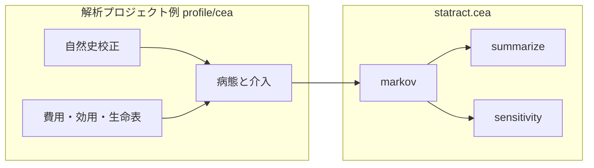

# Cost-effectiveness

疾患非依存の **費用対効果分析（CEA）** ユーティリティです。R の生態系に倣い、**モデル構築**と**結果の要約**を分けています。

| 層 | モジュール | R での近いもの |
|----|------------|----------------|
| cohort Markov | `statract.cea.markov` | heemod（核だけ） |
| ICER / 支配 | `statract.cea.summarize` | dampack `calculate_icers` |
| DSA / PSA 後段 | `statract.cea.sensitivity` | dampack / BCEA |

**R・rpy2・heemod / dampack / BCEA / hesim には依存しません。** 実装は NumPy と Polars です。

病態・費用表・校正済み自然史は解析プロジェクト側に置きます（例: SSL 経路は `profile/cea`）。

## 設計方針



- **入れるもの**: 名前付き状態の cohort STM、割引、イベント用 `on_cycle`、ICER 表（強支配 / 延長支配）、NMB、one-way DSA、PSA → CE plane / CEAC / EVPI
- **入れないもの（V1）**: 半サイクル補正、個体シミュレーション、partitioned survival、EVPPI、TreeAge 連携、疾患固有の校正（GAM 等）

## モジュール一覧

### `markov` — cohort 核

`simulate_cohort_markov(...)` が 1 年（または任意）サイクルの状態分布を進め、割引済み費用・QALY・LY を返します。検査・切除などの介入は `on_cycle(age, mass) -> (mass, extra_cost, extra_qaly)` に閉じます（`extra_*` は**未割引**。割引は核が掛ける）。

初期分布は、有限で非負かつ合計が正のとき 1 に正規化します。負の mass、合計が正でない初期分布、非有限または負の `discount_rate` は `ValueError` です。推移行列の各行は非負で和が 1、callable や `on_cycle` が返す mass はコホートの合計を保つ必要があります。負の mass を 0 に切り詰めて計算は続けません。

### `summarize` — ICER 表

`calculate_icers(cost, effect, strategies)` はモデルを知りません。戦略ごとの費用・効果だけから frontier を作り、`status` に次を付けます。

| status | 意味 |
|--------|------|
| `ND` | 非支配（frontier 上） |
| `D` | 強支配 |
| `ED` | 延長支配 |

`net_monetary_benefit(cost, effect, wtp=...)` は NMB = effect × WTP − cost です。

### `sensitivity` — 感度分析の後段

呼び出し側が「パラメータ dict → `(costs, effects)`」を渡します。

- `one_way_dsa` / `tornado_table`
- `run_psa` → `ce_plane` / `ceac` / `evpi`

`ceac` は費用か効果が非有限の draw を確率から外します。有限な draw が無いとき `prob_ce` は NaN で、先頭の戦略を最良とは数えません。

パラメータ分布（例: 費用の Gamma）はプロジェクト側で引きます。

## Quickstart

依存は Python のみです（`numpy`, `polars`）。R は不要です。

```python
from statract.cea import (
    calculate_icers,
    one_way_dsa,
    run_psa,
    simulate_cohort_markov,
    ceac,
    evpi,
)
```

### 1. 3 状態 cohort Markov

Healthy → Sick → Dead の教科書型です。

```python
import numpy as np
from statract.cea import simulate_cohort_markov

# 行=from, 列=to
P = np.array(
    [
        [0.94, 0.05, 0.01],  # Healthy
        [0.00, 0.90, 0.10],  # Sick
        [0.00, 0.00, 1.00],  # Dead
    ]
)

res = simulate_cohort_markov(
    states=("Healthy", "Sick", "Dead"),
    initial={"Healthy": 1.0},
    ages=range(50, 81),
    transition=P,
    utility={"Healthy": 1.0, "Sick": 0.6, "Dead": 0.0},
    cost={"Healthy": 0.0, "Sick": 1000.0, "Dead": 0.0},
    discount_rate=0.03,
    record_trace=True,
)
print(res.cost, res.qaly, res.ly)
print(res.trace.head())
```

#### 介入を `on_cycle` に載せる

検査・切除など、状態報酬だけでは表せないイベントはフックに書きます。返す費用・QALY は**未割引**です。

```python
def on_cycle(age: int, mass: np.ndarray):
    if age != 55:
        return mass, 0.0, 0.0
    m = mass.copy()
    # 例: Healthy の 10% を「検診」で費用だけ計上
    return m, 5000.0 * float(m[0]), 0.0

res = simulate_cohort_markov(
    states=("Healthy", "Sick", "Dead"),
    initial=[1.0, 0.0, 0.0],
    ages=range(50, 70),
    transition=P,
    utility=[1.0, 0.5, 0.0],
    discount_rate=0.03,
    on_cycle=on_cycle,
)
```

年齢依存遷移は callable か `dict[age, matrix]` で渡せます。初期分布は合計が正なら 1 に正規化します。負の mass、行和が 1 でない推移、質量を落とす `on_cycle` は `ValueError` になります。

```python
def transition(age: int, mass: np.ndarray) -> np.ndarray:
    p_hs = min(0.02 + 0.001 * (age - 50), 0.2)
    P_age = P.copy()
    P_age[0, 0] = 1.0 - p_hs - 0.01
    P_age[0, 1] = p_hs
    return mass @ P_age
```

### 2. ICER 表（モデル非依存）

```python
from statract.cea import calculate_icers, net_monetary_benefit

icers = calculate_icers(
    cost=[10_000, 25_000, 40_000],
    effect=[5.0, 6.0, 6.2],
    strategies=["A", "B", "C"],
)
print(icers)

nmb = net_monetary_benefit(
    icers["cost"],
    icers["effect"],
    wtp=5_000_000,
)
```

`status` が `ND` / `D` / `ED` です。延長支配の例は単体テスト `tests/test_cea_summarize.py` を参照してください。

### 3. One-way DSA と PSA

```python
import numpy as np
from statract.cea import one_way_dsa, run_psa, ce_plane, ceac, evpi


def evaluate(params: dict[str, float]):
    # SOC vs INT（例）
    c0, e0 = 1000.0, 10.0
    c1 = params["c_int"]
    e1 = 10.0 + params["delta_e"]
    return [c0, c1], [e0, e1]


dsa = one_way_dsa(
    strategies=["SOC", "INT"],
    base_params={"c_int": 5000.0, "delta_e": 1.0},
    ranges={"c_int": (3000.0, 8000.0), "delta_e": (0.5, 1.5)},
    evaluate=evaluate,
    outcome="delta_nmb",
    comparator="SOC",
    wtp=50_000.0,
)
print(dsa)  # spread 降順 → tornado 用

rng = np.random.default_rng(0)
draws = {
    "c_int": rng.normal(5000.0, 500.0, size=500),
    "delta_e": rng.normal(1.0, 0.1, size=500),
}
psa = run_psa(strategies=["SOC", "INT"], param_draws=draws, evaluate=evaluate)
plane = ce_plane(psa, comparator="SOC")
ac = ceac(psa, wtp=[0, 1e4, 5e4, 1e5])
voi = evpi(psa, wtp=[0, 1e4, 5e4, 1e5])
```

`ceac` の確率は、費用と効果が有限な draw だけで計算します。全部が非有限なら `prob_ce` は NaN です。

## 解析プロジェクトとの境界

| 正本 | 内容 |
|------|------|
| **`statract.cea`** | 汎用核・ICER・PSA 後段 |
| **`profile/cea`** | SSL 14 状態、Detection、BRAF/MMR/Stage、tunnel 費用、GAM 校正、TreeAge 入力、費用 CSV |

詳細な SSL SAP は解析側の `profile/cea/docs/CEA_SAP.md` を正本とします。

SSL スクリーニング CEA の実行例:

```bash
cd profile
task cea:treeage   # 自然史入力
task cea:run       # Detection 比較（statract.cea を内部利用）
```

費用の Gamma 引き（SAP: SE = 平均の 20%）は `profile/cea/core/psa_draws.py` が担当し、要約だけ `statract.cea` に渡します。

## 次に読む

- [公開教学例 cea_sicksicker](../examples/cea_sicksicker.md) — DARTH Sick-Sicker（Markov / ICER / DSA / PSA）
- [R パッケージとの対応](vs-r.md)
- API: [markov](../api/cea/markov.md) · [summarize](../api/cea/summarize.md) · [sensitivity](../api/cea/sensitivity.md)
