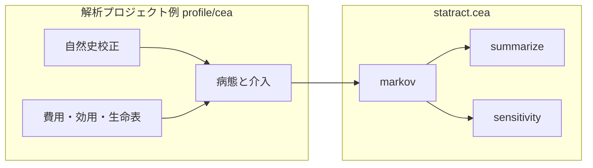

# statract.cea — 概要

疾患非依存の **費用対効果分析（CEA）** ユーティリティです。R の生態系に倣い、**モデル構築**と**結果の要約**を分けています。

| 層 | モジュール | R での近いもの |
|----|------------|----------------|
| cohort Markov | `statract.cea.markov` | heemod（核だけ） |
| ICER / 支配 | `statract.cea.summarize` | dampack `calculate_icers` |
| DSA / PSA 後段 | `statract.cea.sensitivity` | dampack / BCEA |

**R・rpy2・heemod / dampack / BCEA / hesim には依存しません。** 実装は NumPy と Polars です。

病態・費用表・校正済み自然史は解析プロジェクト側に置きます（例: SSL 経路は `profile/cea`）。

## 設計方針

- **入れるもの**: 名前付き状態の cohort STM、割引、イベント用 `on_cycle`、ICER 表（強支配 / 延長支配）、NMB、one-way DSA、PSA → CE plane / CEAC / EVPI
- **入れないもの（V1）**: 半サイクル補正、個体シミュレーション、partitioned survival、EVPPI、TreeAge 連携、疾患固有の校正（GAM 等）

## モジュール一覧

### `markov` — cohort 核

`simulate_cohort_markov(...)` が 1 年（または任意）サイクルの状態分布を進め、割引済み費用・QALY・LY を返します。検査・切除などの介入は `on_cycle(age, mass) -> (mass, extra_cost, extra_qaly)` に閉じます（`extra_*` は**未割引**。割引は核が掛ける）。

初期分布は、有限で非負かつ合計が正のとき 1 に正規化します。負の mass、合計が正でない初期分布、非有限または負の `discount_rate` は `ValueError` です。推移行列の各行は非負で和が 1、callable や `on_cycle` が返す mass はコホートの合計を保つ必要があります。負の mass を 0 に切り詰めて計算は続けません。

### `summarize` — ICER 表

`calculate_icers(cost, effect, strategies)` はモデルを知りません。戦略ごとの費用・効果だけから frontier を作り、`status` に次を付けます。

| status | 意味 |
|--------|------|
| `ND` | 非支配（frontier 上） |
| `D` | 強支配 |
| `ED` | 延長支配 |

`net_monetary_benefit(cost, effect, wtp=...)` は NMB = effect × WTP − cost です。

### `sensitivity` — 感度分析の後段

呼び出し側が「パラメータ dict → `(costs, effects)`」を渡します。

- `one_way_dsa` / `tornado_table`
- `run_psa` → `ce_plane` / `ceac` / `evpi`

`ceac` は費用か効果が非有限の draw を確率から外します。有限な draw が無いとき `prob_ce` は NaN で、先頭の戦略を最良とは数えません。

パラメータ分布（例: 費用の Gamma）はプロジェクト側で引きます。

## 解析プロジェクトとの境界

| 正本 | 内容 |
|------|------|
| **`statract.cea`** | 汎用核・ICER・PSA 後段 |
| **`profile/cea`** | SSL 14 状態、Detection、BRAF/MMR/Stage、tunnel 費用、GAM 校正、TreeAge 入力、費用 CSV |

詳細な SSL SAP は解析側の `profile/cea/docs/CEA_SAP.md` を正本とします。

## 次のページ

- [Quickstart](quickstart.md) — 動く最小例
- [公開教学例 cea_sicksicker](../stat/examples/cea_sicksicker.md) — DARTH Sick-Sicker（Markov / ICER / DSA / PSA）
- [R パッケージとの対応](vs-r.md)
- API: [markov](../api/cea/markov.md) · [summarize](../api/cea/summarize.md) · [sensitivity](../api/cea/sensitivity.md)
