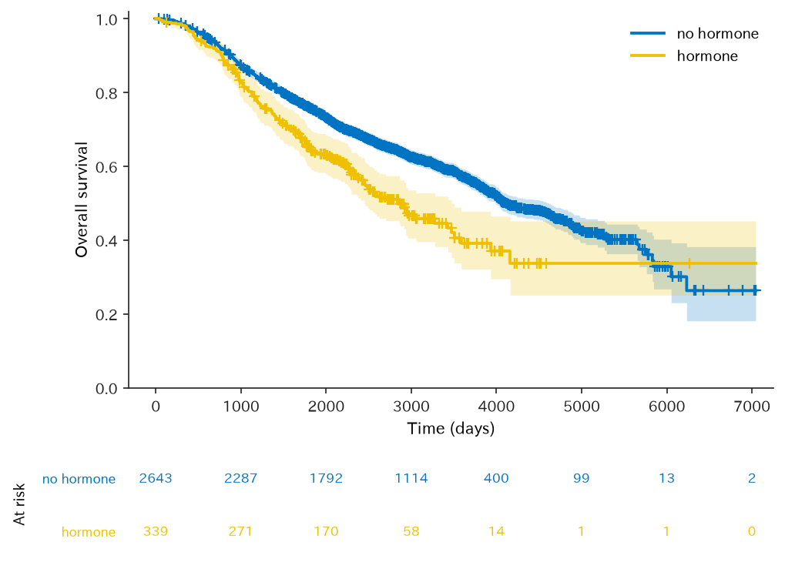
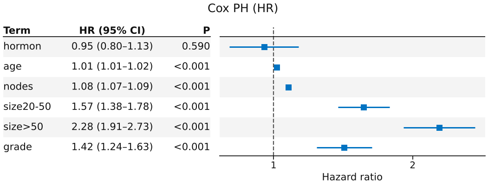
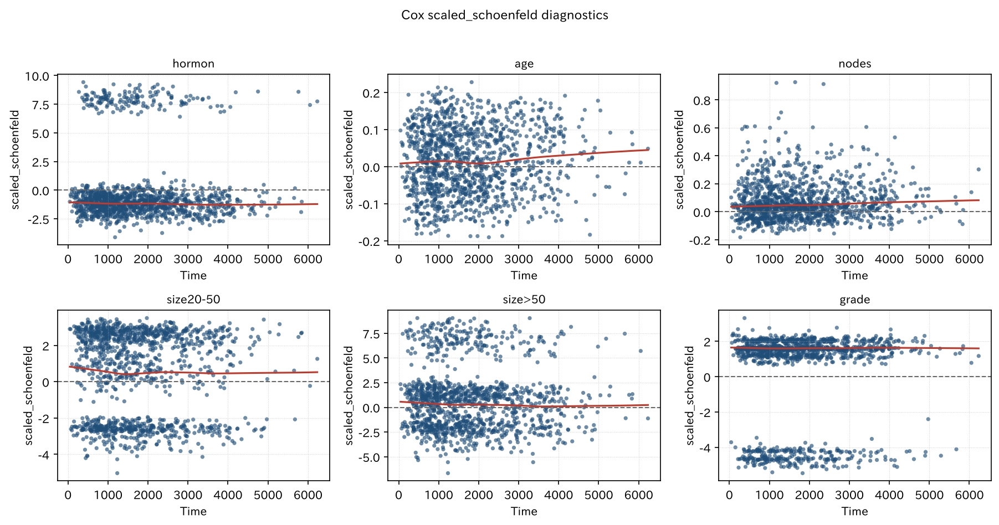
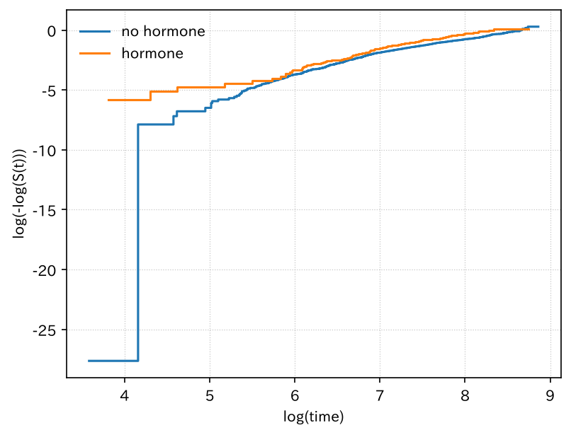
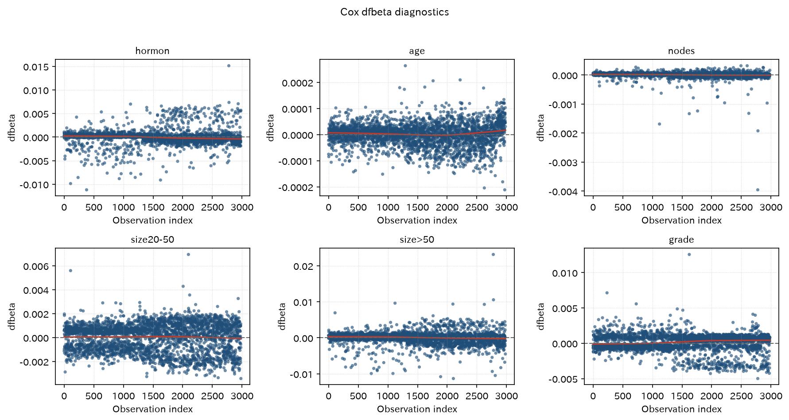
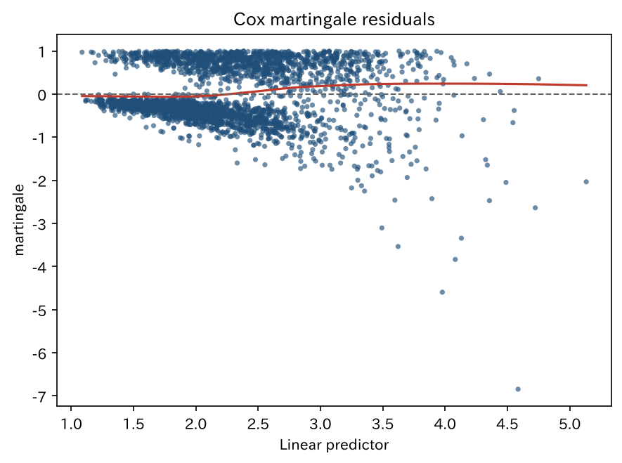
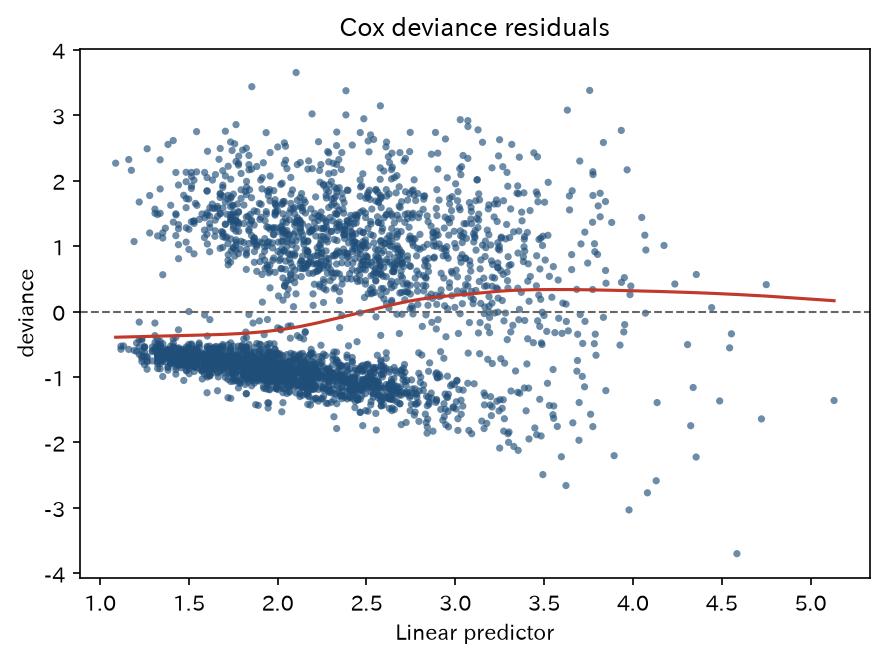
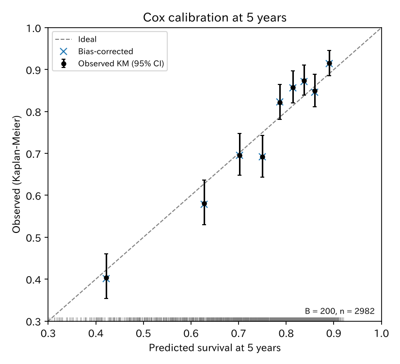

# PH 検定と AFT モデル

`aft_rotterdam` — Cox / PH 検定 / AFT

colon が PH を仮定した Cox だけなのに対し、PH 検定と AFT の正本。Cox forest まで。

[← ギャラリー](index.md) · [実行用ディレクトリと手順（GitHub）](https://github.com/mizuy/statract/tree/main/examples/aft_rotterdam)

## 目的概説

[`surv_colon`](surv_colon.md) は PH を仮定した Cox だけです。ここでは PH 診断（`proportional_hazards_test`）と、崩れたときの加速故障時間（Weibull AFT）を同じ公開コホートで見せるための例です。観察コホートであり因果の確定主張はしません。

## データと列の説明

| 項目 | 内容 |
|------|------|
| ソース | R `survival::rotterdam`（約 2982 人）。LGPL (>= 2) |
| 取得 | `build.py` |
| 単位 | 患者 1 行。アウトカムは死亡（再発は使わない） |

主な解析列:

| 列 | 意味 |
|----|------|
| `dtime` | 死亡までの日数 |
| `death` / `event` | 死亡イベント |
| `hormon` / `hormon_label` | ホルモン療法（0/1） |
| `age`, `nodes`, `size`, `grade` | Cox / AFT 共変量（`size` は区間ラベルのカテゴリ） |

## CQ と大まかな解析方針

**CQ** — ロッテルダム乳がんコホートで、ホルモン療法は死亡までの時間と関連するか。Cox の比例ハザードが疑わしいとき、Weibull AFT では時間比はどうか。

方針:

1. 全例コホートを確定（除外なしのため flowchart 省略）
2. Table 1 → KM / log-rank
3. Cox + `plot_forest(..., layout="table")` + `proportional_hazards_test`
4. Cox 予後モデルの内部検証（bootstrap optimism: `validate_cox`、5 年較正: `calibrate_cox`）
5. Weibull AFT（収束しないとき lognormal を併記）

## flowchart / tableone

解析セットに除外はありません（全例解析）。ギャラリー方針どおり **flowchart / Mermaid は省略**します。

### Table 1

=== "表"

    --8<-- "examples/assets/aft_rotterdam/table1_gt.md"

    [CSV](assets/aft_rotterdam/table1.csv)

=== "コード"

    ```python
    from statract import agg_category, agg_mean_sd, tableone

    params = {
        "Age (years)": ("age", agg_mean_sd),
        "Tumor size": ("size", agg_category),
        "Positive nodes": ("nodes", agg_mean_sd),
        "Grade": ("grade", agg_category),
        "Hormone therapy": ("hormon_label", agg_category),
        "Chemotherapy": ("chemo", agg_category),
        "Post-menopausal": ("meno", agg_category),
    }
    gt = tableone(cohort, params, hue="hormon_label", add_all=True, add_pvalue=True)
    # CSV/HTML/md を *_out/ に書くときだけ write_tableone_artifacts（ギャラリー同期用）
    ```

## メインの解析方法とそのコア

Cox:

$$
h(t \mid x)=h_0(t)\exp(\beta_{\mathrm{hormon}}\mathrm{hormon}+\beta_{\mathrm{age}}\mathrm{age}+\beta_{\mathrm{nodes}}\mathrm{nodes}+\beta_{\mathrm{size}}\mathrm{size}+\beta_{\mathrm{grade}}\mathrm{grade}).
$$

PH のスコア検定は時間変換 Kaplan–Meier（R の `km`）。Weibull AFT は log-time 上の線形予測子（`survreg` パラメータ化）。指数化係数は時間比。Cox forest は `plot_forest(..., layout="table")`（論文用白黒は `style="bw"`）。

内部検証は rms の `validate.cph` / `calibrate.cph`（`cmethod="KM"`）相当。bootstrap 標本で当てはめ直したモデルを、その標本（training）と元データ（test）で評価し、差の平均を optimism として見かけの指標から引きます。B=200、seed 固定。


## 結果

n=2982。サイト掲載は `task aft_rotterdam:all` 後の `aft_rotterdam_out/` から `tools/sync_example_assets.py` でコピーした同一ファイルです。

### Kaplan–Meier（`hormon`、number-at-risk 付き）

=== "図"

    

=== "コード"

    ```python
    from statract import plot_survival

    ax = plot_survival(cohort, time="dtime", status="event", hue="hormon_label")
    ax.set_xlabel("Time (days)")
    ax.set_ylabel("Overall survival")
    ax.figure.savefig(out / "figures" / "km_hormon.png", dpi=150, bbox_inches="tight")
    ```

### 時点生存割合

=== "表"

    | time | estimate | std_error | conf_low | conf_high | n_risk | group |
    | --- | --- | --- | --- | --- | --- | --- |
    | 365 | 0.981 | 0.002655 | 0.9759 | 0.9863 | 2586 | no hormone |
    | 1825 | 0.7562 | 0.008413 | 0.7399 | 0.7729 | 1901 | no hormone |
    | 3650 | 0.5675 | 0.01085 | 0.5466 | 0.5892 | 661 | no hormone |
    | 365 | 0.9734 | 0.008749 | 0.9564 | 0.9907 | 331 | hormone |
    | 1825 | 0.641 | 0.02672 | 0.5907 | 0.6956 | 186 | hormone |
    | 3650 | 0.392 | 0.03959 | 0.3216 | 0.4778 | 26 | hormone |

    [CSV](assets/aft_rotterdam/km_at.csv)

=== "コード"

    ```python
    from statract import survival_curve

    km = survival_curve(cohort, "dtime", "event", by="hormon_label")
    km_at = km.at([365.0, 1825.0, 3650.0])
    ```

### Cox PH（tidy）

=== "表"

    | term | estimate | std_error | statistic | p_value | conf_low | conf_high | exp_estimate | exp_conf_low | exp_conf_high |
    | --- | --- | --- | --- | --- | --- | --- | --- | --- | --- |
    | hormon | -0.04722 | 0.0877 | -0.5385 | 0.5903 | -0.2191 | 0.1247 | 0.9539 | 0.8032 | 1.133 |
    | age | 0.01473 | 0.002266 | 6.5 | 8.008e-11 | 0.01029 | 0.01917 | 1.015 | 1.01 | 1.019 |
    | nodes | 0.07415 | 0.004766 | 15.56 | 0 | 0.06481 | 0.08349 | 1.077 | 1.067 | 1.087 |
    | size20-50 | 0.4493 | 0.06522 | 6.889 | 5.605e-12 | 0.3215 | 0.5771 | 1.567 | 1.379 | 1.781 |
    | size>50 | 0.8261 | 0.09076 | 9.102 | 0 | 0.6482 | 1.004 | 2.284 | 1.912 | 2.729 |
    | grade | 0.3525 | 0.07012 | 5.026 | 4.997e-07 | 0.215 | 0.4899 | 1.423 | 1.24 | 1.632 |

    [CSV](assets/aft_rotterdam/cox_tidy.csv)

=== "コード"

    ```python
    from statract import cox_ph

    fit = cox_ph(cox_df, "Surv(dtime, event) ~ hormon + age + nodes + size + grade")
    cox_tidy = fit.tidy(exponentiate=True)
    ```

### Cox forest（表 + forest）

=== "図"

    

=== "コード"

    ```python
    from statract import plot_forest

    plot_forest(
        cox_tidy,
        out / "figures" / "cox_forest.png",
        title="Cox PH (HR)",
        xlabel="Hazard ratio",
        layout="table",
    )
    ```

### PH 検定（`cox.zph` 相当）

=== "表"

    | term | statistic | df | p_value |
    | --- | --- | --- | --- |
    | hormon | 0.704 | 1 | 0.4014 |
    | age | 14.59 | 1 | 1.337e-04 |
    | nodes | 3.729 | 1 | 0.05346 |
    | size | 4.875 | 2 | 0.08736 |
    | grade | 2.676 | 1 | 0.1019 |
    | global | 24.73 | 6 | 3.836e-04 |

    [CSV](assets/aft_rotterdam/ph_test.csv)

=== "コード"

    ```python
    from statract import proportional_hazards_test

    zph = proportional_hazards_test(fit)  # 既定 time_transform="kaplan_meier"
    ```

### Cox 診断プロット（survminer 風）

=== "図"

    

    

    

    

    

=== "コード"

    ```python
    from statract import write_cox_diagnostic_suite

    write_cox_diagnostic_suite(
        fit,
        out / "figures",
        data=cohort,
        time="dtime",
        status="event",
        by="hormon_label",
        stem="cox",
    )
    ```

ギャップ: survminer の対話 faceting / 外れ値ラベル / Cook 距離は未実装。層別 smooth なし。

### Cox 予後モデルの内部検証（bootstrap）

Cox モデル（上と同じ式）を予後モデルとして見たときの過剰適合を、bootstrap（B=200、seed=20261008）で補正します。`Dxy` は Somers の順位相関（C = 0.5 + Dxy/2）、`Slope` は線形予測子の較正 slope です。

=== "表"

    | index | index_orig | training | test | optimism | index_corrected | n |
    | --- | --- | --- | --- | --- | --- | --- |
    | Dxy | 0.3783 | 0.3793 | 0.3767 | 0.00265 | 0.3756 | 200 |
    | R2 | 0.1578 | 0.1584 | 0.1561 | 0.00225 | 0.1555 | 200 |
    | Slope | 1 | 1 | 0.9863 | 0.01372 | 0.9863 | 200 |
    | D | 0.02677 | 0.02699 | 0.02646 | 5.253e-04 | 0.02625 | 200 |
    | U | -1.050e-04 | -1.053e-04 | 2.454e-04 | -3.507e-04 | 2.458e-04 | 200 |
    | Q | 0.02688 | 0.02709 | 0.02622 | 8.760e-04 | 0.026 | 200 |
    | g | 0.6613 | 0.6676 | 0.6567 | 0.01087 | 0.6505 | 200 |

    [CSV](assets/aft_rotterdam/cox_validate.csv)

=== "コード"

    ```python
    from statract import validate_cox

    val = validate_cox(cox_df, COX_FORMULA, B=200, seed=20261008)
    ```

5 年（u = 1825 日）時点の較正。予測生存で約 300 人ずつ 9 群に分け、群の平均予測と KM を比べます。×は optimism を引いた補正後 KM。

=== "図"

    

=== "表"

    | mean_predicted | KM | std_err | mean_optimism | KM_corrected |
    | --- | --- | --- | --- | --- |
    | 0.422 | 0.404 | 0.0677 | 0.00222 | 0.401 |
    | 0.627 | 0.581 | 0.0471 | 0.00188 | 0.579 |
    | 0.702 | 0.696 | 0.0367 | 7.91e-04 | 0.695 |
    | 0.750 | 0.691 | 0.0370 | -1.04e-04 | 0.692 |
    | 0.787 | 0.822 | 0.0258 | -7.44e-04 | 0.823 |
    | 0.814 | 0.858 | 0.0227 | 0.00172 | 0.856 |
    | 0.838 | 0.874 | 0.0211 | 0.00193 | 0.872 |
    | 0.860 | 0.849 | 0.0234 | 0.00302 | 0.846 |
    | 0.890 | 0.915 | 0.0167 | 0.00149 | 0.914 |

    [CSV](assets/aft_rotterdam/cox_calibrate_5y.csv)

=== "コード"

    ```python
    import matplotlib.pyplot as plt
    import numpy as np
    from statract import calibrate_cox

    cal = calibrate_cox(cox_df, COX_FORMULA, u=1825.0, m=300, B=200, seed=20261008)
    t = cal.table  # mean_predicted, KM, KM_corrected, std_err, mean_optimism, ...

    # plot_calibration_curve はロジスティック用（calibrate_logistic の結果）なので、
    # 生存の較正図は matplotlib で描く（plot.calibrate の KM 版に相当）
    pred, km, se = (t[c].to_numpy() for c in ("mean_predicted", "KM", "std_err"))
    lo, hi = km * np.exp(-1.96 * se), np.minimum(km * np.exp(1.96 * se), 1.0)
    fig, ax = plt.subplots(figsize=(5.5, 5))
    ax.plot([0, 1], [0, 1], "--", color="gray", label="Ideal")
    ax.errorbar(pred, km, yerr=[km - lo, hi - km], fmt="o", color="black", label="Observed KM (95% CI)")
    ax.plot(pred, t["KM_corrected"].to_numpy(), "x", color="C0", label="Bias-corrected")
    fig.savefig(out / "figures" / "cox_calibrate_5y.png", dpi=150)
    ```

### AFT Weibull（tidy、指数化 = 時間比）

=== "表"

    | term | estimate | std_error | statistic | p_value | conf_low | conf_high | exp_estimate | exp_conf_low | exp_conf_high |
    | --- | --- | --- | --- | --- | --- | --- | --- | --- | --- |
    | (Intercept) | 8.455 | 0.07228 | 117 | 0 | 8.314 | 8.597 | 4700 | 4079 | 5415 |
    | hormon | -0.06343 | 0.03177 | -1.997 | 0.04585 | -0.1257 | -0.00117 | 0.9385 | 0.8819 | 0.9988 |
    | age | -0.004143 | 8.004e-04 | -5.176 | 2.271e-07 | -0.005712 | -0.002574 | 0.9959 | 0.9943 | 0.9974 |
    | nodes | -0.0396 | 0.001734 | -22.83 | 0 | -0.043 | -0.0362 | 0.9612 | 0.9579 | 0.9644 |
    | size20-50 | -0.08832 | 0.02165 | -4.08 | 4.497e-05 | -0.1307 | -0.0459 | 0.9155 | 0.8774 | 0.9551 |
    | size>50 | -0.2877 | 0.03375 | -8.524 | 0 | -0.3538 | -0.2215 | 0.75 | 0.702 | 0.8013 |
    | grade | -0.1312 | 0.02285 | -5.744 | 9.231e-09 | -0.176 | -0.08645 | 0.877 | 0.8386 | 0.9172 |
    | Log(scale) | -0.4473 | 0 | -inf | 0 | -0.4473 | -0.4473 | 0.6393 | 0.6393 | 0.6393 |

    [CSV](assets/aft_rotterdam/aft_weibull_tidy.csv)

=== "コード"

    ```python
    from statract import accelerated_failure

    aft = accelerated_failure(cox_df, COX_FORMULA, distribution="weibull")
    aft_tidy = aft.tidy(exponentiate=True)  # 時間比
    # Weibull が収束しないときの読み用:
    aft_ln = accelerated_failure(cox_df, COX_FORMULA, distribution="lognormal")
    ```

## 解釈と解説

log-rank はホルモン療法群で差がある（統計量 23.7、p≈1.1×10⁻⁶）。調整 Cox の `hormon` HR は約 **0.95**（95% CI 約 0.80–1.13）で 1 と区別しにくい。節数・腫瘍径・グレード・年齢は HR>1。`proportional_hazards_test` の全体 p≈3.8×10⁻⁴（主に `age`）。未調整 KM と調整 Cox の向きの食い違いは交絡として読みます。zph 全体が有意なので単一 HR だけに頼らない、という読み方をします。

予後モデルとしての内部検証では、見かけの Dxy 0.378（C≈0.689）に対し optimism は 0.003 で、補正後 Dxy 0.376（C≈0.688）。補正後の較正 slope は 0.986 で、縮小はほぼ不要です。n=2982・死亡約 1270 件に対し自由度 6 のモデルなので、過剰適合が小さいのは予想どおりです。5 年較正では 9 群の点がおおむね対角線上にあり、群ごとの optimism は 0.003 以下。予測 0.63 と 0.75 の群では KM が予測より 5–6 ポイント低く（0.75 の群は 95% CI 上端 0.74 で対角線にわずかに届かない）、中間リスク帯でやや楽観的です。識別は中程度（C≈0.69）なので、較正が良くても個人予測の精度は限られます。また内部検証なので、別コホートへの移植性（外部妥当性）は示しません。PH の崩れ（`age`）は較正点の評価時点を 5 年に固定していることで部分的に吸収されますが、他の時点では較正が異なりえます。

限界: 再発は競合になりやすいので使っていない。AFT 分布は Weibull 第一選択。未測定交絡。LGPL 教学データ。

## 実行と成果物

```bash
cd examples
task aft_rotterdam:all
uv run python ../tools/sync_example_assets.py --stem aft_rotterdam
```

既存の付随文書: [concept](https://github.com/mizuy/statract/blob/main/examples/aft_rotterdam/aft_rotterdam_concept.md) · [protocol](https://github.com/mizuy/statract/blob/main/examples/aft_rotterdam/aft_rotterdam_protocol.md) · [results](https://github.com/mizuy/statract/blob/main/examples/aft_rotterdam/aft_rotterdam_results.md) · [discussion](https://github.com/mizuy/statract/blob/main/examples/aft_rotterdam/aft_rotterdam_discussion.md)
