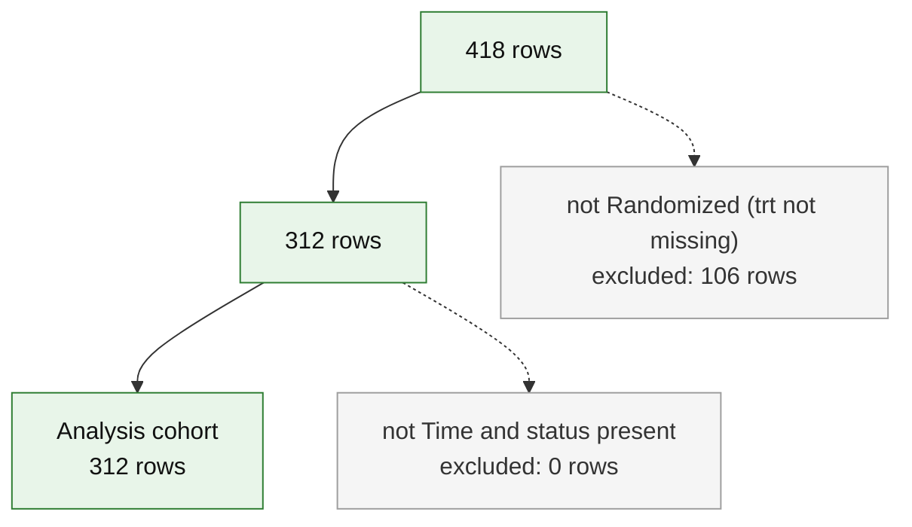

```mermaid
flowchart TB
  classDef keep fill:#e8f5e9,stroke:#2e7d32,color:#111
  classDef drop fill:#f5f5f5,stroke:#9e9e9e,color:#333
  A["418 rows"]:::keep
  B["312 rows"]:::keep
  X1["not Randomized (trt not missing)<br/>excluded: 106 rows"]:::drop
  C["Analysis cohort<br/>312 rows"]:::keep
  X2["not Time and status present<br/>excluded: 0 rows"]:::drop
  A --> B
  A -.-> X1
  B --> C
  B -.-> X2
```
