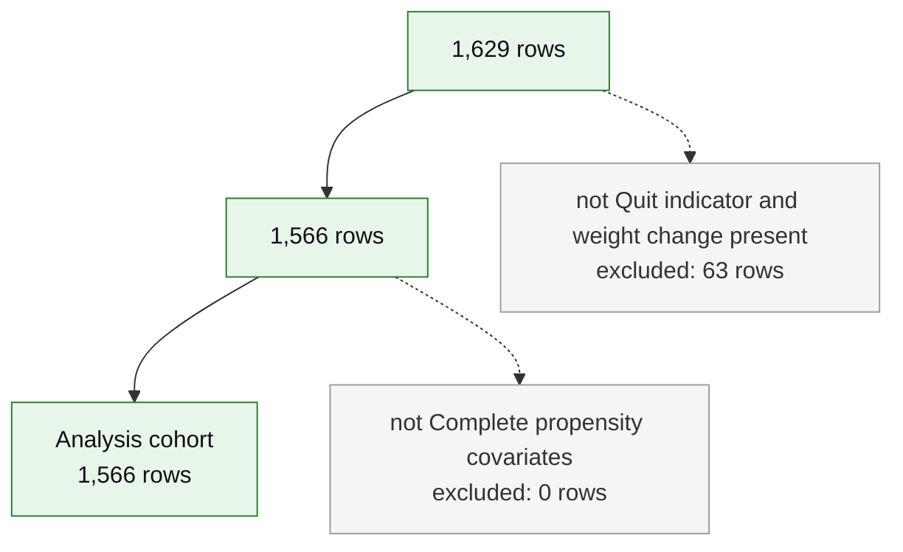

```mermaid
flowchart TB
  classDef keep fill:#e8f5e9,stroke:#2e7d32,color:#111
  classDef drop fill:#f5f5f5,stroke:#9e9e9e,color:#333
  A["1,629 rows"]:::keep
  B["1,566 rows"]:::keep
  X1["not Quit indicator and weight change present<br/>excluded: 63 rows"]:::drop
  C["Analysis cohort<br/>1,566 rows"]:::keep
  X2["not Complete propensity covariates<br/>excluded: 0 rows"]:::drop
  A --> B
  A -.-> X1
  B --> C
  B -.-> X2
```
