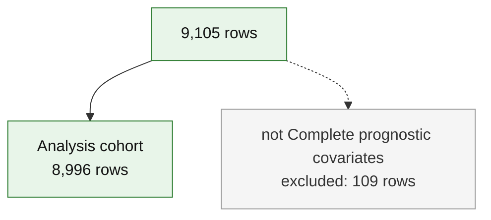

```mermaid
flowchart TB
  classDef keep fill:#e8f5e9,stroke:#2e7d32,color:#111
  classDef drop fill:#f5f5f5,stroke:#9e9e9e,color:#333
  A["9,105 rows"]:::keep
  B["Analysis cohort<br/>8,996 rows"]:::keep
  X1["not Complete prognostic covariates<br/>excluded: 109 rows"]:::drop
  A --> B
  A -.-> X1
```
