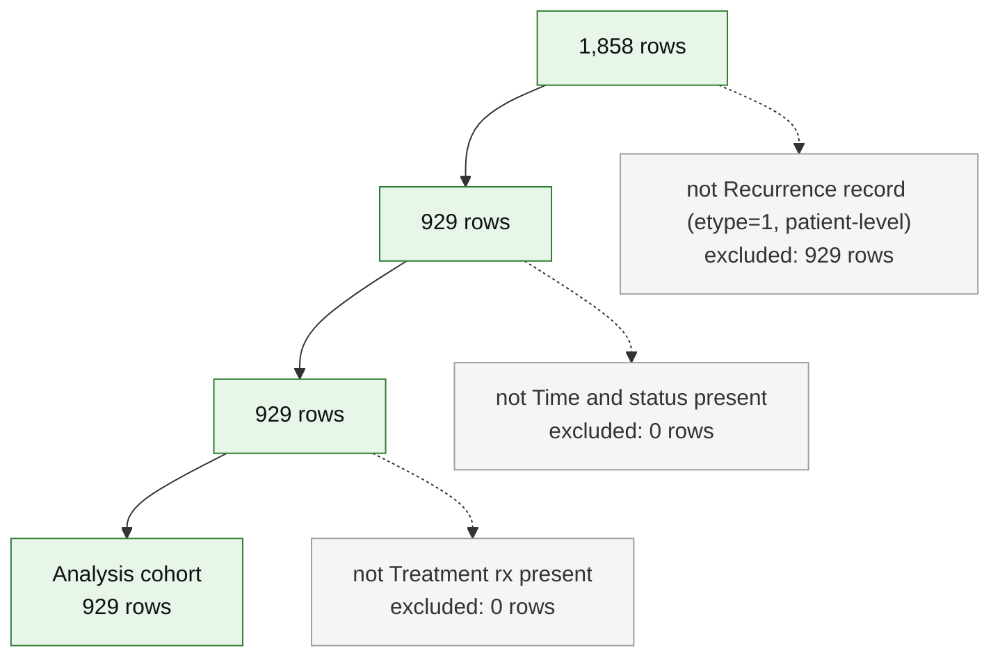

```mermaid
flowchart TB
  classDef keep fill:#e8f5e9,stroke:#2e7d32,color:#111
  classDef drop fill:#f5f5f5,stroke:#9e9e9e,color:#333
  A["1,858 rows"]:::keep
  B["929 rows"]:::keep
  X1["not Recurrence record (etype=1, patient-level)<br/>excluded: 929 rows"]:::drop
  C["929 rows"]:::keep
  X2["not Time and status present<br/>excluded: 0 rows"]:::drop
  D["Analysis cohort<br/>929 rows"]:::keep
  X3["not Treatment rx present<br/>excluded: 0 rows"]:::drop
  A --> B
  A -.-> X1
  B --> C
  B -.-> X2
  C --> D
  C -.-> X3
```
