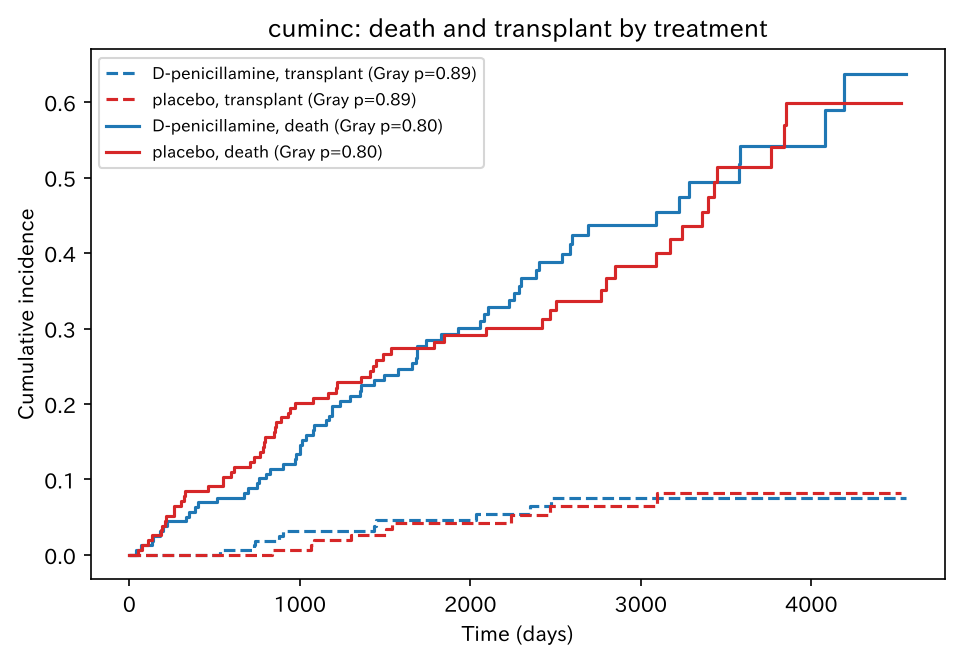

# 競合リスク解析

`cif_pbc` — 競合リスク（CIF / Fine–Gray）

単一イベントの colon に対し、競合リスク（肝死 vs 移植）の正本。Fine–Gray forest、cmprsk 流の `cuminc`（Gray 検定）と `crr` まで。

[← ギャラリー](index.md) · [実行用ディレクトリと手順（GitHub）](https://github.com/mizuy/statract/tree/main/examples/cif_pbc)

## 目的概説

単一イベントの KM/Cox は [`surv_colon`](surv_colon.md) で示した。ここでは移植を競合とした **肝死** の累積発生（Aalen–Johansen）と Fine–Gray を、同じ `statract` 公開 API で通すための例です。

## データと列の説明

| 項目 | 内容 |
|------|------|
| ソース | R `survival::pbc`（無作為化 312 例）。LGPL (>= 2) |
| 取得 | `build.py`（R `survival`、否则 Rdatasets CSV） |
| 単位 | 患者 1 行。非無作為化 106 例は主解析に入れない |

主な解析列:

| 列 | 意味 |
|----|------|
| `time` | 追跡日数 |
| `status` | 0 打ち切り、1 移植（競合）、2 死亡（関心事象 = 肝死） |
| `death_naive` | 誤用 KM 用（移植を打ち切り扱い） |
| `trt` / `trt_label` / `dp` | 治療（D-ペニシラミン = 1）。参照はプラセボ |
| `age`, `sex`, `bili`, `albumin`, `edema`, `stage` | Fine–Gray 共変量 |

## CQ と大まかな解析方針

**CQ** — 無作為化 PBC 試験で、D-ペニシラミンはプラセボと比べ、移植を競合事象としたときの **肝死の累積発生** を下げるか。

方針:

1. flowchart で無作為化例を確定
2. Table 1（`hue=trt_label`）
3. 誤用 KM（対比）と Aalen–Johansen CIF（肝死）
4. Fine–Gray（`fine_gray` → 重み付き `cox_ph`）と `plot_forest(..., layout="table")`
5. cmprsk 移植版: `cumulative_incidence`（`cuminc`、Gray 検定）と `fine_gray_regression`（`crr`）で同じ問いを確かめる

## flowchart / tableone

### Flowchart

| 段 | flowchart キー | 対応基準 |
|----|----------------|----------|
| 無作為化 | `Randomized (trt not missing)` | `trt` / `trt_label` 非欠損 |
| 時間 | `Time and status present` | `time` / `status` 非欠損 |

=== "図"

    ```mermaid
    flowchart TB
      classDef keep fill:#e8f5e9,stroke:#2e7d32,color:#111
      classDef drop fill:#f5f5f5,stroke:#9e9e9e,color:#333
      A["418 rows"]:::keep
      B["312 rows"]:::keep
      X1["not Randomized (trt not missing)<br/>excluded: 106 rows"]:::drop
      C["Analysis cohort<br/>312 rows"]:::keep
      X2["not Time and status present<br/>excluded: 0 rows"]:::drop
      A --> B
      A -.-> X1
      B --> C
      B -.-> X2
    ```

    同一内容は `assets/cif_pbc/mermaid_flowchart.md`（`cif_pbc_out/` から sync）。

=== "コード"

    ```python
    import io
    import polars as pl
    from statract.reporting import markdown_flowchart, mermaid_flowchart

    buf = io.StringIO()
    cohort = target.pp.flowchart(
        {
            "Randomized (trt not missing)": (
                pl.col("trt").is_not_null() & pl.col("trt_label").is_not_null()
            ),
            "Time and status present": (
                pl.col("time").is_not_null() & pl.col("status").is_not_null()
            ),
        },
        out=buf,
    )
    flow_text = buf.getvalue()
    markdown_flowchart(flow_text)
    mermaid_flowchart(flow_text, final_label="Analysis cohort")
    ```

### Table 1

=== "表"

    --8<-- "examples/assets/cif_pbc/table1_gt.md"

    [CSV](assets/cif_pbc/table1.csv)

=== "コード"

    ```python
    from statract import agg_category, agg_mean_sd, agg_median_iqr, tableone

    params = {
        "Age (years)": ("age", agg_mean_sd),
        "Sex": ("sex", agg_category),
        "Bilirubin (mg/dL)": ("bili", agg_median_iqr),
        "Albumin (g/dL)": ("albumin", agg_median_iqr),
        "Edema score": ("edema", agg_category),
        "Histologic stage": ("stage", agg_category),
    }
    gt = tableone(cohort, params, hue="trt_label", add_all=True, add_pvalue=True)
    # CSV/HTML/md を *_out/ に書くときだけ write_tableone_artifacts（ギャラリー同期用）
    ```

## メインの解析方法とそのコア

原因 $k=2$（肝死）。Aalen–Johansen 累積発生 $\hat F_2(t)$。誤用として移植を打ち切りにした Kaplan–Meier を対比。Fine–Gray の subdistribution ハザード:

$$
\lambda_2(t \mid x)=\lambda_{2,0}(t)\exp(\beta_{\mathrm{dp}}\mathrm{dp}+\beta^\top z),
$$

$z$ は年齢、性別、ビリルビン、アルブミン、浮腫、病期。実装: `fine_gray(..., cause=2)` のあと `cox_ph("Surv(fgstart, fgstop, fgstatus) ~ ...", weights="fgwt")` → `plot_forest(..., layout="table")`（論文用白黒は `style="bw"`）。CIF 図は matplotlib ステップ（`plot_survival` は使わない）。偽の PH 診断スイートは載せない。

同じ解析を R `cmprsk` 流でも行う。`cumulative_incidence(..., by="trt_label")` は群・原因ごとの CIF と、群間の **Gray 検定**（$(1-\hat F(t-))^\rho$ 重み、既定 $\rho=0$）を返す。`fine_gray_regression("Surv(time, status) ~ ...", cause=2)` は `crr` と同じ擬似尤度を直接解き、SE には打ち切り分布の推定を含む Fine–Gray のサンドイッチ分散を使う。


## 結果

無作為化 312 例。サイト掲載は `assets/cif_pbc/`。

### Aalen–Johansen CIF（肝死）

=== "図"

    

=== "コード"

    ```python
    from statract import survival_curve

    aj = survival_curve(
        cohort, "time", "status", by="trt_label", kind="aalen_johansen"
    )
    cif = aj.frame()
    # state == "2" が肝死。図はステッププロット（例スクリプトの _plot_cif）
    ```

### CIF 時点値

=== "表"

    | time | estimate | std_error | conf_low | conf_high | n_risk | group | state |
    | --- | --- | --- | --- | --- | --- | --- | --- |
    | 365 | 0.05696 | 0.01892 | 0.01988 | 0.09404 | 150 | D-penicillamine | 2 |
    | 730 | 0.08861 | 0.02359 | 0.04238 | 0.1348 | 144 | D-penicillamine | 2 |
    | 1825 | 0.2844 | 0.04359 | 0.199 | 0.3698 | 83 | D-penicillamine | 2 |
    | 3650 | 0.5424 | 0.07883 | 0.3879 | 0.6969 | 17 | D-penicillamine | 2 |
    | 365 | 0.08442 | 0.02331 | 0.03873 | 0.1301 | 142 | placebo | 2 |
    | 730 | 0.1234 | 0.02818 | 0.06814 | 0.1786 | 136 | placebo | 2 |
    | 1825 | 0.2823 | 0.04357 | 0.1969 | 0.3677 | 78 | placebo | 2 |
    | 3650 | 0.514 | 0.08248 | 0.3524 | 0.6757 | 17 | placebo | 2 |

    [CSV](assets/cif_pbc/cif_death_at.csv)

=== "コード"

    ```python
    death_cif = cif.filter(pl.col("state").cast(pl.Utf8) == "2")
    # aj_death.at([365, 730, 1825, 3650])
    ```

### Fine–Gray（tidy、指数化）

=== "表"

    | term | estimate | std_error | statistic | p_value | conf_low | conf_high | exp_estimate | exp_conf_low | exp_conf_high |
    | --- | --- | --- | --- | --- | --- | --- | --- | --- | --- |
    | dp | -0.02607 | 0.1836 | -0.142 | 0.8871 | -0.386 | 0.3339 | 0.9743 | 0.6798 | 1.396 |
    | age | 0.03255 | 0.009926 | 3.279 | 0.00104 | 0.0131 | 0.052 | 1.033 | 1.013 | 1.053 |
    | sexm | 0.4924 | 0.2692 | 1.829 | 0.06738 | -0.03521 | 1.02 | 1.636 | 0.9654 | 2.773 |
    | bili | 0.124 | 0.01644 | 7.543 | 4.588e-14 | 0.09179 | 0.1562 | 1.132 | 1.096 | 1.169 |
    | albumin | -0.8716 | 0.2385 | -3.654 | 2.581e-04 | -1.339 | -0.4041 | 0.4183 | 0.2621 | 0.6676 |
    | edema | 1.042 | 0.3175 | 3.282 | 0.00103 | 0.4197 | 1.664 | 2.835 | 1.522 | 5.281 |
    | stage | 0.45 | 0.1245 | 3.616 | 2.994e-04 | 0.2061 | 0.6939 | 1.568 | 1.229 | 2.002 |

    [CSV](assets/cif_pbc/finegray_tidy.csv)

=== "コード"

    ```python
    from statract import cox_ph, fine_gray

    expanded = fine_gray(fg_df, FG_FORMULA, cause=2)
    fg_fit = cox_ph(expanded, FG_COX, weights="fgwt")
    fg_tidy = fg_fit.tidy(exponentiate=True)
    ```

### Fine–Gray forest（subdistribution HR）

=== "図"

    

=== "コード"

    ```python
    from statract import plot_forest

    plot_forest(
        fg_tidy,
        out / "figures" / "finegray_forest.png",
        title="Fine–Gray (subdistribution HR)",
        xlabel="Hazard ratio",
        layout="table",
    )
    ```

### cuminc と Gray 検定

`cumulative_incidence` は肝死（cause 2）と移植（cause 1）の CIF を群ごとに返す。点推定は上の Aalen–Johansen と一致する（5 年肝死 0.284 / 0.282）。SE は `cuminc` の分散式なので `survival_curve` の値と少し違う（例: D-ペニシラミン 5 年 0.037 vs 0.044）。

=== "図"

    

=== "表"

    Gray 検定（D-ペニシラミン vs プラセボ、$\rho=0$）:

    | cause | statistic | p_value | df |
    | --- | --- | --- | --- |
    | 1（移植） | 0.01943 | 0.8891 | 1 |
    | 2（肝死） | 0.06659 | 0.7964 | 1 |

    [Gray 検定 CSV](assets/cif_pbc/gray_test.csv) · [時点値 CSV](assets/cif_pbc/cuminc_at.csv)

=== "コード"

    ```python
    from statract import cumulative_incidence

    ci = cumulative_incidence(cohort, "time", "status", by="trt_label")
    ci.tests                          # Gray 検定（原因ごと）
    ci.at([365, 730, 1825, 3650])     # timepoints() 相当
    ci.frame()                        # 曲線の角（time, estimate, variance, std_error）
    ```

### crr と fine_gray の比較

=== "表"

    | term | crr 係数 | fine_gray 係数 | crr SHR | fine_gray SHR | crr SE | fine_gray SE（robust） | fine_gray SE（モデル） |
    | --- | --- | --- | --- | --- | --- | --- | --- |
    | dp | -0.02662 | -0.02607 | 0.9737 | 0.9743 | 0.1888 | 0.1836 | 0.1846 |
    | age | 0.03259 | 0.03255 | 1.033 | 1.033 | 0.01019 | 0.009926 | 0.009486 |
    | sexm | 0.4926 | 0.4924 | 1.637 | 1.636 | 0.277 | 0.2692 | 0.2527 |
    | bili | 0.1239 | 0.124 | 1.132 | 1.132 | 0.01646 | 0.01644 | 0.01524 |
    | albumin | -0.8701 | -0.8716 | 0.4189 | 0.4183 | 0.2449 | 0.2385 | 0.2482 |
    | edema | 1.041 | 1.042 | 2.832 | 2.835 | 0.3224 | 0.3175 | 0.3119 |
    | stage | 0.4495 | 0.45 | 1.568 | 1.568 | 0.1279 | 0.1245 | 0.1308 |

    `crr` の `dp` SHR 0.97（95% CI 0.67–1.41）。擬似尤度比検定 χ² = 168.5（df 7）。[比較 CSV](assets/cif_pbc/crr_vs_finegray.csv) · [crr tidy CSV](assets/cif_pbc/crr_tidy.csv)

=== "コード"

    ```python
    import numpy as np
    from statract import fine_gray_regression

    crr = fine_gray_regression(fg_df, FG_FORMULA, cause=2)
    crr_tidy = crr.tidy(exponentiate=True)
    crr.glance()                      # 擬似尤度比検定
    # 比較相手: fine_gray → cox_ph(weights="fgwt") の fg_fit
    model_se = np.sqrt(np.diag(fg_fit.information_inverse()))
    ```

係数の差は小数第 3 位以下。差の主因は同時点死亡の扱いで、`crr` は Breslow、`cox_ph` の既定は Efron（`ties="breslow"` にすると係数は 5 桁一致）。SE は推定量が違う: `crr` は打ち切り分布 $\hat G$ の推定誤差を含む Fine–Gray サンドイッチ。重み付き `cox_ph` は非整数重みなので展開行ごとの robust（`survival::coxph` と同じ既定）で、$\hat G$ の変動は入らない。ここでは `crr` の SE が robust SE より 0–3% 大きい程度で、結論は変わらない。

## 解釈と解説

肝死の 5 年 CIF は D-ペニシラミン約 0.28、プラセボ約 0.28。Fine–Gray の `dp` subdistribution HR は約 **0.97**（95% CI 約 0.68–1.40、robust SE）。`crr` でも SHR 0.97（0.67–1.41）、Gray 検定も肝死 p = 0.80、移植 p = 0.89 で、群差の証拠はない。治療の点推定が 1 付近なのは、歴史的試験で生存利益が明確でなかったことと方向が一致します。ビリルビンの SHR は約 1.13（1 mg/dL あたり）。

限界: 非無作為化例は除外。誤用 KM は対比用。CIF 図は公式 `plot_survival` ではない。LGPL 教学データ。

## 実行と成果物

```bash
cd examples/cif_pbc
task all
```

既存の付随文書: [concept](https://github.com/mizuy/statract/blob/main/examples/cif_pbc/cif_pbc_concept.md) · [protocol](https://github.com/mizuy/statract/blob/main/examples/cif_pbc/cif_pbc_protocol.md) · [results](https://github.com/mizuy/statract/blob/main/examples/cif_pbc/cif_pbc_results.md) · [discussion](https://github.com/mizuy/statract/blob/main/examples/cif_pbc/cif_pbc_discussion.md)
