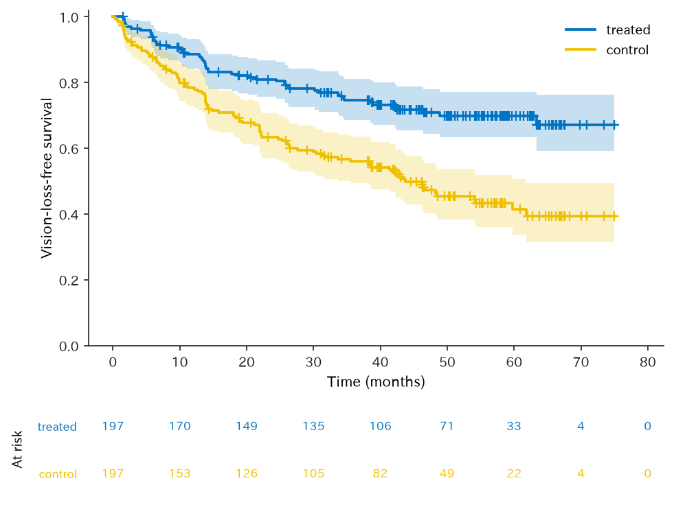
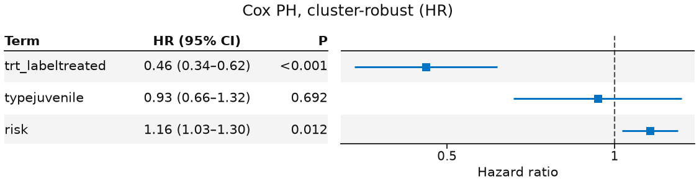
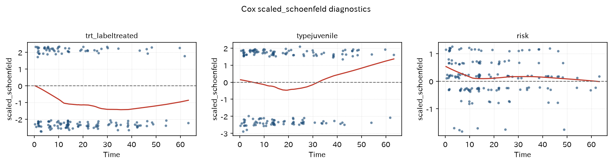
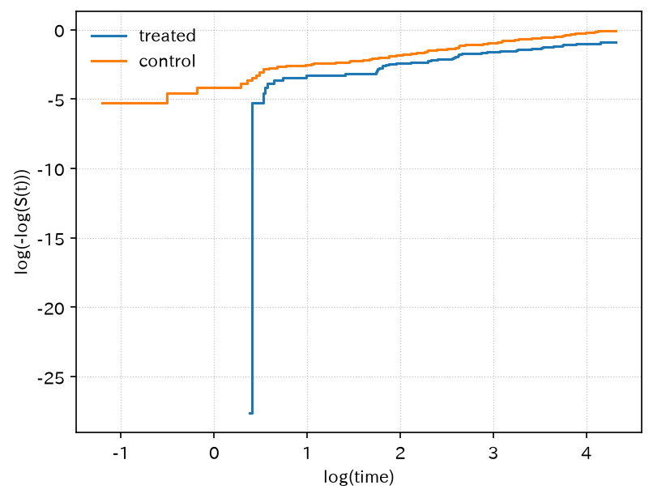
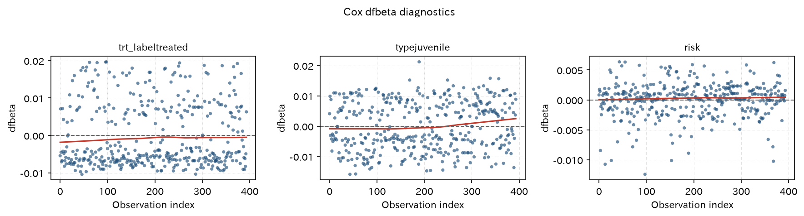
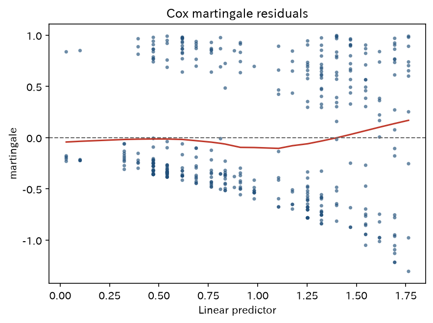
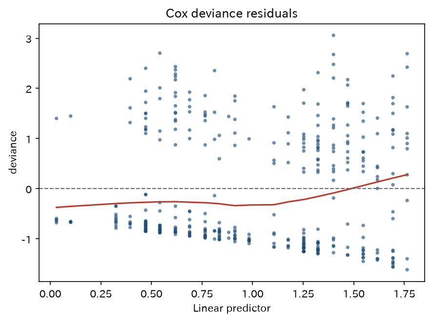

# クラスター頑健 Cox

`cox_retinopathy` — クラスター頑健 Cox（Lin–Wei sandwich）

患者あたり両眼の公開 RCT で、`cox_ph` の **Lin–Wei sandwich**（`cluster(id)` / `cluster=`）を通す正本。OLS/GLM の `hc_covariance` や `fit_mixed` は使わない。

[← ギャラリー](index.md) · [実行用ディレクトリと手順（GitHub）](https://github.com/mizuy/statract/tree/main/examples/cox_retinopathy)

## 目的概説

単一イベント生存の Cox は [`surv_colon`](surv_colon.md) が患者独立の正本です。ここでは **同一患者の両眼** が相関するため、モデルベース SE では不十分な場面を示します。係数は同じでも、分散はスコア残差を `id` で合算した Lin–Wei（`survival::coxph` の `cluster()`）です。

## データと列の説明

| 項目 | 内容 |
|------|------|
| ソース | R `survival::retinopathy`（糖尿病網膜症・片眼レーザー）。ライセンス LGPL (>= 2)。git 非収載 |
| 取得 | `build.py`（R が使えれば `data(retinopathy, package="survival")`、否则 Rdatasets CSV） |
| 単位 | 眼 1 行。197 人 × 両眼 = 394 行。行の除外なし |

主な解析列:

| 列 | 意味 |
|----|------|
| `id` | 患者。sandwich のクラスター |
| `futime` | 視力喪失または打ち切りまでの月 |
| `status` / `event` | 視力喪失（`status==1` → `event` bool） |
| `trt` / `trt_label` | 治療眼 `treated` / 対照眼 `control`。参照は `control`（`pl.Enum` 順） |
| `type` | 糖尿病型 `adult` / `juvenile` |
| `risk` | 眼単位のベースラインリスク（6–12） |
| `laser`, `eye`, `age` | Table 1（レーザー種、治療側、発症年齢）。患者単位 |

## CQ と大まかな解析方針

**CQ** — 増殖前糖尿病網膜症において、片眼レーザー光凝固は対側の未治療眼に比べ、視力喪失までの時間を延長するか。

方針:

1. 全 394 眼を解析セットとする（除外ゼロのため **flowchart は置かない**）
2. Table 1（`hue=trt_label`）。患者単位の列は群間で同一（患者内無作為化）
3. KM（**number-at-risk 表付き**）+ log-rank は記述
4. Cox（`trt_label + type + risk + cluster(id)`）で調整 HR。`plot_forest(..., layout="table")`
5. 同じ平均構造のモデルベース SE と sandwich SE の比を表にする
6. `proportional_hazards_test` と Schoenfeld / log-log / dfbeta / martingale / deviance

推論の主はクラスター Cox。KM / log-rank は眼を独立とみなす記述です。

## flowchart / tableone

除外・畳み込みはない（394 眼 / 197 人を全例使用）。flowchart は省略し、Table 1 に進む。

### Table 1（`hue=trt_label`、眼単位）

患者単位の年齢・病型・レーザー種は両群で同じ分布になる。p 値は付けない（患者内割付けに対して独立二群検定が不向きで、年齢では誤った極小 p が出ることがある）。

=== "表"

    --8<-- "examples/assets/cox_retinopathy/table1_gt.md"

    [CSV](assets/cox_retinopathy/table1.csv)

=== "コード"

    ```python
    from statract import agg_category, agg_mean_sd, tableone

    tableone(
        cohort,
        {
            "Age at diabetes onset (years)": ("age", agg_mean_sd),
            "Diabetes type": ("type", agg_category),
            "Laser type": ("laser", agg_category),
            "Treated eye (laterality)": ("eye", agg_category),
            "Baseline risk score": ("risk", agg_mean_sd),
        },
        hue="trt_label",
        add_all=True,
        add_pvalue=False,
    )
    ```

## メインの解析方法とそのコア

Kaplan–Meier 生存関数 $\hat S(t)$（群 = `trt_label`）。2 標本 log-rank（Mantel–Haenszel、$\rho=0$）。Cox:

$$
h(t \mid x) = h_0(t)\exp(\beta_{\mathrm{trt}} + \beta_{\mathrm{type}}\mathrm{type} + \beta_{\mathrm{risk}}\mathrm{risk}).
$$

分散は Lin–Wei: スコア残差を患者 `id` で足して meat とし、情報行列の逆との sandwich にする（`cox_ph` が `cluster=` または式の `cluster(id)` を見たとき。right-censored、entry=0）。

- KM / 図: `plot_survival`（既定で number-at-risk。NAR は曲線の x 軸と揃える。論文用白黒は `style="bw"`）
- log-rank: `log_rank(..., by="trt_label")`
- Cox: `cox_ph(..., cluster=)` → `tidy(exponentiate=True)` → `plot_forest(..., layout="table")`（論文用白黒は `style="bw"`）
- 比較: `cluster` なしのモデルベース SE
- PH: `proportional_hazards_test` + `write_cox_diagnostic_suite`

`hc_covariance` は OLS/GLM 用。Cox の頑健分散はこの経路である。

## 結果

**394 眼 / 197 人**。サイト掲載は `task all` 後の `cox_retinopathy_out/` から `scripts/sync_example_assets.py` でコピーした同一ファイルです。

### Kaplan–Meier（`trt_label`、number-at-risk 付き）

=== "図"

    

=== "コード"

    ```python
    from statract import plot_survival

    ax = plot_survival(cohort, time="futime", status="event", hue="trt_label")
    ax.set_xlabel("Time (months)")
    ax.set_ylabel("Vision-loss-free survival")
    ax.figure.savefig(out / "figures" / "km_trt.png", dpi=150, bbox_inches="tight")
    ```

### 時点生存割合

=== "表"

    | time | estimate | std_error | conf_low | conf_high | n_risk | group |
    | --- | --- | --- | --- | --- | --- | --- |
    | 12 | 0.8858 | 0.02292 | 0.8420 | 0.9319 | 165 | treated |
    | 24 | 0.8098 | 0.02858 | 0.7557 | 0.8678 | 144 | treated |
    | 48 | 0.7087 | 0.03466 | 0.6439 | 0.7800 | 76 | treated |
    | 12 | 0.7829 | 0.02966 | 0.7269 | 0.8433 | 149 | control |
    | 24 | 0.6334 | 0.03497 | 0.5684 | 0.7058 | 117 | control |
    | 48 | 0.4721 | 0.03871 | 0.4021 | 0.5544 | 54 | control |

    [CSV](assets/cox_retinopathy/km_at.csv)

=== "コード"

    ```python
    from statract import survival_curve

    km = survival_curve(cohort, "futime", "event", by="trt_label")
    km_at = km.at([12.0, 24.0, 48.0])  # 1y / 2y / 4y
    ```

### Log-rank

=== "表"

    ```text
    log-rank statistic = 22.246, df = 1, p = 2.399e-06
    ```

=== "コード"

    ```python
    from statract import log_rank

    lr = log_rank(cohort, "futime", "event", by="trt_label")
    ```

### Cox PH（Lin–Wei sandwich、指数化）

=== "表"

    | term | estimate | std_error | statistic | p_value | conf_low | conf_high | exp_estimate | exp_conf_low | exp_conf_high |
    | --- | --- | --- | --- | --- | --- | --- | --- | --- | --- |
    | trt_labeltreated | -0.7815 | 0.1510 | -5.175 | 2.274e-07 | -1.077 | -0.4855 | 0.4577 | 0.3405 | 0.6154 |
    | typejuvenile | -0.07017 | 0.1774 | -0.3956 | 0.6924 | -0.4178 | 0.2775 | 0.9322 | 0.6585 | 1.320 |
    | risk | 0.1470 | 0.05881 | 2.500 | 0.01243 | 0.03175 | 0.2623 | 1.158 | 1.032 | 1.300 |

    [CSV](assets/cox_retinopathy/cox_tidy.csv)

=== "コード"

    ```python
    from statract import cox_ph

    fit = cox_ph(
        cohort,
        "Surv(futime, event) ~ trt_label + type + risk + cluster(id)",
    )
    # 同じ sandwich: cox_ph(cohort, "futime", "event", ["trt_label", "type", "risk"], cluster="id")
    tidy = fit.tidy(exponentiate=True)
    ```

### モデルベース SE と sandwich SE

=== "表"

    | term | estimate | se_model | se_sandwich | se_ratio |
    | --- | --- | --- | --- | --- |
    | trt_labeltreated | -0.7815 | 0.1690 | 0.1510 | 0.893 |
    | typejuvenile | -0.07017 | 0.1623 | 0.1774 | 1.093 |
    | risk | 0.1470 | 0.05598 | 0.05881 | 1.051 |

    [CSV](assets/cox_retinopathy/cox_se_compare.csv)

=== "コード"

    ```python
    naive = cox_ph(cohort, "Surv(futime, event) ~ trt_label + type + risk")
    clustered = cox_ph(
        cohort,
        "Surv(futime, event) ~ trt_label + type + risk + cluster(id)",
    )
    ```

### Cox forest（表 + forest、sandwich）

=== "図"

    

=== "コード"

    ```python
    from statract import plot_forest

    plot_forest(
        tidy,
        out / "figures" / "cox_forest.png",
        title="Cox PH, cluster-robust (HR)",
        xlabel="Hazard ratio",
        layout="table",
    )
    ```

### 比例ハザード検定

=== "表"

    | term | statistic | df | p_value |
    | --- | --- | --- | --- |
    | trt_labeltreated | 0.5759 | 1 | 0.4479 |
    | typejuvenile | 0.6285 | 1 | 0.4279 |
    | risk | 1.688 | 1 | 0.1938 |
    | global | 2.905 | 3 | 0.4065 |

    [CSV](assets/cox_retinopathy/ph_test.csv)

=== "コード"

    ```python
    from statract import proportional_hazards_test

    zph = proportional_hazards_test(fit)
    ```

### Cox 診断プロット（survminer 風）

=== "図"

    

    

    

    

    

=== "コード"

    ```python
    from statract import write_cox_diagnostic_suite

    write_cox_diagnostic_suite(
        fit,
        out / "figures",
        data=cohort,
        time="futime",
        status="event",
        by="trt_label",
        stem="cox",
    )
    ```

ギャップ: 対話的 faceting / 外れ値ラベルなし。entry>0 の counting process ではこの実装は sandwich を掛けずモデルベース共分散のまま（Fine–Gray 展開とは別）。

## 解釈と解説

レーザー治療眼は対照眼より視力喪失ハザードが低い（log-rank 22.25、df=1、p≈2.4×10⁻⁶）。クラスター Cox では **treated 対 control の HR が約 0.46**（sandwich 95% CI 約 0.34–0.62）。病型はほぼ中立、リスクスコアが高いほどハザードが高い。`proportional_hazards_test` の全体 p≈0.41 で、このモデルでは PH の強い破綻は示唆されない。

sandwich が必要な理由: 両眼は同じ患者の frailty を共有する。患者内で治療を割付けているため、**治療項の sandwich SE はモデルベースより小さい**（比 ≈ 0.89）。患者単位の病型では比 > 1 になり、独立とみなすと SE を過小評価しうる。これが `cluster(id)` を教えるデータである。

限界:

- KM / log-rank は眼独立の記述。推論は Lin–Wei Cox
- 教学 LGPL エクスポートであり、現行の光凝固適応を更新しない
- Cox の頑健分散は `cluster=` であり `hc_covariance` ではない

## 実行と成果物

```bash
cd examples/cox_retinopathy
task all
uv run python ../../scripts/sync_example_assets.py --stem cox_retinopathy
```

サイト掲載は `assets/cox_retinopathy/` のみ（`*_out/` からのコピー）。既存の付随文書: [concept](https://github.com/mizuy/statract/blob/main/examples/cox_retinopathy/cox_retinopathy_concept.md) · [protocol](https://github.com/mizuy/statract/blob/main/examples/cox_retinopathy/cox_retinopathy_protocol.md) · [results](https://github.com/mizuy/statract/blob/main/examples/cox_retinopathy/cox_retinopathy_results.md) · [discussion](https://github.com/mizuy/statract/blob/main/examples/cox_retinopathy/cox_retinopathy_discussion.md)
