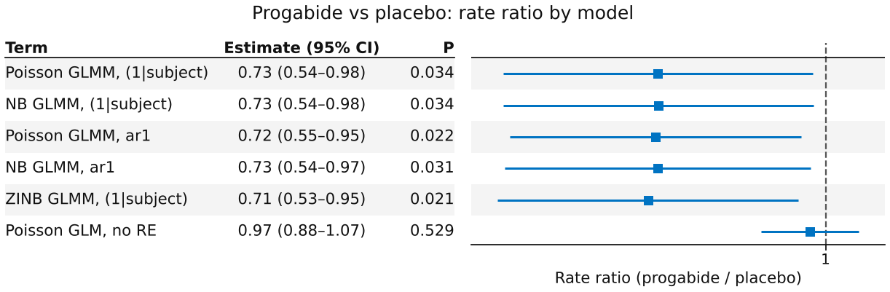
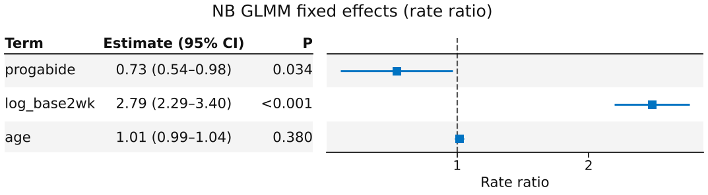
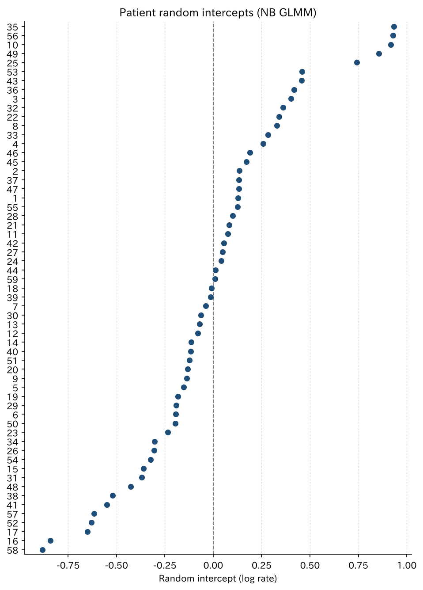

# てんかん RCT の計数 GLMM

`glmm_epil` — ポアソン / 負の二項 / ar1 / ゼロ過剰 GLMM の比較と率比

反復測定の発作回数（計数）に、患者の変量切片を入れた GLMM を当てはめる例です。ポアソン GLMM から始め、過分散を負の二項（NB2）で、受診間の相関を `ar1(period + 0 | subject)` で扱い、AIC と対数尤度で比べます。治療効果は率比（rate ratio）で示します。

[← ギャラリー](index.md) · [実行用ディレクトリと手順（GitHub）](https://github.com/mizuy/statract/tree/main/examples/glmm_epil)

## 目的概説

計数アウトカムの反復測定を `fit_mixed` の Laplace エンジンで解析する例です。同じ固定効果で変量効果の構造と分布だけを変えたモデルを並べ、どれを選んでも治療の率比がほぼ変わらないことと、患者効果を入れない GLM では結論が変わることを見せます。

## データと列の説明

| 項目 | 内容 |
|------|------|
| ソース | R `MASS::epil`（Thall & Vail 1990, *Biometrics* 46:657–671。Leppik ら の progabide 試験）。MASS は GPL-2 \| GPL-3 |
| 取得 | `build.py`（R `MASS`、なければ [Rdatasets CSV](https://vincentarelbundock.github.io/Rdatasets/csv/MASS/epil.csv)）。生データはリポジトリに入れない |
| 単位 | 患者 × 受診（2 週ごと 4 回）の縦長 236 行。患者 59 人（placebo 28、progabide 31）。**除外なし** |

| 列 | 意味 |
|----|------|
| `y` | その 2 週間の発作回数 |
| `trt` / `progabide` | 割付（placebo / progabide）。解析は 0/1 |
| `base` | 割付前 8 週間の発作回数 |
| `log_base2wk` | `log(base / 4)`。2 週あたりに直したベースラインの対数 |
| `age` | 年齢（歳） |
| `subject` | 患者 ID（変量効果のグループ） |
| `period` | 受診 1–4（`ar1` の時点因子） |

## CQ と大まかな解析方針

**CQ** — progabide はプラセボと比べ、ベースラインの発作回数と年齢で調整した 2 週あたりの発作率を下げるか。

方針:

1. 患者 1 行の Table 1（`hue=trt`）。除外が無いので flowchart は置かない
2. 固定効果は共通 `y ~ progabide + log_base2wk + age`。変量効果と分布を変えて 5 つの GLMM を当てはめる
    - ポアソン、`(1 | subject)`
    - 負の二項（NB2）、`(1 | subject)` — **主解析**
    - ポアソン / 負の二項、`ar1(period + 0 | subject)`（`engine="laplace"`）
    - ゼロ過剰負の二項、`(1 | subject)`、`zero_inflation=True`（感度分析）
3. AIC = −2 logLik + 2 df で比較。progabide の率比をモデル横断の forest に並べる
4. 参照: 患者効果なしのポアソン GLM（`fit_glm`）

## flowchart / tableone

59 人 × 4 回 = 236 行をすべて使い、欠損による除外はありません。flowchart は省略します。

### Table 1（患者単位）

=== "表"

    --8<-- "examples/assets/glmm_epil/table1_gt.md"

    [CSV](assets/glmm_epil/table1.csv)

=== "コード"

    ```python
    from statract import agg_category, agg_mean_sd, agg_median_iqr, tableone

    params = {
        "Age (years)": ("age", agg_mean_sd),
        "Baseline seizures / 8 wk": ("base", agg_median_iqr),
        "Seizures, 4 visits total": ("y_total", agg_median_iqr),
        "Any seizure-free visit": ("any_zero_visit", agg_category),
    }
    gt = tableone(patients, params, hue="trt", add_all=True, add_pvalue=True)
    ```

ベースラインの発作回数は中央値 22（IQR 12–41）と幅が広く、右に裾を引きます。受診 236 回のうち 0 回は 23 回（9.7%）、少なくとも 1 回 0 の受診がある患者は 15 人（25%）です。

## メインの解析方法とそのコア

患者 $i$、受診 $j$ の発作回数 $y_{ij}$。主解析は NB2 GLMM:

$$
\log \mu_{ij}=\beta_0+\beta_1\,\mathrm{progabide}_i+\beta_2\log(\mathrm{base}_i/4)+\beta_3\,\mathrm{age}_i+u_i,\quad u_i\sim N(0,\sigma^2)
$$

$$
y_{ij}\mid u_i \sim \mathrm{NB}(\mu_{ij},\theta),\quad \mathrm{Var}=\mu+\mu^2/\theta
$$

$e^{\beta_1}$ が患者内（条件付き）の率比です。ポアソン版は $\theta\to\infty$。`ar1` 版は $u_i$ の代わりに受診ごとの効果 $u_{ij}$ を置き、$\mathrm{Cov}(u_{ij},u_{ik})=\sigma^2\rho^{|j-k|}$ とします（glmmTMB の `ar1(period + 0 | subject)`）。ゼロ過剰版は確率 $\pi$（定数、logit）で構造的 0 を足します。

推定は `fit_mixed(..., family="poisson" / "negative_binomial")` の Laplace 近似（glmmTMB と一致を確認済み、[R との対応](../models/vs-r.md)）。`MixedFit` に AIC は無いので、AIC は `log_likelihood` と自由度（固定効果 4 + 分散 1（ar1 は 2）+ `theta` + ゼロ部分）から計算します。

患者間のばらつきは median rate ratio（MRR、$\exp(\sqrt{2\sigma^2}\,\Phi^{-1}(0.75))$）で要約します。MOR と同じ式なので `median_odds_ratio` をそのまま使います。

## 結果

### モデル比較（AIC / logLik）

=== "表"

    | model | df | logLik | AIC | ΔAIC | theta | rho |
    | --- | --- | --- | --- | --- | --- | --- |
    | Poisson GLMM, (1\|subject) | 5 | −671.29 | 1352.6 | 91.4 | | |
    | NB GLMM, (1\|subject) | 6 | −627.40 | 1266.8 | 5.6 | 7.20 | |
    | Poisson GLMM, ar1 | 6 | −628.08 | 1268.2 | 6.9 | | 0.687 |
    | NB GLMM, ar1 | 7 | −627.18 | 1268.4 | 7.1 | 9.68 | 0.914 |
    | ZINB GLMM, (1\|subject) | 7 | −623.60 | 1261.2 | 0.0 | 9.33 | |
    | Poisson GLM, no RE | 4 | −862.54 | 1733.1 | 471.9 | | |

    [CSV](assets/glmm_epil/model_comparison.csv)

=== "コード"

    ```python
    from statract import fit_glm, fit_mixed

    rhs = "progabide + log_base2wk + age"
    pois = fit_mixed(visits, f"y ~ {rhs} + (1 | subject)", family="poisson")
    nb = fit_mixed(visits, f"y ~ {rhs} + (1 | subject)", family="negative_binomial")
    pois_ar1 = fit_mixed(
        visits, f"y ~ {rhs} + ar1(period + 0 | subject)", family="poisson", engine="laplace"
    )
    nb_ar1 = fit_mixed(
        visits, f"y ~ {rhs} + ar1(period + 0 | subject)",
        family="negative_binomial", engine="laplace",
    )
    zinb = fit_mixed(
        visits, f"y ~ {rhs} + (1 | subject)",
        family="negative_binomial", zero_inflation=True,
    )
    glm = fit_glm(visits, f"y ~ {rhs}", family="poisson")  # 参照（患者効果なし）

    # AIC = -2 logLik + 2 df（df = 固定効果 + 分散パラメータ + theta + ゼロ部分）
    aic_nb = -2 * nb.log_likelihood + 2 * (len(nb.coefficients) + 1 + 1)
    nb.theta, nb_ar1.variance_table(), zinb.zero_table(exponentiate=True)
    ```

### progabide の率比（モデル横断）

=== "図"

    

=== "表"

    | model | rate ratio | 95% CI | p |
    | --- | --- | --- | --- |
    | Poisson GLMM, (1\|subject) | 0.726 | 0.540–0.976 | 0.034 |
    | NB GLMM, (1\|subject) | 0.727 | 0.541–0.977 | 0.034 |
    | Poisson GLMM, ar1 | 0.723 | 0.547–0.954 | 0.022 |
    | NB GLMM, ar1 | 0.726 | 0.542–0.972 | 0.031 |
    | ZINB GLMM, (1\|subject) | 0.713 | 0.535–0.950 | 0.021 |
    | Poisson GLM, no RE | 0.970 | 0.884–1.066 | 0.53 |

    [CSV](assets/glmm_epil/trt_rate_ratios.csv)

=== "コード"

    ```python
    import polars as pl
    from statract import plot_forest

    fits = {"NB GLMM, (1|subject)": nb, "NB GLMM, ar1": nb_ar1}  # 他のモデルも同様
    rate_ratios = pl.concat(
        [
            f.tidy(exponentiate=True)
            .filter(pl.col("term") == "progabide")
            .with_columns(pl.lit(name).alias("term"))
            for name, f in fits.items()
        ]
    )
    plot_forest(
        rate_ratios,
        out / "figures" / "trt_rate_ratio_forest.png",
        title="Progabide vs placebo: rate ratio by model",
        xlabel="Rate ratio (progabide / placebo)",
        layout="table",
        drop_intercept=False,
    )
    ```

### 主解析: NB GLMM の固定効果

=== "図"

    

=== "表"

    | term | estimate | std_error | rate ratio | 95% CI | p_value |
    | --- | --- | --- | --- | --- | --- |
    | (Intercept) | −0.303 | 0.437 | 0.738 | 0.314–1.738 | 0.49 |
    | progabide | −0.319 | 0.151 | 0.727 | 0.541–0.977 | 0.034 |
    | log_base2wk | 1.026 | 0.101 | 2.789 | 2.287–3.401 | 4.1e-24 |
    | age | 0.0107 | 0.0122 | 1.011 | 0.987–1.035 | 0.38 |

    [CSV](assets/glmm_epil/nb_glmm_tidy.csv)

=== "コード"

    ```python
    from statract import plot_forest

    tidy = nb.tidy(exponentiate=True)
    plot_forest(
        tidy,
        out / "figures" / "nb_glmm_forest.png",
        title="NB GLMM fixed effects (rate ratio)",
        xlabel="Rate ratio",
        layout="table",
    )
    ```

### 患者の変量切片（BLUP）と MRR

=== "図"

    

=== "表"

    | variance | median rate ratio |
    | --- | --- |
    | 0.233 | 1.58 |

    [MRR CSV](assets/glmm_epil/nb_glmm_mrr.csv) · [BLUP CSV](assets/glmm_epil/nb_glmm_random_effects.csv)

=== "コード"

    ```python
    from statract import glmm_random_effects, median_odds_ratio, plot_random_effects

    re = glmm_random_effects(nb, visits.select("subject"))
    plot_random_effects(
        re,
        out / "figures" / "nb_glmm_subject_blups.png",
        title="Patient random intercepts (NB GLMM)",
        xlabel="Random intercept (log rate)",
        figsize=(6.5, 9.0),
    )
    # MOR と同じ式を対数率の尺度で読む
    mrr = median_odds_ratio(nb).rename({"median_odds_ratio": "median_rate_ratio"})
    ```

### ar1 と ゼロ過剰の補足

=== "表"

    | モデル | 量 | 値 |
    | --- | --- | --- |
    | NB GLMM, ar1 | 受診効果の分散 $\sigma^2$ | 0.259 |
    | NB GLMM, ar1 | 隣接受診の相関 $\rho$ | 0.914 |
    | ZINB GLMM | ゼロ部分の切片（logit） | −3.35（SE 0.53） |
    | ZINB GLMM | 構造的 0 の確率 $\pi$ | 約 0.034 |

    [ar1 CSV](assets/glmm_epil/nb_ar1_variance.csv) · [ゼロ部分 CSV](assets/glmm_epil/zinb_zero_part.csv)

=== "コード"

    ```python
    nb_ar1.variance_table()            # structure="ar1"、correlation が rho
    zinb.zero_table(exponentiate=True)  # ゼロ部分の係数（odds）
    ```

## 解釈と解説

主解析の NB GLMM では、progabide の率比は **0.73**（95% CI 0.54–0.98、p = 0.034）でした。同じ患者で比べて、2 週あたりの発作率が約 27% 低い、という条件付きの解釈です。ポアソン、ar1、ゼロ過剰のどのモデルでも率比は 0.71–0.73 に収まり、変量効果の構造や分布の選び方には左右されませんでした。`log_base2wk` の係数は 1.03 で 1 に近く、追跡中の発作率はベースラインの率にほぼ比例します。

適合度では、ポアソン GLMM（患者切片）は NB より AIC が 85.8 大きく、過分散が明らかです（NB の $\theta$ = 7.2）。ポアソンでも `ar1` で受診ごとの効果を入れると AIC は NB に近づき（ΔAIC 6.9）、受診間のばらつきが過分散の多くを説明します。NB に `ar1` を足しても対数尤度はほとんど変わらず（+0.2）、$\rho$ = 0.91 なので患者内の相関はほぼ一定、つまり変量切片で足ります。ゼロ過剰 NB は AIC が最小（NB より 5.6 小さい）でしたが、推定される構造的 0 の確率は約 3% と小さく、受診の 0 は 23 回だけです。治療効果も変わらないので、主解析は解釈しやすい NB GLMM にしました。

患者間のばらつきは大きく、同じ共変量の患者 2 人を比べた発作率の比の中央値（MRR）は約 1.58 です。患者効果を入れないポアソン GLM は率比 0.97（p = 0.53）で、GLMM と結論が逆になります。この GLM は受診を独立とみなすので SE が小さすぎ、さらに発作回数の多い患者の重みが大きくなります。たとえば progabide 群の患者 49（ベースライン 151 回）だけで全発作数の約 15% を占めます。反復計数では患者効果を入れたモデルが必要です。

限界: 教学データで 59 人と小さく、受診 4 の効果（`V4`）や治療 × ベースラインの交互作用（Breslow & Clayton 1993 のモデル）は入れていません。率比は患者内の条件付き効果で、GEE の周辺効果とは別の量です。AIC の自由度は例のスクリプトで数えています（`MixedFit` は AIC を返しません）。

## 実行と成果物

```bash
cd examples/glmm_epil
task all
```

成果物は `examples/glmm_epil/glmm_epil_out/`、掲載分は `uv run python scripts/sync_example_assets.py --stem glmm_epil` で `docs/examples/assets/glmm_epil/` にコピーします。
