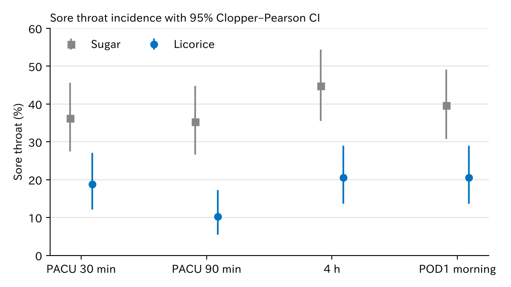
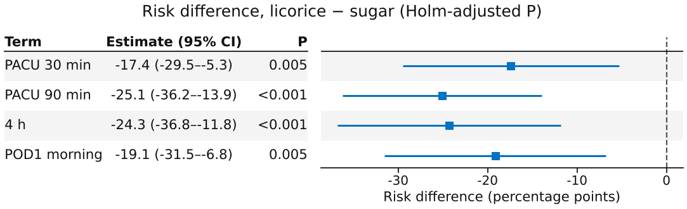

# 2 群 RCT の基本検定

`htest_licorice` — 比率の差・Clopper–Pearson・Wilcoxon・McNemar・Holm

2 群の RCT を、回帰を使わずに基本の検定と区間だけで解析する例です。発生割合は群ごとに正確（Clopper–Pearson）区間、群間はリスク差と `prop_test`、痛みスコアは Wilcoxon 順位和検定、群内の時点比較は McNemar と対応のある Wilcoxon です。4 時点をくり返し比べるので、p 値は Holm で補正します。

[← ギャラリー](index.md) · [実行用ディレクトリと手順（GitHub）](https://github.com/mizuy/statract/tree/main/examples/htest_licorice)

## 目的概説

`t_test`、`wilcox_test`、`mcnemar_test`、`binom_test`、`prop_test`、`p_adjust` を公開 RCT で通して見せる例です。どれも R の `t.test`、`wilcox.test`、`mcnemar.test`、`binom.test`、`prop.test`、`p.adjust` と同じ値を返します（[R パッケージとの対応](../models/vs-r.md)）。共変量調整や混合モデルはこの例の対象外です。

## データと列の説明

| 項目 | 内容 |
|------|------|
| ソース | `medicaldata::licorice_gargle`（MIT。Ruetzler et al. *Anesth Analg* 2013;117:614–21 を引用）、n=235 |
| 取得 | `build.py`（R の `medicaldata`、なければ Rdatasets CSV、なければパッケージの `.rda`） |
| 単位 | 患者 1 行。術後の痛みスコアが欠ける 2 例を除く |

主な解析列:

| 列 | 意味 |
|----|------|
| `treat` / `arm` | 挿管前のうがい。0 = 砂糖水（Sugar）、1 = 甘草（Licorice） |
| `pain_<時点>` | 安静時の咽頭痛スコア 0–10。時点は PACU 30 分・90 分、術後 4 時間、術後 1 日朝 |
| `sore_<時点>` | 咽頭痛あり（スコア > 0） |
| `age`, `bmi`, `sex`, `asa`, `mallampati`, `smoking`, `surgery_size` | Table 1 用の背景 |

## CQ と大まかな解析方針

**CQ** — 挿管前の甘草うがいは、砂糖水と比べて術後の咽頭痛を減らすか。

方針:

1. 痛みスコアが全時点そろう 233 例を解析セットにする（flowchart）
2. Table 1（`hue=arm`、SMD）
3. **主**: 各時点の咽頭痛の発生割合。群ごとに `binom_test` の正確区間、群間はリスク差を `prop_test`（2 標本、連続性補正あり）。4 時点の p 値を `p_adjust(..., "holm")`
4. **副**: 痛みスコアを `wilcox_test`（順位和）。効果の大きさは `t_test`（Welch）の平均差
5. **群内**: PACU 30 分と術後 1 日朝の比較。有無は `mcnemar_test`、スコアは `wilcox_test(..., paired=True)`

## flowchart / tableone

### Flowchart

| 段 | flowchart キー | 対応基準 |
|----|----------------|----------|
| アウトカム | `Throat pain scores at all time points` | 4 時点の `pain_*` が非欠損 |

=== "図"

    ```mermaid
    flowchart TB
      classDef keep fill:#e8f5e9,stroke:#2e7d32,color:#111
      classDef drop fill:#f5f5f5,stroke:#9e9e9e,color:#333
      A["235 rows"]:::keep
      B["Analysis cohort<br/>233 rows"]:::keep
      X1["not Throat pain scores at all time points<br/>excluded: 2 rows"]:::drop
      A --> B
      A -.-> X1
    ```

    同一内容は `assets/htest_licorice/mermaid_flowchart.md`（`htest_licorice_out/` から sync）。

=== "コード"

    ```python
    import io
    import polars as pl
    from statract.reporting import mermaid_flowchart

    buf = io.StringIO()
    cohort = flowchart(  # examples/support.py
        target,
        {
            "Throat pain scores at all time points": pl.all_horizontal(
                [pl.col(f"pain_{t}").is_not_null() for t in TIMES]
            ),
        },
        out=buf,
    )
    mermaid_flowchart(buf.getvalue(), final_label="Analysis cohort")
    ```

### Table 1

=== "表"

    --8<-- "examples/assets/htest_licorice/table1_gt.md"

    [CSV](assets/htest_licorice/table1.csv)

=== "コード"

    ```python
    from statract import agg_category, agg_mean_sd, tableone

    params = {
        "Age (years)": ("age", agg_mean_sd),
        "BMI": ("bmi", agg_mean_sd),
        "Sex": ("sex", agg_category),
        "ASA": ("asa", agg_category),
        "Mallampati": ("mallampati", agg_category),
        "Smoking": ("smoking", agg_category),
        "Surgery size": ("surgery_size", agg_category),
    }
    gt = tableone(cohort, params, hue="arm", add_all=True, add_smd=True)
    ```

RCT なので背景の群間検定は載せず、SMD だけを示します。

## メインの解析方法とそのコア

時点 $t$ の咽頭痛の割合を群 $g$ で $p_{gt}$ とします。

- **群ごとの区間**: 発生数 $x \sim \mathrm{Bin}(n, p)$ の Clopper–Pearson 区間。下限は $\mathrm{Beta}(\alpha/2;\,x,\,n-x+1)$、上限は $\mathrm{Beta}(1-\alpha/2;\,x+1,\,n-x)$ の分位点（`binom_test`）。
- **リスク差**: $\hat p_{\mathrm{L}t} - \hat p_{\mathrm{S}t}$ と、連続性補正つきの Wald 区間。検定は 2 × 2 表の $\chi^2$（`prop_test`、R の `prop.test` と同じ）。
- **多重性**: 4 時点の p 値を Holm で補正（`p_adjust`）。
- **痛みスコア**: 0–10 の順序尺度なので Wilcoxon 順位和検定（同順位補正と連続性補正つきの正規近似）。7 割前後が 0 点のため、Hodges–Lehmann のずれは 0 に潰れます（R でも同じ）。効果の大きさは Welch の平均差で示します。
- **群内の時点比較**: 同じ患者の 2 時点なので、有無は McNemar、スコアは対応のある Wilcoxon 符号付き順位検定。

## 結果

n=233（Sugar 116、Licorice 117）。サイト掲載は `assets/htest_licorice/`。表の数値は `task all` の成果物と同一です。

### 発生割合（群ごと、Clopper–Pearson 95% CI）

=== "図"

    

=== "表"

    | 時点 | Sugar | Licorice |
    | --- | --- | --- |
    | PACU 30 min | 42/116, 36.2% (27.5–45.6) | 22/117, 18.8% (12.2–27.1) |
    | PACU 90 min | 41/116, 35.3% (26.7–44.8) | 12/117, 10.3% (5.4–17.2) |
    | 4 h | 52/116, 44.8% (35.6–54.3) | 24/117, 20.5% (13.6–29.0) |
    | POD1 morning | 46/116, 39.7% (30.7–49.2) | 24/117, 20.5% (13.6–29.0) |

    [CSV](assets/htest_licorice/incidence.csv)

=== "コード"

    ```python
    from statract import binom_test

    sore = cohort.filter(pl.col("arm") == "Licorice")["sore_pacu30min"]
    res = binom_test(int(sore.sum()), sore.len())
    res.estimate, res.conf_int  # 割合と Clopper–Pearson 区間

    # 集計式の中で使うときは proportion_ci(..., method="clopper-pearson")
    ```

### リスク差（Licorice − Sugar、Holm 補正）

=== "図"

    

=== "表"

    | 時点 | リスク差 (95% CI)、% ポイント | χ² | P | Holm P |
    | --- | --- | --- | --- | --- |
    | PACU 30 min | −17.4 (−29.5 to −5.3) | 8.00 | 0.0047 | 0.0047 |
    | PACU 90 min | −25.1 (−36.2 to −13.9) | 19.46 | 1.0 × 10⁻⁵ | 4.1 × 10⁻⁵ |
    | 4 h | −24.3 (−36.8 to −11.8) | 14.58 | 1.3 × 10⁻⁴ | 4.0 × 10⁻⁴ |
    | POD1 morning | −19.1 (−31.5 to −6.8) | 9.27 | 0.0023 | 0.0047 |

    [CSV](assets/htest_licorice/sore_throat_tests.csv)

=== "コード"

    ```python
    from statract import p_adjust, plot_forest, prop_test

    rows = []
    for t, label in TIMES.items():
        lic = cohort.filter(pl.col("arm") == "Licorice")[f"sore_{t}"]
        sug = cohort.filter(pl.col("arm") == "Sugar")[f"sore_{t}"]
        res = prop_test([int(lic.sum()), int(sug.sum())], [lic.len(), sug.len()])
        rows.append({"term": label, "estimate": res.estimate,
                     "conf_low": res.conf_int[0], "conf_high": res.conf_int[1],
                     "p_value": res.p_value})
    rd = pl.DataFrame(rows)
    rd = rd.with_columns(pl.Series("p_holm", p_adjust(rd["p_value"], "holm")))

    plot_forest(
        rd.with_columns(pl.col("estimate", "conf_low", "conf_high") * 100,
                        pl.col("p_holm").alias("p_value")),
        out / "figures" / "risk_difference_forest.png",
        null_value=0.0,
        log_scale=False,
        xlabel="Risk difference (percentage points)",
        estimate_digits=1,
        layout="table",
    )
    ```

### 痛みスコア（Wilcoxon 順位和、Welch の平均差）

=== "表"

    | 時点 | 平均 Licorice | 平均 Sugar | 0 点の割合 | W | P | Holm P | 平均差 (95% CI) |
    | --- | --- | --- | --- | --- | --- | --- | --- |
    | PACU 30 min | 0.27 | 1.03 | 72.5% | 5294.5 | 2.2 × 10⁻⁴ | 4.5 × 10⁻⁴ | −0.75 (−1.06 to −0.44) |
    | PACU 90 min | 0.14 | 0.82 | 77.3% | 4952.0 | 1.2 × 10⁻⁶ | 4.7 × 10⁻⁶ | −0.68 (−0.94 to −0.43) |
    | 4 h | 0.35 | 0.91 | 67.4% | 5109.5 | 8.7 × 10⁻⁵ | 2.6 × 10⁻⁴ | −0.56 (−0.85 to −0.28) |
    | POD1 morning | 0.32 | 0.65 | 70.0% | 5473.5 | 0.0016 | 0.0016 | −0.33 (−0.55 to −0.11) |

    [CSV](assets/htest_licorice/pain_tests.csv)

=== "コード"

    ```python
    from statract import t_test, wilcox_test

    w = wilcox_test(lic_pain, sug_pain, exact=False)  # W と p 値
    tt = t_test(lic_pain, sug_pain)                    # Welch。tt.estimate は平均差
    w.frame()                                          # broom 形式の 1 行
    ```

### 群内の時点比較（PACU 30 分 vs 術後 1 日朝）

=== "表"

    | 群 | 両方あり | 30 分のみ | 1 日朝のみ | 両方なし | McNemar χ² | P | 対応 Wilcoxon V | P |
    | --- | --- | --- | --- | --- | --- | --- | --- | --- |
    | Sugar | 27 | 15 | 19 | 55 | 0.26 | 0.61 | 1094 | 0.0058 |
    | Licorice | 6 | 16 | 18 | 77 | 0.03 | 0.86 | 334 | 0.59 |

    [CSV](assets/htest_licorice/paired_tests.csv)

=== "コード"

    ```python
    from statract import mcnemar_test, wilcox_test

    sub = cohort.filter(pl.col("arm") == "Sugar")
    mcnemar_test(sub["sore_pacu30min"], sub["sore_pod1am"])   # 2 列でも 2×2 表でも可
    wilcox_test(sub["pain_pacu30min"], sub["pain_pod1am"], paired=True, exact=False)
    ```

## 解釈と解説

- 甘草うがいは 4 時点すべてで咽頭痛の割合を下げました。リスク差は −17 から −25 % ポイントで、Holm 補正後もすべて P < 0.005 です。元論文の主要評価（PACU 30 分の咽頭痛）と同じ向きです。
- 痛みスコアも 4 時点で甘草群が低く、Wilcoxon の結果は発生割合と一致します。0 点が多いデータでは Hodges–Lehmann の推定値と区間が 0 付近に潰れて役に立たないので、平均差か発生割合を効果の大きさに使います。
- 群内の比較では、咽頭痛の有無は PACU 30 分と術後 1 日朝でほぼ同じでした（McNemar）。砂糖水群ではスコアの分布だけが有意に変わりました。有無とスコアは別の情報なので、両方を見ます。
- 4 時点は同じ患者のくり返し測定です。時点ごとの検定と Holm 補正は単純で読みやすい反面、時点間の相関は使いません。経時の効果を一つのモデルで見るなら GEE や混合モデル（[反復測定の線形混合モデル](lmm_pbcseq.md)）を使います。

## 実行と成果物

```bash
cd examples/htest_licorice
task all
```

完全な成果物は `examples/htest_licorice/htest_licorice_out/`（git 管理外）。掲載用は `uv run python scripts/sync_example_assets.py --stem htest_licorice` で `docs/examples/assets/htest_licorice/` にコピーします。
