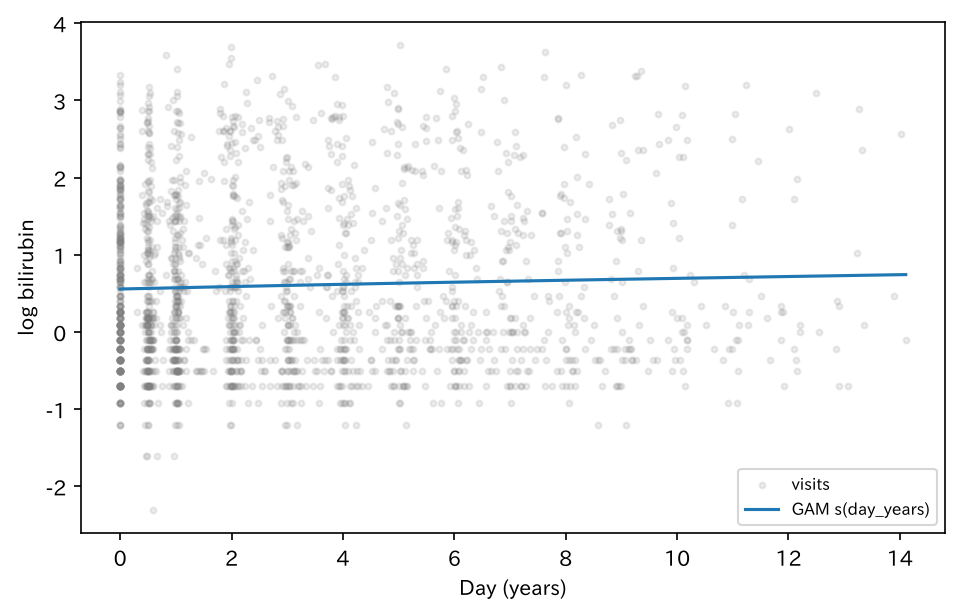
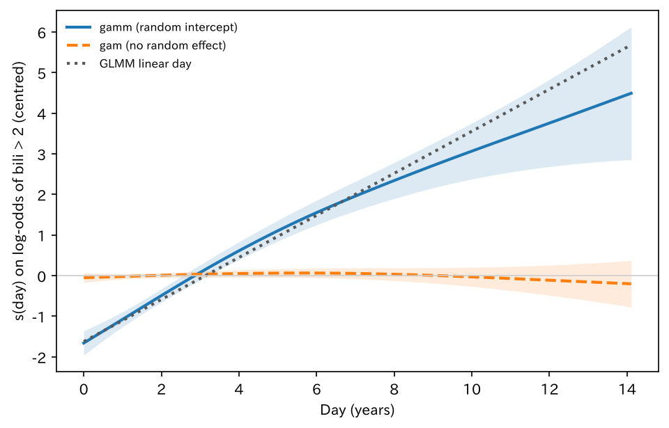

# 反復測定の線形混合モデル

`lmm_pbcseq` — ガウス LMM / クラスタ SE / GAM / GAMM

indo の二項混合に対し、ガウス `fit_mixed`（lmer 相当）の正本。GAM は主解析（ガウス・平滑1本）。

[← ギャラリー](index.md) · [実行用ディレクトリと手順（GitHub）](https://github.com/mizuy/statract/tree/main/examples/lmm_pbcseq)

## 目的概説

[`logit_indo`](logit_indo.md) の混合は二項 `fit_mixed(..., family="binomial")` です。ここではガウス `fit_mixed`（`lmer` 相当）、患者クラスタ SE、および現行制限つき GAM を縦断検査で本編に載せるための例です。

## データと列の説明

| 項目 | 内容 |
|------|------|
| ソース | R `survival::pbcseq`。LGPL (>= 2) |
| 取得 | `build.py` |
| 単位 | 患者単位 Table 1 + 訪問行のモデル。`trt` は 1 = D-ペニシラミン、0 = プラセボ（横断 `pbc` の 1/2 とは違う） |

主な解析列:

| 列 | 意味 |
|----|------|
| `id` | 患者 ID（変量 / クラスタ） |
| `bili` / `log_bili` | ビリルビン（mg/dL）と対数 |
| `day` / `day_years` | 病日と年換算（`day/365.25`） |
| `dp` / `trt_label` | 治療（患者内で一定とみなす） |
| `age`, `sex`, `albumin` | ベースライン記述 |

## CQ と大まかな解析方針

**CQ** — 無作為化 PBC の反復検査で、病日と D-ペニシラミンは対数ビリルビンと関連するか。患者内相関を変量切片で入れたとき、集団の病日カーブ（GAM）はどうか。

方針:

1. 患者単位 Table 1（除外なしのため flowchart 省略）
2. 変量切片 LMM（主）
3. 同平均構造の OLS + `cluster_covariance`（比較）
4. GAM `s(day_years)`（主解析の一部。治療・変量は API 制限で入れられない）
5. `gamm`（`gamm4` 移植）: `s(day_years) + dp + (1 | id)`。`gamm` は二項・Poisson のみなので、結果は「ビリルビン > 2 mg/dL」の二値。同じ二値で患者相関を無視した `gam` と、病日を線形にした二項 GLMM と比べる

## flowchart / tableone

解析セットに除外はありません（全例解析）。ギャラリー方針どおり **flowchart / Mermaid は省略**します。

### Table 1（患者単位）

=== "表"

    --8<-- "examples/assets/lmm_pbcseq/table1_gt.md"

    [CSV](assets/lmm_pbcseq/table1.csv)

=== "コード"

    ```python
    from statract import agg_category, agg_mean_sd, agg_median_iqr, tableone

    params = {
        "Age (years)": ("age", agg_mean_sd),
        "Sex": ("sex", agg_category),
        "Baseline bilirubin": ("bili", agg_median_iqr),
        "Baseline albumin": ("albumin", agg_median_iqr),
        "Baseline day": ("day", agg_median_iqr),
    }
    gt = tableone(cohort_p, params, hue="trt_label", add_all=True, add_pvalue=True)
    # CSV/HTML/md を *_out/ に書くときだけ write_tableone_artifacts（ギャラリー同期用）
    ```

## メインの解析方法とそのコア

訪問 $ij$、患者 $i$。主解析の LMM:

$$
\log(\mathrm{bili}_{ij})=\beta_0+\beta_1\mathrm{day\_years}_{ij}+\beta_2\mathrm{dp}_i+u_i+\varepsilon_{ij},\quad u_i\sim N(0,\sigma_u^2).
$$

比較: 同じ平均構造の OLS に患者クラスタのサンドイッチ。GAM（主解析）:

$$
\log(\mathrm{bili})=\beta_0+s(\mathrm{day\_years})+\varepsilon,
$$

$s$ は立方回帰スプライン（`smooth`、`k` は一意な病日数以下）。この版の GAM は `family="gaussian"`・`cr`・平滑1本・REML。

GAMM（`gamm`、R `gamm4` 相当）。$y_{ij}=1[\mathrm{bili}_{ij}>2]$:

$$
\mathrm{logit}\,P(y_{ij}=1\mid u_i)=\beta_0+\beta_1\mathrm{dp}_i+s(\mathrm{day\_years}_{ij})+u_i,\quad u_i\sim N(0,\sigma_u^2).
$$

`gamm` は平滑を「固定の線形部分 + iid 変量効果」に書き直し（`mgcv::smooth2random`）、患者切片と一緒に Laplace 近似の GLMM として当てます。平滑の滑らかさは変量効果の分散として推定され、患者内相関は $u_i$ が受け持ちます。平滑は `tp`・`k=10`（mgcv 既定）。


## 結果

無作為化 312 人、訪問 1945 行。サイト掲載は `assets/lmm_pbcseq/`。

### GAM 平滑（病日）

=== "図"

    

=== "コード"

    ```python
    from statract import gam, smooth
    import matplotlib.pyplot as plt
    import numpy as np
    import polars as pl

    k = min(8, int(visits["day_years"].n_unique()))
    fitted_gam = gam(visits, "log_bili", [smooth("day_years", k=k)])
    grid = pl.DataFrame({
        "day_years": np.linspace(
            float(visits["day_years"].min()),
            float(visits["day_years"].max()),
            80,
        )
    })
    pred = fitted_gam.predict(grid)
    fig, ax = plt.subplots(figsize=(6.5, 4.2))
    ax.scatter(visits["day_years"], visits["log_bili"], s=8, alpha=0.15, color="gray")
    ax.plot(grid["day_years"], pred, color="C0", label="GAM s(day_years)")
    ax.set_xlabel("Day (years)")
    ax.set_ylabel("log bilirubin")
    fig.savefig(out / "figures" / "gam_day.png", dpi=150, bbox_inches="tight")
    ```

### GAMM: 病日平滑 + 患者変量切片（ビリルビン > 2 mg/dL）

訪問 1945 行のうち 39.3% がビリルビン > 2 mg/dL。図は 3 モデルの病日効果（対数オッズ、訪問平均で 0 に中心化）。帯は 95% 点ごと CI。

=== "図"

    

=== "表"

    | model | dp 推定 | dp SE | dp p | 病日 edf | 患者切片分散 |
    | --- | --- | --- | --- | --- | --- |
    | gamm: s(day) + dp + (1\|id) | -0.712 | 0.722 | 0.32 | 1.95 | 33.9 |
    | gam: s(day) + dp | -0.053 | 0.093 | 0.57 | 1.75 | — |
    | GLMM: day + dp + (1\|id) | -0.725 | 0.846 | 0.39 | 1（線形） | 34.2 |

    [比較 CSV](assets/lmm_pbcseq/gamm_compare.csv) · [gamm tidy CSV](assets/lmm_pbcseq/gamm_tidy.csv)

=== "コード"

    ```python
    from statract import fit_mixed, gam, gamm, smooth
    import matplotlib.pyplot as plt
    import numpy as np
    import polars as pl

    v = visits.with_columns((pl.col("bili") > 2.0).cast(pl.Int64).alias("high_bili"))
    sm = smooth("day_years", k=10, basis="tp")

    # gamm4(high_bili ~ dp + s(day_years), random = ~(1 | id), family = binomial)
    fit_gamm = gamm(v, "high_bili", [sm], random="(1 | id)", predictors=["dp"], family="binomial")
    fit_gamm.tidy()            # dp など parametric 項
    fit_gamm.smooth_table()    # edf と平滑の分散
    fit_gamm.variance_table()  # 患者切片の分散

    # 比較: 患者相関を無視した gam、病日線形の GLMM
    fit_gam = gam(v, "high_bili", [sm], predictors=["dp"], family="binomial")
    fit_glmm = fit_mixed(v, "high_bili ~ day_years + dp + (1 | id)", family="binomial")

    grid = np.linspace(v["day_years"].min(), v["day_years"].max(), 100)
    pe_mm = fit_gamm.partial_effect("day_years", grid)  # fit, std_error
    pe_gam = fit_gam.partial_effect("day_years", n=100)  # estimate, std_error
    slope = fit_glmm.tidy().filter(pl.col("term") == "day_years")["estimate"][0]

    fig, ax = plt.subplots(figsize=(6.5, 4.2))
    for x, f, se, c, ls, lab in (
        (pe_mm["day_years"], pe_mm["fit"], pe_mm["std_error"], "C0", "-", "gamm (random intercept)"),
        (pe_gam["day_years"], pe_gam["estimate"], pe_gam["std_error"], "C1", "--", "gam (no random effect)"),
    ):
        x, f, se = (np.asarray(a, dtype=float) for a in (x, f, se))
        ax.fill_between(x, f - 1.96 * se, f + 1.96 * se, color=c, alpha=0.15, linewidth=0)
        ax.plot(x, f, color=c, linestyle=ls, linewidth=2, label=lab)
    ax.plot(grid, slope * (grid - v["day_years"].mean()), color="0.35", linestyle=":", label="GLMM linear day")
    ax.set_xlabel("Day (years)")
    ax.set_ylabel("s(day) on log-odds of bili > 2 (centred)")
    ax.legend()
    ```

### LMM 固定効果

=== "表"

    | term | estimate | std_error | statistic | p_value | conf_low | conf_high |
    | --- | --- | --- | --- | --- | --- | --- |
    | (Intercept) | 0.6265 | 0.09081 | 6.899 | 5.227e-12 | 0.4485 | 0.8045 |
    | day_years | 0.09509 | 0.00433 | 21.96 | 0 | 0.0866 | 0.1036 |
    | dp | -0.1107 | 0.1271 | -0.8712 | 0.3837 | -0.3598 | 0.1384 |

    [CSV](assets/lmm_pbcseq/lmm_fixed.csv)

=== "コード"

    ```python
    from statract import fit_mixed

    mixed = fit_mixed(visits, "log_bili ~ day_years + dp + (1 | id)")
    lmm_tidy = mixed.tidy()
    # mixed.variance_table() → 患者間分散 / 残差
    ```

### OLS + クラスタ SE

=== "表"

    | term | estimate | std_error | statistic | p_value | conf_low | conf_high |
    | --- | --- | --- | --- | --- | --- | --- |
    | (Intercept) | 0.5747 | 0.08942 | 6.427 | 1.635e-10 | 0.3993 | 0.7501 |
    | day_years | 0.01405 | 0.0161 | 0.8729 | 0.3828 | -0.01752 | 0.04562 |
    | dp | -0.03103 | 0.1235 | -0.2514 | 0.8016 | -0.2732 | 0.2111 |

    [CSV](assets/lmm_pbcseq/ols_cluster.csv)

=== "コード"

    ```python
    from statract import cluster_covariance, fit_ols

    ols = fit_ols(visits, "log_bili ~ day_years + dp")
    ols.covariance = cluster_covariance(ols, "id", data=visits)
    ols_clust = ols.tidy()
    ```

### GAM tidy

=== "表"

    | term | estimate | std_error | statistic | p_value |
    | --- | --- | --- | --- | --- |
    | (Intercept) | 0.6031 | 0.02516 | 23.97 | 0 |
    | day_years[0] | -0.01174 | 0.007787 | -1.508 | 0.1315 |
    | day_years[1] | -0.001792 | 0.007204 | -0.2487 | 0.8036 |
    | day_years[2] | 0.01733 | 0.01304 | 1.328 | 0.1841 |
    | day_years[3] | 0.03579 | 0.02175 | 1.646 | 0.09985 |
    | day_years[4] | 0.04911 | 0.02864 | 1.715 | 0.08642 |
    | day_years[5] | 0.07977 | 0.04686 | 1.702 | 0.08867 |
    | day_years[6] | 0.1419 | 0.1019 | 1.393 | 0.1636 |

    [CSV](assets/lmm_pbcseq/gam_tidy.csv)

=== "コード"

    ```python
    from statract import gam, smooth

    fitted_gam = gam(visits, "log_bili", [smooth("day_years", k=k)])
    gam_tidy = fitted_gam.tidy()
    ```

## 解釈と解説

変量切片 LMM では `day_years` が対数ビリルビンと正の関連（約 **+0.095 / 年**）。`dp` は約 −0.11（区間は 0 を含む）。患者間分散 1.20 に対し残差 0.24 で、独立 OLS をそのまま読む根拠は弱い。GAM（`s(day_years)`、k=8、edf≈2.1）は治療を含まない集団平滑です。クラスタ OLS の `day_years` は点推定が小さく区間が広い（変量切片の有無で平均構造の意味が違う）。

**GAMM。** ビリルビン > 2 mg/dL の二値で、`gamm` の病日平滑（edf≈1.95）はほぼ直線に上がり、0 年から 8 年で対数オッズが約 4 上がる。病日線形の GLMM（+0.52 / 年）とほぼ重なり、変量切片を入れた範囲では非線形性の証拠は弱い。一方、患者相関を無視した `gam` の平滑はほぼ平坦で、ガウスの OLS（クラスタ SE）の `day_years` が小さかったのと同じ形です。変量切片モデルは「同じ患者の中での経時変化」を、変量なしのモデルは「各時点に残っている患者の平均」を見ています。ビリルビンの高い患者ほど早く死亡・移植で観察から抜けるので（初回ビリルビン > 2 の 124 人は最終訪問の中央値 2.2 年、≤ 2 の 188 人は 5.7 年）、後の時点ほど軽い患者が残り、集団平均の曲線は平らになります（脱落の影響で、どちらか一方が「正しい」わけではない）。加えて患者切片の分散が約 34 と非常に大きく、患者内の条件付き効果は周辺効果よりもともと大きく出ます。`dp` の SE は `gam` で 0.093、`gamm` で 0.72 で、患者相関を無視すると治療効果の不確かさを 8 倍近く過小評価します。治療はどのモデルでも 0 を含みます。

限界: 上の Gaussian GAM は平滑1本・治療なし・変量なし。`gamm` は二項・Poisson のみで、対数ビリルビンそのもの（ガウス）には当てられないため二値化した（> 2 mg/dL は閾値の選択に依存）。欠測は完全例。`cif_pbc` と同じ疾患だが解析単位が違う。LGPL 教学データ。

## 実行と成果物

```bash
cd examples
task lmm_pbcseq:all
```

既存の付随文書: [concept](https://github.com/mizuy/statract/blob/main/examples/lmm_pbcseq/lmm_pbcseq_concept.md) · [protocol](https://github.com/mizuy/statract/blob/main/examples/lmm_pbcseq/lmm_pbcseq_protocol.md) · [results](https://github.com/mizuy/statract/blob/main/examples/lmm_pbcseq/lmm_pbcseq_results.md) · [discussion](https://github.com/mizuy/statract/blob/main/examples/lmm_pbcseq/lmm_pbcseq_discussion.md)
