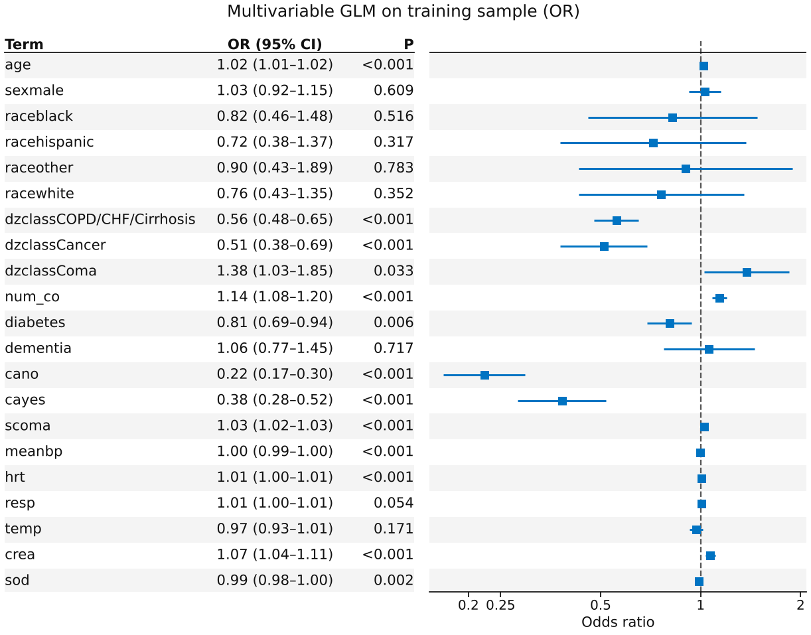
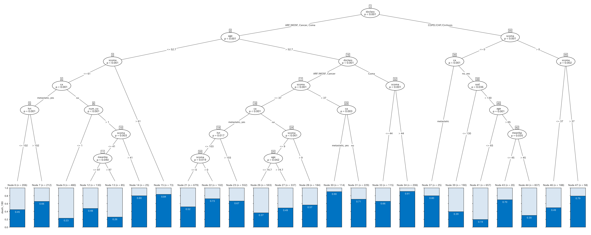
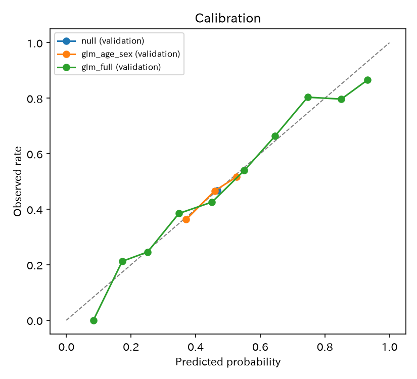
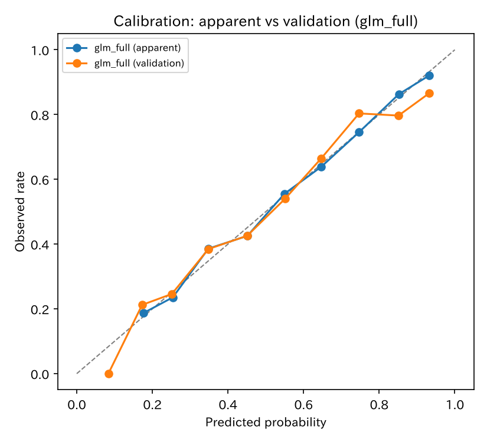
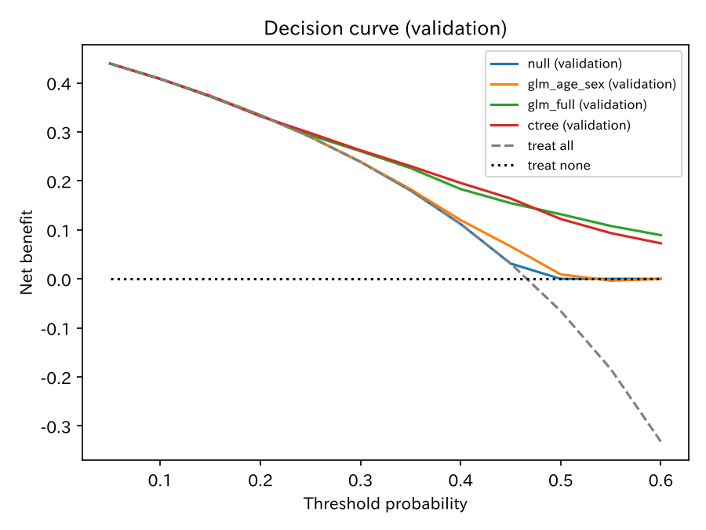

# 予測モデルの較正と DCA

`pred_support` — 二項 GLM / ctree / 較正 / DCA

重症予後の **予測（点）モデル**。180 日死亡確率を train の二項 GLM と条件付き推論木（ctree）で推定し、ホールドアウトで較正・Brier・AUC・決定曲線（DCA）を比べます。効果推定の [`logit_indo`](logit_indo.md) とは役割が違います。

[← ギャラリー](index.md) · [実行用ディレクトリと手順（GitHub）](https://github.com/mizuy/statract/tree/main/examples/pred_support)

## 目的概説

較正曲線と DCA は予測確率 $\hat\pi$ の評価であり、RCT の OR とは別物です。`logit_indo` からホールドアウト較正を外したあとの受け皿として、公開の SUPPORT2 で `write_probability_artifacts` / `plot_calibration` / `plot_dca` / `binary_perf` / `threshold_tradeoff` を通します。学習標本の見かけ較正も併記し、内部分割の楽観を見えるようにします。同じ予測因子で `conditional_tree`（partykit::ctree 相当）も当てはめ、加法的な GLM と、交互作用を自動で拾う木を同じ物差しで比べます。

## データと列の説明

| 項目 | 内容 |
|------|------|
| ソース | SUPPORT2（hbiostat teaching CSV、n=9105）。Knaus et al. / Harrell の重症予後コホート |
| 取得 | `build.py`（`https://hbiostat.org/data/repo/support2csv.zip`。失敗時は UCI CSV）。**fetch only** |
| 単位 | 患者 1 行。共変量欠損 109 行を除外（解析 n=8996） |

主な解析列（ドット付き原名は `num_co` / `d_time` に改名。Wilkinson の `.` と衝突しないようにする）:

| 列 | 意味 |
|----|------|
| `death_180` | 180 日死亡: `(death == 1) & (d_time <= 180)`。180 日未満の生存打ち切りは本表 0 件 |
| `age`, `sex`, `race` | 人口統計 |
| `dzclass` | 疾患クラス（ARF/MOSF, COPD/CHF/Cirrhosis, Cancer, Coma） |
| `num_co`, `diabetes`, `dementia`, `ca` | 併存・癌 |
| `scoma`, `meanbp`, `hrt`, `resp`, `temp`, `crea`, `sod` | day 3 付近の生理 |

`sps` / `aps` / `surv2m` / `surv6m` は既存 SUPPORT スコアなので **予測因子にしない**（リーク回避）。

## CQ と大まかな解析方針

**CQ** — SUPPORT2 の登録時（主に day 3）臨床・生理から 180 日死亡確率を二項 GLM で予測したとき、ホールドアウトでの較正・Brier・DCA は切片のみや年齢+性別と比べてどうか。同じ予測因子の ctree と比べてどうか。見かけ較正はホールドアウトより楽観的か。

方針:

1. flowchart で予後共変量の完全例を確定
2. Table 1（`hue=death_180_label`）。公開 API は `tableone(...)`
3. 層化 70/30（seed=2026）。**train だけ** `fit_glm(..., family="binomial")`: null、年齢+性別、多変量
4. 多変量 OR の `plot_forest(..., layout="table")`（train）
5. 同じ train と予測因子で `conditional_tree`（既定 alpha=0.05、minsplit=20、minbucket=7）
6. 検証確率を `write_probability_artifacts`（較正 / DCA / Brier。GLM と ctree を並べる）。AUC と閾値 0.40 の感度・特異度をモデル間で比較。見かけ vs 検証は `calibration_table` + `plot_calibration`。閾値 0.40 の `binary_perf` と `threshold_tradeoff`

## flowchart / tableone

共変量欠損で 109 行落ちるので flowchart を載せます。

### Flowchart

| 段 | flowchart キー | 対応基準 |
|----|----------------|----------|
| 共変量 | `Complete prognostic covariates` | 上記予測因子と `death_180` が非欠損 |

=== "図"

    ```mermaid
    flowchart TB
      classDef keep fill:#e8f5e9,stroke:#2e7d32,color:#111
      classDef drop fill:#f5f5f5,stroke:#9e9e9e,color:#333
      A["9,105 rows"]:::keep
      B["Analysis cohort<br/>8,996 rows"]:::keep
      X1["not Complete prognostic covariates<br/>excluded: 109 rows"]:::drop
      A --> B
      A -.-> X1
    ```

    同一内容は `assets/pred_support/mermaid_flowchart.md`（`pred_support_out/` から sync）。

=== "コード"

    ```python
    import io
    import polars as pl
    from statract.reporting import mermaid_flowchart

    buf = io.StringIO()
    cohort = target.pp.flowchart(
        {
            "Complete prognostic covariates": pl.all_horizontal(
                [pl.col(c).is_not_null() for c in covs + ["death_180"]],
            ),
        },
        out=buf,
    )
    flow_text = buf.getvalue()
    mermaid_flowchart(flow_text, final_label="Analysis cohort")
    ```

### Table 1

=== "表"

    --8<-- "examples/assets/pred_support/table1_gt.md"

    [CSV](assets/pred_support/table1.csv)

=== "コード"

    ```python
    from statract import agg_category, agg_mean_sd, tableone

    t1 = tableone(
        cohort,
        params={
            "Age (years)": ("age", agg_mean_sd),
            "Sex": ("sex", agg_category),
            "Race": ("race", agg_category),
            "Disease class": ("dzclass", agg_category),
            "Comorbidities (n)": ("num_co", agg_mean_sd),
            "Diabetes": ("diabetes", agg_category),
            "Dementia": ("dementia", agg_category),
            "Cancer": ("ca", agg_category),
            "GCS coma score": ("scoma", agg_mean_sd),
            "Mean BP (mmHg)": ("meanbp", agg_mean_sd),
            "Heart rate": ("hrt", agg_mean_sd),
            "Respiratory rate": ("resp", agg_mean_sd),
            "Temperature (°C)": ("temp", agg_mean_sd),
            "Creatinine (mg/dL)": ("crea", agg_mean_sd),
            "Sodium (mEq/L)": ("sod", agg_mean_sd),
            "180-day death": ("death_180_label", agg_category),
        },
        hue="death_180_label",
        add_all=True,
        add_pvalue=True,
    )
    # write_tableone_artifacts は *_out/ への CSV/HTML 書き出し。Table 1 の公開 API は tableone()。
    ```

## メインの解析方法とそのコア

アウトカム $Y$ は 180 日死亡。学習標本で

$$
\operatorname{logit}(\pi)=\beta_0+\beta^\top x
$$

（`fit_glm(..., family="binomial")`）。OR forest は `plot_forest(..., layout="table")`（論文用白黒は `style="bw"`）。比較は $\operatorname{logit}(\pi)=\beta_0$ と $\operatorname{logit}(\pi)=\beta_0+\beta_1\mathrm{age}+\beta_2\mathrm{sex}$。予測確率 $\hat\pi$ を検証標本で評価。Brier は $\mathrm{E}[(Y-\hat\pi)^2]$。決定曲線の net benefit は閾値 $t$ で

$$
\mathrm{NB}=\frac{\mathrm{TP}}{n}-\frac{\mathrm{FP}}{n}\cdot\frac{t}{1-t}.
$$

ctree は各ノードで、予測因子と $Y$ の条件付き独立を並べ替え検定の二次形式で調べ、Šidák 調整後の最小 p が alpha を下回る変数で二分します。分割点は二標本統計量を最大にする値です。終端ノードの死亡割合がそのまま予測確率になるので、確率は終端ノードの数だけの段階値です。剪定はせず、検定で止めます。

閾値 0.40 の `binary_perf` は教学用であり、臨床カットオフの提案ではありません。

## 結果

完全例 n=8996（fetch 9105 から 109 除外）。層化 70/30（seed=2026）で train n=6297、validation n=2699（検証の 180 日死亡率 0.467）。サイト掲載は `assets/pred_support/`。

### 多変量 GLM（train、OR）

=== "図"

    

=== "表"

    | term | exp_estimate | exp_conf_low | exp_conf_high | p_value |
    | --- | --- | --- | --- | --- |
    | age | 1.018 | 1.014 | 1.022 | 5.8e-20 |
    | dzclassCOPD/CHF/Cirrhosis | 0.557 | 0.478 | 0.649 | 5.7e-14 |
    | dzclassCancer | 0.511 | 0.378 | 0.690 | 1.2e-05 |
    | dzclassComa | 1.377 | 1.026 | 1.848 | 0.033 |
    | num_co | 1.139 | 1.082 | 1.200 | 7.6e-07 |
    | cano | 0.223 | 0.168 | 0.297 | 3.0e-25 |
    | scoma | 1.026 | 1.023 | 1.029 | 3.1e-54 |
    | crea | 1.070 | 1.035 | 1.106 | 6.1e-05 |

    抜粋（参照は因子の第 1 水準。`ca` は metastatic）。完全表: [CSV](assets/pred_support/glm_full_train.csv)

=== "コード"

    ```python
    from statract import fit_glm, plot_forest

    full_fit = fit_glm(train, FULL_FORMULA, family="binomial")
    full_tidy = full_fit.tidy(exponentiate=True)
    plot_forest(
        full_tidy,
        out / "figures" / "glm_full_forest.png",
        title="Multivariable GLM on training sample (OR)",
        xlabel="Odds ratio",
        layout="table",
    )
    ```

### 条件付き推論木（ctree、train）

=== "木"

    ```text
    --8<-- "examples/assets/pred_support/ctree.txt"
    ```

    各行は `[ノード番号] 分割条件`。終端ノードは `: 180 日死亡割合 (n = 学習標本の人数)`。

=== "図"

    

    partykit の `plot` と同じ配置です。楕円は分割変数と Šidák 調整後の p 値、枝は分割条件、下段は終端ノードの 180 日死亡割合（濃い色）です。

    ```python
    plot_tree(tree, out / "figures" / "ctree.png")
    ```

=== "根ノードの検定"

    | term | statistic | p（Šidák） |
    | --- | --- | --- |
    | scoma | 447.3 | <1e-15 |
    | dzclass | 368.0 | <1e-15 |
    | ca | 197.1 | <1e-15 |
    | age | 69.4 | 1.7e-15 |
    | crea | 30.6 | 4.8e-07 |
    | hrt | 25.4 | 6.9e-06 |
    | meanbp | 21.4 | 5.5e-05 |
    | dementia | 12.3 | 0.0069 |

    抜粋（p < 0.05）。完全表: [CSV](assets/pred_support/ctree_tests.csv)

=== "コード"

    ```python
    from statract import conditional_tree

    covs = ["age", "sex", "race", "dzclass", "num_co", "diabetes", "dementia", "ca",
            "scoma", "meanbp", "hrt", "resp", "temp", "crea", "sod"]
    tree = conditional_tree(train, "death_180", covs)
    print(tree.format())          # 上の「木」
    tree.tests()                  # 根ノードの変数選択の検定
    p_tree_val = tree.predict(val)
    ```

### GLM と ctree の比較（validation）

=== "表"

    | model | size | AUC | Brier | 平均予測 | 実測 | 感度（0.40） | 特異度（0.40） |
    | --- | --- | --- | --- | --- | --- | --- | --- |
    | glm_age_sex | 3 係数 | 0.560 | 0.2460 | 0.467 | 0.467 | 0.899 | 0.155 |
    | glm_full | 22 係数 | 0.716 | 0.2137 | 0.464 | 0.467 | 0.722 | 0.567 |
    | ctree | 24 終端ノード | 0.714 | 0.2143 | 0.467 | 0.467 | 0.713 | 0.613 |

    [CSV](assets/pred_support/model_compare_val.csv)

=== "コード"

    ```python
    from scipy.stats import rankdata
    from statract import binary_perf


    def auc(y, p):
        ranks = rankdata(p)
        n_pos = int(y.sum())
        n_neg = y.size - n_pos
        return (ranks[y == 1].sum() - n_pos * (n_pos + 1) / 2) / (n_pos * n_neg)


    for name, p_val in [("glm_full", p_full_val), ("ctree", p_tree_val)]:
        perf = binary_perf(y_val, (p_val >= 0.40).astype(int))
        print(name, auc(y_val, p_val), np.mean((p_val - y_val) ** 2),
              perf["sensitivity"], perf["specificity"])
    ```

### Brier（validation）

=== "表"

    | model | split | brier | n |
    | --- | --- | --- | --- |
    | null (validation) | validation | 0.2489 | 2699 |
    | glm_age_sex (validation) | validation | 0.2460 | 2699 |
    | glm_full (validation) | validation | 0.2137 | 2699 |
    | ctree (validation) | validation | 0.2143 | 2699 |

    [CSV](assets/pred_support/table_brier.csv)

=== "コード"

    ```python
    from statract import write_probability_artifacts

    write_probability_artifacts(
        [
            {"name": "null (validation)", "y_val": y_val, "prob_val": p_null},
            {"name": "glm_age_sex (validation)", "y_val": y_val, "prob_val": p_age},
            {"name": "glm_full (validation)", "y_val": y_val, "prob_val": p_full_val},
            {"name": "ctree (validation)", "y_val": y_val, "prob_val": p_tree_val},
        ],
        out,
        positive_label="180-day death",
        dca_thresholds=np.linspace(0.05, 0.60, 12),
    )
    ```

### 較正（validation）

=== "図"

    

=== "表"

    | model | bin | n | pred_mean | obs_rate |
    | --- | --- | --- | --- | --- |
    | glm_full (validation) | 3 | 520 | 0.252 | 0.246 |
    | glm_full (validation) | 5 | 465 | 0.451 | 0.426 |
    | glm_full (validation) | 7 | 283 | 0.646 | 0.664 |
    | glm_full (validation) | 9 | 128 | 0.851 | 0.797 |

    抜粋。完全表: [CSV](assets/pred_support/table_calibration.csv)

=== "コード"

    ```python
    from statract import plot_calibration

    # 図は write_probability_artifacts が fig_calibration.png を書く
    plot_calibration(cal, out / "figures" / "fig_calibration.png")
    ```

### 較正（見かけ vs 検証）

=== "図"

    

=== "コード"

    ```python
    from statract import calibration_table, plot_calibration

    cal_app_val = pl.concat(
        [
            calibration_table(y_train, p_full_app, model="glm_full (apparent)", split="apparent"),
            calibration_table(y_val, p_full_val, model="glm_full (validation)", split="validation"),
        ]
    )
    plot_calibration(
        cal_app_val,
        out / "figures" / "fig_calibration_apparent.png",
        title="Calibration: apparent vs validation (glm_full)",
    )
    ```

    [CSV](assets/pred_support/table_calibration_apparent.csv)

### 決定曲線（DCA、validation）

=== "図"

    

=== "表"

    | threshold | glm_full | ctree | treat_all | treat_none |
    | --- | --- | --- | --- | --- |
    | 0.30 | 0.261 | 0.262 | 0.239 | 0 |
    | 0.40 | 0.183 | 0.196 | 0.112 | 0 |
    | 0.50 | 0.132 | 0.122 | −0.066 | 0 |
    | 0.60 | 0.089 | 0.073 | −0.332 | 0 |

    抜粋。完全表: [CSV](assets/pred_support/table_dca.csv)

=== "コード"

    ```python
    from statract import plot_dca

    plot_dca(dca, out / "figures" / "fig_dca.png", title="Decision curve (validation)")
    ```

### 閾値 0.40 の二値性能（glm_full、validation）

=== "表"

    | n | sensitivity | specificity | ppv | npv | accuracy |
    | --- | --- | --- | --- | --- | --- |
    | 2699 | 0.722 | 0.567 | 0.594 | 0.699 | 0.639 |

    [CSV](assets/pred_support/binary_perf_val.csv) · 閾値グリッド: [threshold_tradeoff_val.csv](assets/pred_support/threshold_tradeoff_val.csv)

=== "コード"

    ```python
    from statract import binary_perf, threshold_tradeoff

    perf = binary_perf(y_val, (p_full_val >= 0.40).astype(int))
    trade = threshold_tradeoff(
        y_val,
        p_full_val,
        thresholds=np.array([0.20, 0.30, 0.40, 0.50, 0.60]),
    )
    ```

## 解釈と解説

多変量 GLM の検証 Brier は約 **0.214**（null 0.249、年齢+性別 0.246）。較正ビンは対角線の近くに並び、高確率側でやや過大予測です。見かけ較正は同じモデルでもホールドアウトより甘く見える、というのが内部分割の教材です。

DCA では閾値 0.30–0.50 付近で多変量の net benefit が treat-all と年齢+性別を上回ります。切片のみは（定数予測なので）閾値が有病率以下では treat-all と一致します。閾値 0.40 では感度約 0.72、特異度約 0.57です。

**GLM と ctree。** ctree（終端 24）は AUC 0.714、Brier 0.2143 で、多変量 GLM（22 係数、AUC 0.716、Brier 0.2137）とほぼ同じ精度です。平均予測は両者とも実測 0.467 に合い、較正ビンもどちらも対角線の近くにあります。DCA は閾値 0.30–0.45 では ctree がわずかに上、0.50 以上では GLM が上です。木の予測は段階値なので、高い閾値で確率の細かな序列が要る場面では GLM が有利です。閾値 0.40 では ctree の方が特異度が高く（0.613 対 0.567）、感度はほぼ同じです。

木が最初に分けるのは疾患クラス（COPD/CHF/Cirrhosis とそれ以外）で、その下で年齢、昏睡スコア `scoma`、癌の有無が繰り返し現れます。たとえば 52.7 歳を超える ARF/MOSF または Cancer で、`scoma` > 37 かつ癌あり（転移・非転移）のノードは 180 日死亡 0.90、65 歳以下の COPD/CHF/Cirrhosis で `scoma` 0・ナトリウム > 130 のノードは 0.20 です。GLM は各変数の効果を全員に同じ大きさで足しますが、木は「どの部分集団で何が効くか」を直接示します。精度が同等なら、説明のしやすさで木を、確率の滑らかさと係数の解釈で GLM を選べます。どちらも同じ分割の 1 回の hold-out であり、差の不確かさはブートストラップや交差検証で見るべきです。

係数の向きは「ARF/MOSF と転移癌・昏睡・生理異常が重い」という記述と矛盾しません。糖尿病の OR が 1 を下回るなどは完全例の予測モデルであり、因果効果ではありません。外部検証ではなく、臨床用スコアでもありません。hbiostat 教学 CSV は **再配布せず fetch only** です。

## 実行と成果物

```bash
cd examples/pred_support
task all
```

既存の付随文書: [concept](https://github.com/mizuy/statract/blob/main/examples/pred_support/pred_support_concept.md) · [protocol](https://github.com/mizuy/statract/blob/main/examples/pred_support/pred_support_protocol.md) · [results](https://github.com/mizuy/statract/blob/main/examples/pred_support/pred_support_results.md) · [discussion](https://github.com/mizuy/statract/blob/main/examples/pred_support/pred_support_discussion.md)
