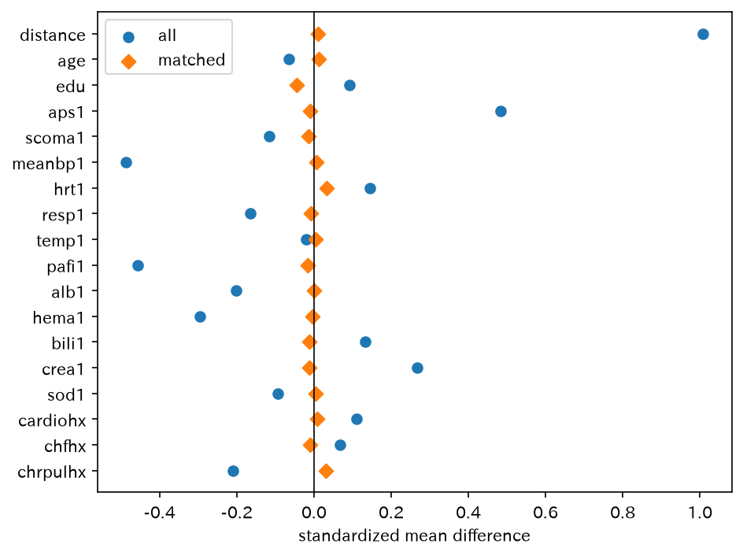
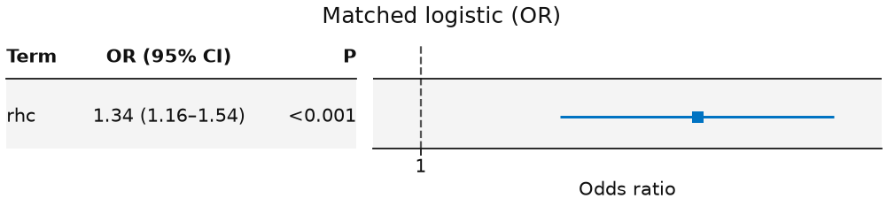

# psm_rhc — PS 最近傍マッチ → ロジスティック

1:1 最近傍マッチ（ATT）の正本。API は `match_sample`。マッチ後 OR の forest まで。

[← ギャラリー](index.md) · [実行用ディレクトリと手順（GitHub）](https://github.com/mizuy/statract/tree/main/examples/psm_rhc)

## 目的概説

観察研究で交絡を減らす MatchIt 流の `match_sample` を、公開の重症患者教学データで示すための例です。推定対象は ATT、API は `match_sample` です。因果の確定主張はしません。

## データと列の説明

| 項目 | 内容 |
|------|------|
| ソース | Vanderbilt RHC（Connors JAMA 1996 系）。**再配布しない。教学のみ** |
| 取得 | `build.py` → `https://hbiostat.org/data/repo/rhc.csv` |
| 単位 | 入院/患者 1 行 |

主な解析列:

| 列 | 意味 |
|----|------|
| `swang1` / `rhc` | 初日 RHC（Yes/No → 0/1） |
| `dth30` / `dth30_bin` | 30 日死亡 |
| `age`, `sex`, `race`, `edu`, `cat1`, `ca`, … | マッチ共変量（protocol 列挙の完全例） |
| `weights` | マッチ後ウェイト（キャリパー外は 0） |

## CQ と大まかな解析方針

**CQ** — ICU 初日の肺動脈カテーテル（RHC）は、交絡を傾向スコア最近傍マッチで揃えたあと、30 日死亡と関連するか。

方針:

1. 完全例コホートを確定（除外なしのため flowchart 省略）
2. 未マッチ Table 1 → `match_sample`（nearest / logit / ATT / caliper 0.2）
3. `balance` / `love_plot` とマッチ後 Table 1
4. マッチ標本で `dth30_bin ~ rhc` の二項 GLM（OR）と `plot_forest(..., layout="table")`

## flowchart / tableone

解析セットに除外はありません（全例解析）。ギャラリー方針どおり **flowchart / Mermaid は省略**します。

### Table 1（未マッチ / マッチ後）

=== "コード"

    ```python
    from statract import agg_category, agg_mean_sd, tableone

    table1_params = {
        "Age": ("age", agg_mean_sd),
        "Sex": ("sex", agg_category),
        "Race": ("race", agg_category),
        "Education (years)": ("edu", agg_mean_sd),
        "Primary disease": ("cat1", agg_category),
        "Cancer": ("ca", agg_category),
        "APS1": ("aps1", agg_mean_sd),
        "Mean BP": ("meanbp1", agg_mean_sd),
        "DNR": ("dnr1", agg_category),
        "30-day death": ("dth30_bin", agg_mean_sd),
    }
    unmatched = tableone(
        cohort, table1_params, hue="rhc", add_all=True, add_pvalue=True,
    )
    matched_gt = tableone(
        kept,
        {k: v for k, v in table1_params.items() if k != "30-day death"},
        hue="rhc",
        add_all=True,
        add_pvalue=True,
    )
    # CSV/HTML/md を *_out/ に書くときだけ write_tableone_artifacts
    # （stem="table1_unmatched" / "table1_matched"。ギャラリー同期用）
    ```

## メインの解析方法とそのコア

傾向スコア $e(x)=P(\mathrm{rhc}=1\mid x)$ をロジットで推定。最近傍 1:1、ATT、`order=data`、標準化キャリパー 0.2。Love plot はマッチ前後の標準化平均差。アウトカムモデル:

$$
\operatorname{logit}P(\mathrm{dth30}=1)=\beta_0+\beta_1\mathrm{rhc}
$$

実装は `match_sample` と `fit_glm(..., family="binomial", weights="weights")` → `plot_forest(..., layout="table")`（論文用白黒は `style="bw"`）。


## 結果

完全例 5735 人、マッチ後（weights>0）3350 人（治療 1675）。サイト掲載は `assets/psm_rhc/`。

### Love plot（マッチ前後の標準化差）

=== "図"

    

=== "コード"

    ```python
    fig = matched.love_plot()
    fig.savefig(out / "figures" / "love_plot.png", dpi=150, bbox_inches="tight")
    ```

### バランス（要約）

=== "表"

    | term | smd_all | smd_matched | n_matched | pair_distance |
    | --- | --- | --- | --- | --- |
    | distance | 1.008 | 0.01135 | 5735 | 0.01297 |
    | age | -0.06469 | 0.01264 | 5735 | 1.185 |
    | aps1 | 0.4837 | -0.009876 | 5735 | 0.9746 |
    | meanbp1 | -0.4869 | 0.007307 | 5735 | 0.9878 |
    | pafi1 | -0.4566 | -0.01521 | 5735 | 1.023 |

    抜粋。完全表: [CSV](assets/psm_rhc/balance.csv)

=== "コード"

    ```python
    balance = matched.balance()
    balance.write_csv(out / "balance.csv")
    ```

### ロジスティック（マッチ後、OR）

=== "表"

    | term | estimate | std_error | statistic | p_value | conf_low | conf_high | exp_estimate | exp_conf_low | exp_conf_high |
    | --- | --- | --- | --- | --- | --- | --- | --- | --- | --- |
    | (Intercept) | -0.8402 | 0.05324 | -15.78 | 0 | -0.9446 | -0.7358 | 0.4316 | 0.3889 | 0.4791 |
    | rhc | 0.2907 | 0.07354 | 3.952 | 7.735e-05 | 0.1465 | 0.4348 | 1.337 | 1.158 | 1.545 |

    [CSV](assets/psm_rhc/glm_matched.csv)

=== "コード"

    ```python
    from statract import fit_glm

    glm = fit_glm(kept, "dth30_bin ~ rhc", family="binomial", weights="weights")
    glm_tidy = glm.tidy(exponentiate=True)
    ```

### マッチ後 forest（OR）

=== "図"

    

=== "コード"

    ```python
    from statract import plot_forest

    plot_forest(
        glm_tidy,
        out / "figures" / "glm_matched_forest.png",
        title="Matched logistic (OR)",
        xlabel="Odds ratio",
        layout="table",
    )
    ```

### 参考: 未マッチロジスティック

| term | estimate | exp_estimate | exp_conf_low | exp_conf_high |
| --- | --- | --- | --- | --- |
| rhc | 0.3276 | 1.388 | 1.241 | 1.552 |

[CSV](assets/psm_rhc/glm_unmatched.csv)

## 解釈と解説

未マッチの 30 日死亡 OR は約 **1.39**、マッチ後は約 **1.34**（いずれも `rhc` の OR>1）。Love plot で SMD の縮小を確認できます。観察された交絡を nearest/logit で揃えても正の関連は残り、Connors JAMA 1996 の問題意識と方向は矛盾しません。教学用 ATT 近似であり、RHC 適応の根拠にはしません。

限界: 未測定交絡、キャリパー 0.2 での除外、再配布不可の教学 CSV。

## 実行と成果物

```bash
cd examples/psm_rhc
task all
```

既存の付随文書: [concept](https://github.com/mizuy/statract/blob/main/examples/psm_rhc/psm_rhc_concept.md) · [protocol](https://github.com/mizuy/statract/blob/main/examples/psm_rhc/psm_rhc_protocol.md) · [results](https://github.com/mizuy/statract/blob/main/examples/psm_rhc/psm_rhc_results.md) · [discussion](https://github.com/mizuy/statract/blob/main/examples/psm_rhc/psm_rhc_discussion.md)
