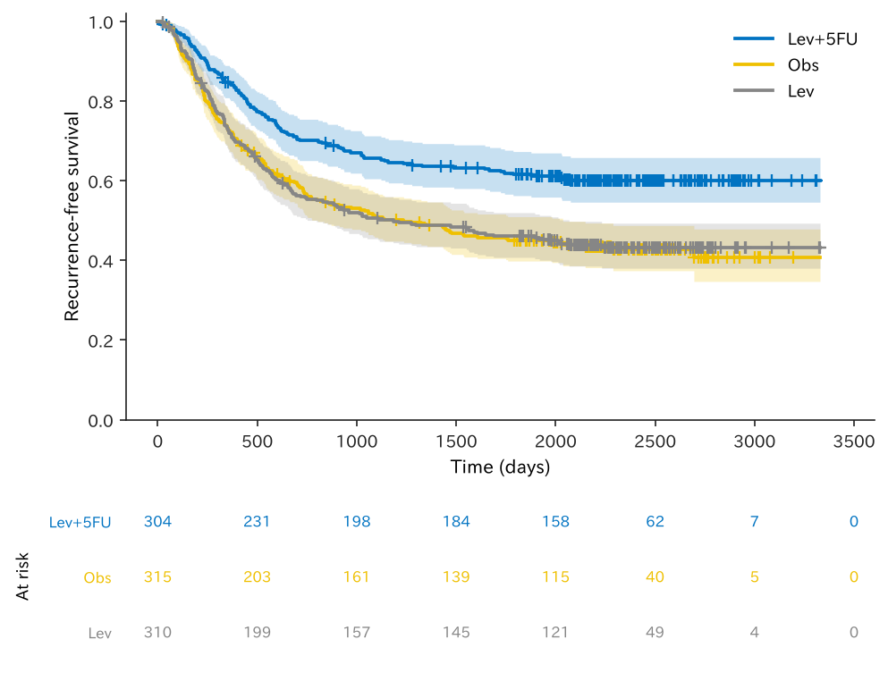
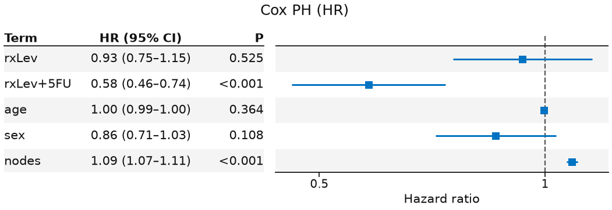
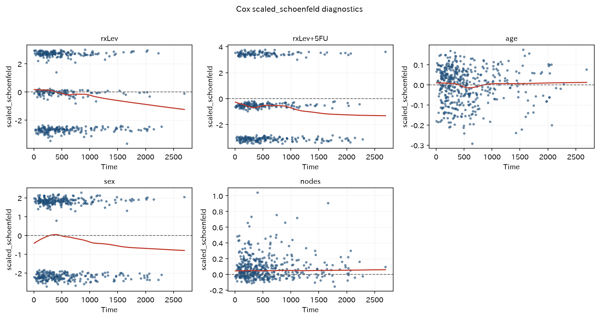
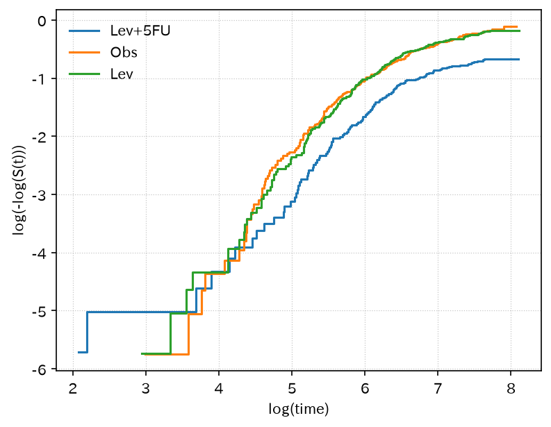
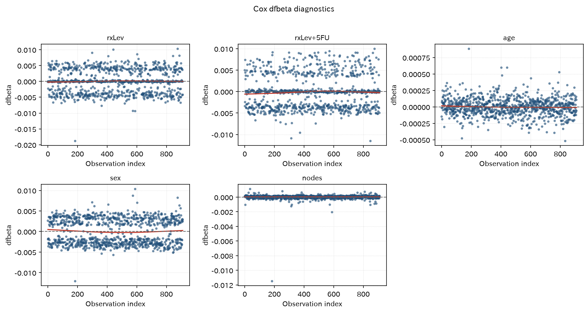
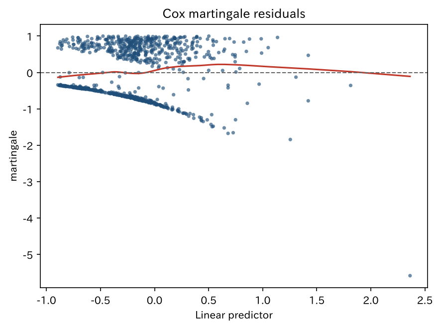
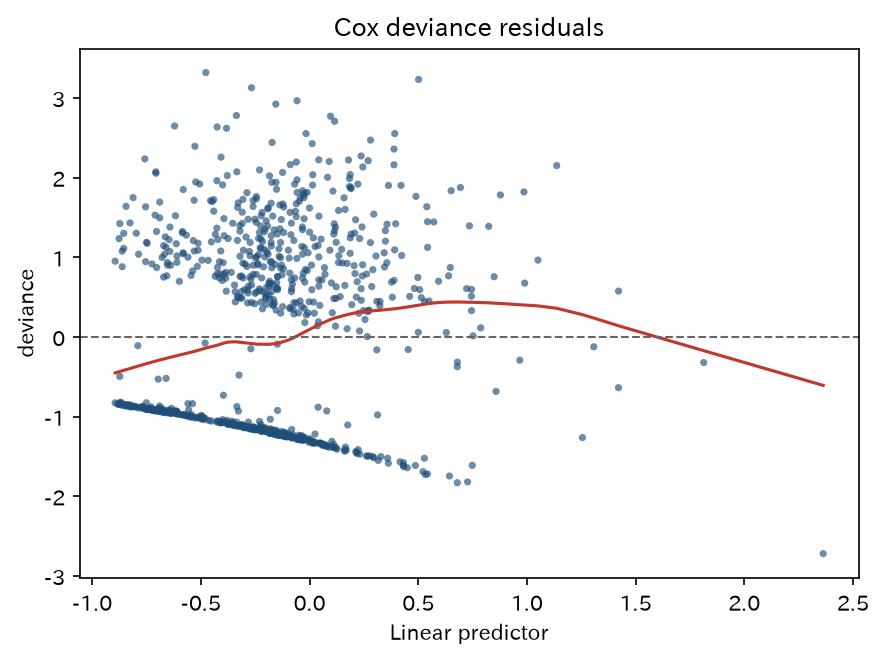

# 生存曲線と Cox 回帰

`surv_colon` — KM / log-rank / Cox

KM / log-rank / Cox の正本。`etype=1` で患者単位に畳み、`hue=rx` の Table 1 から KM（number-at-risk 付き）・Cox forest・PH 診断まで。

[← ギャラリー](index.md) · [実行用ディレクトリと手順（GitHub）](https://github.com/mizuy/statract/tree/main/examples/surv_colon)

## 目的概説

`statract` の生存 API（Kaplan–Meier + number-at-risk、log-rank、Cox、`proportional_hazards_test`、survminer 風診断、`plot_forest` 表一体型）を、公開 RCT の患者単位データで一連の文書に載せるための例です。単一イベント生存の正本であり、競合リスクや AFT は他例に任せます。

## データと列の説明

| 項目 | 内容 |
|------|------|
| ソース | R `survival::colon`（Laurie's / Moertel adjuvant）。ライセンス GPL-2/3。git 非収載 |
| 取得 | `build.py`（R が使えれば `data(colon, package="survival")`、否则 Rdatasets CSV） |
| 単位 | 再発レコード（`etype=1`）に畳んだ患者 1 行（長表は再発+死亡の 2 行形式） |

主な解析列:

| 列 | 意味 |
|----|------|
| `time` | 再発までの日数 |
| `status` / `event` | 再発イベント（`status==1` → `event` bool） |
| `rx` | 治療（`Obs` / `Lev` / `Lev+5FU`）。参照は `Obs`（`pl.Enum` 順） |
| `age`, `sex`, `nodes` | Cox 調整共変量（陽性リンパ節） |
| `obstruct`, `perfor`, `adhere`, `differ`, `extent` | Table 1 用の記述変数 |

## CQ と大まかな解析方針

**CQ** — 切除後 stage B/C 大腸癌において、補助化学療法 `rx`（観察 / levamisole / levamisole+5-FU）は再発までの時間を延長するか。

方針:

1. flowchart で再発レコード・時間・治療が揃ったコホートを確定する（Mermaid 化して docs に載せる）
2. Table 1（`hue=rx`）でベースラインを記述する
3. KM（**number-at-risk 表付き**）+ log-rank で群間の再発フリー生存を見る
4. Cox（`rx + age + sex + nodes`）で調整 HR を推定し、`plot_forest(..., layout="table")` で可視化する
5. `proportional_hazards_test` と Schoenfeld / log-log / dfbeta / martingale / deviance 診断を併記する

競合リスク（再発 vs 死亡）は本カットの対象外（→ [`cif_pbc`](cif_pbc.md)）。

## flowchart / tableone

### Flowchart

| 段 | flowchart キー | 対応基準 |
|----|----------------|----------|
| ソース | （開始 n = 長表の行） | 再発+死亡の 2 行形式 |
| 患者単位 | `Recurrence record (etype=1, patient-level)` | `etype == 1` |
| 時間 | `Time and status present` | `time` / `status` 非欠損 |
| 治療 | `Treatment rx present` | `rx` 非欠損 |

=== "図"

    ```mermaid
    flowchart TB
      classDef keep fill:#e8f5e9,stroke:#2e7d32,color:#111
      classDef drop fill:#f5f5f5,stroke:#9e9e9e,color:#333
      A["1,858 rows"]:::keep
      B["929 rows"]:::keep
      X1["not Recurrence record (etype=1, patient-level)<br/>excluded: 929 rows"]:::drop
      C["929 rows"]:::keep
      X2["not Time and status present<br/>excluded: 0 rows"]:::drop
      D["Analysis cohort<br/>929 rows"]:::keep
      X3["not Treatment rx present<br/>excluded: 0 rows"]:::drop
      A --> B
      A -.-> X1
      B --> C
      B -.-> X2
      C --> D
      C -.-> X3
    ```

    同一内容は `assets/surv_colon/mermaid_flowchart.md`（`surv_colon_out/` から sync）。

=== "コード"

    ```python
    import io
    import polars as pl
    from statract.reporting import markdown_flowchart, mermaid_flowchart

    buf = io.StringIO()
    cohort = raw.pp.flowchart(
        {
            "Recurrence record (etype=1, patient-level)": pl.col("etype") == 1,
            "Time and status present": pl.col("time").is_not_null() & pl.col("status").is_not_null(),
            "Treatment rx present": pl.col("rx").is_not_null(),
        },
        out=buf,
    )
    flow_text = buf.getvalue()
    # text_flowchart.md / mermaid_flowchart.md として保存
    markdown_flowchart(flow_text)
    mermaid_flowchart(flow_text, final_label="Analysis cohort")
    ```

### Table 1（`hue=rx`）

=== "表"

    --8<-- "examples/assets/surv_colon/table1_gt.md"

    [CSV](assets/surv_colon/table1.csv)

=== "コード"

    ```python
    from statract import agg_category, agg_mean_sd, tableone

    params = {
        "Age (years)": ("age", agg_mean_sd),
        "Sex": ("sex_label", agg_category),
        "Positive nodes": ("nodes", agg_mean_sd),
        "Obstruction": ("obstruct", agg_category),
        "Perforation": ("perfor", agg_category),
        "Adherence": ("adhere", agg_category),
        "Differentiation": ("differ", agg_category),
        "Extent": ("extent", agg_category),
    }
    gt = tableone(cohort, params, hue="rx", add_all=True, add_pvalue=True)
    # CSV/HTML/md を *_out/ に書くときだけ write_tableone_artifacts（ギャラリー同期用）
    ```

## メインの解析方法とそのコア

Kaplan–Meier 生存関数 $\hat S(t)$（群 = `rx`）。k 標本 log-rank（Mantel–Haenszel、$\rho=0$）。Cox:

$$
h(t \mid x) = h_0(t)\exp(\beta_{\mathrm{rx}} + \beta_{\mathrm{age}}\mathrm{age} + \beta_{\mathrm{sex}}\mathrm{sex} + \beta_{\mathrm{nodes}}\mathrm{nodes}).
$$

- KM / 図: `plot_survival`（既定で number-at-risk 表。論文用白黒は `style="bw"`）
- log-rank: `log_rank(..., by="rx")`
- Cox: `cox_ph` → `tidy(exponentiate=True)` → `plot_forest(..., layout="table")`（論文用白黒は `style="bw"`）
- PH: `proportional_hazards_test` + `write_cox_diagnostic_suite`（Schoenfeld / log-log / dfbeta / martingale / deviance）


## 結果

再発レコードに畳んだ **929 人**（Cox 完全例 911）。サイト掲載は `task all` 後の `surv_colon_out/` から `scripts/sync_example_assets.py` でコピーした同一ファイルです。

### Kaplan–Meier（`rx`、number-at-risk 付き）

=== "図"

    

=== "コード"

    ```python
    from statract import plot_survival

    ax = plot_survival(cohort, time="time", status="event", hue="rx")
    ax.set_xlabel("Time (days)")
    ax.set_ylabel("Recurrence-free survival")
    ax.figure.savefig(out / "figures" / "km_rx.png", dpi=150, bbox_inches="tight")
    ```

### 時点生存割合

=== "表"

    | time | estimate | std_error | conf_low | conf_high | n_risk | group |
    | --- | --- | --- | --- | --- | --- | --- |
    | 365 | 0.841 | 0.02105 | 0.8007 | 0.8833 | 252 | Lev+5FU |
    | 1095 | 0.6564 | 0.02745 | 0.6047 | 0.7125 | 195 | Lev+5FU |
    | 1825 | 0.6152 | 0.02819 | 0.5624 | 0.673 | 176 | Lev+5FU |
    | 365 | 0.7206 | 0.02528 | 0.6728 | 0.7719 | 228 | Obs |
    | 1095 | 0.5105 | 0.02834 | 0.4579 | 0.5692 | 156 | Obs |
    | 1825 | 0.4504 | 0.02833 | 0.3981 | 0.5095 | 130 | Obs |
    | 365 | 0.7203 | 0.0256 | 0.6719 | 0.7723 | 223 | Lev |
    | 1095 | 0.5071 | 0.0286 | 0.4541 | 0.5664 | 154 | Lev |
    | 1825 | 0.4601 | 0.02857 | 0.4074 | 0.5196 | 136 | Lev |

    [CSV](assets/surv_colon/km_at_3y.csv)

=== "コード"

    ```python
    from statract import survival_curve

    km = survival_curve(cohort, "time", "event", by="rx")
    km_at = km.at([365.0, 1095.0, 1825.0])  # 1y / 3y / 5y
    ```

### Log-rank

=== "表"

    ```text
    log-rank statistic = 23.062, df = 2, p = 9.822e-06
    ```

=== "コード"

    ```python
    from statract import log_rank

    lr = log_rank(cohort, "time", "event", by="rx")
    ```

### Cox PH（tidy、指数化）

=== "表"

    | term | estimate | std_error | statistic | p_value | conf_low | conf_high | exp_estimate | exp_conf_low | exp_conf_high |
    | --- | --- | --- | --- | --- | --- | --- | --- | --- | --- |
    | rxLev | -0.06906 | 0.1088 | -0.635 | 0.5254 | -0.2822 | 0.1441 | 0.9333 | 0.7541 | 1.155 |
    | rxLev+5FU | -0.5419 | 0.1206 | -4.495 | 6.955e-06 | -0.7782 | -0.3056 | 0.5816 | 0.4592 | 0.7367 |
    | age | -0.003591 | 0.003954 | -0.9082 | 0.3638 | -0.01134 | 0.004159 | 0.9964 | 0.9887 | 1.004 |
    | sex | -0.1515 | 0.0942 | -1.608 | 0.1079 | -0.3361 | 0.03316 | 0.8594 | 0.7146 | 1.034 |
    | nodes | 0.08276 | 0.008861 | 9.34 | 0 | 0.06539 | 0.1001 | 1.086 | 1.068 | 1.105 |

    [CSV](assets/surv_colon/cox_tidy.csv)

=== "コード"

    ```python
    from statract import cox_ph

    fit = cox_ph(cox_df, "Surv(time, event) ~ rx + age + sex + nodes")
    tidy = fit.tidy(exponentiate=True)
    ```

### Cox forest（表 + forest）

=== "図"

    

=== "コード"

    ```python
    from statract import plot_forest

    plot_forest(
        tidy,
        out / "figures" / "cox_forest.png",
        title="Cox PH (HR)",
        xlabel="Hazard ratio",
        layout="table",
    )
    ```

### 比例ハザード検定

=== "表"

    | term | statistic | df | p_value |
    | --- | --- | --- | --- |
    | rxLev | 0.1441 | 1 | 0.7042 |
    | rxLev+5FU | 0.5322 | 1 | 0.4657 |
    | age | 0.0002155 | 1 | 0.9883 |
    | sex | 2.947 | 1 | 0.08604 |
    | nodes | 0.5894 | 1 | 0.4426 |
    | global | 4.352 | 5 | 0.4999 |

    [CSV](assets/surv_colon/ph_test.csv)

=== "コード"

    ```python
    from statract import proportional_hazards_test

    zph = proportional_hazards_test(fit)
    ```

### Cox 診断プロット（survminer 風）

=== "図"

    

    

    

    

    

=== "コード"

    ```python
    from statract import write_cox_diagnostic_suite

    write_cox_diagnostic_suite(
        fit,
        out / "figures",
        data=cohort,
        time="time",
        status="event",
        by="rx",
        stem="cox",
    )
    ```

ギャップ（R survminer との差）: 対話的 faceting / 外れ値ラベル / Cook 距離パネルなし。層別 Cox の層ごとの smooth は描かない。Fine–Gray 専用の残差図は未対応。

## 解釈と解説

補助療法 `rx` は再発時間と関連する（log-rank 統計量 23.06、df=2、p≈9.8×10⁻⁶）。Cox（年齢・性別・陽性リンパ節調整）では **Lev+5FU 対 Obs の HR が約 0.58**（95% CI 約 0.46–0.74）。Lev 単独は Obs と大きく違わない（HR≈0.93）。`proportional_hazards_test` の全体 p≈0.50 で、このモデルでは PH の強い破綻は示唆されない。

限界:

- 患者単位は再発行のみ。死亡を競合にした Fine–Gray は出していない
- `nodes` 欠損は Cox だけ落とす
- GPL パッケージ由来の教学エクスポートであり、診療方針の更新を主張しない

## 実行と成果物

```bash
cd examples/surv_colon
task all
# docs 掲載用に同一ファイルをコピー:
uv run python ../../scripts/sync_example_assets.py --stem surv_colon
```

サイト掲載は `assets/surv_colon/` のみ（`*_out/` からのコピー）。既存の付随文書: [concept](https://github.com/mizuy/statract/blob/main/examples/surv_colon/surv_colon_concept.md) · [protocol](https://github.com/mizuy/statract/blob/main/examples/surv_colon/surv_colon_protocol.md) · [results](https://github.com/mizuy/statract/blob/main/examples/surv_colon/surv_colon_results.md) · [discussion](https://github.com/mizuy/statract/blob/main/examples/surv_colon/surv_colon_discussion.md)
