# 手法の選び方

statract にある統計解析を、「どういう時に」「どれを」「どう使うか」でまとめたページです。細かい引数は [API](../api/models/fit.md)、実データの通しの流れは [解析例ギャラリー](../examples/index.md) を見てください。

## まず決めること

手法は、ほぼ次の 3 つで決まります。

1. **アウトカムの型**: 連続、二値、順序、カテゴリ（3 水準以上）、計数、時間（打ち切りあり）
2. **データの構造**: 独立、対応あり（前後・ペア）、クラスター（施設・患者内の反復）
3. **目的**: 群の比較、関連の推定、因果効果の推定、予測

```mermaid
flowchart TD
  Q["アウトカムは？"] --> C["連続"]
  Q --> B["二値"]
  Q --> N["計数・率"]
  Q --> T["時間（打ち切りあり）"]
  Q --> O["順序・カテゴリ"]
  C --> C1["2 群: t_test / wilcox_test<br/>調整: fit_ols"]
  B --> B1["2 群: prop_test / binom_test<br/>調整: fit_glm binomial / fit_risk_ratio"]
  N --> N1["fit_glm poisson<br/>過分散: fit_mixed negative_binomial"]
  T --> T1["survival_curve / log_rank / RMST<br/>調整: cox_ph"]
  O --> O1["ordinal_regression<br/>multinomial_regression"]
  C1 --> R{"クラスターや反復がある？"}
  B1 --> R
  N1 --> R
  T1 --> R
  R -- "はい" --> R1["fit_mixed / gamm<br/>cluster_covariance / cox_ph(cluster=)"]
  R -- "いいえ" --> R2["そのまま"]
```



## 早見表

| 目的 | アウトカム | 手法 | 関数 |
|------|------------|------|------|
| 背景因子を並べる | 何でも | Table 1、SMD | `tableone` |
| 2 群の平均を比べる | 連続 | t 検定 | `t_test` |
| 2 群の分布を比べる | 連続・順序 | Wilcoxon（Mann–Whitney） | `wilcox_test` |
| 割合を比べる | 二値 | 比率の検定、正確二項 | `prop_test`、`binom_test` |
| 対応のある二値を比べる | 二値 | McNemar | `mcnemar_test` |
| 多重比較を調整する | P 値 | Holm、BH など | `p_adjust` |
| 調整した関連を推定する | 連続 | 線形回帰 | `fit_ols` |
| 調整した関連を推定する | 二値・計数・正の連続 | GLM | `fit_glm` |
| リスク比を推定する | 二値 | 修正ポアソン、log-binomial | `fit_risk_ratio` |
| 調整したリスク差・リスク比 | 二値・計数 | GLM の回帰標準化 | `standardize_glm` |
| 順序のある結果 | 順序 | 比例オッズモデル | `ordinal_regression`、`brant_test` |
| 順序のない結果 | カテゴリ | 多項ロジスティック | `multinomial_regression` |
| 非線形の関連を見る | 連続・二値・時間 | スプライン | 式に `rcs(age, 4)`、`spline_effect` |
| 非線形の関連を見る（罰則つき） | 連続・二値・計数 | 加法モデル | `gam` |
| 施設や反復を考える | 連続・二値・計数 | 混合モデル | `fit_mixed`、`gamm` |
| 生存曲線を描く・比べる | 時間 | Kaplan–Meier、log-rank | `survival_curve`、`log_rank` |
| ハザード比を推定する | 時間 | Cox | `cox_ph` |
| 平均の生存時間で比べる | 時間 | RMST | `restricted_mean_survival` |
| PH が成り立たない | 時間 | AFT | `accelerated_failure` |
| 競合する事象がある | 時間 | CIF、Gray 検定、Fine–Gray | `cumulative_incidence`、`fine_gray_regression` |
| マッチしたセット | 二値 | 条件付きロジスティック | `conditional_logit` |
| 処置の効果（観察研究） | 何でも | マッチング、IPTW、標準化 | `match_sample`、`propensity_weights`、`standardize_glm`、`standardize_cox` |
| 予測モデルを評価する | 二値・時間 | ROC、内部検証、較正、DCA | `roc_curve`、`validate_logistic`、`calibrate_logistic`、`decision_curve_table` |
| 欠損を埋める | 何でも | 多重代入 | `impute_chained`、`pool` |
| 分岐のルールを探す | 連続 | 条件付き推論木 | `conditional_tree` |
| 費用対効果を出す | 費用・QALY | Markov、ICER | `statract.cea` |

## 記述: Table 1

**いつ**: 論文の最初の表。群ごとの背景因子を並べるとき。

**どう**: `tableone` に列と集計関数の対応を渡します。`hue` が群です。`add_pvalue=True` で群間の P 値、`add_smd=True` で標準化差（SMD）を足します。

```python
from statract import agg_category_np, agg_mean_sd, agg_median_iqr, tableone

tableone(
    frame,
    {
        "年齢": ("age", agg_mean_sd),
        "入院日数": ("los", agg_median_iqr),
        "性別": ("sex", agg_category_np),
    },
    hue="arm",
    add_smd=True,
)
```

**注意**: RCT の Table 1 に P 値は勧められません。偏りの大きさを見るなら SMD を使います。観察研究で 0.1 を超える SMD は、調整が必要な目安です。

詳しくは [Table One](../tableone/overview.md) です。

## 2 群の比較: 基本の検定

**いつ**: 調整なしで 2 群を比べるとき。RCT の主解析や、記述の補助です。

| データ | 手法 | 呼び方 |
|--------|------|--------|
| 連続、ほぼ正規 | Welch の t 検定（既定） | `t_test(x, y)` |
| 連続、外れ値や歪み | Wilcoxon 順位和 | `wilcox_test(x, y, conf_int=True)` |
| 前後の連続 | 対応のある t / 符号付き順位 | `t_test(x, y, paired=True)`、`wilcox_test(x, y, paired=True)` |
| 2 群の割合 | 比率の差 | `prop_test([x1, x2], [n1, n2])` |
| 1 群の割合と区間 | 正確二項（Clopper–Pearson） | `binom_test(x, n)` |
| 前後の二値 | McNemar | `mcnemar_test(x, y)` |

複数の時点やアウトカムを検定したら、`p_adjust(pvalues, "holm")` で調整します。FDR なら `"BH"` です。

**注意**: 交絡の調整が要るなら回帰に進みます。値は R の `t.test`、`wilcox.test` などに合わせています。

例: [2 群 RCT の基本検定](../examples/htest_licorice.md)

## 回帰: 調整した関連

### アウトカムで選ぶ

| アウトカム | モデル | 呼び方 | 係数の読み方 |
|------------|--------|--------|--------------|
| 連続 | 線形回帰 | `fit_ols(frame, "y ~ x + age")` | 平均の差 |
| 二値 | ロジスティック | `fit_glm(frame, "y ~ x", family="binomial")` | `exp` でオッズ比 |
| 計数・率 | ポアソン | `fit_glm(frame, "n ~ x", family="poisson", offset="log_years")` | `exp` で率比 |
| 正の連続で右に歪む | ガンマ | `fit_glm(frame, "cost ~ x", family="gamma")` | 逆数リンク |
| 二値でリスク比がほしい | 修正ポアソン | `fit_risk_ratio(frame, "y ~ x + age")` | リスク比 |
| 順序（重症度など） | 比例オッズ | `ordinal_regression(frame, "grade ~ x", levels=["none", "mild", "severe"])` | `exp` で累積オッズ比 |
| 3 水準以上で順序なし | 多項ロジスティック | `multinomial_regression(frame, "subtype ~ x + age")` | `exp` で基準水準に対する相対リスク比 |

式の書き方は [Wilkinson 式](../models/formula.md) です。カテゴリの最初の水準が参照になります。係数表は `fit.tidy()` です。

### 効果の尺度を選ぶ

ロジスティック回帰のオッズ比は、結果がよく起きる（目安 10% 以上）とリスク比より大きく出ます。読み手に伝わりやすい尺度を選びます。

| 出したいもの | 呼び方 |
|--------------|--------|
| 調整したオッズ比 | `fit_glm(..., family="binomial")` |
| 調整したリスク比 | `fit_risk_ratio(frame, "y ~ arm + age")`。既定は修正ポアソン（HC0）、`method="log-binomial"` も選べる |
| 調整したリスク差、リスク比、オッズ比（周辺） | `standardize_glm(frame, "y ~ arm * age + sex", values={"arm": [0, 1]})` のあと `.tidy(contrast="difference", reference=0)` |

`standardize_glm` は全員の処置を 0 と 1 に置き換えて予測確率を平均します。交互作用を入れても、一つの数で要約できます。

**注意**: 順序ロジスティックは比例オッズの仮定を `brant_test(fit)` で確かめます。崩れていれば多項ロジスティックを考えます。

### 標準誤差を選ぶ

モデルの仮定が怪しいときは、係数はそのままで分散だけ差し替えます。

| 状況 | 共分散 | 呼び方 |
|------|--------|--------|
| 分散が一定でない | ロバスト（HC） | `hc_covariance(fit, kind="HC3")` |
| 施設や患者で相関がある | クラスター頑健 | `cluster_covariance(fit, "site", data=frame)` |
| 時系列で自己相関がある | Newey–West | `newey_west_covariance(fit, lags=4)` |
| 解析的な式を信じたくない | ブートストラップ | `bootstrap_covariance(fit, n=2000, seed=1)` |

差し替えた分散で係数表を作るときは `coefficient_test(fit, cov)` です。

### モデルを確かめる・比べる

| 確かめたいこと | 関数 |
|----------------|------|
| 入れ子のモデルを比べる | `likelihood_ratio_test(full, reduced)`、`wald_test(full, reduced)` |
| 多重共線性 | `check_collinearity(fit)`（VIF） |
| 分散の不均一 | `breusch_pagan_test(fit)` |
| 自己相関 | `durbin_watson_test(fit)`、`breusch_godfrey_test(fit)` |
| 関数形の誤り | `ramsey_reset_test(fit)` |

## 非線形の関連: スプラインと加法モデル

**いつ**: 年齢や検査値の効果が直線でなさそうなとき。カットオフを決め打ちしたくないとき。

### スプライン

**どう**: 式に `rcs(age, 4)`（制限付き 3 次スプライン、節点 4 個）と書きます。`fit_glm`、`fit_ols`、`cox_ph` で使えます。`ns(age, df = 3)` と `bs(age, df = 5)` も書けます。

```python
from statract import fit_glm, plot_spline_effect, spline_effect, spline_test

fit = fit_glm(frame, "death ~ rcs(age, 4) + sex", family="binomial")
print(spline_test(fit, "rcs(age, 4)"))  # 全体と非線形部分の検定
curve = spline_effect(fit, frame, "age", at=range(40, 86), reference=60, exponentiate=True)
plot_spline_effect(curve)  # 60 歳を基準にした OR の曲線
```

**注意**: 節点は 3 から 5 個で足ります。非線形部分の P 値が大きければ、直線のモデルで構いません。書き方は [Wilkinson 式](../models/formula.md#スプライン) です。

### 加法モデル

**いつ**: 滑らかさをデータから決めたいとき。平滑を 2 本以上や、2 変数の曲面を入れたいとき。

**どう**: `gam` に平滑項 `smooth` を渡します。平滑の滑らかさは REML で自動に決まります。

```python
from statract import gam, smooth

fit = gam(frame, "y", [smooth("age")], predictors=["arm"], family="binomial")
print(fit.smooth_table())
```

**注意**: 平滑を入れたモデルと直線のモデルは `compare_gams` で AIC を比べます。平滑の `edf` が 1 に近ければ、直線で足ります。

## クラスターと反復: 混合モデル

**いつ**: 多施設のデータ、同じ患者の反復測定、検査医ごとのばらつきがあるとき。

**どう**: 変量効果を式に書きます。

| データ | 呼び方 |
|--------|--------|
| 連続、施設の変量切片 | `fit_mixed(frame, "y ~ x + (1 | site)")` |
| 反復測定で傾きも個人差 | `fit_mixed(frame, "y ~ time + (1 + time | id)")` |
| 二値 | `fit_mixed(frame, "y ~ x + (1 | site)", family="binomial")` |
| 計数で過分散 | `fit_mixed(frame, "n ~ x + offset(log(years)) + (1 | site)", family="negative_binomial")` |
| ゼロが多い計数 | `zero_inflation=True` または `hurdle=True` |
| 非線形と変量効果 | `gamm(frame, "y", [smooth("x")], random="(1 | site)", family="binomial")` |

施設差の大きさは `fit.variance_table()` で見ます。ロジスティックなら `median_odds_ratio` でオッズ比の尺度にできます。

**注意**: 「施設をまたいだ平均の効果」が知りたいだけなら、`fit_glm` と `cluster_covariance` でも足ります。施設のばらつきそのものが知りたいときに混合モデルを使います。

例: [多施設 RCT の混合ロジスティック](../examples/logit_indo.md)、[てんかん RCT の計数 GLMM](../examples/glmm_epil.md)、[反復測定の線形混合モデル](../examples/lmm_pbcseq.md)

## 生存時間

### 曲線と検定

**いつ**: 打ち切りのある時間のアウトカム（死亡、再発）。

```python
from statract import log_rank, plot_survival, survival_curve

curve = survival_curve(frame, "time", "event", by="arm")
print(curve.at([1, 3, 5]))       # 時点の生存割合
print(log_rank(frame, "time", "event", by="arm"))
```

図は `plot_survival` です。リスク集合の人数（number at risk）も付きます。

### Cox 回帰

**いつ**: 共変量を調整したハザード比を出すとき。

```python
from statract import cox_ph, proportional_hazards_test

fit = cox_ph(frame, "Surv(time, event) ~ arm + age + sex")
print(fit.tidy())
print(proportional_hazards_test(fit))
```

| 状況 | 使い方 |
|------|--------|
| 層ごとに基準ハザードが違う | `strata(center)` を式に入れる |
| 同じ患者の複数の眼など | `cluster(id)` か `cluster=`（Lin–Wei のロバスト分散） |
| 時間で変わる共変量・効果 | `split_follow_up` で追跡を区切り、`entry` を渡す |
| 遅れて観察に入る | `entry=` |

**注意**: `proportional_hazards_test` で PH（比例ハザード）を確かめます。P 値が小さい共変量は、層にするか、時間で区切るか、AFT を考えます。診断図をまとめて出すときは `write_cox_diagnostic_suite` です。

### RMST: 平均の生存時間で比べる

**いつ**: PH が崩れていてハザード比が一つの数にまとまらないとき。「5 年のうち平均で何か月長く生きるか」で伝えたいとき。

`restricted_mean_survival(frame, "time", "event", by="arm", tau=5)` です。`.arms` が群ごとの RMST、`.contrasts` が差と比です。`tau` は両群に十分な追跡がある時点にします。共変量で調整した RMST は `standardize_cox(..., measure="rmean")` です。

### PH が成り立たないとき: AFT

`accelerated_failure(frame, "Surv(time, event) ~ arm", distribution="weibull")` です。係数は「時間が何倍に延びるか」で読みます。分布は `weibull`、`exponential`、`lognormal`、`loglogistic` などです。

### 競合リスク

**いつ**: 関心の事象（例: 肝死）の前に、別の事象（例: 移植）で観察が終わるとき。KM で 1 − 生存を描くと、発生を過大に見積もります。

| 知りたいこと | 呼び方 |
|--------------|--------|
| 累積発生（CIF）と Gray 検定 | `cumulative_incidence(frame, "time", "status", by="arm")` |
| CIF の図の数値 | `survival_curve(..., kind="aalen_johansen")` |
| 部分分布ハザード比 | `fine_gray_regression(frame, "Surv(time, status) ~ arm + age", cause=1)` |
| 原因別ハザード比 | 他の原因を打ち切りにして `cox_ph` |

`status` は 0 が打ち切り、1 以上が原因です。病因を調べるなら原因別ハザード、予後の予測なら Fine–Gray が向いています。

### マッチしたセット

ケース・コントロールの 1:k マッチや、マッチしたペアの二値アウトカムは `conditional_logit(frame, "y ~ x + strata(set)")` です。

例: [生存曲線と Cox 回帰](../examples/surv_colon.md)、[競合リスク解析](../examples/cif_pbc.md)、[PH 検定と AFT モデル](../examples/aft_rotterdam.md)、[クラスター頑健 Cox](../examples/cox_retinopathy.md)

## 因果推論: 観察研究の処置効果

**いつ**: 処置が無作為でなく、背景の違う群を比べるとき。どの方法も「測った交絡因子で説明がつく」ことが前提です。

| 方法 | 推定するもの | 呼び方 |
|------|--------------|--------|
| 傾向スコアマッチング | ATT（処置群での効果） | `match_sample(frame, "treat", covs, method="nearest", distance="logit", caliper=0.2)` |
| IPTW | ATE、ATT、ATO | `propensity_weights(frame, "treat ~ age + sex + stage", estimand="ATE", stabilize=True, trim=0.99)` |
| GLM の回帰標準化 | 周辺のリスク差・リスク比 | `standardize_glm(frame, "y ~ treat * age + sex", values={"treat": [0, 1]})` |
| Cox の回帰標準化 | 周辺の生存曲線、その差、RMST | `standardize_cox(frame, "Surv(time, status) ~ treat * age + sex", values={"treat": [0, 1]}, times=[1, 3, 5])` |

マッチングのあとは `matched.balance()` と `matched.love_plot()` で SMD を確かめます。

IPTW は次の順で進めます。

1. `ipw = propensity_weights(...)` で重みを作る。
2. `ipw.balance(threshold=0.1)` と `ipw.love_plot("love.png")` で重みづけ後の SMD を確かめる。`ipw.effective_sample_size()` が小さすぎないかも見る。
3. `ipw.frame()` の `weights` 列を、`fit_glm`、`fit_risk_ratio`、`cox_ph` の `weights=` に渡す。
4. 分散はロバスト分散（`hc_covariance(fit, "HC0")`）にする。

**注意**: 極端な重みは `trim` で切り詰めます。それでもバランスが悪ければ、傾向スコアのモデルを見直します。

例: [傾向スコアマッチング](../examples/psm_rhc.md)、[逆確率重み付け（IPTW）](../examples/iptw_nhefs.md)

## 予測モデルの評価

**いつ**: リスクスコアや予測モデルを作り、その性能を報告するとき。

| 見るもの | 意味 | 呼び方 |
|----------|------|--------|
| 識別 | 高リスクの人を高く並べられるか | `roc_curve(truth, score)`、2 つの AUC は `roc_test(roc1, roc2)` |
| 楽観の補正 | 同じデータで評価した甘さを除く | `validate_logistic(frame, "y", preds, B=200)`、`validate_cox(...)` |
| 較正 | 予測の確率が実際と合うか | `calibrate_logistic(...)`、`calibrate_cox(..., u=5)`、`calibration_table` |
| 総合 | 確率の当たりの良さ | `brier_score(y, prob)` |
| 臨床の有用性 | 閾値ごとの正味の利益 | `decision_curve_table(y, prob)`、図は `plot_dca` |
| 閾値の決め方 | 感度と特異度の兼ね合い | `threshold_tradeoff(y, prob)` |

**注意**: AUC だけでは足りません。較正と決定曲線もあわせて報告します（TRIPOD の考え方）。

例: [予測モデルの較正と DCA](../examples/pred_support.md)

## 欠損: 多重代入

**いつ**: 共変量の欠損が多く、完全例だけでは偏りや精度の損失が心配なとき。

```python
from statract import fit_glm, impute_chained

mi = impute_chained(frame, m=20, n_iter=10, seed=1)
table = mi.pool(lambda d: fit_glm(d, "y ~ x + age", family="binomial"))
```

各データでモデルを当て、Rubin のルールでまとめます。代入のモデルにはアウトカムも入れます。

## 探索: 条件付き推論木

**いつ**: 連続のアウトカムを、どの変数のどこで分けると差が出るかを探すとき。分岐は検定で選ぶので、木を刈り込む必要がありません。

`conditional_tree(frame, "y", ["age", "bmi", "stage"])` で木を作り、`plot_tree` で描きます。結果は仮説を作るためのもので、確認の解析には回帰を使います。

## 費用対効果分析

**いつ**: 治療ごとの費用と QALY を比べて ICER を出すとき。

cohort Markov で状態の推移を回し（`simulate_cohort_markov`）、ICER 表を作り（`calculate_icers`）、一元感度分析と確率的感度分析で頑健さを見ます。手順は [Cost-effectiveness](../cea/overview.md) です。

例: [Markov モデルの費用対効果分析](../examples/cea_sicksicker.md)

## 次に読む

- [Models](../models/overview.md): 回帰、生存時間、混合、GAM の Quickstart
- [Wilkinson 式](../models/formula.md): 式の文法
- [Figures](../viz/overview.md): forest、KM、較正、DCA の図
- [Models vs R](../models/vs-r.md): R との数値の対応
