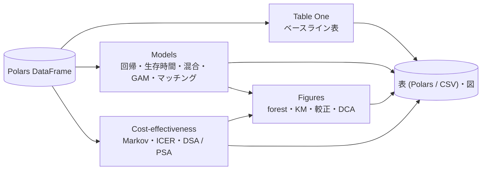

<p align="center">
  
</p>

# statract

Polars の表を渡して、結果の表と図を受け取る。ベースライン表、回帰、生存時間、統計図、費用効果分析を、一つのライブラリでつなぎます。



## 何ができるか

| 領域 | できること | 主な入口 |
|------|------------|----------|
| [Table One](tableone/overview.md) | ベースライン表、集計、群間の検定 | `tableone` |
| [Models](models/overview.md) | 線形・一般化線形、Cox / AFT / Fine–Gray、混合、GAM、木、マッチング、予測の評価 | `fit_ols`、`fit_glm`、`cox_ph`、`fit_mixed`、`match_sample` |
| [Figures](viz/overview.md) | forest、Kaplan–Meier、較正、決定曲線、funnel | `plot_forest`、`plot_survival` |
| [Cost-effectiveness](cea/overview.md) | cohort Markov、ICER、DSA / PSA | `simulate_cohort_markov`、`calculate_icers` |

## 最小の例

```bash
pip install statract
pip install "statract[sm]"   # statsmodels を使う機能（OLS の一部、割合の信頼区間、probit）
```

```python
import polars as pl
from statract import cox_ph, fit_ols, survival_curve

frame = pl.DataFrame(
    {
        "y": [1.2, 0.4, 2.1],
        "x": [0.0, 0.5, 1.0],
        "time": [0.4, 1.2, 0.8],
        "event": [1, 0, 1],
    }
)
fit_ols(frame, "y", ["x"])
survival_curve(frame, "time", "event")
cox_ph(frame, "Surv(time, event) ~ x")
```

## どこから読むか

| 目的 | ページ |
|------|--------|
| 回帰や生存時間を動かしたい | [Models](models/overview.md)（Quickstart つき）、式の書き方は [Wilkinson 式](models/formula.md) |
| 論文用の図を作りたい | [Figures](viz/overview.md) |
| 費用効果分析をしたい | [Cost-effectiveness](cea/overview.md)（Quickstart つき） |
| 入力から図までの通しの例を見たい | [解析例ギャラリー](examples/index.md) |
| R との数値の対応や速度を確認したい | [Models vs R](models/vs-r.md)、[Benchmarks](models/benchmarks.md) |
| 関数の引数を調べたい | [API](api/models/fit.md) |

## 設計の前提

- 核は pandas を使いません。データと結果の表は Polars です。Kaplan–Meier は自前の `survival_curve` で、lifelines は使いません。
- statsmodels は optional extra `sm`、R ブリッジ（`statract.r`）は extra `r` です。`import statract` は R も rpy2 も読みません。
- 解析パイプラインの出力ディレクトリと CSV companion は `statract.reporting` と `statract.task_io` が担当します。

```python
from statract.task_io import prepare_task_output, save_frames
```
