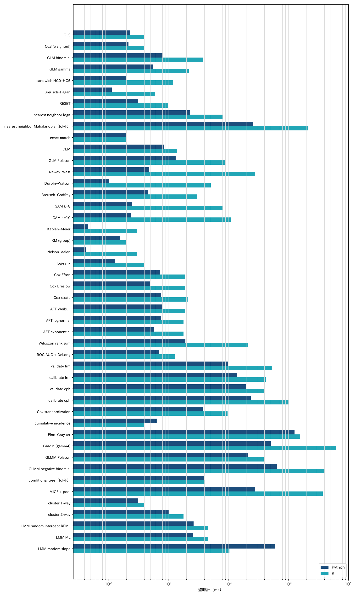
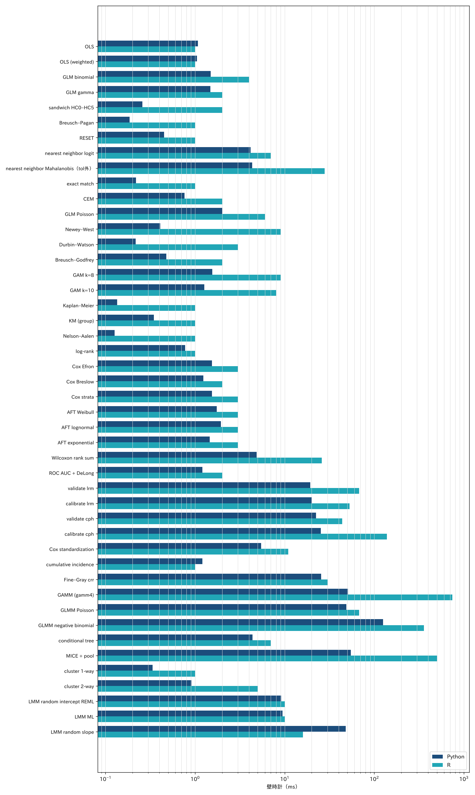
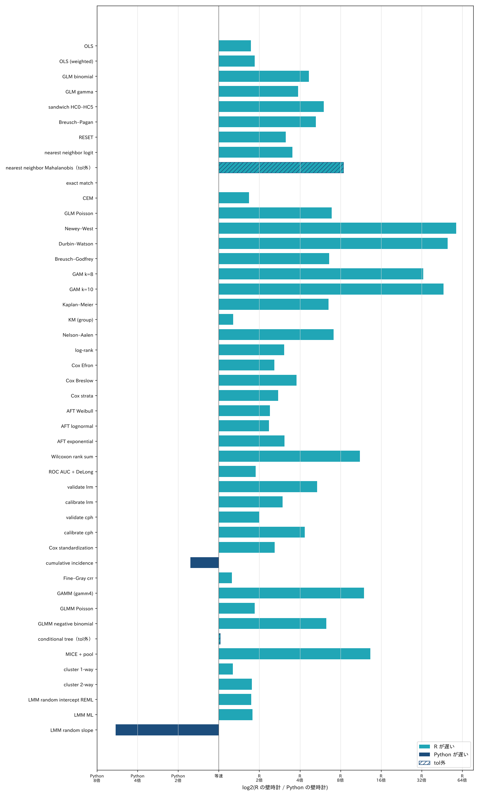
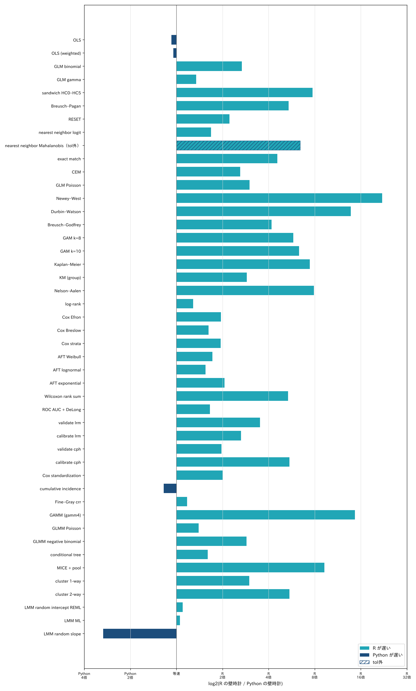

# 速度と R との差

公開データで **同じ表** を Python（このライブラリ）と R に渡し、壁時計と数値差を測った結果。設計・許容差・データの引用は [リポジトリの benchmark-plan](https://github.com/mizuy/statract/blob/main/docs/dev/benchmark-plan.md)。R 関数の対応は [vs R](vs-r.md)。

**このページの表は 2026-10-09 の全タスク再計測。** 出典は [`comparison.csv`](benchmarks/comparison.csv)（`bench/stat/run_all.py` と同じ比較。344 行、102 タスク）。表は `bench/stat/render_tables.py`、図は `bench/stat/plot_charts.py` が CSV から作る。2026-10-07 の 68 タスクに、SUPPORT2 の 17 種（両スライスで 34 タスク）を足した。足したのは検定（`t.test` ほか）、pROC、rms の validate / calibrate、stdReg2、cmprsk、gamm4、glmmTMB（ポアソン / 負の二項）、partykit の ctree、mice。設計と比べる量は [benchmark-plan](https://github.com/mizuy/statract/blob/main/docs/dev/benchmark-plan.md)。Python は statract 0.1.0。R の版は前回の表と同じ機械で、足したパッケージの版はこの CSV に記録していない。ウォームアップ 1 回のあと 5 回の中央値（mice は 1 回）。BLAS / OMP スレッドは 1。混合モデルの Python 側は lme-python（`fit_mixed`）。

秒は Apple M4 Max（macOS）の壁時計で、前回（2026-10-05）の VM とは機械が違う。前回の表とは秒を比べない。R の秒はおおむね 1 ms 刻み。比が空なのは R 側が 0 s と記録されたため。

前回からの数値の変化は次のとおり。OLS は悪条件の計画行列で QR に回し、(X'WX)⁻¹ を列スケールした QR から作るようにした。これで HC とクラスタが R にそろった。共分散は |ΔV_ij| / √(V_ii V_jj) で比べる。GAM は mgcv の外側の Newton 法を収束させた当てはめ直しと比べる（R の秒は既定の呼び出し）。混合モデルは lme-python に収束の許容差 1e-8 を渡す。クラスタ頑健分散と混合モデルは、STAR の生まれ年を中心化しないことによる悪条件のため許容差を緩めた（表の「緩めた許容差」）。最近傍の組は、共変量が同じ対照への入れ替わりをタイとして同じ組とみなす。理由と数値は [benchmark-plan](https://github.com/mizuy/statract/blob/main/docs/dev/benchmark-plan.md) にある。

データは実行時に取得し、リポジトリには入れない。UCI Adult、Bike Sharing、Vanderbilt SUPPORT2、Harvard Dataverse STAR（file 666716）。STAR の取得は User-Agent 付きの HTTPS が必要だった。

## 読み方

| 列 | 意味 |
|----|------|
| 手法 | `bench/stat` のタスク ID |
| n | 切ったあとの行数 |
| Python / R | そのタスクの壁時計 |
| 比 | Python ÷ R。1 未満なら Python が速い |
| vs R | CSV の全チェック。括弧の数は quantity の行数。pass は [vs-r.md](vs-r.md) の許容差。「緩めた許容差」は benchmark-plan で緩めたタスク |

`tableone` はこのスイートに入っていない。Fine–Gray は SUPPORT2 に作った競合原因（院内死亡と退院後死亡）で `crr` と比べる。解析例は [解析例](../examples/index.md)。

## スピードの並び

タスクごとの壁時計。棒は [`comparison.csv`](benchmarks/comparison.csv) の `python_s` と `r_s`（ミリ秒、対数軸）。青が Python、青緑が R。どちらもロゴと同じ青から青緑で、数値の成否を色では分けていない。

ラベルの「tol外」は、そのタスクの quantity が許容差の外だったという印である。棒の長さは速度であり、数値比較が成功したという意味ではない。R のタイマーが 0 s のタスク（両側の Wald と尤度比、1,000 行側の KM（群））は対数軸に載せない。秒は下の表にある。

indo の二項 GLMM は再計測していないので、この図には入れていない。indo の記録はページ末尾。

### 同じ速さからの倍率

中心は Python と R が同じ壁時計。軸は log2(R の壁時計 / Python の壁時計) で、0 が等速。右へ行くほど R が遅い（Python が速い）。左へ行くほど Python が遅い。目盛りは 2 倍、4 倍のように、どちらが何倍遅いかを示す。棒の色と向きは速さだけである。斜線と「tol外」は数値比較が許容差の外であることであり、速さの成否ではない。

タスク分けは上の壁時計の図と同じ。R のタイマーが 0 s のタスクは比が定義できないので載せていない。indo の二項 GLMM は再計測していないので、この図にも入れていない。

## 大きい側

SUPPORT2 の生存は完全ケース 9,103 行。STAR の変量傾きは生徒単位の別スライス（n=10,000）。

| 手法 | API | n | Python | R | 比 | vs R |
|------|-----|--:|------:|--:|---:|------|
| OLS | `fit_ols` / `lm` | 10000 | 2.31 ms | 4.00 ms | 0.578 | 一致（5） |
| OLS（重み） | `fit_ols(weights=)` / `lm` | 10000 | 2.17 ms | 4.00 ms | 0.542 | 一致（5） |
| GLM 二項 | `fit_glm(binomial)` / `glm` | 10000 | 8.15 ms | 38.00 ms | 0.215 | 一致（3） |
| GLM ガンマ | `fit_glm(gamma)` / `glm` | 10000 | 5.66 ms | 22.00 ms | 0.257 | 一致（2） |
| sandwich HC0–HC5 | `hc_covariance` / `vcovHC` | 10000 | 2.00 ms | 12.00 ms | 0.166 | 一致（6） |
| Wald | `wald_test` / `waldtest` | 10000 | 0.026 ms | 0 s | — | 一致（2）。R のタイマーが 0 |
| 尤度比 | `likelihood_ratio_test` / `lrtest` | 10000 | 0.015 ms | 0 s | — | 一致（2）。R のタイマーが 0 |
| Breusch–Pagan | `breusch_pagan_test` / `bptest` | 10000 | 1.14 ms | 6.00 ms | 0.190 | 一致（4） |
| RESET | `ramsey_reset_test` / `resettest` | 10000 | 3.18 ms | 10.00 ms | 0.318 | 一致（2） |
| 最近傍 logit | `match_sample` / `matchit` | 10000 | 23.06 ms | 81.00 ms | 0.285 | 一致（2）。16 組は共変量が同じ別の対照（タイの破り方） |
| 最近傍 マハラノビス | `distance="mahalanobis"` | 10000 | 259.0 ms | 2.175 s | 0.119 | tol 外（1/1）。組が一致しない（3247 組中 2278 組が同じ）。LAPACK のビルドに依存 |
| 完全一致 | `method="exact"` | 10000 | 2.01 ms | 2.00 ms | 1.003 | 一致（1） |
| CEM | `method="cem"` | 10000 | 8.35 ms | 14.00 ms | 0.596 | 一致（1） |
| GLM ポアソン | `fit_glm(poisson)` / `glm` | 10000 | 13.21 ms | 91.00 ms | 0.145 | 一致（3） |
| Newey–West | `newey_west_covariance` / `NeweyWest` | 10000 | 4.84 ms | 280.0 ms | 0.017 | 一致（1） |
| Durbin–Watson | `durbin_watson_test` / `dwtest` | 10000 | 1.02 ms | 51.00 ms | 0.020 | 一致（2） |
| Breusch–Godfrey | `breusch_godfrey_test` / `bgtest` | 10000 | 4.55 ms | 30.00 ms | 0.152 | 一致（4） |
| GAM k=8 | `gam` / `mgcv::gam` | 10000 | 2.49 ms | 82.00 ms | 0.030 | 一致（4） |
| GAM k=10 | 同上 | 10000 | 2.37 ms | 110.0 ms | 0.022 | 一致（4） |
| Kaplan–Meier | `survival_curve` / `survfit` | 9103 | 0.459 ms | 3.00 ms | 0.153 | 一致（3） |
| KM（群） | `survival_curve(by=)` | 9103 | 1.56 ms | 2.00 ms | 0.780 | 一致（3） |
| Nelson–Aalen | `kind="nelson_aalen"` | 9103 | 0.421 ms | 3.00 ms | 0.140 | 一致（3） |
| log-rank | `log_rank` / `survdiff` | 9103 | 1.31 ms | 4.00 ms | 0.327 | 一致（6） |
| Cox Efron | `cox_ph` / `coxph` | 9103 | 7.36 ms | 19.00 ms | 0.387 | 一致（3） |
| Cox Breslow | `ties="breslow"` | 9103 | 5.03 ms | 19.00 ms | 0.265 | 一致（3） |
| Cox 層 | `strata=` | 9103 | 7.63 ms | 21.00 ms | 0.363 | 一致（3） |
| AFT Weibull | `accelerated_failure` / `survreg` | 9103 | 7.94 ms | 19.00 ms | 0.418 | 一致（3） |
| AFT lognormal | 同上 | 9103 | 7.64 ms | 18.00 ms | 0.425 | 一致（3） |
| AFT exponential | 同上 | 9103 | 5.85 ms | 18.00 ms | 0.325 | 一致（3） |
| クラスタ 1-way | `cluster_covariance` / `vcovCL` | 10000 | 3.15 ms | 4.00 ms | 0.787 | 一致（1）。緩めた許容差 |
| クラスタ 2-way | 同上 2 列 | 10000 | 10.22 ms | 18.00 ms | 0.568 | 一致（1）。緩めた許容差 |
| LMM 変量切片 REML | `fit_mixed` / `lmer` | 10000 | 26.36 ms | 46.00 ms | 0.573 | 一致（5）。緩めた許容差 |
| LMM ML | `method="ml"` | 10000 | 25.82 ms | 46.00 ms | 0.561 | 一致（5）。緩めた許容差 |
| LMM 変量傾き | `slopes=` | 10000 | 610.5 ms | 105.0 ms | 5.814 | 一致（5）。緩めた許容差 |
| t 検定 | `t_test` / `t.test` | 9103 | 0.060 ms | 0 s | — | 一致（10）。R のタイマーが 0 |
| Wilcoxon 順位和 | `wilcox_test` / `wilcox.test` | 9103 | 19.25 ms | 215.0 ms | 0.090 | 一致（4） |
| 比率の検定 | `prop_test` / `prop.test` | 9103 | 0.060 ms | 0 s | — | 一致（5）。R のタイマーが 0 |
| p 値の補正 | `p_adjust` / `p.adjust` | 9103 | 0.005 ms | 0 s | — | 一致（5）。R のタイマーが 0 |
| ROC と DeLong | `roc_curve`, `roc_test` / pROC | 9103 | 6.90 ms | 13.00 ms | 0.531 | 一致（5） |
| validate（ロジスティック） | `validate_logistic` / `rms::validate` | 9103 | 100.4 ms | 539.0 ms | 0.186 | 一致（1） |
| calibrate（ロジスティック） | `calibrate_logistic` / `rms::calibrate` | 9103 | 141.2 ms | 421.0 ms | 0.335 | 一致（2） |
| validate（Cox） | `validate_cox` / `rms::validate` | 9103 | 198.4 ms | 396.0 ms | 0.501 | 一致（1） |
| calibrate（Cox） | `calibrate_cox` / `rms::calibrate` | 9103 | 236.5 ms | 1.029 s | 0.230 | 一致（4） |
| Cox 標準化 | `standardize_cox` / `stdReg2` | 9103 | 37.39 ms | 97.00 ms | 0.385 | 一致（2） |
| 累積発生と Gray 検定 | `cumulative_incidence` / `cuminc` | 9103 | 6.49 ms | 4.00 ms | 1.623 | 一致（6） |
| Fine–Gray（crr） | `fine_gray_regression` / `crr` | 9103 | 1.273 s | 1.592 s | 0.799 | 一致（3） |
| GAMM | `gamm` / `gamm4` | 9103 | 518.6 ms | 6.218 s | 0.083 | 一致（4） |
| GLMM ポアソン | `fit_mixed(poisson)` / `glmmTMB` | 9103 | 210.8 ms | 390.0 ms | 0.540 | 一致（4） |
| GLMM 負の二項 | `fit_mixed(negative_binomial)` / `glmmTMB` | 9103 | 646.2 ms | 4.051 s | 0.160 | 一致（5） |
| 条件付き推論木 | `conditional_tree` / `ctree` | 9103 | 39.91 ms | 41.00 ms | 0.973 | tol 外（2/5）。splits equal 1.000e+00、pred rel 8.054e-01 |
| 多重代入と統合 | `impute_chained`, `pool` / `mice` | 9104 | 283.1 ms | 3.773 s | 0.075 | 一致（2） |

許容差の外に残るのはマハラノビスの最近傍と、9,103 行の ctree である。ctree は根の検定統計量と p 値、終端ノードの数は R と一致するが、深い分岐の 1 つ以上が R と違い、予測が最大 0.81 ずれる。1,000 行では分岐も予測も一致する。原因はまだ調べていない。

マハラノビスは、全水準の指標でプールした共分散が特異になり、MatchIt はその一般化逆行列をピボット付き Cholesky で分解する。末尾の塊が LAPACK のビルドで変わるので、x86-64 Linux の参照 LAPACK では組が一致し、この macOS では一致しない。ロジットの 10,000 行では 16 組が、共変量の同じ別の対照を取っている（タイの破り方）。

速さで Python が遅いのは、変量傾きの LMM（比 5.8）だけになった。lme-python の反復が 150 回を超える。GLMM（ポアソン 0.54、負の二項 0.16）、GAMM（0.08）、mice（0.08）は、2026-10-09 のアルゴリズム改良（mice の多項ロジットを Newton 法に、GLMM と GAMM に Laplace 近似の厳密勾配など）で R より速くなった。改良前の比は GLMM ポアソン 9.8、負の二項 2.9、GAMM 3.7、mice 12.9 だった。経緯は [speed-plan](https://github.com/mizuy/statract/blob/main/docs/dev/speed-plan.md)。累積発生（cuminc）は 1.6 だが、どちらも 10 ms 未満である。変量切片は収束の許容差を 1e-8 に締めたぶん前回より秒が延びたが、`lmer` より速い。R の `lmer` は変量傾きで `boundary (singular) fit` を出した。

## 1,000 行側

同じタスクの小さいスライス。STAR の小さい側は生徒を切った結果 n=1,002 と n=1,001。

| 手法 | n | Python | R | 比 | vs R |
|------|--:|------:|--:|---:|------|
| OLS | 1000 | 1.08 ms | 1.000 ms | 1.077 | 一致（5） |
| OLS（重み） | 1000 | 1.05 ms | 1.000 ms | 1.046 | 一致（5） |
| GLM 二項 | 1000 | 1.49 ms | 4.00 ms | 0.374 | 一致（3） |
| GLM ガンマ | 1000 | 1.49 ms | 2.00 ms | 0.743 | 一致（2） |
| sandwich HC0–HC5 | 1000 | 0.258 ms | 2.00 ms | 0.129 | 一致（6） |
| Wald | 1000 | 0.024 ms | 0 s | — | 一致（2）。R のタイマーが 0 |
| 尤度比 | 1000 | 0.014 ms | 0 s | — | 一致（2）。R のタイマーが 0 |
| Breusch–Pagan | 1000 | 0.185 ms | 1.000 ms | 0.185 | 一致（4） |
| RESET | 1000 | 0.451 ms | 1.00 ms | 0.451 | 一致（2） |
| 最近傍 logit | 1000 | 4.16 ms | 7.00 ms | 0.594 | 一致（2） |
| 最近傍 マハラノビス | 1000 | 4.35 ms | 28.00 ms | 0.155 | tol 外（1/1）。組が一致しない（330 組中 165 組が同じ）。LAPACK のビルドに依存 |
| 完全一致 | 1000 | 0.219 ms | 1.000 ms | 0.219 | 一致（1） |
| CEM | 1000 | 0.765 ms | 2.00 ms | 0.382 | 一致（1） |
| GLM ポアソン | 1000 | 2.00 ms | 6.00 ms | 0.333 | 一致（3） |
| Newey–West | 1000 | 0.409 ms | 9.00 ms | 0.045 | 一致（1） |
| Durbin–Watson | 1000 | 0.218 ms | 3.00 ms | 0.073 | 一致（2） |
| Breusch–Godfrey | 1000 | 0.478 ms | 2.00 ms | 0.239 | 一致（4） |
| GAM k=8 | 1000 | 1.55 ms | 9.00 ms | 0.173 | 一致（4） |
| GAM k=10 | 1000 | 1.26 ms | 8.00 ms | 0.158 | 一致（4） |
| Kaplan–Meier | 1000 | 0.135 ms | 1.000 ms | 0.135 | 一致（3） |
| KM（群） | 1000 | 0.347 ms | 1.000 ms | 0.347 | 一致（3） |
| Nelson–Aalen | 1000 | 0.126 ms | 1.000 ms | 0.126 | 一致（3） |
| log-rank | 1000 | 0.776 ms | 1.000 ms | 0.776 | 一致（6） |
| Cox Efron | 1000 | 1.54 ms | 3.00 ms | 0.513 | 一致（3） |
| Cox Breslow | 1000 | 1.23 ms | 2.00 ms | 0.616 | 一致（3） |
| Cox 層 | 1000 | 1.54 ms | 3.00 ms | 0.514 | 一致（3） |
| AFT Weibull | 1000 | 1.75 ms | 3.00 ms | 0.582 | 一致（3） |
| AFT lognormal | 1000 | 1.94 ms | 3.00 ms | 0.646 | 一致（3） |
| AFT exponential | 1000 | 1.45 ms | 3.00 ms | 0.485 | 一致（3） |
| クラスタ 1-way | 1002 | 0.334 ms | 1.00 ms | 0.334 | 一致（1）。緩めた許容差 |
| クラスタ 2-way | 1002 | 0.914 ms | 5.00 ms | 0.183 | 一致（1）。緩めた許容差 |
| LMM 変量切片 REML | 1002 | 9.12 ms | 10.00 ms | 0.912 | 一致（5）。緩めた許容差 |
| LMM ML | 1002 | 9.47 ms | 10.00 ms | 0.947 | 一致（5）。緩めた許容差 |
| LMM 変量傾き | 1001 | 48.10 ms | 16.00 ms | 3.006 | 一致（5）。緩めた許容差 |
| t 検定 | 1000 | 0.052 ms | 0 s | — | 一致（10）。R のタイマーが 0 |
| Wilcoxon 順位和 | 1000 | 4.85 ms | 26.00 ms | 0.186 | 一致（4） |
| 比率の検定 | 1000 | 0.061 ms | 0 s | — | 一致（5）。R のタイマーが 0 |
| p 値の補正 | 1000 | 0.005 ms | 0 s | — | 一致（5）。R のタイマーが 0 |
| ROC と DeLong | 1000 | 1.21 ms | 2.00 ms | 0.604 | 一致（5） |
| validate（ロジスティック） | 1000 | 19.35 ms | 68.00 ms | 0.285 | 一致（1） |
| calibrate（ロジスティック） | 1000 | 20.09 ms | 53.00 ms | 0.379 | 一致（2） |
| validate（Cox） | 1000 | 22.32 ms | 44.00 ms | 0.507 | 一致（1） |
| calibrate（Cox） | 1000 | 25.27 ms | 138.0 ms | 0.183 | 一致（4） |
| Cox 標準化 | 1000 | 5.48 ms | 11.00 ms | 0.498 | 一致（2） |
| 累積発生と Gray 検定 | 1000 | 1.21 ms | 1.00 ms | 1.210 | 一致（6） |
| Fine–Gray（crr） | 1000 | 25.53 ms | 30.00 ms | 0.851 | 一致（3） |
| GAMM | 1000 | 50.74 ms | 744.0 ms | 0.068 | 一致（4） |
| GLMM ポアソン | 1000 | 48.76 ms | 68.00 ms | 0.717 | 一致（4） |
| GLMM 負の二項 | 1000 | 124.9 ms | 358.0 ms | 0.349 | 一致（5） |
| 条件付き推論木 | 1000 | 4.37 ms | 7.00 ms | 0.624 | 一致（5） |
| 多重代入と統合 | 1000 | 54.89 ms | 507.0 ms | 0.108 | 一致（2） |

1,000 行側では、変量傾きの LMM（比 3.0）と OLS、cuminc が R とほぼ同じか遅い。どれも 1 ms から 50 ms の範囲である。GLMM、GAMM、mice は R より速い（比 0.07 から 0.72）。改良前は GLMM が 6.8 から 9.4、mice が 23 だった。

## 未計測

| 手法 | 理由 |
|------|------|
| `tableone` / `write_tableone_artifacts` | `bench/stat` のタスク表に無い |
| `glmm_gpboost` | experimental extra。この実行では入れてない |
| `plot_survival` など図 | 数値ベンチ対象外 |
| indo の二項 GLMM | 下の 2026-10-04 記録。再計測していない |

行ごとの quantity は [comparison.csv](benchmarks/comparison.csv)。

## 2026-10-04 の indo 二項 GLMM（再計測していない）

`bench/stat` のタスク表に indo は無い。次の数は 2026-10-04 の記録で、出典は [`indo_glmm_compare.json`](benchmarks/indo_glmm_compare.json)。今回の機械では再計算していない。

式 `pep ~ indomethacin + age + risk + sod_yes + pdstent_yes + (1 | site)`。Laplace。n=602。

| | lme-python | R `glmer` | 差 |
|--|----------:|----------:|---|
| 壁時計 | 12.85 ms | 113 ms | 比 0.114 |
| インドメタシン OR | 0.4661 | 0.4644 | rel 3.66×10⁻³ |
| 切片 OR | 0.0806 | 0.0785 | rel 2.71×10⁻² |
| クラスタ分散 | 0.2954 | 0.2958 | rel 1.44×10⁻³ |
| 対数尤度 | −217.633 | −217.631 | abs 2.14×10⁻³ |

処置 OR の相対差は約 0.4%。固定効果の最大相対差は `sod_yes`（係数が約 0.01）。
