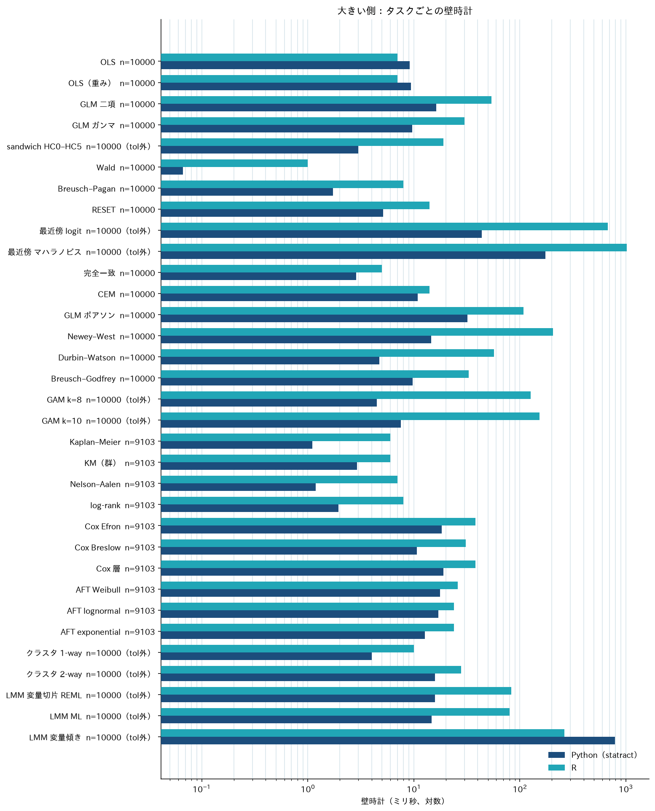
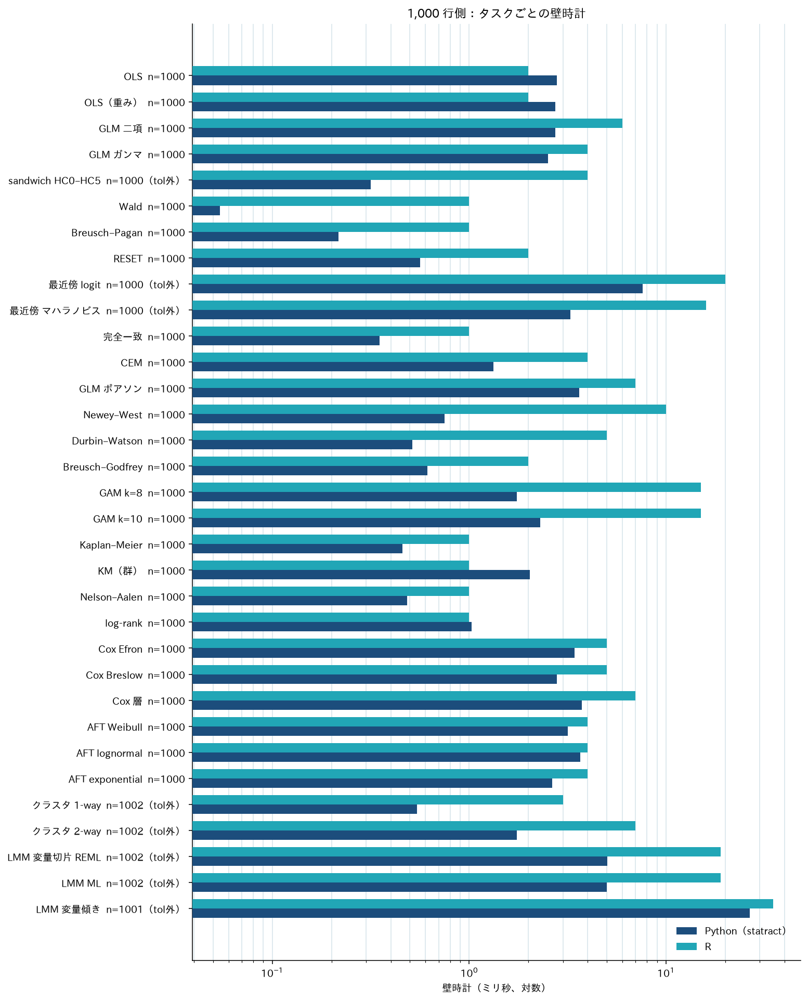

# statract — 速度と R との差

公開データで **同じ表** を Python（このライブラリ）と R に渡し、壁時計と数値差を測った結果。設計・許容差・データの引用は [ベンチマークの設計](benchmark-plan.md)。R 関数の対応は [vs R](vs-r.md)。

**このページの表は 2026-10-05 の再計測。** 出典は [`comparison.csv`](benchmarks/comparison.csv)（`bench/stat/run_all.py` と同じ比較。208 行、68 タスク）。Python は `statract`、R は R 4.3.3 + lme4 1.1.35.1 + survival 3.5.8。ウォームアップ 1 回のあと 5 回の中央値。BLAS / OMP スレッドは 1。混合モデルの Python 側は既定の lme-python（`fit_mixed`）。mixedlm-rs はこの実行では計測していない。

秒は **この VM** の壁時計。R の秒はおおむね 1 ms 刻み。比が空なのは R 側が 0 s と記録されたため。

データは実行時に取得し、リポジトリには入れない。UCI Adult、Bike Sharing、Vanderbilt SUPPORT2、Harvard Dataverse STAR（file 666716）。STAR の取得は User-Agent 付きの HTTPS が必要だった。

## 読み方

| 列 | 意味 |
|----|------|
| 手法 | `bench/stat` のタスク ID |
| n | 切ったあとの行数 |
| Python / R | そのタスクの壁時計 |
| 比 | Python ÷ R。1 未満なら Python が速い |
| vs R | CSV の全チェック。括弧の数は quantity の行数。pass は [vs-r.md](vs-r.md) の許容差 |

`tableone` はこのスイートに入っていない。Fine–Gray も未計測。解析例は [Examples / Gallery](examples.md)。

## スピードの並び

タスクごとの壁時計。棒は [`comparison.csv`](benchmarks/comparison.csv) の `python_s` と `r_s`（ミリ秒、対数軸）。青が Python、青緑が R。どちらもロゴと同じ青から青緑で、数値の成否を色では分けていない。

ラベルの「tol外」は、そのタスクの quantity が許容差の外だったという印である。棒の長さは速度であり、数値比較が成功したという意味ではない。R のタイマーが 0 s の尤度比（大きい側 n=10,000 と 1,000 行側 n=1,000）は対数軸に載せない。秒は下の表にある。

indo の二項 GLMM と mixedlm-rs は再計測していないので、この図には入れていない。indo の記録はページ末尾。

## 大きい側

SUPPORT2 の生存は完全ケース 9,103 行。STAR の変量傾きは生徒単位の別スライス（n=10,000）。

| 手法 | API | n | Python | R | 比 | vs R |
|------|-----|--:|------:|--:|---:|------|
| OLS | `fit_ols` / `lm` | 10000 | 9.17 ms | 7.00 ms | 1.311 | 一致（5） |
| OLS（重み） | `fit_ols(weights=)` / `lm` | 10000 | 9.38 ms | 7.00 ms | 1.341 | 一致（5） |
| GLM 二項 | `fit_glm(binomial)` / `glm` | 10000 | 16.24 ms | 54.00 ms | 0.301 | 一致（3） |
| GLM ガンマ | `fit_glm(gamma)` / `glm` | 10000 | 9.68 ms | 30.00 ms | 0.323 | 一致（2） |
| sandwich HC0–HC5 | `hc_covariance` / `vcovHC` | 10000 | 3.00 ms | 19.00 ms | 0.158 | tol 外（6/6）。最大 cov rel は HC4:cov の 5.127e-06（rtol 1e-8） |
| Wald | `wald_test` / `waldtest` | 10000 | 0.066 ms | 1.000 ms | 0.066 | 一致（2） |
| 尤度比 | `likelihood_ratio_test` / `lrtest` | 10000 | 0.032 ms | 0 s | — | 一致。R のタイマーが 0 |
| Breusch–Pagan | `breusch_pagan_test` / `bptest` | 10000 | 1.72 ms | 8.00 ms | 0.215 | 一致（4） |
| RESET | `ramsey_reset_test` / `resettest` | 10000 | 5.13 ms | 14.00 ms | 0.367 | 一致（2） |
| 最近傍 logit | `match_sample` / `matchit` | 10000 | 43.56 ms | 677.0 ms | 0.064 | **組が不一致**（python 3247 r 3247） |
| 最近傍 マハラノビス | `distance="mahalanobis"` | 10000 | 173.8 ms | 1.024 s | 0.170 | **組が不一致**（python 3247 r 3247） |
| 完全一致 | `method="exact"` | 10000 | 2.85 ms | 5.00 ms | 0.571 | 一致（1） |
| CEM | `method="cem"` | 10000 | 10.87 ms | 14.00 ms | 0.776 | 一致（1） |
| GLM ポアソン | `fit_glm(poisson)` / `glm` | 10000 | 32.13 ms | 108.0 ms | 0.298 | 一致（3） |
| Newey–West | `newey_west_covariance` / `NeweyWest` | 10000 | 14.53 ms | 206.0 ms | 0.071 | 一致（1） |
| Durbin–Watson | `durbin_watson_test` / `dwtest` | 10000 | 4.72 ms | 57.00 ms | 0.083 | 一致（2） |
| Breusch–Godfrey | `breusch_godfrey_test` / `bgtest` | 10000 | 9.71 ms | 33.00 ms | 0.294 | 一致（4） |
| GAM k=8 | `gam` / `mgcv::gam` | 10000 | 4.46 ms | 126.0 ms | 0.035 | tol 外。coef rel 6.702e-04 |
| GAM k=10 | 同上 | 10000 | 7.53 ms | 154.0 ms | 0.049 | tol 外。coef rel 1.610e-05 |
| Kaplan–Meier | `survival_curve` / `survfit` | 9103 | 1.10 ms | 6.00 ms | 0.184 | 一致（3） |
| KM（群） | `survival_curve(by=)` | 9103 | 2.92 ms | 6.00 ms | 0.487 | 一致（3） |
| Nelson–Aalen | `kind="nelson_aalen"` | 9103 | 1.19 ms | 7.00 ms | 0.170 | 一致（3） |
| log-rank | `log_rank` / `survdiff` | 9103 | 1.95 ms | 8.00 ms | 0.244 | 一致（6） |
| Cox Efron | `cox_ph` / `coxph` | 9103 | 18.34 ms | 38.00 ms | 0.483 | 一致（3） |
| Cox Breslow | `ties="breslow"` | 9103 | 10.65 ms | 31.00 ms | 0.344 | 一致（3） |
| Cox 層 | `strata=` | 9103 | 18.97 ms | 38.00 ms | 0.499 | 一致（3） |
| AFT Weibull | `accelerated_failure` / `survreg` | 9103 | 17.62 ms | 26.00 ms | 0.678 | 一致（3） |
| AFT lognormal | 同上 | 9103 | 17.09 ms | 24.00 ms | 0.712 | 一致（3） |
| AFT exponential | 同上 | 9103 | 12.65 ms | 24.00 ms | 0.527 | 一致（3） |
| クラスタ 1-way | `cluster_covariance` / `vcovCL` | 10000 | 4.03 ms | 10.00 ms | 0.403 | tol 外。cov rel 9.408e-05 |
| クラスタ 2-way | 同上 2 列 | 10000 | 15.91 ms | 28.00 ms | 0.568 | tol 外。cov rel 4.290e-05 |
| LMM 変量切片 REML | `fit_mixed` / `lmer` | 10000 | 15.78 ms | 83.00 ms | 0.190 | tol 外。coef rel 4.267e-04、se rel 2.640e-04、re rel 7.605e-04、sigma2 rel 7.529e-05、loglik abs 9.699e-05 |
| LMM ML | `method="ml"` | 10000 | 14.76 ms | 80.00 ms | 0.184 | tol 外。coef rel 4.459e-04、se rel 2.722e-04、re rel 7.865e-04、sigma2 rel 7.825e-05、loglik abs 1.037e-04 |
| LMM 変量傾き | `slopes=` | 10000 | 792.7 ms | 264.0 ms | 3.003 | tol 外。coef rel 1.179e-03、re rel 8.811e-04、loglik abs 8.637e-08 |

HC とクラスタの失敗は、差がゼロではないが多くの場合 10⁻⁷–10⁻⁵ 相対で、計画のサンドイッチ rtol 10⁻⁸ より緩い。Cox / GLM / KM の主結果は許容差内。最近傍マッチは件数は一致し、組が一致しない。LMM は lme-python 対 `lmer` で、係数・分散成分・対数尤度が旧 tol の外に出る。変量傾きの大きい側は Python の方が遅い（比 3.003）。R の `lmer` は変量傾きで `boundary (singular) fit` を出した。

## 1,000 行側

同じタスクの小さいスライス。STAR の小さい側は生徒を切った結果 n=1,002 と n=1,001。

| 手法 | n | Python | R | 比 | vs R |
|------|--:|------:|--:|---:|------|
| OLS | 1000 | 2.79 ms | 2.00 ms | 1.393 | 一致（5） |
| OLS（重み） | 1000 | 2.74 ms | 2.00 ms | 1.368 | 一致（5） |
| GLM 二項 | 1000 | 2.73 ms | 6.00 ms | 0.456 | 一致（3） |
| GLM ガンマ | 1000 | 2.52 ms | 4.00 ms | 0.631 | 一致（2） |
| sandwich HC0–HC5 | 1000 | 0.317 ms | 4.00 ms | 0.079 | tol 外（6/6）。最大 cov rel は HC2:cov の 3.894e-07（rtol 1e-8） |
| Wald | 1000 | 0.054 ms | 1.000 ms | 0.054 | 一致（2） |
| 尤度比 | 1000 | 0.031 ms | 0 s | — | 一致。R のタイマーが 0 |
| Breusch–Pagan | 1000 | 0.217 ms | 1.00 ms | 0.217 | 一致（4） |
| RESET | 1000 | 0.564 ms | 2.00 ms | 0.282 | 一致（2） |
| 最近傍 logit | 1000 | 7.63 ms | 20.00 ms | 0.382 | **組が不一致**（python 330 r 330） |
| 最近傍 マハラノビス | 1000 | 3.27 ms | 16.00 ms | 0.204 | **組が不一致**（python 330 r 330） |
| 完全一致 | 1000 | 0.350 ms | 1.00 ms | 0.350 | 一致（1） |
| CEM | 1000 | 1.33 ms | 4.00 ms | 0.332 | 一致（1） |
| GLM ポアソン | 1000 | 3.61 ms | 7.00 ms | 0.516 | 一致（3） |
| Newey–West | 1000 | 0.750 ms | 10.00 ms | 0.075 | 一致（1） |
| Durbin–Watson | 1000 | 0.514 ms | 5.00 ms | 0.103 | 一致（2） |
| Breusch–Godfrey | 1000 | 0.614 ms | 2.00 ms | 0.307 | 一致（4） |
| GAM k=8 | 1000 | 1.75 ms | 15.00 ms | 0.117 | 一致（4） |
| GAM k=10 | 1000 | 2.29 ms | 15.00 ms | 0.153 | 一致（4） |
| Kaplan–Meier | 1000 | 0.457 ms | 1.00 ms | 0.457 | 一致（3） |
| KM（群） | 1000 | 2.04 ms | 1.000 ms | 2.040 | 一致（3） |
| Nelson–Aalen | 1000 | 0.483 ms | 1.00 ms | 0.483 | 一致（3） |
| log-rank | 1000 | 1.03 ms | 1.00 ms | 1.027 | 一致（6） |
| Cox Efron | 1000 | 3.43 ms | 5.00 ms | 0.685 | 一致（3） |
| Cox Breslow | 1000 | 2.79 ms | 5.00 ms | 0.557 | 一致（3） |
| Cox 層 | 1000 | 3.74 ms | 7.00 ms | 0.535 | 一致（3） |
| AFT Weibull | 1000 | 3.16 ms | 4.00 ms | 0.791 | 一致（3） |
| AFT lognormal | 1000 | 3.68 ms | 4.00 ms | 0.920 | 一致（3） |
| AFT exponential | 1000 | 2.64 ms | 4.00 ms | 0.660 | 一致（3） |
| クラスタ 1-way | 1002 | 0.545 ms | 3.00 ms | 0.182 | tol 外。cov rel 1.504e-05 |
| クラスタ 2-way | 1002 | 1.74 ms | 7.00 ms | 0.249 | tol 外。cov rel 2.298e-06 |
| LMM 変量切片 REML | 1002 | 5.04 ms | 19.00 ms | 0.265 | tol 外。coef rel 1.119e-04、re rel 1.403e-04、sigma2 rel 6.368e-05、loglik abs 4.038e-07 |
| LMM ML | 1002 | 5.01 ms | 19.00 ms | 0.264 | tol 外。coef rel 7.413e-04、se rel 1.445e-04、re rel 9.518e-04、sigma2 rel 4.249e-04、loglik abs 1.994e-05 |
| LMM 変量傾き | 1001 | 26.64 ms | 35.00 ms | 0.761 | tol 外。coef rel 1.421e-04、re rel 5.762e-04、sigma2 rel 1.802e-05、loglik abs 1.118e-07 |

## 未計測

| 手法 | 理由 |
|------|------|
| `tableone` / `write_tableone_artifacts` | `bench/stat` のタスク表に無い |
| `glmm_gpboost` | experimental extra。この実行では入れてない |
| mixedlm-rs | optional extra。この実行では計測していない |
| Fine–Gray / Aalen–Johansen | この 4 データに競合原因コードが無い |
| `plot_survival` など図 | 数値ベンチ対象外 |
| indo の二項 GLMM | 下の 2026-10-04 記録。この VM では再計測していない |

行ごとの quantity は [comparison.csv](benchmarks/comparison.csv)。

## 2026-10-04 の indo 二項 GLMM（再計測していない）

`bench/stat` のタスク表に indo は無い。次の数は 2026-10-04 の記録で、出典は [`indo_glmm_compare.json`](benchmarks/indo_glmm_compare.json)。この VM では再計算していない。

式 `pep ~ indomethacin + age + risk + sod_yes + pdstent_yes + (1 | site)`。Laplace。n=602。

| | lme-python | R `glmer` | 差 |
|--|----------:|----------:|---|
| 壁時計 | 12.85 ms | 113 ms | 比 0.114 |
| インドメタシン OR | 0.4661 | 0.4644 | rel 3.66×10⁻³ |
| 切片 OR | 0.0806 | 0.0785 | rel 2.71×10⁻² |
| クラスタ分散 | 0.2954 | 0.2958 | rel 1.44×10⁻³ |
| 対数尤度 | −217.633 | −217.631 | abs 2.14×10⁻³ |

処置 OR の相対差は約 0.4%。固定効果の最大相対差は `sod_yes`（係数が約 0.01）。
