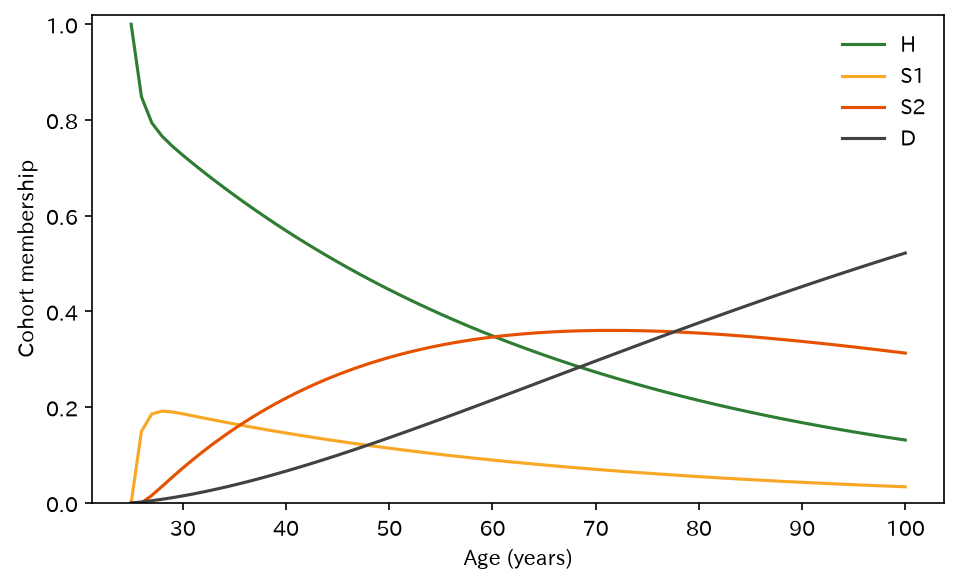
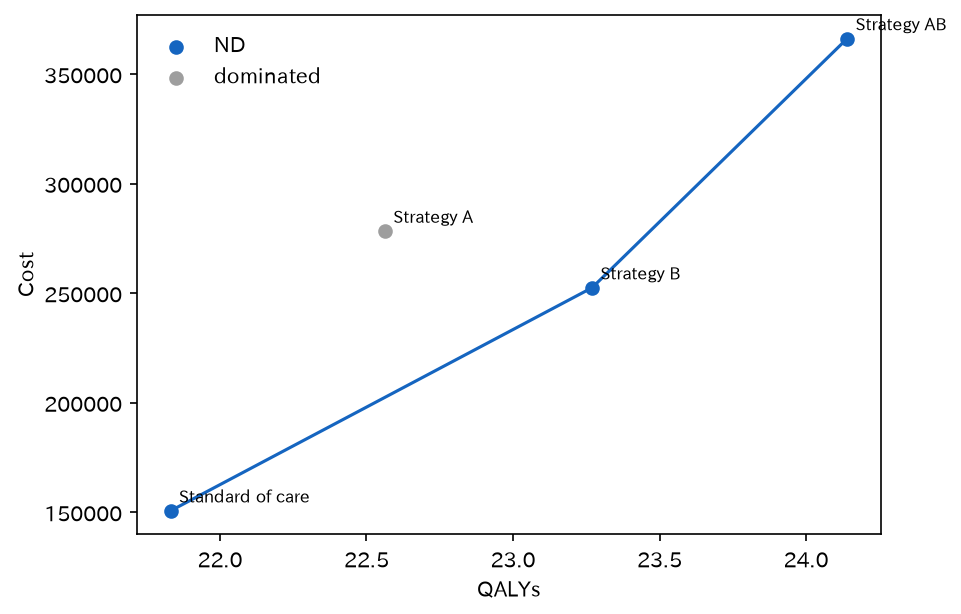
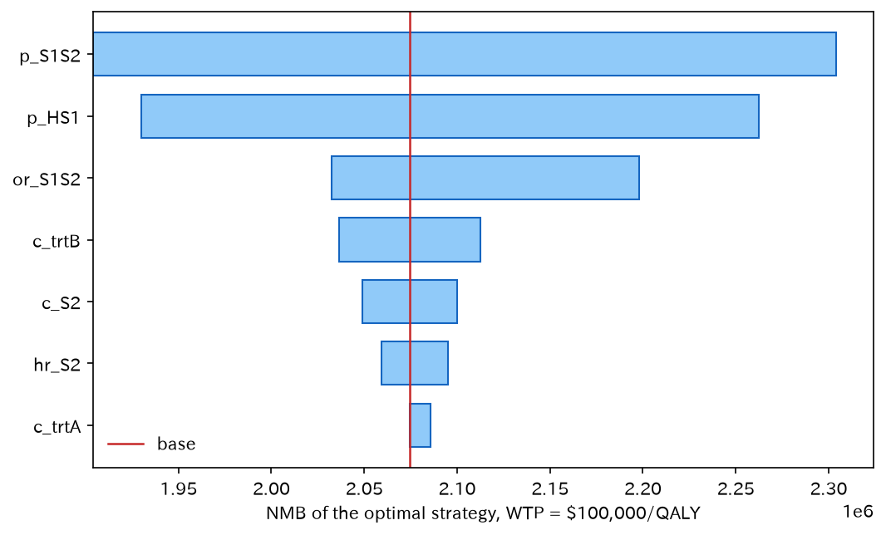
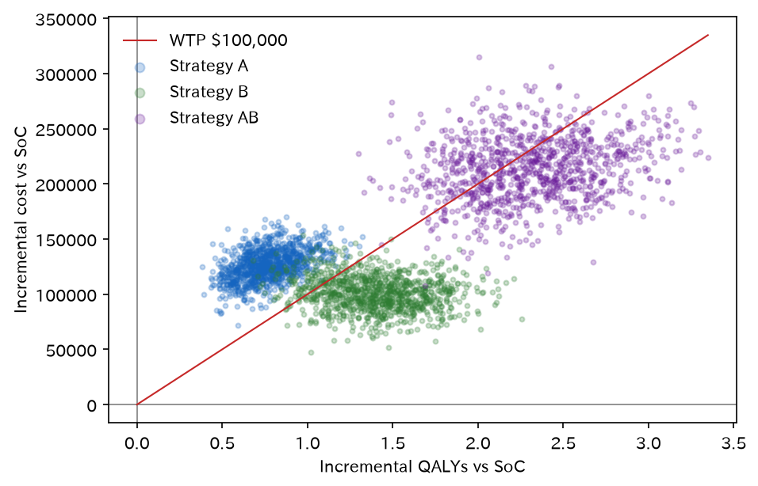
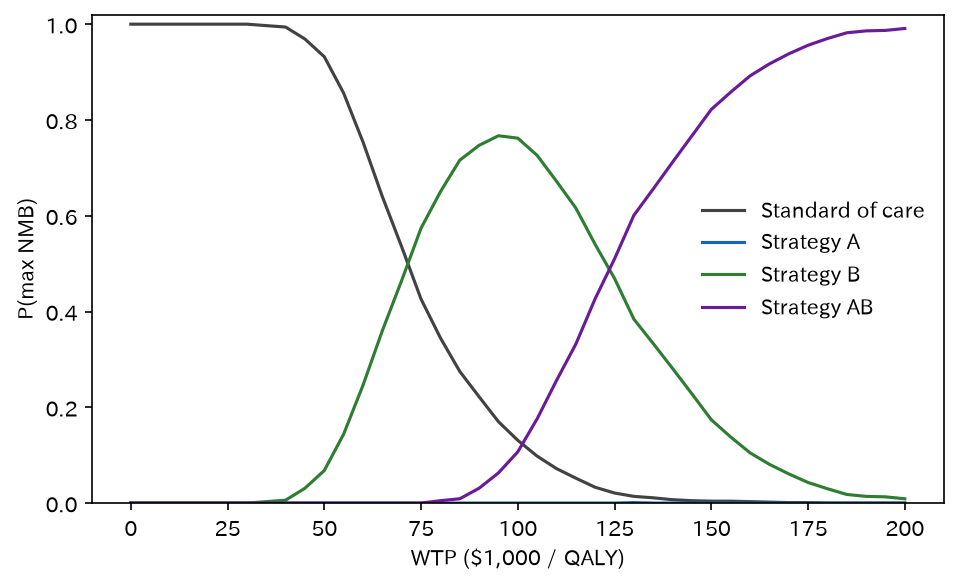
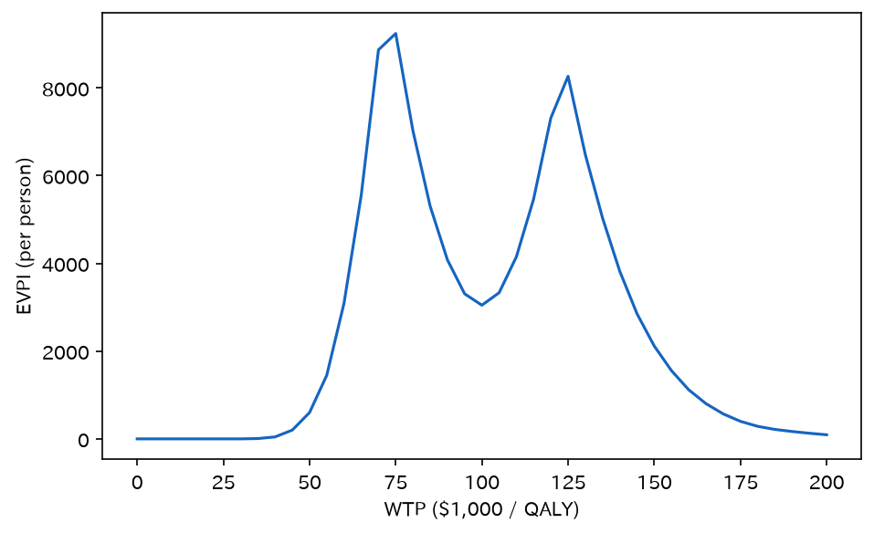

# cea_sicksicker — cohort Markov / ICER / DSA / PSA

`statract.cea` の核（疾患非依存）を、DARTH の仮想疾患 Sick-Sicker で通す例です。病態・費用・効用はライブラリの外（`examples/cea_sicksicker/`）に置きます。

[← ギャラリー](../examples.md) · [実行用ディレクトリ（GitHub）](https://github.com/mizuy/statract/tree/main/examples/cea_sicksicker) · CEA 概要は [cea/overview](../../cea/overview.md) · 配置規約は [ANALYSIS_WORKFLOW.md](https://github.com/mizuy/statract/blob/main/examples/README.md)

## 目的概説

Quickstart の 3 状態合成例を、**引用可能な教学パラメータ**と 4 戦略に置き換えます。見せるのは `simulate_cohort_markov` → `calculate_icers` / NMB → `one_way_dsa` → `run_psa`（`ce_plane` / `ceac` / `evpi`）です。半サイクル補正・遷移報酬・年齢別死亡・tunnels は V1 核に無いので入れません（論文フルモデルとはそこが違う、と明記します）。

## データと列の説明

| 項目 | 内容 |
|------|------|
| ソース | Alarid-Escudero et al. *Med Decis Making* 2023;43(1):3-20. doi:[10.1177/0272989X221103163](https://doi.org/10.1177/0272989X221103163)（OA）。Table 1 の時間一定版。仮想疾患 |
| コード | [DARTH-git/Cohort-modeling-tutorial](https://github.com/DARTH-git/Cohort-modeling-tutorial) |
| 取得 | `build.py` にスカラーをタイプ（**CSV を git に置かない**。PHI / SEER / MIMIC なし） |
| 単位 | 閉じた仮想コホート（患者マイクロデータではない） |

主な入力:

| 名前 | 意味 |
|------|------|
| `p_HS1`, `p_S1H`, `p_S1S2`, `p_HD` | 生存条件つき年次確率 / Healthy 死亡 |
| `hr_S1`, `hr_S2` | S1/S2 死亡のハザード比（対 Healthy） |
| `or_S1S2` | 治療 B の S1→S2 オッズ比 |
| `c_*`, `u_*` | 状態報酬。`c_trtA` / `c_trtB` / `u_trtA` は治療上乗せ |
| `H`, `S1`, `S2`, `D` | 所属トレースの列 |

ライセンス: 論文は OA。数値は教学用の仮想疾患パラメータで、出典を付けて再掲する想定です。臨床データではありません。

## CQ と大まかな解析方針

**CQ** — 25 歳で Healthy の仮想コホートに対し、SoC と比べて治療 A・B・AB はいくらの増分費用対効果か。WTP $100,000/QALY での最適戦略と、決定の不確実性はどうか。

方針:

1. 除外なしの仮想コホート（flowchart なし）。入力表を Table 1 相当にする
2. 4 状態の時間一定 $P$ を example 側で組み、`simulate_cohort_markov` で割引費用・QALY
3. `calculate_icers`（強支配 / 延長支配）と NMB
4. one-way DSA（最適戦略の NMB）と PSA 1000 回

## flowchart / tableone

患者行が無く、開始時は全員 H で除外ゼロです。**`pp.flowchart` / Mermaid / tableone は使いません。** コホート n は仮想の 1 単位（所属の合計 1）。入力スカラーを表にします。

Virtual closed cohort: 100% start in H at age 25; ages 25–100 inclusive (76 cycles); no patient-level inclusion/exclusion.

### 入力パラメータ（Table 1 相当）

=== "表"

    | parameter | base | psa_distribution | source |
    | --- | --- | --- | --- |
    | p_HD | 0.002 | fixed | Alarid-Escudero et al. MDM 2023 Table 1 |
    | p_HS1 | 0.15 | beta(30.0, 170.0) | Alarid-Escudero et al. MDM 2023 Table 1 |
    | p_S1H | 0.5 | beta(60.0, 60.0) | Alarid-Escudero et al. MDM 2023 Table 1 |
    | p_S1S2 | 0.105 | beta(84.0, 716.0) | Alarid-Escudero et al. MDM 2023 Table 1 |
    | hr_S1 | 3 | lognormal(log(3.0), 0.01) | Alarid-Escudero et al. MDM 2023 Table 1 |
    | hr_S2 | 10 | lognormal(log(10.0), 0.02) | Alarid-Escudero et al. MDM 2023 Table 1 |
    | or_S1S2 | 0.6 | lognormal(log(0.6), 0.1) | Alarid-Escudero et al. MDM 2023 Table 1 |
    | c_H | 2000 | gamma(100.0, 20.0) | Alarid-Escudero et al. MDM 2023 Table 1 |
    | c_S1 | 4000 | gamma(177.8, 22.5) | Alarid-Escudero et al. MDM 2023 Table 1 |
    | c_S2 | 1.5e+04 | gamma(225.0, 66.7) | Alarid-Escudero et al. MDM 2023 Table 1 |
    | c_D | 0 | fixed | Alarid-Escudero et al. MDM 2023 Table 1 |
    | c_trtA | 1.2e+04 | gamma(576.0, 20.8) | Alarid-Escudero et al. MDM 2023 Table 1 |
    | c_trtB | 1.3e+04 | gamma(676.0, 19.2) | Alarid-Escudero et al. MDM 2023 Table 1 |
    | u_H | 1 | beta(200.0, 3.0) | Alarid-Escudero et al. MDM 2023 Table 1 |
    | u_S1 | 0.75 | beta(130.0, 45.0) | Alarid-Escudero et al. MDM 2023 Table 1 |
    | u_S2 | 0.5 | beta(230.0, 230.0) | Alarid-Escudero et al. MDM 2023 Table 1 |
    | u_D | 0 | fixed | Alarid-Escudero et al. MDM 2023 Table 1 |
    | u_trtA | 0.95 | beta(300.0, 15.0) | Alarid-Escudero et al. MDM 2023 Table 1 |
    | discount_rate | 0.03 | fixed | Alarid-Escudero et al. MDM 2023 Table 1 (d_c = d_e) |
    | age_start | 25 | fixed | n_age_init = 25 |
    | age_end | 100 | fixed | n_age_max = 100 |

    [CSV](assets/cea_sicksicker/params.csv)

=== "コード"

    ```python
    from support import cache
    from project import project

    @cache(project.cache / "build")
    def build():
        return {"params": param_rows_from_table1()}
    ```

Gamma は R の shape–scale（平均 = shape × scale）です。

## メインの解析方法とそのコア

サイクル $t$（年齢 $a=25+t$）、所属 $m_t$、割引 $\delta=0.03$:

$$
C=\sum_t (1+\delta)^{-t} m_t^\top c,\qquad
Q=\sum_t (1+\delta)^{-t} m_t^\top u,\qquad
m_{t+1}=m_t P.
$$

$P$ は example 側。S1/S2 死亡は $p_{HD}$ を率に変換してハザード比を掛けます。治療 B は $\mathrm{logit}(p_{S1S2})+\log(0.6)$。A は S1 効用を 0.95 にし、S1/S2 に年 $12{,}000$ を足します。AB は併用。NMB $= Q\cdot 100{,}000 - C$。

## 結果

サイト掲載は `assets/cea_sicksicker/`（`cea_sicksicker_out/` から sync）。基本ケースでは **Strategy A が強支配（D）**、frontier は SoC → B → AB です。B vs SoC の ICER は約 $7.081\times 10^4$/QALY、AB vs B は約 $1.307\times 10^5$/QALY。WTP $100{,}000$ では B の NMB が最大です。

### SoC 所属トレース

=== "図"

    

=== "コード"

    ```python
    from statract.cea import simulate_cohort_markov

    soc = simulate_cohort_markov(
        states=("H", "S1", "S2", "D"),
        initial={"H": 1.0},
        ages=range(25, 101),
        transition=P_soc,
        utility={"H": 1.0, "S1": 0.75, "S2": 0.5, "D": 0.0},
        cost={"H": 2000.0, "S1": 4000.0, "S2": 15000.0, "D": 0.0},
        discount_rate=0.03,
        record_trace=True,
    )
    ```

### 基本ケース ICER

=== "表"

    | strategy | cost | effect | incremental_cost | incremental_effect | icer | status | nmb_wtp100k |
    | --- | --- | --- | --- | --- | --- | --- | --- |
    | Standard of care | 1.506e+05 | 21.83 | nan | nan | nan | ND | 2.033e+06 |
    | Strategy B | 2.524e+05 | 23.27 | 1.019e+05 | 1.438 | 7.081e+04 | ND | 2.075e+06 |
    | Strategy AB | 3.662e+05 | 24.14 | 1.138e+05 | 0.8705 | 1.307e+05 | ND | 2.048e+06 |
    | Strategy A | 2.783e+05 | 22.56 | nan | nan | nan | D | 1.978e+06 |

    [CSV](assets/cea_sicksicker/icer.csv)

=== "コード"

    ```python
    from statract.cea import calculate_icers, net_monetary_benefit

    icers = calculate_icers(costs, effects, strategies=list(STRATEGIES))
    nmb = net_monetary_benefit(icers["cost"], icers["effect"], wtp=100_000.0)
    ```

### 費用–効果フロンティア

=== "図"

    

=== "コード"

    ```python
    nd = icers.filter(pl.col("status") == "ND")
    ax.plot(nd["effect"], nd["cost"])
    ```

### One-way DSA（最適戦略の NMB）

WTP $100{,}000$/QALY で 4 戦略のうち最大の NMB。教学レンジ（論文の OWSA 表そのものではない）。

=== "表"

    | parameter | base | low | high | outcome_base | outcome_low | outcome_high | outcome_min | outcome_max | spread |
    | --- | --- | --- | --- | --- | --- | --- | --- | --- | --- |
    | p_S1S2 | 0.105 | 0.05 | 0.16 | 2.075e+06 | 2.304e+06 | 1.904e+06 | 1.904e+06 | 2.304e+06 | 4.003e+05 |
    | p_HS1 | 0.15 | 0.1 | 0.2 | 2.075e+06 | 2.262e+06 | 1.93e+06 | 1.93e+06 | 2.262e+06 | 3.325e+05 |
    | or_S1S2 | 0.6 | 0.4 | 0.8 | 2.075e+06 | 2.198e+06 | 2.033e+06 | 2.033e+06 | 2.198e+06 | 1.654e+05 |
    | c_trtB | 1.3e+04 | 9000 | 1.7e+04 | 2.075e+06 | 2.112e+06 | 2.037e+06 | 2.037e+06 | 2.112e+06 | 7.584e+04 |
    | c_S2 | 1.5e+04 | 1e+04 | 2e+04 | 2.075e+06 | 2.1e+06 | 2.049e+06 | 2.049e+06 | 2.1e+06 | 5.127e+04 |
    | hr_S2 | 10 | 5 | 15 | 2.075e+06 | 2.095e+06 | 2.059e+06 | 2.059e+06 | 2.095e+06 | 3.596e+04 |
    | c_trtA | 1.2e+04 | 8000 | 1.6e+04 | 2.075e+06 | 2.086e+06 | 2.075e+06 | 2.075e+06 | 2.086e+06 | 1.121e+04 |

    [CSV](assets/cea_sicksicker/dsa.csv)

=== "図"

    

=== "コード"

    ```python
    from statract.cea import one_way_dsa, tornado_table

    dsa = one_way_dsa(
        strategies=list(STRATEGIES),
        base_params=BASE_PARAMS,
        ranges=DSA_RANGES,
        evaluate=evaluate,
        outcome="nmb",
        wtp=100_000.0,
    )
    dsa = tornado_table(dsa)
    ```

### PSA（n=1000, seed=2026）

平均費用・効果の ICER も基本ケースと同じく A が D、B vs SoC の ICER は約 $7.234\times 10^4$。WTP $100{,}000$ で CEAC は SoC 0.131、A 0、B 0.762、AB 0.107。同じ WTP の EVPI は約 $3.047\times 10^3$ 人あたり。

=== "図"

    

=== "コード"

    ```python
    from statract.cea import run_psa, ce_plane, ceac, evpi

    psa = run_psa(strategies=list(STRATEGIES), param_draws=draws, evaluate=evaluate)
    plane = ce_plane(psa, comparator="Standard of care")
    ac = ceac(psa, wtp=wtp_grid)
    voi = evpi(psa, wtp=wtp_grid)
    ```

=== "図"

    

    [CEAC CSV](assets/cea_sicksicker/ceac.csv)

=== "図"

    

    [EVPI CSV](assets/cea_sicksicker/evpi.csv) · [PSA 平均 ICER](assets/cea_sicksicker/psa_mean_icer.csv)

## 解釈と解説

基本ケースでは A は B より高くて QALY が少ないので強支配です。WTP $100{,}000$/QALY なら B が NMB 最大（AB の増分 ICER は閾値を超える）。tornado で効くのは進行（`p_S1S2`）と発症（`p_HS1`）、ついで治療 B の OR です。`c_trtA` の spread が小さいのは、このレンジでは最適が B のままだからです。

論文チュートリアルとの差: 年齢別死亡・tunnels・遷移報酬・半サイクルなし。数値を論文の図とビット一致させないでください。役割分担（Markov 核 vs 病態）を見せる教学例です。

## 実行と成果物

```bash
cd examples/cea_sicksicker
task all
```

ローカル分割: [concept](https://github.com/mizuy/statract/blob/main/examples/cea_sicksicker/cea_sicksicker_concept.md) · [protocol](https://github.com/mizuy/statract/blob/main/examples/cea_sicksicker/cea_sicksicker_protocol.md) · [results](https://github.com/mizuy/statract/blob/main/examples/cea_sicksicker/cea_sicksicker_results.md) · [discussion](https://github.com/mizuy/statract/blob/main/examples/cea_sicksicker/cea_sicksicker_discussion.md)
