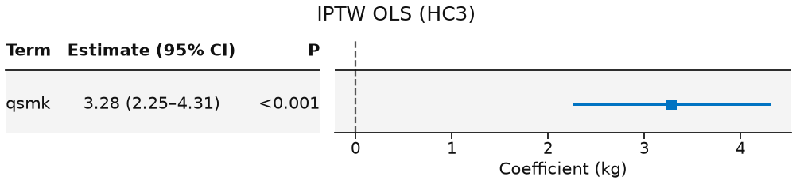
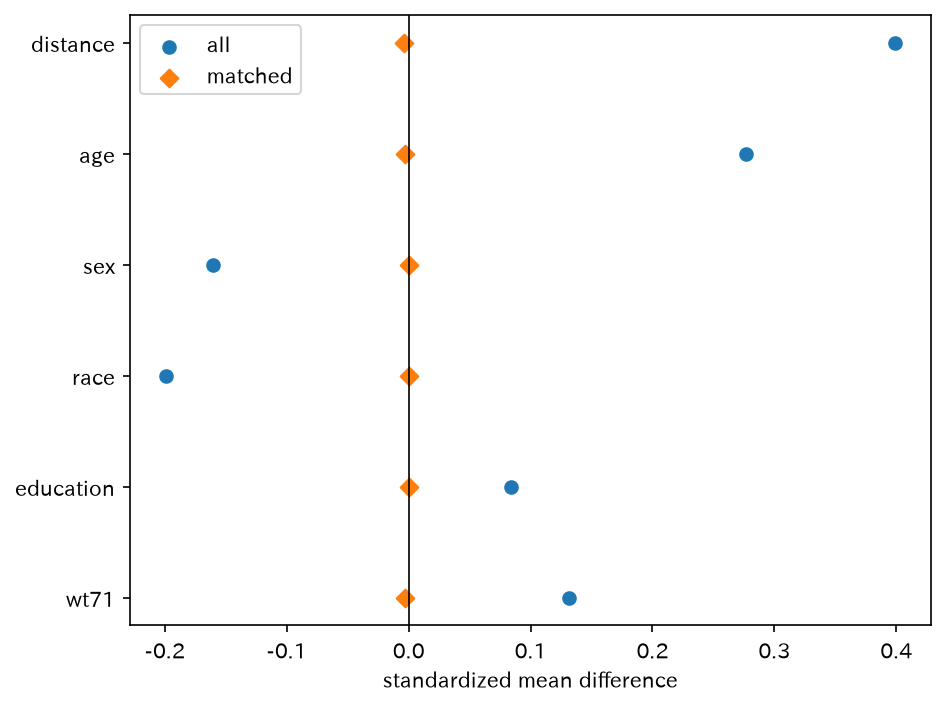

# iptw_nhefs — 安定化 IPTW（ATE）

`psm_rhc` の対。連続アウトカムの安定化 IPTW（ATE のみ）。ライブラリに `iptw()` は無く、重みは例スクリプトの手計算。IPTW OLS の forest まで。

[← ギャラリー](../examples.md) · [実行用ディレクトリと手順（GitHub）](https://github.com/mizuy/statract/tree/main/examples/iptw_nhefs)

## 目的概説

[`psm_rhc`](psm_rhc.md) は 1:1 最近傍の ATT です。ここでは連続アウトカムの **ATE 安定化 IPTW** を、名前付き `iptw()` が無い現状の公開 API（`fit_glm` + 重み列 + `fit_ols` + HC + `plot_forest`）で示すための例です。

## データと列の説明

| 項目 | 内容 |
|------|------|
| ソース | NHEFS（`causaldata` / Rdatasets / Hernán CSV）。**fetch only** |
| 取得 | `build.py` |
| 単位 | 参加者 1 行 |

主な解析列:

| 列 | 意味 |
|----|------|
| `qsmk` | 追跡中の禁煙 1、継続喫煙 0 |
| `wt82_71` | 1982−1971 の体重変化（kg） |
| `age`, `sex`, `race`, `education`, `smokeintensity`, `smokeyrs`, `exercise`, `active`, `wt71` | PS 共変量 |
| `ps`, `sw`, `sw_trunc` | 傾向スコアと安定化重み（上限 10） |

## CQ と大まかな解析方針

**CQ** — NHEFS で 1971 年に喫煙していた人が 1982 年までに禁煙したこと（`qsmk`）は、交絡を安定化 IPTW で調整した平均で、追跡時の体重変化（`wt82_71`）を何 kg 変えるか。

方針:

1. flowchart で曝露・アウトカム・PS 共変量の完全例を確定
2. Table 1（`hue=qsmk`）
3. PS 二項 GLM → 安定化 ATE 重み（上限 10）→ 重み付き OLS + HC3 + `plot_forest(..., layout="table")`
4. 感度: CEM の `balance` / `love_plot` のみ（第二推定対象にしない）

## flowchart / tableone

### Flowchart

| 段 | flowchart キー | 対応基準 |
|----|----------------|----------|
| 曝露とアウトカム | `Quit indicator and weight change present` | `qsmk` / `wt82_71` 非欠損 |
| 共変量 | `Complete propensity covariates` | PS 共変量すべて非欠損 |

=== "図"

    ```mermaid
    flowchart TB
      classDef keep fill:#e8f5e9,stroke:#2e7d32,color:#111
      classDef drop fill:#f5f5f5,stroke:#9e9e9e,color:#333
      A["1,629 rows"]:::keep
      B["1,566 rows"]:::keep
      X1["not Quit indicator and weight change present<br/>excluded: 63 rows"]:::drop
      C["Analysis cohort<br/>1,566 rows"]:::keep
      X2["not Complete propensity covariates<br/>excluded: 0 rows"]:::drop
      A --> B
      A -.-> X1
      B --> C
      B -.-> X2
    ```

    同一内容は `assets/iptw_nhefs/mermaid_flowchart.md`（`iptw_nhefs_out/` から sync）。

=== "コード"

    ```python
    import io
    import polars as pl
    from statract.reporting import mermaid_flowchart
    from statract.reporting import markdown_flowchart

    buf = io.StringIO()
    cohort = target.pp.flowchart(
        {
            "Quit indicator and weight change present": (
                pl.col("qsmk").is_not_null() & pl.col("wt82_71").is_not_null()
            ),
            "Complete propensity covariates": pl.all_horizontal(
                [pl.col(c).is_not_null() for c in covs]
            ),
        },
        out=buf,
    )
    flow_text = buf.getvalue()
    markdown_flowchart(flow_text)
    mermaid_flowchart(flow_text, final_label="Analysis cohort")
    ```

### Table 1

=== "コード"

    ```python
    from statract import agg_category, agg_mean_sd, tableone

    params = {
        "Age": ("age", agg_mean_sd),
        "Sex": ("sex", agg_category),
        "Race": ("race", agg_category),
        "Education": ("education", agg_category),
        "Cigarettes/day (1971)": ("smokeintensity", agg_mean_sd),
        "Years smoked": ("smokeyrs", agg_mean_sd),
        "Exercise": ("exercise", agg_category),
        "Activity": ("active", agg_category),
        "Weight 1971 (kg)": ("wt71", agg_mean_sd),
        "Weight change (kg)": ("wt82_71", agg_mean_sd),
    }
    gt = tableone(cohort, params, hue="qsmk", add_all=True, add_pvalue=True)
    # CSV/HTML/md を *_out/ に書くときだけ write_tableone_artifacts（ギャラリー同期用）
    ```

## メインの解析方法とそのコア

傾向スコア $\pi(x)=P(A=1\mid X=x)$ を二項 GLM。安定化 ATE 重み

$$
W=\frac{A\,P(A=1)}{\pi(X)}+\frac{(1-A)\,P(A=0)}{1-\pi(X)},
$$

$W$ を 10 で切り詰め。アウトカムモデル $E[Y\mid A]$ は重み付き OLS。分散は HC3。推定対象は ATE のみ（ATT ブランチは作らない）。係数 forest は `plot_forest(..., layout="table")`（論文用白黒は `style="bw"`）。


## 結果

完全例 n=1566。サイト掲載は `assets/iptw_nhefs/`。

### IPTW 重み要約

=== "表"

    | min | median | mean | max | n_capped | n |
    | --- | --- | --- | --- | --- | --- |
    | 0.3345 | 0.961 | 0.9984 | 3.487 | 0 | 1566 |

    [CSV](assets/iptw_nhefs/iptw_weight_summary.csv)

=== "コード"

    ```python
    # 安定化重み（例スクリプトと同じ手計算）
    qsmk = cohort["qsmk"].to_numpy().astype(float)
    p_a = float(np.nanmean(qsmk))
    sw = np.where(qsmk == 1.0, p_a / ps_col, (1.0 - p_a) / (1.0 - ps_col))
    sw_trunc = np.clip(sw, 0.0, WEIGHT_CAP)
    weighted = cohort.with_columns(
        pl.Series("ps", ps_col),
        pl.Series("sw", sw),
        pl.Series("sw_trunc", sw_trunc),
    ).filter(pl.col("sw_trunc").is_not_null() & pl.col("sw_trunc").is_finite())
    ```

### OLS（未調整）

=== "表"

    | term | estimate | std_error | statistic | p_value | conf_low | conf_high |
    | --- | --- | --- | --- | --- | --- | --- |
    | (Intercept) | 1.984 | 0.2288 | 8.672 | 0 | 1.536 | 2.433 |
    | qsmk | 2.541 | 0.4511 | 5.632 | 2.106e-08 | 1.656 | 3.425 |

    [CSV](assets/iptw_nhefs/ols_unadjusted.csv)

=== "コード"

    ```python
    from statract import fit_ols

    unadj = fit_ols(cohort, "wt82_71 ~ qsmk")
    unadj_tidy = unadj.tidy()
    ```

### IPTW + HC3

=== "表"

    | term | estimate | std_error | statistic | p_value | conf_low | conf_high |
    | --- | --- | --- | --- | --- | --- | --- |
    | (Intercept) | 1.789 | 0.2223 | 8.05 | 0 | 1.353 | 2.225 |
    | qsmk | 3.28 | 0.523 | 6.272 | 4.608e-10 | 2.254 | 4.306 |

    [CSV](assets/iptw_nhefs/ols_iptw_hc3.csv)

=== "コード"

    ```python
    from statract import fit_ols, hc_covariance

    iptw = fit_ols(weighted, "wt82_71 ~ qsmk", weights="sw_trunc")
    iptw.covariance = hc_covariance(iptw, kind="HC3")
    iptw_hc = iptw.tidy()
    ```

### IPTW OLS forest（HC3）

=== "図"

    

=== "コード"

    ```python
    from statract import plot_forest

    plot_forest(
        iptw_hc,
        out / "figures" / "ols_iptw_forest.png",
        title="IPTW OLS (HC3)",
        xlabel="Coefficient (kg)",
        layout="table",
    )
    ```

### 感度: CEM Love plot

=== "図"

    

=== "コード"

    ```python
    from statract import match_sample

    matched = match_sample(cohort, "qsmk", cem_covs, method="cem")
    fig = matched.love_plot()
    fig.savefig(out / "figures" / "cem_love.png", dpi=150, bbox_inches="tight")
    # アウトカム回帰はしない（第二推定対象にしない）
    ```

## 解釈と解説

安定化 IPTW（ATE、上限 10、実際に cap された重みは 0、HC3）では禁煙の体重変化差は約 **+3.28 kg**（95% CI 約 2.25–4.31）。未調整は約 +2.54 kg。「禁煙後に体重が増える」方向は教科書の NHEFS 例と一致します。ライブラリに `iptw()` は無く、重みは例スクリプトの手計算です。教学 reproductions であり、禁煙指導の体重効果の確定推定ではありません。

限界: ATT は出していない。CEM はバランス感度（実装が ATT 風の重みなので因果効果として読まない）。Positivity・切り詰め・未測定交絡。fetch-only データ。

## 実行と成果物

```bash
cd examples/iptw_nhefs
task all
```

既存の付随文書: [concept](https://github.com/mizuy/statract/blob/main/examples/iptw_nhefs/iptw_nhefs_concept.md) · [protocol](https://github.com/mizuy/statract/blob/main/examples/iptw_nhefs/iptw_nhefs_protocol.md) · [results](https://github.com/mizuy/statract/blob/main/examples/iptw_nhefs/iptw_nhefs_results.md) · [discussion](https://github.com/mizuy/statract/blob/main/examples/iptw_nhefs/iptw_nhefs_discussion.md)
