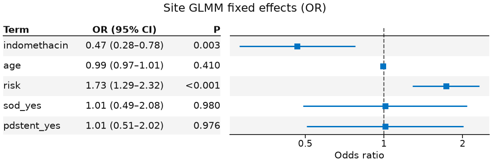
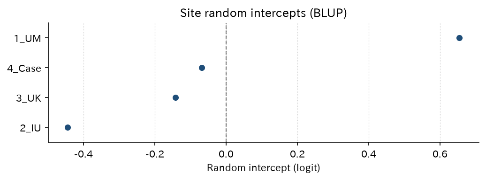
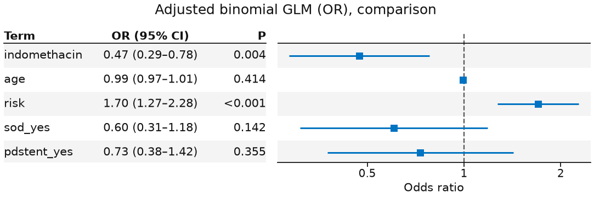

# logit_indo — 施設 GLMM / MOR / 固定効果比較

内視鏡テーマの多施設 RCT。主解析は `site` 変量切片の二項 GLMM（`fit_mixed(..., family="binomial")`、エンジンは lme-python）。施設 BLUP・median odds ratio（MOR）と、固定効果二項 GLM の比較を載せます。効果推定の例なのでホールドアウト較正 / DCA は使いません。

[← ギャラリー](../examples.md) · [実行用ディレクトリ（GitHub）](https://github.com/mizuy/statract/tree/main/examples/logit_indo) · 配置規約は [ANALYSIS_WORKFLOW.md](https://github.com/mizuy/statract/blob/main/examples/README.md)

## 目的概説

内視鏡ライブラリの主題に近い公開 RCT で、施設クラスタを変量切片に入れた二項 GLMM を主解析として見せるための例です。無作為化 RCT でも施設差の異質性を MOR と BLUP で要約し、同じ共変量の固定効果 GLM を比較対照に置きます。予測モデル向けのホールドアウト較正はこの例の対象外です。

## データと列の説明

| 項目 | 内容 |
|------|------|
| ソース | `medicaldata::indo_rct`（MIT + Elmunzer NEJM 2012 引用）、n=602、4 施設 |
| 取得 | `build.py`（R `medicaldata`、否则 Rdatasets CSV） |
| 単位 | 参加者 1 行。**除外なし（全例解析）** |

主な解析列:

| 列 | 意味 |
|----|------|
| `outcome` / `pep` | PEP（`0_no`/`1_yes` → 0/1） |
| `rx` / `indomethacin` | 割付（プラセボ / インドメタシン）。解析は 0/1 |
| `age`, `risk` | 調整共変量 |
| `sod_yes`, `pdstent_yes` | あれば調整に追加 |
| `site` | 施設（変量切片グループ） |

## CQ と大まかな解析方針

**CQ** — ERCP 時の直腸インドメタシン 100 mg は、プラセボと比べ post-ERCP pancreatitis（PEP）を減らすか。施設を変量切片にした GLMM では固定効果 OR はどうか。施設間異質性（MOR）はどの程度か。

方針:

1. 全例（n=602）で Table 1（`hue=rx`）。除外が無いので flowchart は置かない
2. **主**: `fit_mixed("pep ~ ... + (1 | site)", family="binomial")` + `plot_forest(..., layout="table")` + 施設 BLUP（`plot_random_effects`）+ MOR（`median_odds_ratio`）
3. **比較**: 同じ共変量の未調整・調整二項 GLM（固定効果のみ）

## flowchart / tableone

解析セットは teaching データの全 602 行で、欠損による除外はありません。ギャラリー方針どおり **flowchart / Mermaid は省略**します。

### Table 1

=== "コード"

    ```python
    from statract import agg_category, agg_mean_sd, tableone

    params = {
        "Age (years)": ("age", agg_mean_sd),
        "Risk score": ("risk", agg_mean_sd),
        "Gender": ("gender", agg_category),
        "Site": ("site", agg_category),
        "SOD": ("sod", agg_category),
        "PD stent": ("pdstent", agg_category),
        "PEP": ("outcome", agg_category),
    }
    gt = tableone(cohort, params, hue="rx", add_all=True, add_pvalue=True)
    # CSV/HTML/md を *_out/ に書くときだけ write_tableone_artifacts（ギャラリー同期用）
    ```

完全な Table 1 CSV はローカル `logit_indo_out/table1.csv`（`task all` で再生成）。

## メインの解析方法とそのコア

PEP 確率 $\pi$。主解析（施設 $j$）:

$$
\operatorname{logit}(\pi_{ij})=\beta_0+\beta_1\mathrm{indomethacin}_{ij}+\beta^\top z_{ij}+u_j,\quad u_j\sim N(0,\sigma^2)
$$

$z$ は年齢、リスクスコア、（あれば）SOD・膵管ステント。実装は `fit_mixed(..., family="binomial")`（lme-python `glmer`）。固定効果 OR は `plot_forest(..., layout="table")`（論文用白黒は `style="bw"`）。

**Median odds ratio**（Larsen et al.）はクラスタ分散 $\sigma^2$ から

$$
\mathrm{MOR}=\exp\bigl(\sqrt{2\sigma^2}\,\Phi^{-1}(0.75)\bigr)
$$

で求めます（ライブラリ関数 `median_odds_ratio`）。施設 BLUP は `glmm_random_effects` → `plot_random_effects`。

比較の固定効果モデル:

$$
\operatorname{logit}(\pi_i)=\beta_0+\beta_1\mathrm{indomethacin}_i+\beta^\top z_i
$$

（`fit_glm(..., family="binomial")`）。ホールドアウト較正 / DCA は予測モデル用であり、本例では使いません。


## 結果

n=602（全例）。サイト掲載は `assets/logit_indo/`。表の数値は `task all` の成果物と同一です。

### 施設変量 GLMM（主解析、`fit_mixed` binomial）

=== "表"

    | term | estimate | std_error | exp_estimate | exp_conf_low | exp_conf_high | p_value |
    | --- | --- | --- | --- | --- | --- | --- |
    | (Intercept) | -2.518 | 0.7687 | 0.0806 | 0.0179 | 0.364 | 0.00105 |
    | indomethacin | -0.7634 | 0.2605 | 0.466 | 0.280 | 0.777 | 0.00339 |
    | age | -0.00815 | 0.00989 | 0.992 | 0.973 | 1.011 | 0.410 |
    | risk | 0.5467 | 0.1504 | 1.728 | 1.286 | 2.320 | 0.000278 |
    | sod_yes | 0.00924 | 0.3680 | 1.009 | 0.491 | 2.076 | 0.980 |
    | pdstent_yes | 0.0106 | 0.3522 | 1.011 | 0.507 | 2.015 | 0.976 |

    [CSV](assets/logit_indo/glmm_tidy.csv)

=== "コード"

    ```python
    from statract import fit_mixed, plot_forest

    mixed = fit_mixed(
        glm_df,
        "pep ~ indomethacin + age + risk + sod_yes + pdstent_yes + (1 | site)",
        family="binomial",
    )
    tidy = mixed.tidy(exponentiate=True)
    plot_forest(
        tidy,
        out / "figures" / "glmm_fixed_forest.png",
        title="Site GLMM fixed effects (OR)",
        xlabel="Odds ratio",
        layout="table",
    )
    ```

### GLMM 固定効果 forest（OR）

=== "図"

    

=== "コード"

    ```python
    from statract import plot_forest

    plot_forest(
        tidy,
        out / "figures" / "glmm_fixed_forest.png",
        title="Site GLMM fixed effects (OR)",
        xlabel="Odds ratio",
        layout="table",
    )
    ```

### 施設変量効果（BLUP）

=== "図"

    

=== "表"

    | group | blup | n |
    | --- | --- | --- |
    | 2_IU | -0.444 | 413 |
    | 3_UK | -0.142 | 22 |
    | 4_Case | -0.068 | 3 |
    | 1_UM | 0.654 | 164 |

    [CSV](assets/logit_indo/glmm_random_effects.csv)

=== "コード"

    ```python
    from statract import glmm_random_effects, plot_random_effects

    re = glmm_random_effects(mixed, glm_df.select("site"))
    plot_random_effects(
        re,
        out / "figures" / "glmm_site_blups.png",
        title="Site random intercepts (BLUP)",
        xlabel="Random intercept (logit)",
    )
    ```

### Median odds ratio（MOR）

=== "表"

    | variance | median_odds_ratio |
    | --- | --- |
    | 0.2954 | 1.679 |

    [CSV](assets/logit_indo/glmm_mor.csv)

=== "コード"

    ```python
    from statract import median_odds_ratio

    mor = median_odds_ratio(mixed)
    ```

MOR はライブラリ API（`statract.median_odds_ratio`）です。例スクリプト内の手計算ではありません。

### 二項 GLM（比較、未調整 OR）

=== "表"

    | term | estimate | std_error | exp_estimate | exp_conf_low | exp_conf_high | p_value |
    | --- | --- | --- | --- | --- | --- | --- |
    | (Intercept) | -1.590 | 0.1522 | 0.204 | 0.151 | 0.275 | 1.47e-25 |
    | indomethacin | -0.7051 | 0.2528 | 0.494 | 0.301 | 0.811 | 0.00529 |

    [CSV](assets/logit_indo/glm_unadjusted.csv)

=== "コード"

    ```python
    from statract import fit_glm

    unadj = fit_glm(glm_df, "pep ~ indomethacin", family="binomial")
    unadj_tidy = unadj.tidy(exponentiate=True)
    ```

### 二項 GLM（比較、調整 OR）

=== "表"

    | term | estimate | std_error | exp_estimate | exp_conf_low | exp_conf_high | p_value |
    | --- | --- | --- | --- | --- | --- | --- |
    | (Intercept) | -1.884 | 0.6601 | 0.152 | 0.0417 | 0.554 | 0.00431 |
    | indomethacin | -0.7502 | 0.2572 | 0.472 | 0.285 | 0.782 | 0.00353 |
    | age | -0.00793 | 0.00970 | 0.992 | 0.973 | 1.011 | 0.414 |
    | risk | 0.5321 | 0.1484 | 1.703 | 1.273 | 2.277 | 0.000337 |
    | sod_yes | -0.503 | 0.3428 | 0.605 | 0.309 | 1.184 | 0.142 |
    | pdstent_yes | -0.314 | 0.3398 | 0.730 | 0.375 | 1.422 | 0.355 |

    [CSV](assets/logit_indo/glm_adjusted.csv)

=== "コード"

    ```python
    adj = fit_glm(
        glm_df,
        "pep ~ indomethacin + age + risk + sod_yes + pdstent_yes",
        family="binomial",
    )
    adj_tidy = adj.tidy(exponentiate=True)
    ```

### 調整 GLM forest（比較）

=== "図"

    

=== "コード"

    ```python
    from statract import plot_forest

    plot_forest(
        adj_tidy,
        out / "figures" / "glm_adjusted_forest.png",
        title="Adjusted binomial GLM (OR), comparison",
        xlabel="Odds ratio",
        layout="table",
    )
    ```

## 解釈と解説

施設変量 GLMM（全例 n=602）ではインドメタシンの固定効果オッズ比は約 **0.47**（95% CI 約 0.28–0.78）。クラスタ分散は約 **0.30**、median odds ratio（MOR）は約 **1.68**。施設 BLUP は `1_UM` が正（PEP オッズが高い方向）、`2_IU` が負。同じ共変量の固定効果調整 GLM の OR は約 **0.47** で向きは一致します。

限界: lme-python の二項 GLMM は lme4 `glmer` の endolab fixture 対象外（許容差はガウス LMM より緩い）。教学パッケージデータです。較正 / DCA のホールドアウトは予測モデル向けであり、本例の効果推定には使いません。

## 実行と成果物

```bash
cd examples/logit_indo
task all
```

ワークフロー分割版: [concept](https://github.com/mizuy/statract/blob/main/examples/logit_indo/logit_indo_concept.md) · [protocol](https://github.com/mizuy/statract/blob/main/examples/logit_indo/logit_indo_protocol.md) · [results](https://github.com/mizuy/statract/blob/main/examples/logit_indo/logit_indo_results.md) · [discussion](https://github.com/mizuy/statract/blob/main/examples/logit_indo/logit_indo_discussion.md)
