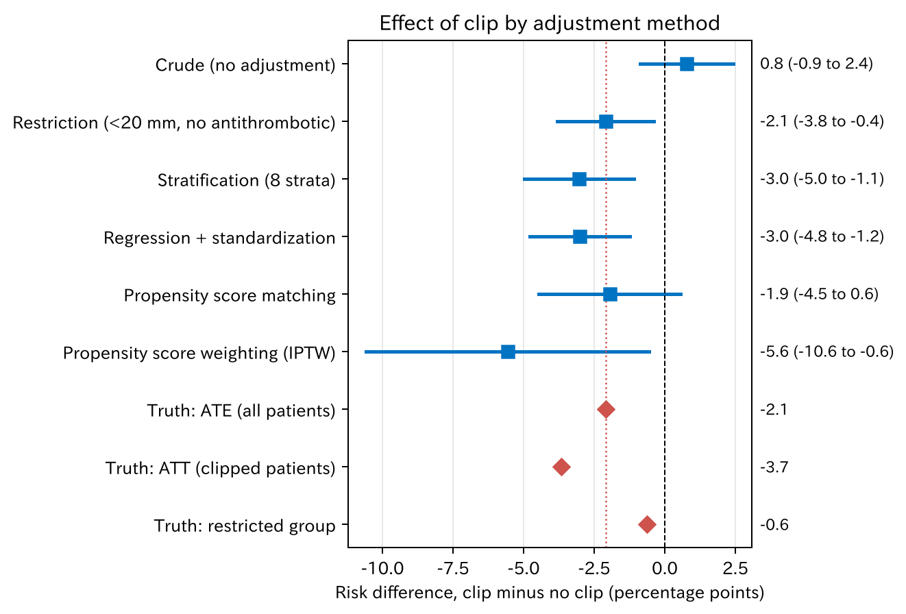

# 3. 背景を調整する方法

第 2 章で、調整する変数は DAG（directed acyclic graph、有向非巡回グラフ）で選ぶと述べました。この章では、選んだ変数で**どう調整するか**を見ます。方法は大きく五つあります。同じデータに五つすべてを使い、本当の値と比べます。

[← 目次](index.md) · [← 第 2 章](causal-basics.md)

## 3.1 五つの方法 {#overview}

| 方法 | 何をするか | いつ行うか | 推定するもの |
|------|------------|------------|--------------|
| 限定 | 対象を特定の患者だけに絞る | 計画（対象の選び方） | 絞った集団での効果 |
| 層別化 | 似た患者の層に分け、層の中で比べて、あとで合わせる | 解析 | ATE（average treatment effect、平均処置効果）など（合わせ方による） |
| 回帰 | アウトカムのモデルに交絡因子を入れる | 解析 | 条件付き効果。標準化すれば ATE |
| マッチング | 背景の似た相手どうしを組にする | 解析（計画でも） | 多くは ATT（average treatment effect on the treated、処置群での平均処置効果） |
| 重み付け | 重みをかけて、背景のそろった仮の集団を作る | 解析 | ATE、ATT など |

マッチング、層別化、重み付けは、交絡因子そのものでも、**傾向スコア**（第 4 章）でも行えます。回帰に傾向スコアを入れる方法もあります。

どの方法も、根本の仮定は同じで、**測った変数で調整すれば交換可能になる**というものです（第 2 章）。測っていない交絡因子は、どの方法でも取り除けません。

### 反事実モデルから見ると {#counterfactual-view}

第 2 章の表のように、患者ごとに $Y(1)$ と $Y(0)$ の 2 列を書くと、どの患者も片方が空欄です。知りたいのは $\mathrm{E}[Y(1)]$ と $\mathrm{E}[Y(0)]$ でした。五つの方法は、**この空欄の埋め方**の違いです。

| 方法 | 空欄の埋め方 |
|------|-------------|
| 限定 | 交換可能と言える狭い集団に絞り、反対側の群の平均で埋める |
| 層別化 | 同じ層の、反対側の群の平均で埋める。そのあと層の大きさで平均する |
| 回帰（標準化） | モデルで一人ずつ $Y(1)$ と $Y(0)$ を予測して埋める |
| マッチング | 組にした相手の実際の結果で、本人の空欄を埋める |
| 重み付け | 埋めずに、見えている人に重みをかけて全体を代表させる |

どれも「背景 $X$ が同じなら、反対側の群の結果を自分の反事実の代わりに使ってよい」という仮定（条件付き交換可能性）に立っています。

式で見ても同じものを推定しています。層別化と回帰の標準化は、どちらも次の式の推定です。

$$
\mathrm{E}[Y(1)] = \sum_{x} \mathrm{E}[Y \mid A = 1, X = x] \, P(X = x)
$$

「$X = x$ の人たちでクリップした人の出血割合」を、全体での $X$ の分布で平均しています。これを **g-formula** と呼びます。層別化は $X$ を層に分けてこの式を計算し、回帰は $\mathrm{E}[Y \mid A = 1, X = x]$ をモデルで求めてこの式を計算します。マッチングは、空欄を「近い人の結果」で埋める方法です。重み付けも同じ量を推定しますが、道すじが違います。これは傾向スコアを紹介したあと、[第 5 章](iptw.md#g-formula)で見ます。

## 3.2 同じデータで比べる {#compare}

調整する変数は、DAG から選んだ年齢、抗血栓薬、病変径、近位結腸です。

=== "図"

    

    [CSV](../examples/assets/theory_bleeding/ch3_methods.csv)

=== "コード"

    ```python
    from statract import fit_glm, hc_covariance, match_sample, propensity_weights, standardize_glm

    covs = ["age", "antithrombotic", "size_mm", "proximal"]

    # 回帰 + 標準化
    std = standardize_glm(df, "bleed ~ clip + " + " + ".join(covs), values={"clip": [0, 1]})
    std.tidy(contrast="difference", reference=0)

    # 傾向スコアマッチング（第 4 章）
    matched = match_sample(df, "clip", covs, caliper=0.2)

    # 傾向スコアによる重み付け（第 5 章）
    ipw = propensity_weights(df, "clip ~ " + " + ".join(covs), estimand="ATE")
    ```

赤い点線は本当の ATE（この 3000 人での値、−2.1 ポイント。[第 2 章](causal-basics.md)）、赤い菱形は本当の値です。

- 調整なしでは +0.8 で、向きが逆です。
- 調整すると、どの方法でも出血を減らす向きになります。
- 推定値は方法ごとにばらつきます。これは方法の違い、推定する対象（ATE か ATT か）の違い、偶然が重なったものです。区間はどれも広く、出血 136 例のデータで言えることには限りがあります。

以下、方法ごとに見ます。

## 3.3 限定 {#restriction}

20 mm 未満で抗血栓薬なしの患者だけに絞ると、交絡因子のうち病変径（の大小）と抗血栓薬はほぼそろいます。推定値は −2.1 ポイント（95% 信頼区間 −3.8–−0.4）でした。

限定はわかりやすい方法です。ただし、絞った中にも交絡は残ります。絞った 1760 人でも病変径は 5–19 mm の幅があり、平均はクリップ群 12.5 mm、なし群 11.5 mm でした。絞っていない部位も、近位結腸の割合がクリップ群 68%、なし群 55% と違います。また、答えは「絞った集団での効果」になります。この集団での本当の値は −0.6 ポイントで、全体（−2.1）とも、クリップがよく効く大きい病変とも違います。さらに、絞るほど例数が減ります。

## 3.4 層別化 {#stratification}

病変径（20 mm 未満 / 以上）、抗血栓薬（なし / あり）、部位（遠位 / 近位）で 8 つの層に分けます。層ごとにクリップの有無で出血割合を比べ、層の大きさで重み付けて平均します。

$$
\widehat{\text{ATE}} = \sum_{s} \frac{n_s}{n} \left( \hat p_{1s} - \hat p_{0s} \right)
$$

$n_s$ は層 $s$ の人数、$\hat p_{1s}$ と $\hat p_{0s}$ はその層でのクリップあり・なしの出血割合です。推定値は −3.0 ポイント（95% 信頼区間 −5.0–−1.1）でした。

[層ごとの表 CSV](../examples/assets/theory_bleeding/ch3_strata.csv)

層ごとの差をどの集団の割合で平均するかで、推定するものが変わります。下の図で対象集団を選んでみてください。全員の割合で平均すると ATE の推定値（−3.0 ポイント）、クリップ群の割合で平均すると ATT の推定値（−4.4 ポイント、本当の値は −3.7）になります。クリップ群には「20 mm 以上、抗血栓薬あり、近位」の層が多く含まれます。この層の差（−17.7 ポイント）は、クリップなしの 6 人から計算した不安定な値です。

<div class="sx-widget" data-widget="standardization">この図を動かすには JavaScript が必要です。</div>

層別化は考え方が素直で、層ごとの結果をそのまま見せられます。弱点は二つあります。

- **層が足りない**。年齢や病変径の細かい違いは、層の中に残ります。
- **層が多すぎる**。変数を増やすと層は掛け算で増えます。このデータでも、「20 mm 以上、抗血栓薬あり、近位」の層ではクリップなしが 6 人しかいません。変数が 10 個あれば、ほとんどの層は空になります。

## 3.5 回帰 {#regression}

アウトカム（出血）のロジスティック回帰に、クリップと交絡因子を入れます。

$$
\log \frac{p}{1-p} = \beta_0 + \beta_1 \cdot \text{クリップ} + \beta_2 \cdot \text{年齢} + \cdots
$$

$e^{\beta_1}$ は「他の変数を固定したときの」オッズ比です（条件付き効果）。第 1 章の 0.47 がこれでした。

全体での効果（ATE）がほしいときは、このモデルを使って**標準化**します。

1. 全員のクリップを「あり」に書きかえ、モデルで一人ひとりの出血確率を予測して平均します。
2. 全員を「なし」に書きかえて同じことをします。
3. 二つの平均の差が ATE の推定値です。

これを **g-formula**（g 計算）とも呼びます。推定値は −3.0 ポイント（95% 信頼区間 −4.8–−1.2）でした。

回帰は多くの変数を一度に扱え、例数を無駄にしません。そのかわり、**モデルの形**（直線でよいか、交互作用はないか）が正しいことに頼ります。このデータでは、クリップの効果は病変径で違う（20 mm 以上でよく効く）のに、モデルにはそれを入れていません。

## 3.6 マッチングと重み付け {#matching-weighting}

マッチングは、クリップをした患者一人ひとりに、背景の似たクリップなしの患者を組にする方法です。組にした集団の中で比べます。推定値は −1.9 ポイント（95% 信頼区間 −4.5–0.6）でした。マッチングは多くの場合 ATT を推定します。詳しくは[第 4 章](propensity-score-matching.md)で扱います。

治療の逆確率による重み付け（inverse probability of treatment weighting、IPTW）は、クリップをされにくいのにされた患者、されやすいのにされなかった患者に大きな重みをかけ、背景のそろった仮の集団を作ります。推定値は −5.6 ポイント（95% 信頼区間 −10.6–−0.6）で、区間がとても広くなりました。クリップをされる確率がほぼ 1 なのにされなかった患者が少数いて、その人たちに大きな重みがかかったためです。いちばん大きい重みは 105.6 倍、50 倍を超える重みは 2 人でした。重みの扱いは[第 5 章](iptw.md)で扱います。

## 3.7 どれを使うか {#choose}

- 変数が少なく、層が十分に埋まるなら、層別化がいちばん透明です。
- 変数が多いときは、回帰か傾向スコア（マッチング、重み付け）を使います。
- 回帰はアウトカムのモデルに、傾向スコアは治療選択のモデルに頼ります。両方を使って結果が近いか確かめると安心です。
- 推定したいのが ATE か ATT かで、方法と合わせ方が決まります。
- どの方法でも、測っていない交絡は残ります。

## まとめ

- 背景を調整する方法には、限定、層別化、回帰（標準化）、マッチング、重み付けがあります。
- どれも「測った変数で調整すれば交換可能」という同じ仮定に立ちます。
- 限定はわかりやすいですが、絞った中にも交絡が残ることがあり、対象も狭くなります。層別化は変数が増えると層が足りなくなります。
- 回帰は多くの変数を扱えますが、モデルの形に頼ります。標準化すれば全体の効果になります。
- 多くの変数を一つの数にまとめてマッチングや重み付けをするのが、次の章の傾向スコアです。
