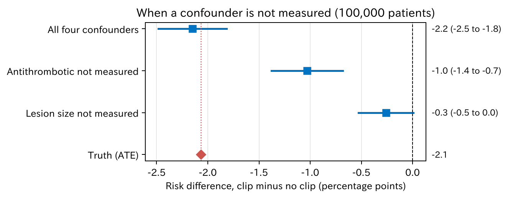
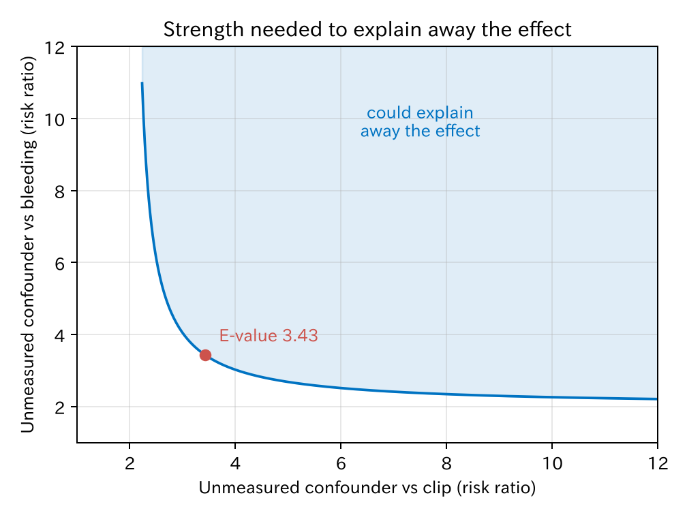

# 6. 仮定と感度分析

第 3 章から第 5 章の方法は、どれも同じ三つの仮定に立っていました（第 2 章）。この章では、それぞれの仮定がくずれたときに何が起きるかを、通しの例で見ます。そして、確かめられない仮定について「どのくらい強い違反なら結論が変わるか」を調べる**感度分析**を紹介します。

[← 目次](index.md) · [← 第 5 章](iptw.md)

| 仮定 | 意味 | データで確かめられるか |
|------|------|----------------------|
| 正値性 | どの背景の患者にも、クリップをされる人とされない人がいる | ある程度できる |
| 条件付き交換可能性 | 測った変数で調整すれば、未測定の交絡は残らない | できない |
| 一致性 | 「クリップをする」の中身が一つに決まっている | できない（研究の設計で決める） |

## 6.1 正値性 {#positivity}

**正値性**（positivity）は、どの背景 $X$ の患者でも、傾向スコアが 0 でも 1 でもない、ということです。

$$
0 < e(X) < 1
$$

傾向スコアがほぼ 1 の患者は、ほぼ必ずクリップをされます。この人たちに「クリップをしなかったら」を比べる相手はいません。

[CSV](../examples/assets/theory_bleeding/ch6_positivity.csv)

| 傾向スコア | クリップあり | クリップなし |
|-----------|-------------|-------------|
| 0.05 未満 | 4 | 161 |
| 0.05–0.95 | 823 | 1906 |
| 0.95 を超える | 100 | 6 |

傾向スコアが 0.95 を超える患者は 106 人で、そのうちクリップなしは 6 人しかいません。この 6 人が、クリップをされた 100 人ぶんの「反事実」を一手に引き受けています。第 5 章の IPTW（inverse probability of treatment weighting、治療の逆確率による重み付け）でいちばん大きい重み（105.6 倍）がかかったのも、この 6 人の一人です。第 4 章のマッチングで組ができなかったクリップ群 311 人も、主に傾向スコアの高い所にいます。311 人の傾向スコアは平均 0.86、全員が 0.60 以上で、0.95 を超えるのは 90 人です。

正値性の違反には二種類あります。

- **偶然の違反**：本当はクリップをしない医師もいるのに、データにたまたま少ない場合です。例数を増やせば解決します。
- **構造的な違反**：施設の方針で、大きな病変には必ずクリップをする場合です。いくら例数を増やしても、比べる相手はいません。

どちらの場合も、取れる手は似ています。

- 重なりの図（第 4 章）、重みの分布（第 5 章）で、違反の場所を見つけます。
- 対象を重なりのある患者に絞ります（限定、切り詰め、重なりの重み）。答えの対象は変わるので、そのことを明記します。
- 回帰の標準化で、モデルに外挿させます。比べる相手がいない所の答えを、モデルの形で補うことになります。

## 6.2 未測定交絡 {#unmeasured}

**条件付き交換可能性**は「必要な交絡因子を全部測った」という仮定です。データからは確かめられません。測っていない交絡因子があると何が起きるかを、シミュレーションで見ます。

偶然のばらつきを除くため、同じ仕組みで 10 万人のデータを作りました。アウトカムのモデルは、本当の形（20 mm 以上でクリップがよく効く）にしています。そのうえで、交絡因子を一つずつ「測っていない」ことにします。

=== "図"

    

    [CSV](../examples/assets/theory_bleeding/ch6_unmeasured.csv)

=== "コード"

    ```python
    from statract import standardize_glm

    full = "bleed ~ clip + clip:large + age + antithrombotic + size_mm + proximal"
    no_at = "bleed ~ clip + clip:large + age + size_mm + proximal"
    std = standardize_glm(big, no_at, values={"clip": [0, 1]})
    std.tidy(contrast="difference", reference=0)
    ```

| 調整に使った変数 | 推定値（ポイント） | 本当の値 |
|-----------------|-------------------|---------|
| 四つの交絡因子すべて | −2.15 | −2.07 |
| 抗血栓薬を測っていない | −1.03 | −2.07 |
| 病変径を測っていない | −0.26 | −2.07 |

本当の値は 10 万人での値で、3000 人での −2.1 ポイント（第 2 章）と小数第 2 位だけ違います。四つすべてで調整すると、本当の値にほぼ一致します。一つ欠けると、効果は半分以下に見えます。

向きにも意味があります。抗血栓薬も大きな病変も、**クリップを選ばせ、出血も増やす**因子です。これを調整しないと、「出血しやすい患者ほどクリップをされている」偏りが残り、クリップの効果は弱く（0 に近く）見えます。逆に、クリップを選ばせて出血を**減らす**因子（たとえば、丁寧な術者ほどクリップを使う）を見落とすと、効果は強く見えます。

10 万人いても、偏りは消えません。**例数を増やして減るのは偶然の誤差だけ**で、交絡による偏りは残ります。

## 6.3 E-value {#e-value}

未測定交絡は確かめられません。そこで、「どのくらい強い未測定交絡があれば、結論がくつがえるか」を計算します。その代表が **E-value** [@VanderWeele2017-qz]です。

3000 人のデータで、四つの交絡因子による回帰の標準化から、リスク比（risk ratio、RR）を求めました。

$$
\text{RR} = 0.50 \quad (95\%\ \text{信頼区間}\ 0.33\text{–}0.76)
$$

推定値では、クリップで出血のリスクが半分になります。本当の周辺リスク比は 0.63（第 1 章）なので、効果をやや強めに見ています。この標準化のモデルにはクリップと病変径の交互作用が入っておらず、第 3 章でも同じモデルのリスク差は −3.0 ポイントと、本当の −2.1 ポイントより強めでした。ただし、交互作用を加えてもリスク比は 0.51 とほとんど変わらないので、差の大部分は偶然のばらつきです。区間は 0.63 を含んでいます。

E-value は次の式で計算します。リスク比が 1 未満のときは、逆数 $1/\text{RR}$ を $\text{RR}$ に入れます。

$$
\text{E-value} = \text{RR} + \sqrt{\text{RR} \times (\text{RR} - 1)}
$$

$1 / 0.498 = 2.01$ を入れると、E-value は **3.43** です。区間の 1 に近い側（0.76）で計算すると **1.98** です。

=== "図"

    

    [CSV](../examples/assets/theory_bleeding/ch6_evalue.csv)

=== "コード"

    ```python
    import numpy as np
    from statract import standardize_glm

    std = standardize_glm(df, "bleed ~ clip + age + antithrombotic + size_mm + proximal", values={"clip": [0, 1]})
    rr = std.tidy(contrast="ratio", reference=0, ci="log")

    def e_value(r):
        r = 1 / r if r < 1 else r
        return r + np.sqrt(r * (r - 1))
    ```

読み方は次のとおりです。

!!! note "E-value 3.43 の意味"
    測った変数で調整したうえで、なお**クリップとも出血とも、リスク比 3.43 以上で関連する**未測定の交絡因子があれば、この効果は 0 で説明しきれます。それより弱い交絡因子では説明しきれません。

図の曲線より右上の組み合わせなら、効果を説明しきれます。E-value は、二つの強さが同じときの値です。

E-value が「大きいか小さいか」は、臨床の知識で判断します。比べる物差しになるのは、測った交絡因子の強さです。E-value はリスク比の尺度なので、オッズ比ではなくリスク比で比べます。このデータでは、抗血栓薬を飲んでいる患者はクリップ群の 33%、クリップなし群の 15% で、リスク比は 2.27 でした。出血のリスクは、抗血栓薬ありの患者がなしの患者の 2.1–2.7 倍でした（クリップの有無別）。

交絡因子とクリップのリスク比 $\text{RR}_{EU}$、交絡因子と出血のリスク比 $\text{RR}_{UY}$ から、その交絡因子がリスク比を動かせる最大の幅（バイアス因子）を計算できます [@VanderWeele2017-qz]。

$$
B = \frac{\text{RR}_{EU} \times \text{RR}_{UY}}{\text{RR}_{EU} + \text{RR}_{UY} - 1}
$$

抗血栓薬の強さを入れると、$B$ は 1.42–1.54 です。推定値 0.50 を 1 まで動かすには $B$ が 2.01 以上必要なので、**抗血栓薬と同じくらいの交絡因子を一つ見落としていても、効果を説明しきることはできません**。リスク比は、1 に近づいても 0.71–0.77 までです。ただし、区間の上限 0.76 を 1 まで動かすには $B$ が 1.32 あれば足ります。抗血栓薬ほどの交絡因子を見落としていれば、区間が 1 を含み、「効果がない」とは言い切れなくなる程度の強さはある、ということです。

6.2 で抗血栓薬を除いたときも、効果は弱く見えましたが、0 にはなりませんでした。3000 人のデータで抗血栓薬を除いて同じ標準化をすると、リスク比は 0.50 から 0.63 になります。上で計算した最大の幅の中に収まる動きです。

E-value の注意点です。

- 未測定交絡が「ある」「ない」を示すものではありません。
- 効果を 0 にする強さを示すだけで、効果を半分にする強さなどは別に計算します。
- どんな結果にも計算できるので、数字だけを機械的に報告しても意味がありません。どんな交絡因子が考えられるか、その強さはどのくらいかを、具体的に議論します。

## 6.4 一致性 {#consistency}

**一致性**（consistency）は、「クリップをした」という観察が、潜在アウトカム $Y(1)$ の「クリップをした」と同じものを指す、という仮定です。

実際の「クリップ」はさまざまです。

- 完全に閉じたのか、一部だけか
- クリップの本数、種類
- 切除の直後か、時間をおいてか

これらで効果が違うなら、「クリップの効果」は一つに決まりません。データでは確かめられないので、**研究の設計**で決めます。何を「クリップあり」とするかを先に定義し、それを報告します。標的試験の模倣（target trial emulation）は、この定義をランダム化比較試験の計画書のように書き出す考え方です。

## 6.5 一つの研究を超えて：Bradford Hill の視点 {#bradford-hill}

ここまでは、**一つの研究**の解析で、仮定がくずれていないかを調べてきました。しかし、因果を判断するときは、一つの研究だけで決めることはまずありません。複数の研究や、生物学的な知識をあわせて考えます。そのときの手がかりとして古くから使われているのが、Austin Bradford Hill [@Hill1965-mg] の 9 つの視点です。喫煙と肺癌の議論の中で示されました。

Hill 自身は、これを「基準」（criteria）ではなく「視点」（viewpoints）と呼びました。全部を満たせば因果、というチェックリストではありません。Hill は、必ず満たすべきものは「時間の順序」だけだとしています。

| 視点 | 意味 | 今の因果推論での見方 | クリップの例 |
|------|------|------------------|------------|
| 強さ（strength） | 関連が強い | 強い関連ほど、未測定交絡だけでは説明しにくい。E-value（6.3）がこれを数にしたもの | リスク比 0.50、E-value 3.43 |
| 一貫性（consistency） | 別の集団、別の方法でも同じ結果 | 偏りの向きが違う複数の方法で同じ答えになるか（トライアンギュレーション、triangulation [@Lawlor2016-lq]） | 観察研究とランダム化比較試験（randomized controlled trial、RCT）、施設や時代の違う研究で同じ向きか |
| 特異性（specificity） | その原因はその結果だけを起こす | 多くの病気は原因が多く、結果も多いので、弱い視点 | クリップは出血以外（穿孔など）にも影響しうる |
| 時間の順序（temporality） | 原因が結果より先 | 必ず必要。DAG（directed acyclic graph、有向非巡回グラフ）の矢印の向き。標的試験の模倣（6.4）では、治療を決める時点と追跡の開始をそろえる | クリップは切除の直後、出血はそのあと |
| 量反応関係（biological gradient） | 量が多いほど効果が大きい | あれば支えになるが、なくても因果は否定できない | 完全に閉じた場合ほど効果が大きいか |
| もっともらしさ（plausibility） | 仕組みが説明できる | DAG を描く根拠になる臨床・生物学の知識 | 傷を閉じると血管の露出が減る |
| 整合性（coherence） | 既知の事実と矛盾しない | 他の知識と合っているか | 大きく近位の病変ほど出血しやすい、という知識と合う |
| 実験（experiment） | 介入すると結果が変わる | RCT、自然実験。交換可能性を設計で作る（第 2 章） | 大きな病変での RCT [@Pohl2019-uv] |
| 類推（analogy） | 似た原因で似た結果がある | 弱い視点 | 他の内視鏡治療での閉鎖の効果 |

この表のように、Hill の視点の多くは、この本で扱ってきた考え方と重なります。

- **強さ**は、未測定交絡への強さ（E-value）として数にできます。
- **時間の順序**と**もっともらしさ**は、DAG を描くときに使う知識そのものです。
- **実験**は、ランダム化が交換可能性を作る、という第 2 章の話です。
- **一貫性**は、偏りの仕組みが違う研究（観察研究、RCT、別の調整方法）で答えがそろうかを見ることです。第 3 章で方法を並べて比べたのも、小さな意味での一貫性の確認です。

一方で、視点のどれも、一つの観察研究の結果が因果だと**証明**するものではありません。Hill の視点は、研究を読む人が「この関連を因果とみなして行動してよいか」を考えるための枠組みです。Hill は論文の最後で、完全な証拠を待って行動を先送りしてはいけない、とも述べています。

## 6.6 解析の報告に書くこと {#reporting}

- 調整する変数を選んだ根拠（DAG）
- 推定したいもの（ATE（average treatment effect、平均処置効果）、ATT（average treatment effect on the treated、処置群での平均処置効果）、ATO（average treatment effect in the overlap population、重なり集団での平均処置効果）など。[略語](index.md#abbreviations)）と、その理由
- 重なりの図、重みの分布、除いた患者の数と特徴
- 調整後のバランス（標準化差、Table 1）
- 主な仮定と、感度分析（E-value など）
- できれば、方法を変えた解析（回帰の標準化と IPTW など）の結果

## 文献 {#references}

教科書では、Hernán と Robins [@Hernan2020-book] の第 3 章が三つの仮定を扱っています。

::: {#refs}
:::

## まとめ

- 調整の方法はどれも、正値性、条件付き交換可能性、一致性の三つの仮定に立ちます。
- 正値性の違反は、重なりの図や重みの分布で見つけられます。対処すると、答えの対象が変わります。
- 未測定の交絡は、例数を増やしても消えません。測った因子の向きから、偏りの向きを考えます。
- E-value は、結論をくつがえすのに必要な未測定交絡の強さです。測った交絡因子の強さと比べて読みます。
- 一致性は、治療の定義を研究の設計で決めることで守ります。
- Bradford Hill の視点は、複数の研究と知識をあわせて因果を判断するための枠組みです。多くは、E-value、DAG、ランダム化、方法を変えた比較と重なります。必ず必要なのは時間の順序だけです。

第 II 部はここまでです。[第 III 部](prediction-model.md)では、同じロジスティック回帰を、因果ではなく**予測**に使います。
