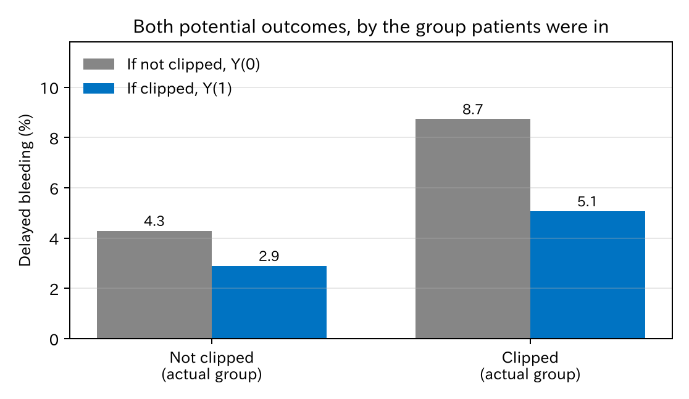
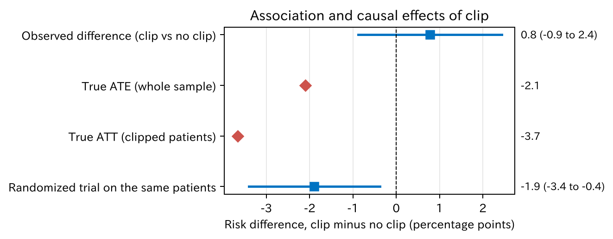
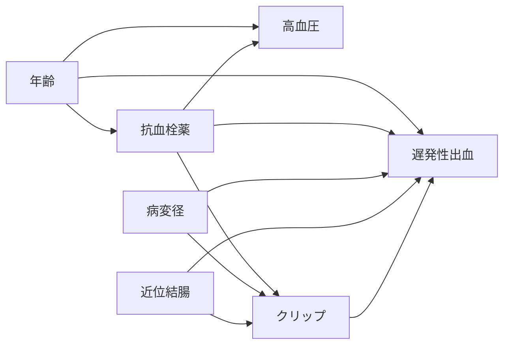

# 2. 因果推論の考え方

この章では、因果推論の二つの基本の道具を短く紹介します。**反事実モデル**（Rubin）と **DAG**（directed acyclic graph、有向非巡回グラフ）です。理論の詳しい説明は、章末の文献に譲ります。

[← 目次](index.md) · [← 第 1 章](independent-risk-factor.md)

## 2.1 反事実モデル {#rubin}

ある患者に、二つの未来を考えます。

- クリップをした場合に出血するか: $Y(1)$
- クリップをしなかった場合に出血するか: $Y(0)$

これを**潜在アウトカム**と呼びます。この患者にとってのクリップの効果は $Y(1) - Y(0)$ です。

ところが一人の患者には、クリップを「する」か「しない」か、片方しかできません。もう片方は起きなかった未来（反事実）で、見ることはできません。シミュレーションなら両方作れます。かっこの中が、実際には起きなかった方です。

--8<-- "examples/assets/theory_bleeding/potential_outcomes.md"

一人ひとりの効果は見えないので、集団の**平均**を考えます。全体での平均の効果を **ATE**（average treatment effect、平均処置効果）と呼びます。

$$
\text{ATE} = \mathrm{E}[Y(1)] - \mathrm{E}[Y(0)]
$$

全員にクリップをした場合と、誰にもしなかった場合の出血割合の差です。実際にクリップをされた患者に限った平均は **ATT**（average treatment effect on the treated、処置群での平均処置効果）と呼びます。このデータでは ATE は −2.1 ポイント、ATT は −3.7 ポイントです。

ここでの ATE は、この 3000 人の $Y(1) - Y(0)$ の平均（標本の ATE）です。シミュレーションなので、両方の潜在アウトカムがわかっています。もとの集団での値（母集団の ATE）もほぼ同じで、一人ひとりの出血リスクから計算すると −2.16 ポイント（第 1 章の 5.8% と 3.6% の差）、10 万人で作り直すと −2.07 ポイント（第 6 章）です。違いは小数第 2 位の偶然のばらつきだけです。以下の章では、特に断らない限り、この 3000 人での −2.1 ポイントを「本当の ATE」と呼びます。

### 関連は因果ではない

実際のデータで計算できるのは、クリップ群と非クリップ群の出血割合の差です。このデータでは **+0.8 ポイント**で、クリップで出血が増えるように見えます。

=== "図"

    

    [CSV](../examples/assets/theory_bleeding/ch2_by_group.csv)

=== "コード"

    ```python
    po.group_by("clip").agg(pl.col("y0").mean(), pl.col("y1").mean())
    ```

灰色の棒は「もしクリップをしなかったら」の出血割合 $Y(0)$ です。クリップ群は 8.7%、非クリップ群は 4.3% です。クリップ群は、**もともと出血しやすい**患者でした。この「もともとの差」が交絡です。

二つの群で $Y(0)$ も $Y(1)$ も平均が同じなら、群の差はそのまま因果効果になります。この状態を**交換可能性**と呼びます。ランダム化は、くじで群を決めることで交換可能性を作ります。同じ 3000 人でランダム化をやり直すと、推定値は −1.9 ポイント（95% 信頼区間 −3.4–−0.4）で、ATE に近くなります。

=== "図"

    

    [CSV](../examples/assets/theory_bleeding/ch2_effects.csv)

=== "コード"

    ```python
    from statract import prop_test

    clip, none = po.filter(pl.col("clip") == 1), po.filter(pl.col("clip") == 0)
    observed = prop_test(
        [int(clip["bleed"].sum()), int(none["bleed"].sum())],
        [clip.height, none.height],
        correct=False,
    )
    ate = po["y1"].mean() - po["y0"].mean()   # シミュレーションだから計算できる
    ```

観察研究では、ランダム化の代わりに次の仮定を置きます。

- **条件付き交換可能性**: 測った変数（病変径、抗血栓薬など）が同じ患者どうしなら、クリップをするかどうかは潜在アウトカムと関係ありません。
- **正値性**: どの特徴の患者にも、クリップをされた人とされなかった人がいます。
- **一致性**: 「クリップ」の中身が十分にそろっています。

1 番目の「どの変数を測り、どれで調整すればよいか」を考える道具が DAG です。

## 2.2 DAG {#dag}

DAG は、変数を箱、影響を矢印で描いた図です。矢印がないことは「直接は影響しない」という仮定です。DAG はデータから作るのではなく、臨床の知識で描きます。

通しの例の DAG（第 1 章）です。



DAG の道の形は三つしかありません。

| 形 | 例 | 真ん中の変数で調整すると |
|----|----|--------------------------|
| 分岐 $X \leftarrow Z \to Y$（交絡因子） | クリップ ← 病変径 → 出血 | 見かけの関連が止まる |
| 連鎖 $X \to Z \to Y$（中間因子） | 年齢 → 抗血栓薬 → 出血 | 効果の一部が消える |
| 合流 $X \to Z \leftarrow Y$（合流点） | 病変径 → 紹介 ← 抗血栓薬 | ないはずの関連が**生まれる** |

調整する変数は、次の二つで決めます（**バックドア基準**）。

1. クリップに**入ってくる**矢印から始まる道（バックドア経路）を、すべて閉じます。
2. クリップの**あと**に決まる変数（中間因子や結果）は入れません。

この DAG では、{抗血栓薬、病変径、近位結腸} で調整すれば足ります。高血圧は要りません。調整する変数は、$P$ 値ではなく DAG で選びます。

## 2.3 文献 {#references}

入門には、Hernán と Robins [@Hernan2020-book] が最も向いています。著者のウェブサイトで無料公開されていて、反事実モデル、DAG、各手法を臨床疫学の例で説明しています。短い論文では Hernán [@Hernan2004-fx]、日本語では岩崎 [@Iwasaki2015-book] と星野 [@Hoshino2009-book] があります。

原著と発展的な文献は、反事実モデルが Rubin [@Rubin1974-nh] と Imbens と Rubin [@Imbens2015-book]、DAG が Greenland ら [@Greenland1999-rp] と Pearl [@Pearl2009-book] です。第 1 章の Table 2 の誤りは Westreich と Greenland [@Westreich2013-ax] が論じています。

::: {#refs}
:::

DAG から調整する変数を求めるには [DAGitty](https://www.dagitty.net/) が便利です。

## まとめ

- 因果効果は、潜在アウトカムの差 $Y(1) - Y(0)$ で定義します。見えるのは片方だけなので、平均（ATE、ATT）を推定します。
- 観察された群の差には、もともとの差（交絡）が混ざります。
- 観察研究では、測った変数で調整すれば交換可能になると仮定します。
- どの変数で調整するかは DAG で決めます。

次の[第 3 章](adjustment-methods.md)では、選んだ変数で実際にどう調整するかを見ます。
