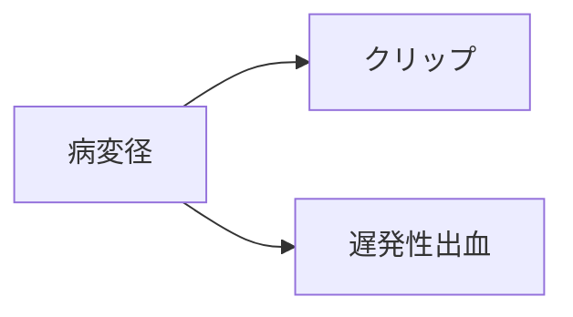
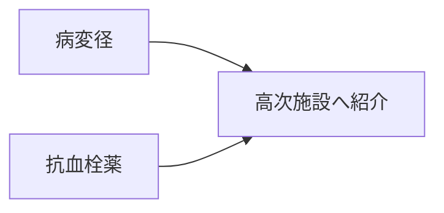
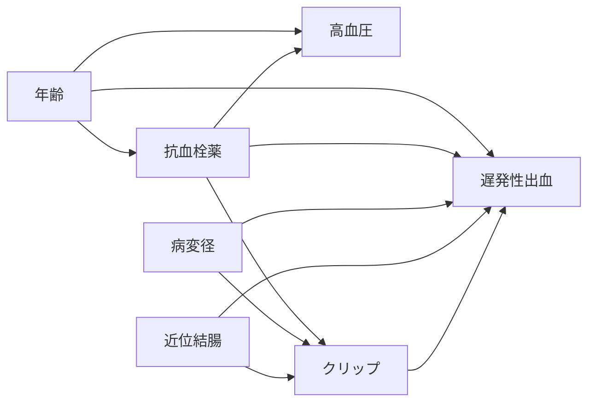
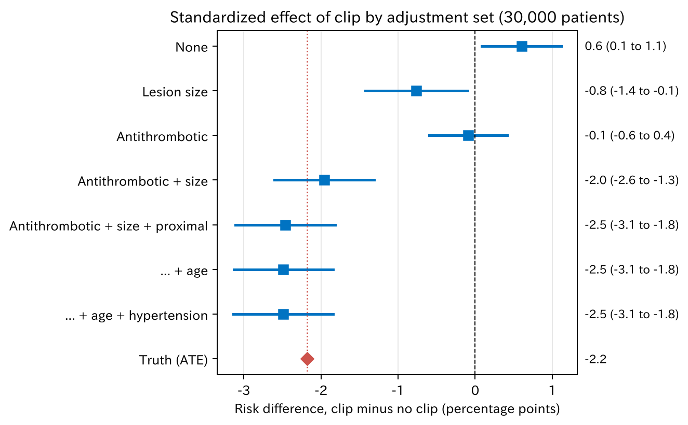
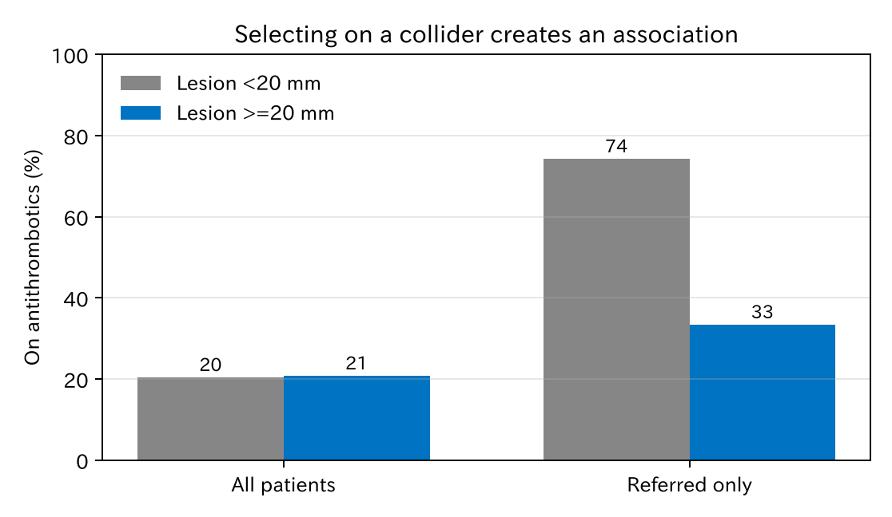
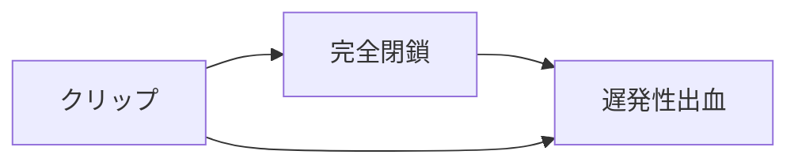

# 3. 交絡と DAG

第 2 章で、観察研究から因果効果を推定するには「条件付き交換可能性」が要ると述べました。測った変数で調整すれば、クリップをした群としない群を公平に比べられる、という仮定です。では、**何で調整すればよいか**。この章では、それを DAG で決める方法を学びます。

[← 目次](index.md) · [← 第 2 章](potential-outcomes.md)

## 3.1 DAG の約束 {#rules}

DAG（directed acyclic graph、有向非巡回グラフ）は、変数を箱、影響を矢印で描いた図です。

- 矢印 $X \to Y$ は「$X$ が $Y$ に影響する」という意味です。
- 矢印が**ない**ことも主張です。「直接は影響しない」と仮定しています。
- 矢印をたどって元の変数に戻ってくる輪はありません（非巡回）。原因は結果より前に起きるからです。
- 二つの変数の両方に影響する変数は、測っていなくても描きます。

DAG はデータから作るものではありません。臨床の知識から描くものです。

## 3.2 三つの基本形 {#structures}

どんなに複雑な DAG も、三つの形の組み合わせです。

### 分岐（交絡因子）



病変が大きいとクリップされやすく、出血もしやすい。クリップに効果がなくても、クリップと出血は関連して見えます。病変径は**交絡因子**です。病変径で調整する（病変径が同じ患者どうしで比べる）と、この見かけの関連は消えます。

### 連鎖（中間因子）


年齢が高いと抗血栓薬を飲む人が多く、抗血栓薬で出血が増える。抗血栓薬は年齢と出血の**中間因子**です。抗血栓薬で調整すると、年齢から抗血栓薬を通る効果が消えます。

### 合流（合流点）



大きい病変も、抗血栓薬を飲んでいることも、紹介の理由になります。病変径と抗血栓薬は、もともと関係がありません。ところが、紹介された患者だけを見ると、二つの間に関係が**生まれます**。紹介は**合流点**（collider）です。合流点で調整する、あるいは合流点で患者を選ぶと、ないはずの関連ができます。3.5 で実際に確かめます。

### まとめると

| 形 | 図 | 何もしないとき | 真ん中の変数で調整すると |
|----|----|----------------|--------------------------|
| 分岐 | $X \leftarrow Z \to Y$ | 関連が流れる | 止まる |
| 連鎖 | $X \to Z \to Y$ | 関連が流れる | 止まる |
| 合流 | $X \to Z \leftarrow Y$ | 止まっている | **流れ始める** |

分岐と連鎖は、調整すると止まります。合流だけは逆で、調整すると流れ始めます。

## 3.3 バックドア経路 {#backdoor}

第 1 章の DAG をもう一度見ます。



知りたいのは「クリップ → 出血」の矢印の効果です。クリップと出血をつなぐ道は、この矢印のほかにもあります。矢印の向きを気にせずにたどると、次の道があります。

| 道 | 合流点 | 何もしないとき |
|----|--------|----------------|
| クリップ ← 抗血栓薬 → 出血 | なし | 開いている |
| クリップ ← 抗血栓薬 ← 年齢 → 出血 | なし | 開いている |
| クリップ ← 病変径 → 出血 | なし | 開いている |
| クリップ ← 近位結腸 → 出血 | なし | 開いている |
| クリップ ← 抗血栓薬 → 高血圧 ← 年齢 → 出血 | 高血圧 | 閉じている |

どれもクリップに**入ってくる**矢印から始まっています。こうした道を**バックドア経路**と呼びます。開いたバックドア経路があると、クリップと出血の間に、効果ではない関連が流れます。これが交絡です。

### 調整する変数の選び方

次の二つを満たす変数の組で調整すれば、交絡を取り除けます（**バックドア基準**）。

1. クリップの**結果**（クリップから矢印をたどって行ける変数）を含まない。
2. すべてのバックドア経路を閉じる。

このデータでは、

- 抗血栓薬で調整すると、上の 2 本の道が閉じます。
- 病変径と近位結腸で、3 本目と 4 本目が閉じます。
- 5 本目は高血圧が合流点なので、もともと閉じています。

したがって **{抗血栓薬、病変径、近位結腸}** で足ります。年齢を加えても構いません（どの道も開きません）。高血圧を加えると 5 本目が開きますが、抗血栓薬でも閉じているので、このデータでは害はありません。

## 3.4 調整の仕方で答えが変わる {#adjustment-sets}

調整する変数の組を変えて、クリップの効果（リスク差）を推定します。偶然のぶれを小さくするため、同じ仕組みで 3 万例のデータを作りました。推定には回帰による標準化（第 4 章）を使っています。

=== "図"

    

    [CSV](../examples/assets/theory_bleeding/ch3_adjustment_sets.csv)

=== "コード"

    ```python
    from statract import standardize_glm

    # 病変径は直線と 20 mm の段差で入れる（クリップの効き方がそうなっているため）
    df = df.with_columns((pl.col("size_mm") >= 20).cast(pl.Int64).alias("large"))
    sets = {
        "None": [],
        "Lesion size": ["size_mm", "large"],
        "Antithrombotic": ["antithrombotic"],
        "Antithrombotic + size": ["antithrombotic", "size_mm", "large"],
        "Antithrombotic + size + proximal": ["antithrombotic", "size_mm", "large", "proximal"],
    }
    for name, covs in sets.items():
        formula = "bleed ~ clip" + (" * (" + " + ".join(covs) + ")" if covs else "")
        std = standardize_glm(df, formula, values={"clip": [0, 1]})
        std.tidy(contrast="difference", reference=0)
    ```

赤い点線が本当の値（ATE −2.2 ポイント）です。

- 何も調整しないと +0.6 で、クリップが出血を増やすように見えます。
- 病変径だけ、抗血栓薬だけでは、バックドア経路が残るので、まだ 0 寄りにずれます。
- 抗血栓薬、病変径、近位結腸をそろえると −2.5 で、区間が本当の値を含みます。
- 年齢や高血圧を足しても、ほとんど変わりません。

調整する変数を選ぶのは DAG です。$P$ 値でも、「推定値が期待した値に近いか」でもありません。最後の −2.5 と本当の −2.2 の差は、モデルの形と偶然によるもので、第 4 章で扱います。

## 3.5 合流点バイアス {#collider}

3.2 の合流の例を、通しのデータで確かめます。病変径と抗血栓薬は、このデータでは無関係に作ってあります。そこに「20 mm 以上の病変か、抗血栓薬を飲んでいると、高次施設に紹介されやすい」という仕組みを加えました。

=== "図"

    

    [CSV](../examples/assets/theory_bleeding/ch3_berkson.csv)

=== "コード"

    ```python
    rng = np.random.default_rng(11)
    referred = rng.binomial(1, expit(-3.0 + 3.0 * large + 3.0 * antithrombotic))
    fit_glm(d, "antithrombotic ~ large", family="binomial")                                   # 全患者
    fit_glm(d.filter(pl.col("referred") == 1), "antithrombotic ~ large", family="binomial")   # 紹介患者
    ```

- 全患者では、抗血栓薬を飲む人は小さい病変で 20%、大きい病変で 21% です。関係はありません（OR 1.02）。
- 紹介患者だけでは、小さい病変で 74%、大きい病変で 33% です。強い負の関連が生まれます（OR 0.17）。

紹介された患者の中で、病変が小さい人は「抗血栓薬のせいで紹介された」人が多いからです。紹介という合流点で患者を選んだことで、ないはずの関連が生まれました。これを**合流点バイアス**（選択バイアス、Berkson バイアス）と呼びます。

一施設の、特に紹介患者が多い施設のデータでは、この形のバイアスがよく起こります。「入院した患者だけ」「追跡できた患者だけ」で解析するときも同じです。

## 3.6 処置のあとの変数で調整しない {#mediator}

クリップのあとに起きることで調整してはいけません。例えば、クリップが出血を減らす仕組みの一つが「傷が完全に閉じること」だとします。



「完全閉鎖」で調整すると、完全閉鎖を通るクリップの効果が消えます。残るのは、完全閉鎖以外の経路だけです。翌日のヘモグロビン値、入院日数なども、クリップのあとに決まる変数です。バックドア基準の 1 番目（処置の結果を含まない）は、これを禁じています。

## 3.7 Table 2 の誤りを DAG で見る {#table2}

第 1 章では、一つの多変量モデルに並んだ係数が、変数ごとに違う意味を持つと述べました。DAG を使うと、変数ごとに「正しい調整」が違うことがはっきりします。

| 知りたい効果 | 調整する | 調整しない |
|--------------|----------|------------|
| クリップの効果 | 抗血栓薬、病変径、近位結腸 | （クリップのあとの変数） |
| 抗血栓薬の全体の効果 | 年齢 | クリップ（中間因子） |
| 年齢の全体の効果 | なし | 抗血栓薬、クリップ（中間因子） |

年齢には、矢印が入ってくる変数がありません。ですから年齢の全体の効果を知りたいなら、何も調整しない単変量解析が正しい答えになります（10 歳あたり OR 約 1.27）。第 1 章の多変量モデルの年齢の OR（1.01）は、抗血栓薬を通る分を除いた、別のものでした。

抗血栓薬の「クリップを通らない直接の効果」を知りたい場合は、クリップで調整します。しかしクリップは、抗血栓薬と病変径の合流点でもあります（抗血栓薬 → クリップ ← 病変径）。（近位結腸も同じです）。クリップで調整すると、抗血栓薬 → クリップ ← 病変径 → 出血 という道が開くので、病変径と近位結腸でも調整が要ります。一つのモデルですべての問いに答えようとすると、こうした食い違いが必ず出てきます。

!!! tip "要点"
    一つのモデルで答えられる因果の問いは、基本的に一つです。知りたい効果ごとに DAG で調整する変数を選び、別々に推定します。

## 3.8 DAG の描き方 {#drawing}

1. 処置（クリップ）とアウトカム（出血）を置き、その間に矢印を描く。
2. 処置の選択に影響する要因を挙げる。誰がどんな理由でクリップを決めるかを考える。
3. それらのうち、アウトカムにも影響するものに矢印を描く。
4. 測っていない共通の原因があれば、測っていなくても描く（U などと書く）。
5. 時間の順に並べる。処置のあとに起きる変数ははっきり分ける。
6. 矢印を描かないことは「影響しない」という強い仮定だと意識する。

描いた DAG から調整する変数を求めるには、[DAGitty](https://www.dagitty.net/) が便利です。DAG を論文に載せると、読者が仮定を確かめられます。

## まとめ

- DAG は、変数の間の影響を矢印で描いた図で、臨床の知識から描きます。
- 分岐（交絡因子）と連鎖（中間因子）は調整すると関連が止まり、合流点は調整すると関連が生まれます。
- 処置に入ってくる矢印から始まる道（バックドア経路）をすべて閉じる変数で調整すると、交絡を取り除けます。
- 処置のあとの変数、合流点では調整しません。合流点で患者を選ぶことも同じバイアスを生みます。
- 知りたい効果が変われば、調整すべき変数も変わります。

次の第 4 章では、選んだ変数でどう調整するか（回帰調整と標準化）を扱います。
