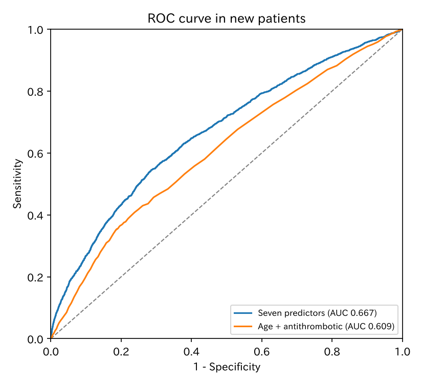
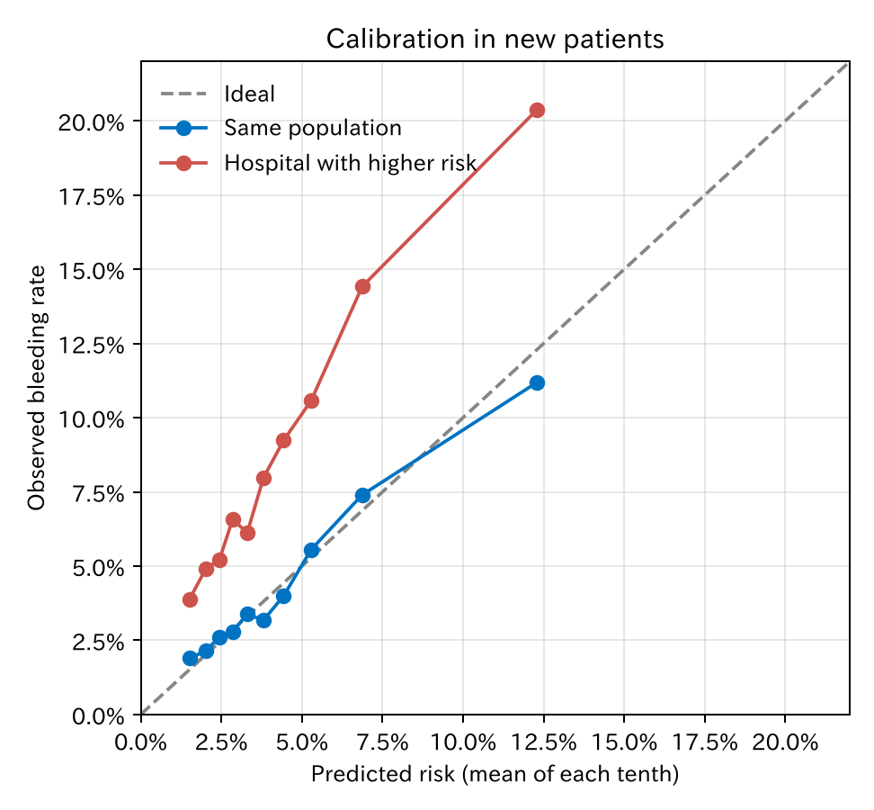
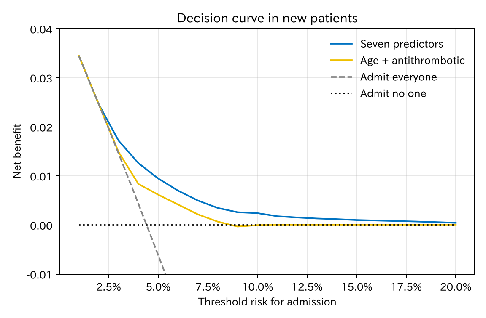

# 9. 識別と較正

予測モデルの良さには、二つの別の面があります。出血する人としない人を**見分けられるか**（識別）と、予測確率が**実際の割合と合っているか**（較正）です。この章では二つを分けて測り、最後に「臨床で使って得をするか」を決定曲線で見ます。

[← 目次](index.md) · [← 第 8 章](overfitting.md)

この章では、第 7 章の 3000 人で作ったモデルを、同じ仕組みで作った**新しい患者 5 万人**で確かめます（外部検証のまねです）。比べる相手として、年齢と抗血栓薬だけの簡単なモデルも作りました。

## 9.1 識別：ROC 曲線と C 統計量 {#discrimination}

予測確率がある値（**閾値**）以上の人を「出血しそう」と判定するとします。閾値を決めると、検査と同じように感度と特異度が決まります。

| 閾値 | 判定が陽性の人 | 感度 | 特異度 | 陽性的中率 | 陰性的中率 |
|------|-------------|------|--------|-----------|-----------|
| 2% | 85% | 93% | 15% | 4.8% | 98.0% |
| 5% | 28% | 52% | 73% | 8.3% | 97.1% |
| 10% | 6% | 19% | 94% | 13.5% | 96.2% |
| 20% | 0.6% | 4% | 99.5% | 25.6% | 95.7% |

[CSV](../examples/assets/theory_bleeding/ch9_thresholds.csv)

閾値を下から上へ動かしたときの（1 − 特異度、感度）をつないだものが **ROC 曲線**（receiver operating characteristic curve）です。

=== "図"

    

=== "コード"

    ```python
    from statract import plot_roc, roc_curve

    rocs = {"Seven predictors": roc_curve(y_new, p_full), "Age + antithrombotic": roc_curve(y_new, p_simple)}
    plot_roc(rocs, "roc.png")
    rocs["Seven predictors"].ci_auc()   # AUC と 95% 信頼区間（DeLong）
    ```

曲線の下の面積を **AUC**（area under the curve）と呼びます。二値のアウトカムでは **C 統計量**（concordance statistic）と同じ値です。意味は次のとおりです。

!!! note "C 統計量の意味"
    出血した人と出血しなかった人を一人ずつ選んだとき、出血した人の予測確率のほうが高い確率。

七つの変数のモデルは 0.67、簡単なモデルは 0.61 でした。0.67 は高くありません。しかし、本当のモデル（データを作った式）でも 0.68 です（第 8 章）。出血の多くは、測った変数では説明できない偶然で起きる、という設定だからです。C 統計量には、データの性質で決まる**上限**があります。

C 統計量は順位しか見ていません。予測確率を全部 2 倍にしても変わりません。そのため、予測確率そのものが当たっているかは、別に確かめる必要があります。

## 9.2 較正：予測確率は当たっているか {#calibration}

予測確率の順に患者を 10 等分し、各グループの「予測確率の平均」と「実際の出血割合」を比べます。点が対角線に乗れば、較正が良いと言えます。

ここで、もう一つの場面を考えます。**別の病院**で同じモデルを使う場合です。患者の背景も、各因子の効果も同じですが、もともとの出血リスクが高い（ベースラインのオッズが約 2.2 倍）とします。



[CSV](../examples/assets/theory_bleeding/ch9_calibration.csv)

| 場面 | C 統計量 | 予測確率の平均 | 実際の出血割合 | 較正の切片 | 較正の傾き |
|------|---------|-------------|-------------|-----------|-----------|
| 同じ集団 | 0.67 | 4.5% | 4.4% | −0.02 | 0.93 |
| リスクの高い病院 | 0.66 | 4.5% | 8.9% | 0.76 | 0.89 |

[CSV](../examples/assets/theory_bleeding/ch9_metrics.csv)

- 同じ集団では、点はほぼ対角線に乗っています。
- リスクの高い病院では、C 統計量はほとんど変わらない（0.66）のに、どのグループでも実際の出血が予測の約 2 倍です。**見分ける力は同じでも、確率は外れています**。

較正は二つの数でまとめます。

- **較正の切片**（calibration-in-the-large）：全体として予測が低すぎるか高すぎるか。0 が理想です。0.76 は、対数オッズで 0.76、オッズで約 2.1 倍、予測が低すぎることを意味します。
- **較正の傾き**：第 8 章と同じです。1 が理想で、1 より小さいと予測が極端すぎます。

このように、較正の切片がずれるだけなら、**切片だけ直す**（再較正）ことで、その病院用のモデルにできます。係数を作り直す必要はありません。

!!! warning "C 統計量だけでは足りない"
    論文の予測モデルは C 統計量だけを報告していることが多いですが、それだけでは「確率が当たるか」はわかりません。リスクを患者に説明する、治療の閾値と比べる、という使い方では、較正のほうが大切です。TRIPOD（予測モデル研究の報告指針、Collins ら 2024）では、識別と較正の両方を報告することを求めています。

## 9.3 Brier スコア {#brier}

**Brier スコア**は、予測確率と実際の結果（0 か 1）の差の 2 乗の平均です。識別と較正の両方を一つの数にまとめたものです。0 が完全で、小さいほど良いです。

$$
\text{Brier} = \frac{1}{n} \sum_{i} (p_i - y_i)^2
$$

| モデル | Brier | 全員に平均の確率を言った場合 |
|--------|-------|--------------------------|
| 七つの変数 | 0.0413 | 0.0422 |
| 年齢と抗血栓薬 | 0.0419 | 0.0422 |

差はとても小さく見えます。出血がまれな場合、「全員に 4.4% と言う」だけで Brier はかなり小さくなるからです。Brier は、同じデータでモデルどうしを比べるのには使えますが、値そのものの良し悪しは読みにくい指標です。

## 9.4 決定曲線：使って得をするか {#dca}

識別も較正も、「臨床で使って得をするか」には直接答えません。それに答えるのが**決定曲線分析**（decision curve analysis、DCA）です。

例として、「予測確率が閾値 $p_t$ 以上なら入院で経過を見る」という使い方を考えます。閾値には臨床の判断が入ります。例えば $p_t = 5\%$ は、「出血する 1 人を入院で見るためなら、出血しない 19 人を入院させてもよい」という考えにあたります（$5 : 95 = 1 : 19$）。

この考えのもとで、モデルを使うことの**正味の利益**（net benefit）を計算します。

$$
\text{正味の利益} = \frac{\text{真陽性の数}}{n} - \frac{\text{偽陽性の数}}{n} \times \frac{p_t}{1 - p_t}
$$

偽陽性（出血しないのに入院）を、閾値で決まる重みで差し引いています。

=== "図"

    

    [CSV](../examples/assets/theory_bleeding/ch9_dca.csv)

=== "コード"

    ```python
    import numpy as np
    from statract import decision_curve_table, plot_dca

    dca = decision_curve_table(y_new, p_full, thresholds=np.linspace(0.01, 0.20, 20), model="Seven predictors")
    plot_dca(dca, "dca.png")
    ```

比べる相手は「全員を入院」（灰色の破線）と「誰も入院させない」（黒の点線、正味の利益 0）です。

- 閾値 5% では、七つの変数のモデルの正味の利益は 0.0095 です。100 人あたり、偽陽性なしで約 1 人の出血を見つけたのと同じ価値、ということです。全員を入院させると −0.006 で、誰も入院させないより悪くなります。
- 閾値 2% 未満なら全員入院と同じで、モデルを使う意味はありません。
- 閾値が 10% を超えると、どのモデルも「誰も入院させない」とほとんど変わりません。出血リスクが 10% を超える患者がわずかしかいないからです。
- 七つの変数のモデルは、どの閾値でも簡単なモデルと同じか、それより上です。

DCA の読み方の要点は、**自分の閾値の範囲で**、モデルの曲線が「全員」と「誰も」の両方より上にあるかです。

## 9.5 何を報告するか {#report}

- 識別：C 統計量と信頼区間、ROC 曲線
- 較正：較正の図、切片と傾き
- 臨床での有用性：使い方と閾値の範囲を決めたうえでの決定曲線
- どのデータで測ったか（見かけ、内部検証、外部検証）

## 文献 {#references}

- Steyerberg EW, Vickers AJ, Cook NR, et al. Assessing the performance of prediction models: a framework for traditional and novel measures. *Epidemiology.* 2010;21:128–138.
- Van Calster B, McLernon DJ, van Smeden M, et al. Calibration: the Achilles heel of predictive analytics. *BMC Med.* 2019;17:230.
- Vickers AJ, Elkin EB. Decision curve analysis: a novel method for evaluating prediction models. *Med Decis Making.* 2006;26:565–574.
- Vickers AJ, van Calster B, Steyerberg EW. A simple, step-by-step guide to interpreting decision curve analysis. *Diagn Progn Res.* 2019;3:18.

## まとめ

- 予測モデルの良さは、識別（見分けられるか）と較正（確率が当たるか）に分けて測ります。
- C 統計量は順位だけを見ます。データの性質で上限が決まり、確率が当たるかはわかりません。
- 較正は、10 等分の図と、切片と傾きで確かめます。別の施設では、識別は保たれても較正がずれることがあります。
- Brier スコアは両方をまとめますが、まれなアウトカムでは値を読みにくい指標です。
- 決定曲線は、閾値を決めて使ったときに得をするかを示します。
