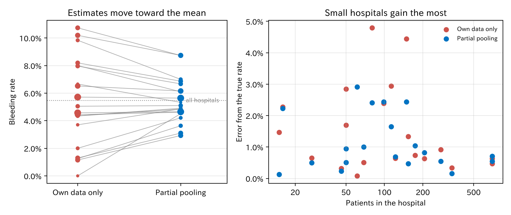
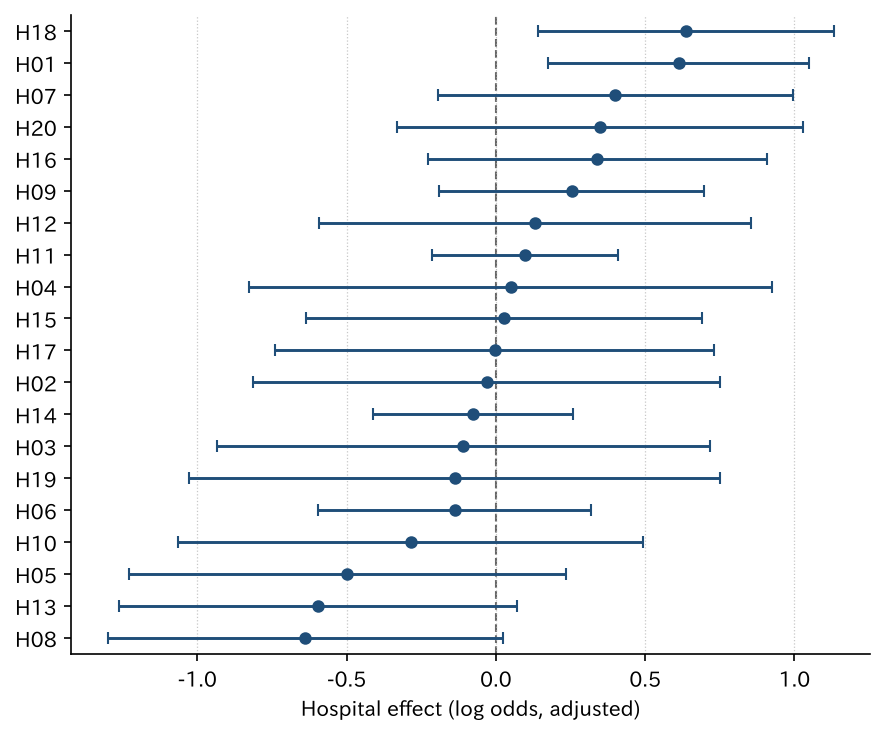
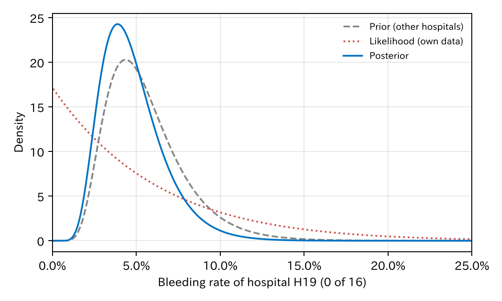

# 14. 階層モデル

第 12 章で、ロジスティック回帰は「患者どうしは独立」と仮定している、と述べました。しかし多施設のデータでは、同じ施設の患者は、内視鏡医の技術、クリップの使い方、術後の管理などを共有しています。この章では、施設のような**まとまり**を持つデータを扱う**階層モデル**（hierarchical model）を紹介します。**混合効果モデル**（mixed-effects model）、**マルチレベルモデル**とも呼ばれます。

[← 目次](index.md) · [← 第 13 章](likelihood.md)

## 14.1 多施設のデータ {#data}

これまでと同じ仕組みで、20 施設、計 3445 人のデータを作りました。施設の大きさは 15 人から 700 人までさまざまです。各施設には、対数オッズを少し上げ下げする**施設の効果** $u_h$ があります。施設の効果は、平均 0、標準偏差 0.5 の正規分布から選びました。

$$
\begin{aligned}
\log \frac{p_{hi}}{1 - p_{hi}} &= \beta_0 + \beta_1 x_{hi1} + \cdots + u_h \\
u_h &\sim \mathrm{Normal}(0, \sigma^2)
\end{aligned}
$$

$h$ は施設、$i$ は施設の中の患者です。標準偏差 0.5 は、同じ背景の患者でも、施設によって出血のオッズが 1.5〜2 倍くらい違うことにあたります。

データの層が二つあることに注意してください。患者は施設の中で生まれ（下の層）、施設は「施設の分布」から生まれます（上の層）。これが「階層」の意味です。

## 14.2 施設ごとの出血割合：三つの考え方 {#pooling}

まず、施設ごとの出血割合を推定します。考え方は三つあります。

- **完全プーリング**：施設を無視して、全員の割合（5.5%）をどの施設にも使う。施設差はないとみなします。
- **プーリングなし**：各施設の割合を、その施設のデータだけで計算する。施設どうしは何の関係もないとみなします。
- **部分プーリング**：各施設のデータを使うが、ほかの施設の情報も借りる。これが階層モデルです。

=== "図"

    

    [CSV](../examples/assets/theory_bleeding/ch14_rates.csv)

=== "コード"

    ```python
    from statract import fit_mixed

    fit = fit_mixed(df, "bleed ~ 1 + (1 | hospital)", family="binomial")
    fit.random_effects()   # 施設ごとの効果（対数オッズでのずれ）
    ```

`(1 | hospital)` は「施設ごとに切片が違い、その違いは正規分布に従う」という意味です。**変量効果**（random effect）と呼びます。ロジスティック回帰に変量効果を足したものを、**一般化線形混合モデル**（generalized linear mixed model、GLMM）と呼びます。

- 左の図で、自施設のデータだけの推定（赤）は 0% から 10.7% まで広がっています。部分プーリング（青）では 2.9% から 8.7% に縮み、全体の平均に近づきます。これを**縮小**（shrinkage）と呼びます。
- 縮み方は施設の大きさで違います。点の大きさが施設の人数です。小さい施設ほど大きく縮み、700 人の施設はほとんど動きません。
- 右の図は、本当の出血割合（データを作ったときの値）からの誤差です。小さい施設で、部分プーリングの誤差が小さくなっています。

| 推定の方法 | 本当の割合からの誤差（2 乗平均の平方根） |
|-----------|---------------------------------|
| 完全プーリング | 2.1% |
| プーリングなし | 2.0% |
| 部分プーリング | 1.4% |

[CSV](../examples/assets/theory_bleeding/ch14_error.csv)

例えば H05 は 80 人中 1 人（1.3%）でしたが、本当の割合は 6.0% です。部分プーリングでは 3.6% と、本当の値に近づきました。一方 H19 は 16 人中 0 人で、部分プーリングで 4.5% になりましたが、本当は 2.3% です。一つ一つの施設では縮みすぎることもありますが、**全体として**誤差が小さくなります。Stein のパラドックスとして知られる性質です（Efron と Morris 1977）。

### なぜ縮むのか {#why-shrink}

部分プーリングの推定は、おおよそ「自施設の割合」と「全体の平均」の重み付き平均です。

$$
\text{推定} \approx w_h \times \text{自施設の割合} + (1 - w_h) \times \text{全体の平均}
$$

重み $w_h$ は、自施設のデータが多いほど、また施設差 $\sigma$ が大きいほど 1 に近づきます。データの少ない施設では、自施設の割合は偶然でぶれやすい（16 人中 0 人は珍しくない）ので、ほかの施設の情報を多めに借ります。$\sigma$ もデータから推定するので、「どのくらい借りるか」もデータが決めます。

## 14.3 患者の背景を調整した階層モデル {#adjusted}

第 7 章の七つの変数を入れたモデルに、施設の変量効果を足します。

=== "コード"

    ```python
    from statract import fit_mixed, glmm_cluster_variance

    fit = fit_mixed(
        df,
        "bleed ~ age + male + antithrombotic + hypertension + size_mm + proximal + clip + (1 | hospital)",
        family="binomial",
    )
    fit.tidy(exponentiate=True)          # 固定効果（オッズ比）
    glmm_cluster_variance(fit)           # 施設の効果の分散 σ²
    ```

| モデル | クリップのオッズ比 | 標準誤差（対数オッズ） | 施設の効果の標準偏差 | ICC | MOR |
|--------|---------------|-------------------|-----------------|-----|-----|
| 施設を無視（GLM） | 0.46 | 0.209 | — | — | — |
| 施設の変量効果（GLMM） | 0.43 | 0.212 | 0.48 | 0.066 | 1.58 |

[CSV](../examples/assets/theory_bleeding/ch14_models.csv)

- 施設の効果の標準偏差は 0.48 と推定され、本当の 0.5 に近い値です。二つのモデルの対数尤度の差から尤度比検定（第 13 章）をすると、施設差は明らかです（$\chi^2 = 9.5$）。ただし「$\sigma = 0$」は取りうる値の端なので、$P$ 値は普通の値の半分にします（約 0.001）。
- **ICC**（intraclass correlation coefficient、級内相関係数）は、出血のしやすさのばらつきのうち、施設の違いで説明される割合です。ロジスティックモデルでは $\sigma^2 / (\sigma^2 + \pi^2/3)$ で計算します。
- **MOR**（median odds ratio、オッズ比の中央値）は、同じ背景の患者が、ランダムに選んだ二つの施設のうちリスクの高いほうに行ったときのオッズ比の中央値です（Larsen と Merlo 2005）。1.58 は、施設を変えるとオッズが 1.6 倍くらい変わる、という意味で、ICC より臨床家に伝わりやすい指標です。

### 固定効果はどう変わるか {#fixed-effects}

クリップのオッズ比は 0.46 から 0.43 になりました。施設の効果を入れると、係数は 0 から少し離れます。階層モデルの係数は「**同じ施設の中で**比べた」効果、施設を無視した係数は「施設をならした」効果で、ロジスティック回帰では二つは一致しません。第 1 章で、条件付きのオッズ比と周辺オッズ比が一致しないと述べたのと同じ理由です。

標準誤差はほとんど変わりませんでした。クリップは同じ施設の中でも、する人としない人がいるからです。逆に、**施設の単位で決まる変数**（施設の方針、施設の症例数など）では、施設を無視すると標準誤差が小さすぎて、偽の有意差が出ます。多施設のデータでは、施設を入れておくのが安全です。

## 14.4 施設の順位づけは危うい {#ranking}

施設の効果を、近似の 95% 区間とともに並べました。

=== "図"

    

    [CSV](../examples/assets/theory_bleeding/ch14_effects.csv) · [順位 CSV](../examples/assets/theory_bleeding/ch14_ranks.csv)

=== "コード"

    ```python
    from statract import plot_random_effects

    effects = fit.random_effects()        # group、blup
    plot_random_effects(effects, "caterpillar.png")   # conf_low、conf_high の列があれば区間も描く
    ```

statract の `random_effects()` は区間を返さないので、図の区間は、施設ごとの対数尤度の曲がり具合と施設の分布から近似で計算しました（ラプラス近似）。

- ほとんどの施設の区間が 0 をまたぎ、互いに大きく重なっています。区間が 0 をまたがないのは H18 と H01 だけです。
- 推定で 1 位の H18 は、本当は 4 位です。推定で 18 位（成績が良いほう）の H05 は、本当は 8 位です。
- 本当の順位と推定の順位が一致したのは、20 施設中 3 施設（H08、H09、H04）でした。

施設の成績表（リーグテーブル）は直感的ですが、順位は偶然に大きく左右されます（Goldstein と Spiegelhalter 1996）。施設を比べるなら、順位ではなく区間を示し、部分プーリングで小さい施設の極端な値を抑えるのが基本です。

!!! note "コラム：ベイズ推論 {#bayes}"
    部分プーリングは、**ベイズ推論**の見方で読むとわかりやすくなります。

    ベイズ推論では、知りたい値（ここでは H19 の出血割合）について、データを見る前の考えを**事前分布**で表し、データの尤度（第 13 章）を掛けて**事後分布**を作ります。

    $$
    \text{事後分布} \propto \text{尤度} \times \text{事前分布}
    $$

    これはベイズの定理そのものです。H19 で計算してみます。

    - **事前分布**：ほかの施設からわかる「施設の出血割合の分布」です。施設差だけのモデルから、中心 5.1%、対数オッズで標準偏差 0.44 の分布になります。
    - **尤度**：H19 自身のデータ、16 人中 0 人です。0% が最ももっともらしいですが、16 人では 10〜20% くらいまで否定できません。
    - **事後分布**：二つを掛けたものです。

    

    [CSV](../examples/assets/theory_bleeding/ch14_bayes.csv)

    事後分布の平均は 4.8%、95% の範囲（**信用区間**）は 2.0〜9.4% です。尤度は平らで情報が少ないので、事後分布はほとんど事前分布で決まります。これが「小さい施設ほど大きく縮む」の正体です。700 人の施設なら尤度が鋭くなり、事後分布は尤度で決まります。

    階層モデルは、事前分布（施設の分布）そのものをデータから推定している、と読めます。このため**経験ベイズ**（empirical Bayes）とも呼ばれます。施設の分布の平均と標準偏差にも事前分布を置き、全部をベイズで推定するのが**完全なベイズの階層モデル**です。その場合、事後分布は式で求まらないので、**マルコフ連鎖モンテカルロ法**（Markov chain Monte Carlo、MCMC）で事後分布から乱数を引いて調べます。Stan、R の brms、Python の PyMC がよく使われます（Gelman ら 2013）。

    この本では、すでにベイズの考え方が何度か出ています。

    - ridge は「係数は 0 の近くにある」という正規分布の事前分布、LASSO はラプラス分布の事前分布にあたります（第 10 章）。
    - Firth の方法は、Jeffreys の事前分布を使ったものにあたります（第 13 章）。
    - WAIC は、事後分布を使って予測の当たりを見積もる情報量規準です（第 8 章）。

    臨床研究では、小さな研究に過去の研究の結果を事前分布として入れる、「効果はたぶん小さい」という**懐疑的な事前分布**で結果の頑健さを確かめる、といった使い方もあります（Spiegelhalter ら 2004）。事前分布の選び方で結論が変わりうるので、いくつかの事前分布で結果を示すのが普通です。

## 文献 {#references}

- Gelman A, Hill J. *Data Analysis Using Regression and Multilevel/Hierarchical Models.* Cambridge University Press; 2007.
- Gelman A, Carlin JB, Stern HS, Dunson DB, Vehtari A, Rubin DB. *Bayesian Data Analysis.* 3rd ed. CRC Press; 2013.
- Efron B, Morris C. Stein's paradox in statistics. *Sci Am.* 1977;236:119–127.
- Larsen K, Merlo J. Appropriate assessment of neighborhood effects on individual health: integrating random and fixed effects in multilevel logistic regression. *Am J Epidemiol.* 2005;161:81–88.
- Goldstein H, Spiegelhalter DJ. League tables and their limitations: statistical issues in comparisons of institutional performance. *J R Stat Soc A.* 1996;159:385–443.
- Spiegelhalter DJ, Abrams KR, Myles JP. *Bayesian Approaches to Clinical Trials and Health-Care Evaluation.* Wiley; 2004.

## まとめ

- 多施設のデータでは、同じ施設の患者は似ています。階層モデルは、施設の効果を「施設の分布から生まれた変量効果」として扱います。
- 施設ごとの推定は、部分プーリングで全体の平均に縮みます。小さい施設ほど大きく縮み、全体として誤差が小さくなります。
- 施設差の大きさは、施設の効果の標準偏差、ICC、MOR で表します。
- 施設の単位で決まる変数では、施設を無視すると標準誤差が小さすぎます。
- 施設の順位は偶然に大きく左右されます。順位ではなく区間を示します。
- 部分プーリングは、施設の分布を事前分布としたベイズ推論と読めます。

次の[第 15 章](survival.md)では、時間とともに起きる出来事を扱う生存時間解析を紹介します。
