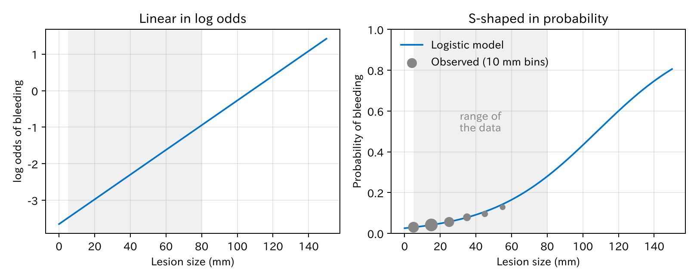
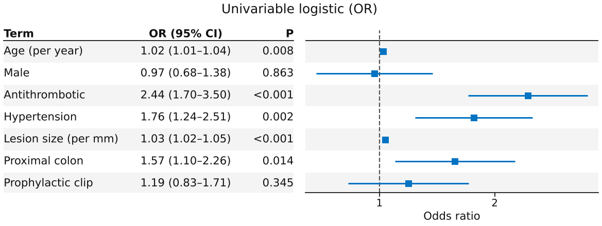
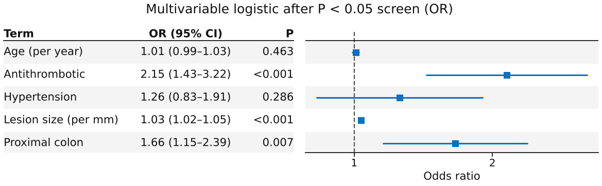
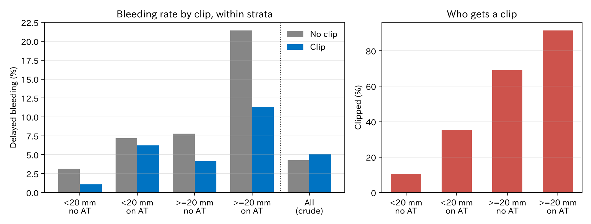
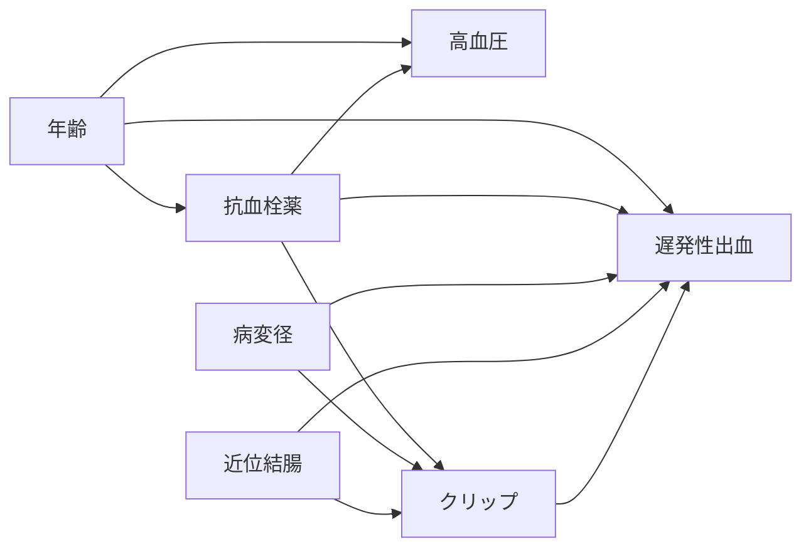

# 1. 「独立した危険因子」とは何か

医学論文では、今もよく次の解析を見かけます。

> 単変量解析で有意だった因子を多変量ロジスティック回帰に入れ、多変量でも有意だった因子を「独立した危険因子」とする。

この章では、まずこの解析をそのままやってみます。そのためにロジスティック回帰の基本を確認します。次に、この解析で何がおかしくなるのかを見ます。最後に、「独立した危険因子を知りたい」という問いを、**因果**の問いと**予測**の問いに分けます。

[← 目次](index.md)

## 1.1 例のデータ {#data}

大腸の内視鏡的切除を受けた患者のデータです。知りたいのは**遅発性出血**（切除後、数日以内の出血）です。

--8<-- "examples/assets/theory_bleeding/n.md"

| 列 | 意味 |
|----|------|
| `age` | 年齢（歳） |
| `male` | 男性なら 1 |
| `antithrombotic` | 抗血栓薬を飲んでいれば 1 |
| `hypertension` | 高血圧があれば 1 |
| `size_mm` | 病変径（mm） |
| `proximal` | 近位結腸（盲腸〜横行結腸）なら 1 |
| `clip` | 予防的クリップで閉鎖したら 1 |
| `bleed` | 遅発性出血があれば 1 |

!!! warning "シミュレーションデータです"
    この数字は実在の患者ではありません。どの変数がどの変数に影響するかを決めて、乱数で作りました。本当の構造は [1.5](#dag) で見せます。実際の研究では、この構造は誰にもわかりません。

### Table 1

=== "表"

    --8<-- "examples/assets/theory_bleeding/table1_gt.md"

    [CSV](../examples/assets/theory_bleeding/table1.csv)

=== "コード"

    ```python
    from statract import agg_category, agg_mean_sd, agg_median_iqr, write_tableone_artifacts

    params = {
        "Age": ("age", agg_mean_sd),
        "Male": ("male_label", agg_category),
        "Antithrombotic": ("antithrombotic_label", agg_category),
        "Hypertension": ("hypertension_label", agg_category),
        "Lesion size (mm)": ("size_mm", agg_median_iqr),
        "Proximal colon": ("proximal_label", agg_category),
        "Prophylactic clip": ("clip_label", agg_category),
    }
    write_tableone_artifacts(
        out, "table1", df=shown, params=params, hue="group", add_all=True, add_pvalue=True,
        column_order=["No bleeding", "Delayed bleeding"],
    )
    ```

出血した群は、年齢が高く、抗血栓薬と高血圧が多く、病変が大きく、近位結腸が多いようです。クリップは出血した群でやや多く見えます（34.6% 対 30.7%）。

## 1.2 ロジスティック回帰の基本 {#logistic}

### 確率とオッズ

ある患者が出血する確率を $p$ とします。**オッズ**は「起きる確率」を「起きない確率」で割ったものです。

$$
\text{オッズ} = \frac{p}{1 - p}
$$

$p = 0.2$ ならオッズは $0.2 / 0.8 = 0.25$ です。$p$ が小さいとき、オッズは $p$ とほぼ同じです（$p = 0.05$ ならオッズは約 0.053）。

### 対数オッズを直線で表す

ロジスティック回帰は、**オッズの対数**を直線で表すモデルです。病変径 $x$ だけを使うと次のようになります。

$$
\log \frac{p}{1 - p} = \beta_0 + \beta_1 x
$$

左辺を**対数オッズ**（ロジット）と呼びます。$p$ は 0 から 1 までしか動けませんが、対数オッズはマイナス無限大からプラス無限大まで動けます。だから右辺を直線にできます。

直線のままでは確率がわかりにくいので、式を $p$ について解きます。

$$
p = \frac{1}{1 + e^{-(\beta_0 + \beta_1 x)}}
$$

これが**ロジスティック曲線**です。対数オッズで見ると直線、確率で見ると S 字になります。

=== "図"

    

=== "コード"

    ```python
    from statract import fit_glm

    fit = fit_glm(df, "bleed ~ size_mm", family="binomial")
    fit.tidy()  # (Intercept) と size_mm の係数
    ```

灰色の帯がデータのある範囲（5〜80 mm）です。この範囲では出血の確率は低く、S 字の下の端だけを見ていることになります。灰色の点は 10 mm ごとの実際の出血割合です。モデルの曲線とよく合っています。

### 係数とオッズ比

$x$ が 1 増えると、対数オッズは $\beta_1$ だけ増えます。対数をはずすと、オッズは $e^{\beta_1}$ 倍になります。この $e^{\beta_1}$ が**オッズ比**（OR）です。

このデータでは $e^{\beta_1} \approx 1.03$ でした。病変が 1 mm 大きいと、出血のオッズが 1.03 倍になります。10 mm なら $1.03^{10} \approx 1.4$ 倍です。足し算ではなく、かけ算で効くことに注意してください。

指数と対数に自信がなければ [A1. 確率、オッズ、対数](math/odds-log.md) を先に読んでください。

### 変数を増やす

変数を増やしても形は同じです。

$$
\log \frac{p}{1 - p} = \beta_0 + \beta_1 x_1 + \beta_2 x_2 + \cdots + \beta_k x_k
$$

ここで $\beta_1$ の意味は「**他の変数をすべて同じ値に固定したまま** $x_1$ だけを 1 増やしたときの、対数オッズの増え方」です。これを「調整した」オッズ比と呼びます。この「固定したまま」が、あとで大事になります。

## 1.3 慣習的な解析をやってみる {#conventional}

論文でよく見る手順を、そのまま実行します。

1. 候補の因子を一つずつロジスティック回帰に入れる（単変量解析）
2. $P < 0.05$ の因子だけを選ぶ
3. 選んだ因子をまとめて一つのロジスティック回帰に入れる（多変量解析）
4. 多変量でも $P < 0.05$ の因子を「独立した危険因子」とする

### 単変量解析

=== "図"

    

    [CSV](../examples/assets/theory_bleeding/univariable.csv)

=== "コード"

    ```python
    import polars as pl
    from statract import fit_glm, plot_forest

    candidates = ["age", "male", "antithrombotic", "hypertension", "size_mm", "proximal", "clip"]
    uni = pl.concat([
        fit_glm(df, f"bleed ~ {x}", family="binomial")
        .tidy(exponentiate=True)
        .filter(pl.col("term") == x)
        for x in candidates
    ])
    plot_forest(uni, "forest_univariable.png", xlabel="Odds ratio")
    ```

$P < 0.05$ で選ばれたのは次の因子です。

--8<-- "examples/assets/theory_bleeding/selected.md"

男性とクリップは選ばれませんでした。クリップのオッズ比は 1.19（95% CI 0.83–1.71、$P = 0.35$）です。

### 多変量解析

=== "図"

    

    [CSV](../examples/assets/theory_bleeding/multivariable.csv)

=== "コード"

    ```python
    selected = uni.filter(pl.col("p_value") < 0.05)["term"].to_list()
    multi = fit_glm(df, "bleed ~ " + " + ".join(selected), family="binomial")
    plot_forest(multi.tidy(exponentiate=True), "forest_multivariable.png", xlabel="Odds ratio")
    ```

論文ならこう書くでしょう。

> 多変量解析の結果、抗血栓薬（OR 2.15）、病変径（1 mm あたり OR 1.03）、近位結腸（OR 1.66）が遅発性出血の独立した危険因子であった。年齢と高血圧は独立した危険因子ではなかった。予防的クリップは遅発性出血と関連しなかった。

## 1.4 何がおかしいのか {#problems}

このデータは作ったものなので、答えがわかっています。答えと比べると、上の結論にはいくつも問題があります。

### クリップの効果が消えた

本当は、**クリップは出血を減らします**。全員にクリップをした場合と、誰にもしなかった場合を比べると、出血は 5.8% から 3.6% に下がります（リスク比 0.63）。特に 20 mm 以上の病変でよく効くように作ってあります。

ところが単変量ではオッズ比 1.19 で、むしろ増えるように見えました。そして $P$ 値で選ぶ段階で落ちたので、多変量には入りもしませんでした。

理由は図を見るとわかります。

=== "図"

    

    [層別の出血率 CSV](../examples/assets/theory_bleeding/stratified_rates.csv) · [クリップの割合 CSV](../examples/assets/theory_bleeding/clip_share.csv)

=== "コード"

    ```python
    strata = df.with_columns(
        pl.when(pl.col("size_mm") >= 20).then(pl.lit(">=20 mm")).otherwise(pl.lit("<20 mm")).alias("size_grp"),
        pl.when(pl.col("antithrombotic") == 1).then(pl.lit("on AT")).otherwise(pl.lit("no AT")).alias("at_grp"),
    )
    rates = strata.group_by("size_grp", "at_grp", "clip").agg(pl.col("bleed").mean())
    share = strata.group_by("size_grp", "at_grp").agg(pl.col("clip").mean())
    ```

- 左の図: 病変径と抗血栓薬で分けた**どの層でも**、クリップした方が出血は少ない。
- 右の図: クリップは、出血しやすい患者（大きい病変、抗血栓薬あり）ほど多く使われている。小さい病変で抗血栓薬なしなら 11%、大きい病変で抗血栓薬ありなら 91% です。
- 全体をまとめると（左の図の右端）、クリップ群には出血しやすい患者が集まっているので、クリップ群の方が出血が多く見える。

医師が「出血しそうだ」と思った患者にクリップをするので、クリップと出血のリスクが結びつきます。これを**適応による交絡**（confounding by indication）と呼びます。単変量解析は、この交絡をまったく取り除きません。

出血とクリップの選択の両方に影響する変数（抗血栓薬、病変径、部位）に年齢を加えて調整すると、クリップのオッズ比は次のようになります。

| モデル | OR | 95% CI | $P$ |
|--------|----|--------|-----|
| 単変量（調整なし） | 1.19 | 0.83–1.71 | 0.35 |
| 交絡因子で調整 | 0.47 | 0.29–0.75 | 0.001 |

[CSV](../examples/assets/theory_bleeding/clip_models.csv) · [本当の値 CSV](../examples/assets/theory_bleeding/clip_truth.csv)

調整したモデルの OR 0.47 は、全体で見たときの本当の値（周辺オッズ比 0.61）とぴったりは一致しません。このずれには理由があり（オッズ比の非崩壊性と効果修飾）、第 II 部で扱います。

!!! tip "要点"
    調整すべき変数は、$P$ 値ではなく「**何が何に影響するか**」という構造で決まります。単変量で有意でないから外す、という手順は、いちばん知りたい治療の効果を捨ててしまうことがあります。

### 高血圧: 結論は合っているが、理由が違う

本当は、高血圧は出血に影響しません。高血圧は年齢が高い人と抗血栓薬を飲む人に多いので、単変量では出血と関連して見えました（OR 1.76、$P = 0.002$）。多変量で年齢と抗血栓薬を入れると関連が消えます（OR 1.26、$P = 0.29$）。

結論は合っています。しかし「有意でない」から「影響しない」とは言えません。次の年齢の例がそれを示します。

### 年齢: 本当は影響するのに「独立した危険因子ではない」

本当は、年齢は出血をわずかに増やします（10 歳で OR 約 1.16）。さらに、年齢が高いと抗血栓薬を飲む人が増え、そのぶんでも出血が増えます。

多変量では年齢の OR は 1.01（$P = 0.46$）でした。理由は二つあります。

- 効果が小さく、この例数では検出しきれない。$P > 0.05$ は「効果がない」という意味ではありません。
- 抗血栓薬を同じモデルに入れたので、「年齢 → 抗血栓薬 → 出血」という道すじの分が年齢の係数から抜けている。

### 一つのモデルの係数は、それぞれ違う意味を持つ

1.2 で見たとおり、多変量モデルの係数は「他の変数を固定したときの」効果です。何を固定しているかは変数ごとに違います。

- 年齢の係数は、抗血栓薬を固定しているので、抗血栓薬を通る分を含まない。
- 抗血栓薬の係数は、クリップを固定していないので、「抗血栓薬があるとクリップされやすく、クリップで出血が減る」という分を含む。

つまり、同じ表に並んだオッズ比でも、ある変数は「直接の効果」、別の変数は「全体の効果」、また別の変数は「どちらでもない値」になります。多変量モデルの係数を全部まとめて「独立した危険因子」と並べる書き方は、この違いを見えなくします。この問題は **Table 2 の誤り**（Table 2 fallacy）と呼ばれています。

### $P$ 値で選ぶ手順そのもの

- $P$ 値は例数で変わります。同じ効果でも、例数が多ければ有意、少なければ非有意です。
- 単変量で選ぶ段階で、交絡で隠れた効果（クリップ）を落とし、見かけの関連（高血圧）を拾います。
- 予測モデルとして見ても、$P$ 値で変数を選ぶと過学習しやすく、新しい患者での性能が落ちます（第 III 部）。

## 1.5 問いを分ける {#dag}

問題の根っこは、「独立した危険因子を知りたい」という問いがあいまいなことです。この問いには、少なくとも二つの違う意味があります。

| | 因果の問い | 予測の問い |
|--|-----------|-----------|
| 問いの形 | その因子を**変えたら**出血は変わるか | その因子を**使えば**出血を当てられるか |
| 例 | 予防的クリップは出血を減らすか。抗血栓薬を休めば出血は減るか | この患者は出血しそうか。誰を入院で観察するか |
| 対象の因子 | 変えられるもの（治療、薬、手技） | 出血より前にわかるもの全部 |
| 変数の選び方 | 因果の構造（DAG）で、交絡因子を選ぶ | 新しい患者で当たるかどうかで選ぶ |
| 見る数字 | 効果の大きさ（リスク差、リスク比）と区間 | 識別（C 統計量）、較正、正味の利益 |
| 高血圧は使うか | 使わなくてよい（交絡因子ではない） | 当たるなら使ってよい |
| 第 II 部 / 第 III 部 | 因果推論 | 予測・機械学習 |

予測では、高血圧が出血の原因でなくても、出血しやすい人の目印になるなら使ってかまいません。逆に因果の問いでは、目印になるかどうかは関係ありません。クリップの選択と出血の両方に影響するかどうかが問題です。

### このデータの本当の構造

このデータは、次の矢印のとおりに作りました。矢印は「影響する」という意味です。この図を **DAG**（有向非巡回グラフ）と呼びます。



DAG を見ると、クリップの効果を知るために調整すべき変数がわかります。クリップと出血の両方に矢印を出している抗血栓薬、病変径、近位結腸です。年齢は抗血栓薬を通してクリップにつながりますが、抗血栓薬で調整すればその道はふさがります。出血の原因なので入れても害はなく、1.4 のモデルでは入れました。高血圧と性別は要りません。

実際の研究では、本当の DAG はわかりません。臨床の知識で DAG を描き、それに基づいて解析を組み立てます。描き方と読み方は第 3 章で扱います。

### 変えられない因子

年齢、病変径、部位は、患者のために変えることができません。これらについて「変えたら出血は変わるか」と問うのは、あまり意味がありません。こうした因子は、主に**予測**（誰が出血しやすいか）のために使います。一方、クリップや抗血栓薬の休薬は変えられるので、**因果**の問いの対象になります。

## まとめ

- ロジスティック回帰は、対数オッズを直線で表すモデルです。係数を指数にするとオッズ比になります。
- 多変量モデルの係数は「他の変数を固定したときの」効果で、何を固定しているかは変数ごとに違います。
- 「単変量 → 多変量」の手順は、交絡で隠れた治療効果を捨て、見かけの関連を拾うことがあります。
- 「独立した危険因子」を知りたいときは、まず問いを分けます。変えたら変わるか（因果）、当てられるか（予測）。
- 因果の問いでは、調整する変数を $P$ 値ではなく構造（DAG）で選びます。

次の第 2 章では、「クリップが出血を減らす」とは正確に何を意味するのかを、潜在アウトカムで定義します。

## データの作り方 {#simulation}

データは [`examples/theory_bleeding/build.py`](https://github.com/mizuy/statract/blob/main/examples/theory_bleeding/build.py) で作っています。出血の本当のモデルは次のとおりです（対数オッズ）。

| 項 | 係数 | オッズ比 |
|----|------|----------|
| 年齢（10 歳あたり） | 0.15 | 1.16 |
| 抗血栓薬 | 0.9 | 2.46 |
| 病変径（10 mm あたり） | 0.55 | 1.73 |
| 近位結腸 | 0.6 | 1.82 |
| クリップ（20 mm 未満） | −0.2 | 0.82 |
| クリップ（20 mm 以上） | −1.0 | 0.37 |

高血圧と性別の係数は 0 です。クリップは、病変径（特に 20 mm 以上）、抗血栓薬、近位結腸で使われやすくしてあります。
