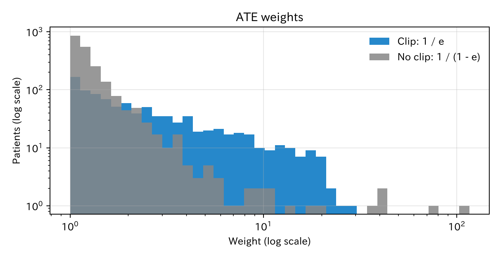
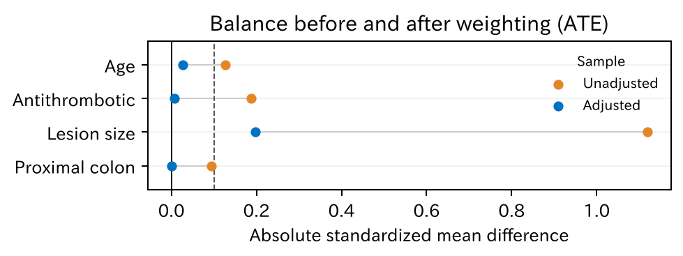
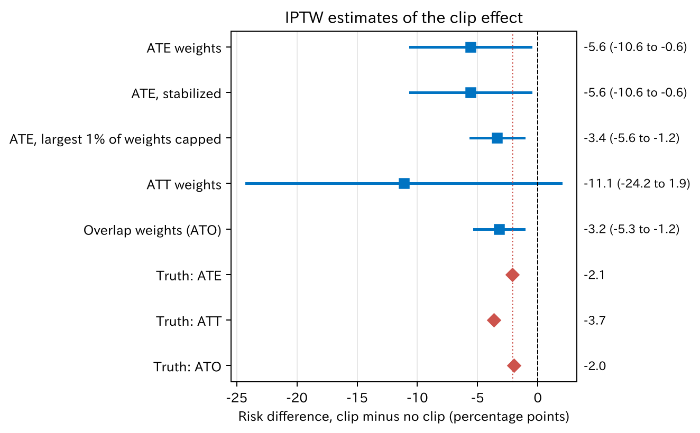

# 5. IPTW

IPTW（inverse probability of treatment weighting、治療の逆確率による重み付け）は、傾向スコアを使って**重み**をかけ、背景のそろった仮の集団を作る方法です。この章では、重みの意味、第 3 章の g-formula と同じ量になる理由、極端な重みの問題を見ます。

[← 目次](index.md) · [← 第 4 章](propensity-score-matching.md)

## 5.1 重みで仮の集団を作る {#idea}

傾向スコア $e(X)$（第 4 章）は、背景 $X$ の患者がクリップをされる確率でした。IPTW では、一人ひとりに次の重みをかけます。

| | 重み |
|--|------|
| クリップをされた患者 | $\dfrac{1}{e(X)}$ |
| クリップをされなかった患者 | $\dfrac{1}{1 - e(X)}$ |

実際に受けた治療の確率の**逆数**です。数字で見るとわかりやすくなります。

「20 mm 以上で抗血栓薬あり」の患者が 100 人いて、80 人がクリップをされたとします。この層の傾向スコアは 0.8 です。

| | 人数 | 重み | 重みをかけた人数 |
|--|------|------|------------------|
| クリップあり | 80 | 1 / 0.8 = 1.25 | 100 |
| クリップなし | 20 | 1 / 0.2 = 5 | 100 |

重みをかけると、どちらの群も 100 人、つまり**層の全員**を代表します。どの層でも同じことが起きるので、重み付けのあとは、クリップ群も非クリップ群も背景の分布が全体と同じになります。全員にクリップをした世界と、誰にもしなかった世界を、それぞれ見えている患者で作っているのです。

されにくいのにされた患者（傾向スコアが小さいのにクリップあり）は、同じ背景でクリップをされた人が少ないので、一人で多くの人を代表します。重みが大きくなるのはそのためです。

## 5.2 g-formula と同じ量になる理由 {#g-formula}

第 3 章で、層別化と回帰の標準化はどちらも g-formula を推定すると述べました。

$$
\mathrm{E}[Y(1)] = \sum_{x} \mathrm{E}[Y \mid A = 1, X = x] \, P(X = x)
$$

IPTW もこれと同じ量を推定します。上の例で確かめます。背景が $x$ の層に $n_x$ 人いて、そのうち $n_{x1}$ 人がクリップをされたとします。

- 傾向スコアは $e(x) = n_{x1} / n_x$ なので、クリップをされた人の重みは $n_x / n_{x1}$ です。
- この層のクリップ群の重みの合計は $n_{x1} \times n_x / n_{x1} = n_x$ になります。
- この層のクリップ群の出血割合を $\hat p_{1x}$ とすると、重みをかけた出血の数は $n_x \, \hat p_{1x}$ です。

全部の層で足して、全体の人数 $n$ で割ると、

$$
\frac{\sum_x n_x \, \hat p_{1x}}{n} = \sum_x \hat p_{1x} \, \frac{n_x}{n}
$$

これは g-formula そのものです。$\hat p_{1x}$ が $\mathrm{E}[Y \mid A = 1, X = x]$、$n_x / n$ が $P(X = x)$ にあたります。

違いは、何をモデルにするかです。

| 方法 | モデルにするもの | g-formula の何を求めるか |
|------|------------------|--------------------------|
| 回帰の標準化 | アウトカム（出血） | $\mathrm{E}[Y \mid A, X]$ をモデルで求める |
| IPTW | 治療の選ばれ方（クリップ） | 重みで $P(X)$ を全体にそろえる |

層が少なければ二つは一致します。変数が多く層を作れないときは、どちらかのモデルに頼ります。どちらのモデルが正しいかで、結果が変わります。

!!! note "期待値で書くと"
    $\mathrm{E}\left[\dfrac{A\,Y}{e(X)}\right] = \mathrm{E}\left[\dfrac{\mathrm{E}[A\,Y \mid X]}{e(X)}\right] = \mathrm{E}\left[\dfrac{e(X)\,\mathrm{E}[Y \mid A = 1, X]}{e(X)}\right] = \mathrm{E}\big[\mathrm{E}[Y \mid A = 1, X]\big]$

    最後の式が g-formula です。途中で $e(X) > 0$（正値性）を使って割っています。期待値の記号と繰り返し期待値の法則は[数学補 A3](math/expectation-variance.md) で扱います。

## 5.3 重みを見る {#weights}

通しの例で、ATE（average treatment effect、平均処置効果）を推定するための重みを計算します。傾向スコアのモデルは第 4 章と同じです。

=== "図"

    

    [CSV](../examples/assets/theory_bleeding/ch5_weight_summary.csv)

=== "コード"

    ```python
    from statract import propensity_weights

    ps_formula = "clip ~ age + antithrombotic + size_mm + proximal"
    ipw = propensity_weights(df, ps_formula, estimand="ATE")
    ipw.summary()     # 群ごとの重みの最小、平均、最大、有効サンプルサイズ
    ipw.weights       # 一人ひとりの重み
    ```

ほとんどの患者の重みは 1–3 ですが、クリップなしの群に 100 を超える重みの患者がいます。傾向スコアが 0.99 を超えるのに、クリップをされなかった患者です。

重みのばらつきは**有効サンプルサイズ**（effective sample size、ESS）で表せます。重みが全部同じなら実際の人数と同じで、ばらつくほど小さくなります。

$$
\text{ESS} = \frac{\left(\sum w_i\right)^2}{\sum w_i^2}
$$

| | 人数 | 重みの最大 | 有効サンプルサイズ |
|--|------|-----------|-------------------|
| クリップなし | 2073 | 105.6 | 377 |
| クリップあり | 927 | 29.4 | 406 |

クリップなしの 2073 人は、重み付けのあとは 377 人ぶんの情報しか持ちません。50 倍を超える重みは 2 人（105.6 倍と 72.4 倍）で、ごく少数の患者が結果を大きく動かせる状態です。

## 5.4 バランスを確かめる {#balance}

マッチングと同じく、重み付けのあとも標準化差（standardized mean difference、SMD）で背景がそろったかを確かめます。

=== "図"

    

    [CSV](../examples/assets/theory_bleeding/ch5_balance.csv)

=== "コード"

    ```python
    from statract import plot_love

    plot_love(ipw.balance(), "love_plot.png", threshold=0.1)
    ```

抗血栓薬と部位はほぼ 0 になりました。病変径は 1.12 から 0.20 まで減りましたが、0.1 を超えて残っています。傾向スコアのモデルが、20 mm を境にクリップが急に増える形を表せていないためです。第 4 章と同じく、モデルに病変径の曲線や「20 mm 以上か」を足すと改善します。

## 5.5 効果を推定する {#effect}

重みをかけた出血割合を、クリップあり・なしで比べます。重みの作り方をいくつか変えて、本当の値と比べました。ATT（average treatment effect on the treated、処置群での平均処置効果）と ATO（average treatment effect in the overlap population、重なり集団での平均処置効果）の重みは、[下](#estimands)で説明します。

=== "図"

    

    [CSV](../examples/assets/theory_bleeding/ch5_estimates.csv)

=== "コード"

    ```python
    from statract import propensity_weights

    ate = propensity_weights(df, ps_formula, estimand="ATE")
    stab = propensity_weights(df, ps_formula, estimand="ATE", stabilize=True)
    capped = propensity_weights(df, ps_formula, estimand="ATE", trim=0.99)
    att = propensity_weights(df, ps_formula, estimand="ATT")
    ato = propensity_weights(df, ps_formula, estimand="ATO")
    ```

| 重み | 推定するもの | 推定値（ポイント） | 95% 信頼区間 | 重みの最大 | 本当の値 |
|------|-------------|-------------------|--------|-----------|---------|
| ATE の重み | ATE | −5.6 | −10.6–−0.6 | 105.6 | −2.1 |
| 安定化した重み | ATE | −5.6 | −10.6–−0.6 | 72.9 | −2.1 |
| 上位 1% の重みを切り詰め | ATE（近似） | −3.4 | −5.6–−1.2 | 15.8 | −2.1 |
| ATT の重み | ATT | −11.1 | −24.2–1.9 | 104.6 | −3.7 |
| 重なりの重み | ATO | −3.2 | −5.3–−1.2 | 0.99 | −2.0 |

区間は頑健分散で計算しています。

### 安定化 {#stabilize}

**安定化した重み**は、重みに群の割合（クリップありなら $P(A = 1)$）を掛けたものです。重みの合計が実際の人数に近くなり、扱いやすくなります。ただし群ごとに定数を掛けるだけなので、出血割合の比較（点推定値）は変わりません。上の表でも −5.6 のままです。極端な重みの問題は、安定化では解けません [@Cole2008-pa]。

### 極端な重みと切り詰め {#trimming}

推定値が本当の値（−2.1）から大きくずれ、区間も広いのは、105.6 倍と 72.4 倍の重みがかかった 2 人など、ごく少数の患者に結果が引っぱられたためです。

大きい重みを一定の値で頭打ちにする（**切り詰め**）と、推定値は −3.4、区間は −5.6–−1.2 まで縮みました。そのかわり、重みはもう正しい逆確率ではなく、推定する対象も少しずれます。ばらつきを減らすかわりに偏りを受け入れる、という取引です。

### 推定する対象を変える {#estimands}

重みの形を変えると、**誰についての効果か**が変わります。

| 推定するもの | クリップありの重み | クリップなしの重み | 誰についての効果か |
|-------------|-------------------|-------------------|-------------------|
| ATE（平均処置効果） | $1 / e$ | $1 / (1 - e)$ | 全員 |
| ATT（処置群での平均処置効果） | $1$ | $e / (1 - e)$ | クリップをされた患者 |
| ATO（重なり集団での平均処置効果） | $1 - e$ | $e$ | どちらの治療もありうる患者 |

ATT の重みは、クリップなしの患者をクリップ群の背景に合わせます。このデータでは、クリップ群に多い大きな病変で、比べる相手がほとんどいません。そのため一人に 100 倍を超える重みがかかり、区間は −24.2–1.9 と使えないほど広くなりました。

**重なりの重み**（overlap weights）は、傾向スコアが 0.5 に近い患者、つまりどちらの治療を受けてもおかしくない患者を重く見ます。重みは 1 を超えないので、極端な重みは起きません。Li ら [@Li2018-cj] が提案しました。答えは「全員」ではなく「どちらもありうる患者」での効果になります。このデータでは推定値 −3.2、本当の値 −2.0 でした。臨床では「どちらにするか迷う患者」での効果が知りたいことも多く、その場合は自然な選択です。

!!! warning "重みの選び方は答えの選び方"
    切り詰めや重なりの重みで区間が狭くなるのは、問いを答えやすいものに変えたからです。どの集団での効果を知りたいのかを先に決め、それに合う重みを選びます。結果を見て選んではいけません。

## 5.6 マッチングと IPTW {#vs-matching}

| | マッチング | IPTW |
|--|-----------|------|
| 主に推定するもの | ATT（処置群での平均処置効果） | ATE（重みで変えられる） |
| 相手がいない患者 | 捨てる（対象が変わる） | 残すが、大きな重みになる |
| 見せ方 | マッチ後の Table 1 | 重み付けの Table 1、重みの分布 |
| 弱点 | 例数が減る | 極端な重みで不安定になる |

どちらも、傾向スコアが 0 や 1 に近い患者がいると苦しくなります。マッチングでは組ができずに外れ、IPTW では重みが大きくなります。同じ問題（正値性）が、違う形で出てくるのです。次の章で扱います。

## 文献 {#references}

教科書では、Hernán と Robins [@Hernan2020-book] の第 12 章が IPTW を扱っています。

::: {#refs}
:::

## まとめ

- IPTW は、受けた治療の確率の逆数で重みをかけ、背景のそろった仮の集団を作ります。
- 層で考えると、IPTW は層別化や回帰の標準化と同じ g-formula を推定します。違いは、治療の選ばれ方をモデルにすることです。
- 重み付けのあとも、標準化差でバランスを確かめます。重みの分布と有効サンプルサイズも見ます。
- 傾向スコアが 0 や 1 に近い患者がいると、重みが極端になり、推定が不安定になります。安定化では解けません。
- 切り詰めや重なりの重みは推定を安定させますが、推定する対象が変わります。
