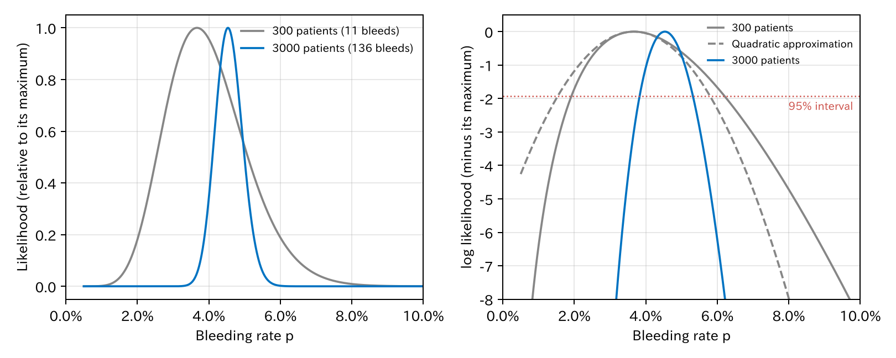
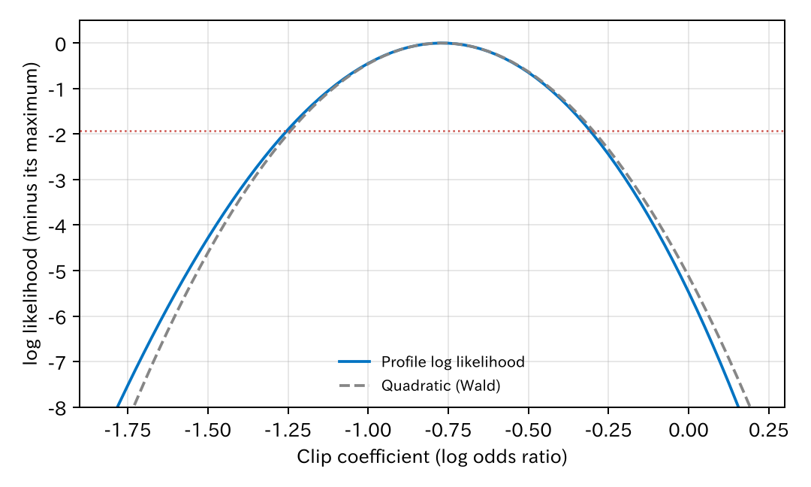
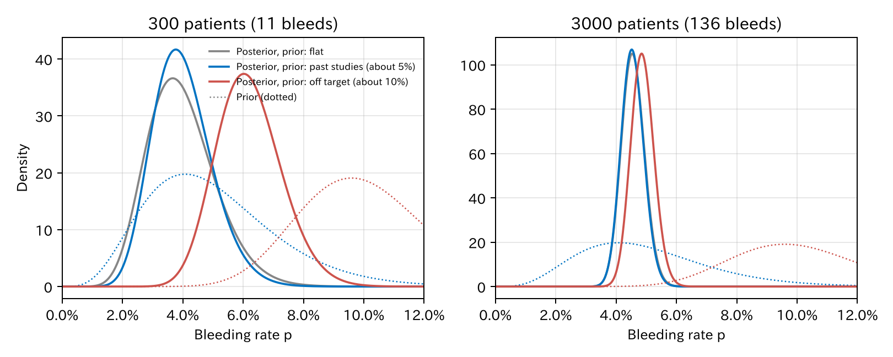
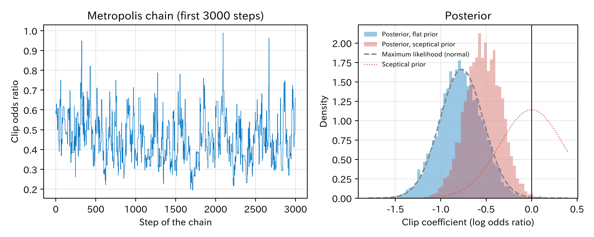

# 13. 尤度と二つの推定法：最尤法とベイズ

第 12 章で、ロジスティック回帰を「データが生まれる仕組み」として読みました。この章では、その仕組みの係数をデータからどう決めるかを扱います。鍵になるのは**尤度**（ゆうど、likelihood）です。尤度の使い方には二つの流儀があります。尤度が最も大きくなる値を選ぶ**最尤法**と、尤度に事前の知識を掛け合わせる**ベイズ推論**です。前半で最尤法を、後半でベイズ推論を扱い、最後に二つを比べます。

[← 目次](index.md) · [← 第 12 章](probability-model.md)

## 13.1 尤度とは {#likelihood}

一番簡単な場合から始めます。患者の特徴は使わず、全員の出血の確率が同じ $p$ だとします。3000 人中 136 人が出血しました。

$p$ がある値だとしたとき、**今のデータが出る確率**を考えます。出血した 136 人それぞれの確率は $p$、しなかった 2864 人は $1 - p$ なので、全員分を掛けて

$$
L(p) = p^{136} (1 - p)^{2864}
$$

です。これを $p$ の関数として見たものが**尤度**です。

- $p = 1\%$ なら、136 人も出血するデータはとても出にくいので、$L$ は小さくなります。
- $p = 20\%$ でも、136 人しか出血しないのは出にくいので、$L$ は小さくなります。
- $L$ が最も大きくなる $p$、つまり**今のデータを最も出しやすい** $p$ を推定値にします。これが**最尤推定**（maximum likelihood estimation）です。

この例では、最尤推定は $136 / 3000 = 4.5\%$ です。予想どおり、出血した割合そのものです。

尤度は「$p$ がその値である確率」ではないことに注意してください。$p$ を決めたときの**データの確率**です。$p$ の確率を考えるのはベイズ推論です（13.5）。

## 13.2 対数尤度と、その曲がり具合 {#log-likelihood}

掛け算は扱いにくいので、対数をとって足し算にします。これが**対数尤度**です。

$$
\log L(p) = \sum_i \bigl[ y_i \log p + (1 - y_i) \log (1 - p) \bigr]
$$

対数は大小を変えないので、最大になる $p$ は同じです。

3000 人全員と、その中から選んだ 300 人で、尤度と対数尤度を描きました。

=== "図"

    

    [CSV](../examples/assets/theory_bleeding/ch13_rate.csv)

=== "コード"

    ```python
    import numpy as np

    p = np.linspace(0.005, 0.14, 2701)
    loglik = 136 * np.log(p) + (3000 - 136) * np.log(1 - p)
    ```

- 3000 人の曲線は鋭く、300 人の曲線はなだらかです。データが多いほど、もっともらしい $p$ の範囲が狭くなります。
- 対数尤度の頂上の**曲がり具合**が、推定の精度を表します。鋭く曲がっていれば、頂上から少しずれただけで対数尤度が大きく下がる、つまりデータとよく合う値の範囲が狭いということです。

この曲がり具合（2 階微分、[数学補 A4](math/derivatives-maximization.md)）から**標準誤差**が出ます。

$$
\text{標準誤差} = \frac{1}{\sqrt{-\dfrac{d^2 \log L}{dp^2}}} = \sqrt{\frac{\hat p (1 - \hat p)}{n}}
$$

右の式は、二項分布の標準誤差としてよく知られた形です。尤度の曲がり具合から、同じものが出てきます。

### 二つの信頼区間 {#two-intervals}

信頼区間の作り方は二つあります。

- **Wald の区間**：推定値 ± 1.96 × 標準誤差。対数尤度を頂上の近くで放物線（2 次式）とみなした区間です（右の図の破線）。
- **尤度比の区間**：対数尤度が頂上から 1.92（$= 3.84/2$、自由度 1 のカイ 2 乗分布の 95% 点の半分）以内にある範囲です（右の図の赤い点線）。

| データ | 出血 | 最尤推定 | 標準誤差 | Wald の 95% 信頼区間 | 尤度比の 95% 信頼区間 |
|--------|------|---------|---------|----------------|----------------|
| 300 人 | 11 人 | 3.7% | 1.1% | 1.5–5.8% | 1.9–6.2% |
| 3000 人 | 136 人 | 4.5% | 0.38% | 3.79–5.28% | 3.83–5.32% |

300 人では、対数尤度が左右対称ではありません（0 の側で急に下がる）。放物線とみなす Wald の区間は、その形を無視しています。3000 人では曲線がほぼ放物線になり、二つの区間はほとんど同じです。例数が多いと尤度は放物線に近づく、というのが Wald の方法の根拠です。

下の図で、人数と出血した人の数を変えてみてください。出血割合を同じに保ったまま人数を増やすと、曲線が鋭くなり、放物線（破線）に重なっていきます。出血を 0 人にすると、標準誤差が 0 になり Wald の区間は作れませんが、尤度比の区間は作れます。

<div class="sx-widget" data-widget="likelihood">この図を動かすには JavaScript が必要です。</div>

## 13.3 係数がたくさんある場合 {#many-parameters}

ロジスティック回帰では、$p$ が患者ごとに違い、$p_i = 1/(1 + e^{-\eta_i})$ です。対数尤度は

$$
\log L(\beta) = \sum_i \bigl[ y_i \log p_i + (1 - y_i) \log (1 - p_i) \bigr]
$$

で、これを係数 $\beta_0, \beta_1, \dots$ について最大にします。式で解けないので、コンピュータが少しずつ頂上に近づきます。よく使われるのは**ニュートン法**で、今いる場所の傾きと曲がり具合から「頂上はこのあたり」と見当をつけて跳ぶ、を繰り返します。ロジスティック回帰では、これは**反復重み付き最小 2 乗法**（iteratively reweighted least squares、IRLS）と同じ計算で、R の `glm` も statract の `fit_glm` もこの方法です。

第 7 章のモデル（8 個の係数）を、全部 0 から始めて解きました。

| 反復 | 対数尤度 | クリップの係数 |
|------|---------|-------------|
| 0 | −2079.4 | 0 |
| 1 | −688.7 | −0.144 |
| 2 | −545.8 | −0.372 |
| 3 | −523.3 | −0.637 |
| 4 | −521.73 | −0.757 |
| 5 | −521.7126 | −0.76986 |
| 6 | −521.7126 | −0.76999 |

[CSV](../examples/assets/theory_bleeding/ch13_newton.csv)

5–6 回で頂上に着きました。最後の係数（−0.770、オッズ比 0.46）は、`fit_glm` の結果と同じです。

係数がたくさんあるときも、標準誤差は頂上での曲がり具合から出ます。曲がり具合は行列（**情報行列**）になり、その逆行列が係数の分散と共分散です。`fit_glm` の `.covariance` がそれです。

### 一つの係数の尤度：プロファイル尤度 {#profile}

クリップの係数だけに注目したいときは、クリップの係数をある値に固定し、ほかの係数はその条件で最大にした対数尤度を描きます。これを**プロファイル尤度**（profile likelihood）と呼びます。

=== "図"

    

=== "コード"

    ```python
    import polars as pl
    from statract import fit_glm

    reduced = "bleed ~ age + male + antithrombotic + hypertension + size_mm + proximal"
    profile = [
        fit_glm(df.with_columns((pl.col("clip") * b).alias("off")), reduced,
                family="binomial", offset="off").log_likelihood
        for b in np.linspace(-1.8, 0.2, 81)
    ]
    ```

クリップの係数を固定するには、`clip × 固定した値` を **offset**（係数を 1 に固定した項）として入れます。曲線は放物線（Wald）とほとんど重なり、二つの 95% 信頼区間（オッズ比）は 0.289–0.742（Wald）と 0.286–0.734（プロファイル尤度）です。

## 13.4 三つの検定 {#tests}

「クリップに効果はない」（係数 = 0）を検定する方法は三つあり、どれも尤度の曲線のどこを見るかの違いです。

| 検定 | 見るところ | カイ 2 乗 | $P$ 値 |
|------|----------|----------|--------|
| **Wald 検定** | 頂上の位置が 0 から標準誤差の何倍離れているか | 10.25 | 0.0014 |
| **尤度比検定** | 係数を 0 に固定すると、対数尤度がどれだけ下がるか（の 2 倍） | 10.95 | 0.0009 |
| **スコア検定** | 係数 = 0 の場所での、対数尤度の傾き | 10.44 | 0.0012 |

[CSV](../examples/assets/theory_bleeding/ch13_tests.csv)

=== "コード"

    ```python
    from statract import fit_glm, likelihood_ratio_test

    full = fit_glm(df, "bleed ~ age + male + antithrombotic + hypertension + size_mm + proximal + clip", family="binomial")
    reduced = fit_glm(df, "bleed ~ age + male + antithrombotic + hypertension + size_mm + proximal", family="binomial")
    likelihood_ratio_test(full, reduced)   # 2 × (対数尤度の差) をカイ 2 乗分布と比べる
    ```

- `fit_glm` の係数表の $P$ 値は Wald 検定です。
- 例数が多いと、三つはほぼ同じになります。少ないときは食い違い、一般には尤度比検定が最も信頼できます [@Agresti2013-book]。
- 尤度比検定は、変数のグループ（スプラインの項全体、カテゴリ変数の全水準など）をまとめて検定するのにも使えます。

## 13.5 もう一つの推定法：ベイズ推論 {#bayes}

最尤法は「データを最も出しやすい値」を一つ選びます。**ベイズ推論**（Bayesian inference）は、知りたい値そのものを確率で表します。

- データを見る前の考えを、**事前分布**（prior distribution）で表します。
- データの尤度を掛けて、**事後分布**（posterior distribution）を作ります。

$$
\underbrace{p(\theta \mid \text{データ})}_{\text{事後分布}} \;\propto\; \underbrace{L(\theta)}_{\text{尤度}} \times \underbrace{p(\theta)}_{\text{事前分布}}
$$

$\theta$（シータ）は知りたい値、$\propto$ は「比例する」です。これはベイズの定理そのものです。尤度は最尤法と同じものを使います。違うのは、尤度の頂上を探すのではなく、尤度で事前分布を**更新する**ことです。

### 出血割合で試す {#bayes-rate}

13.2 と同じ 300 人（出血 11 人）と 3000 人（出血 136 人）で、三つの事前分布を試しました。

| 事前分布 | 意味 |
|---------|------|
| 平ら | どの割合も同じくらいありうる。事前の知識を入れない |
| 過去の研究（中心 5%） | 「100 人で 5 人出血した」くらいの情報を事前に持っている |
| 外れた事前分布（中心 10%） | 「200 人で 20 人出血した」くらいの、実際とずれた思い込み |

=== "図"

    

    [CSV](../examples/assets/theory_bleeding/ch13_bayes_rate.csv)

=== "コード"

    ```python
    from scipy import stats

    # 事前分布がベータ分布 Beta(a, b) なら、事後分布も Beta(a + 出血, b + 出血なし)
    a, b = 5, 95
    posterior = stats.beta(a + 11, b + 300 - 11)
    posterior.mean(), posterior.ppf([0.025, 0.975])
    ```

| データ | 事前分布 | 事後分布の平均 | 95% 信用区間 |
|--------|---------|-------------|-----------|
| 300 人 | 平ら | 4.0% | 2.1–6.4% |
| 300 人 | 過去の研究（5%） | 4.0% | 2.3–6.1% |
| 300 人 | 外れた事前分布（10%） | 6.2% | 4.3–8.5% |
| 3000 人 | 平ら | 4.6% | 3.8–5.3% |
| 3000 人 | 過去の研究（5%） | 4.5% | 3.8–5.3% |
| 3000 人 | 外れた事前分布（10%） | 4.9% | 4.2–5.6% |

- 平らな事前分布では、事後分布は尤度とほぼ同じ形になり、最尤法の結果（3.7%、尤度比の区間 1.9–6.2%）に近くなります。
- 事前の知識が正しければ（過去の研究）、区間が少し狭くなります。
- 事前分布がずれていると、300 人では結果が引っ張られます（6.2%）。3000 人では、データが事前分布を圧倒し、どの事前分布でもほぼ同じ答えになります。

下の図で、事前分布の中心と強さ（何人分の情報にあたるか）を変えてみてください。事前の情報がデータの人数より少なければ、事後分布はほぼ尤度で決まります。多ければ、事前分布に引っ張られます。

<div class="sx-widget" data-widget="bayes-rate">この図を動かすには JavaScript が必要です。</div>

事後分布の 95% の範囲を**信用区間**（credible interval）と呼びます。「本当の割合がこの範囲にある確率は 95%」と、そのまま読めます。最尤法の信頼区間は「同じ研究を何度も繰り返すと、95% の区間が本当の値を含む」という意味で、一回の区間について確率は言えません。臨床家が信頼区間を読むときに思い浮かべているのは、たいてい信用区間の意味です。

## 13.6 係数のベイズ推定：MCMC {#mcmc}

出血割合のような簡単な場合は、事後分布が式で求まります。ロジスティック回帰の係数では式で求まらないので、事後分布から**乱数を引いて**調べます。代表的な方法が**マルコフ連鎖モンテカルロ法**（Markov chain Monte Carlo、MCMC）です。

一番簡単な MCMC の **Metropolis 法**は、次を繰り返します。

1. 今の係数の値から、少しずらした候補を作ります。
2. 候補の事後分布の高さ（尤度 × 事前分布）が今より高ければ移ります。低ければ、高さの比の確率で移ります。

これを何万回も繰り返すと、たどった値の集まりが事後分布に従います。事後分布の高い所に長く留まり、低い所にもときどき行くからです。

第 7 章のモデルで、クリップの係数の事後分布を求めました。事前分布は二つです。

- **平らな事前分布**：どの係数にも事前の知識を入れません。
- **懐疑的な事前分布**：クリップの係数だけに、平均 0、標準偏差 0.35 の正規分布を置きます。「クリップのオッズ比は、95% の確率で 0.5–2 の間。効果はないかもしれない」という慎重な考えです。

=== "図"

    

    [CSV](../examples/assets/theory_bleeding/ch13_bayes_clip.csv)

=== "コード"

    ```python
    import numpy as np
    import penalized as pen   # examples/theory_bleeding/penalized.py

    prior_sd = np.full(8, np.inf)   # 平らな事前分布
    prior_sd[7] = 0.35              # クリップだけ懐疑的な事前分布
    draws = pen.metropolis_logistic(fit.x, y, prior_sd, start=fit.coefficients,
                                    proposal_cov=fit.covariance * 2.38**2 / 8)
    np.exp(np.quantile(draws[:, 7], [0.5, 0.025, 0.975]))   # オッズ比の中央値と 95% 信用区間
    ```

| 方法 | クリップのオッズ比 | 95% 区間 | オッズ比 < 1 の確率 |
|------|---------------|---------|-----------------|
| 最尤法 | 0.46 | 0.29–0.74（信頼区間） | — |
| ベイズ、平らな事前分布 | 0.45 | 0.28–0.72（信用区間） | 99.9% |
| ベイズ、懐疑的な事前分布 | 0.59 | 0.39–0.85（信用区間） | 99.7% |

- 左の図は、連鎖がたどったオッズ比です。同じ所に留まらず、0.3–0.7 のあたりを行き来しています。これが、連鎖が事後分布の全体を回っている印です。
- 平らな事前分布の事後分布（青）は、最尤法の正規近似（灰色の破線）とほとんど重なります。例数が多く事前分布が平らなら、最尤法とベイズは同じ答えになります。
- 懐疑的な事前分布（赤）では、オッズ比が 1 の側に引き寄せられ、0.59 になりました。それでも「クリップが出血を減らす確率」は 99.7% です。慎重な事前の考えから出発しても効果があると言えるので、この結論は頑健です。

「オッズ比 < 1 の確率」は、$P$ 値とは違い、「クリップが出血を減らす確率」と直接読めます。ただしこれは、モデルと事前分布が正しいという前提での確率です。第 II 部の因果の仮定（交絡がすべて調整されていること）は、ベイズでも同じように必要です。

本格的な MCMC には、Stan、R の brms、Python の PyMC がよく使われます。連鎖が収束したかを確かめる指標（$\hat R$ など）も計算してくれます。statract には MCMC の関数はないので、この章では numpy の短い実装（`penalized.py` の `metropolis_logistic`）を使いました。

## 13.7 最尤法とベイズを比べる {#compare}

| | 最尤法 | ベイズ推論 |
|--|-------|----------|
| 答え | 尤度が最も大きい値（点）と、その曲がり具合 | 事後分布（値の確率の分布） |
| 事前の知識 | 使わない | 事前分布として入れる |
| 区間の意味 | 信頼区間：繰り返したときに 95% が本当の値を含む | 信用区間：本当の値がこの範囲にある確率が 95% |
| 計算 | ニュートン法、数回の反復 | 簡単な場合は式、普通は MCMC（時間がかかる） |
| 例数が多いとき | 同じ答えになる | 同じ答えになる |
| 例数が少ないとき | 推定が不安定、分離で無限大 | 事前分布で安定するが、事前分布の選び方で結果が変わる |

例数が多い多くの臨床研究では、二つはほぼ同じ答えを出し、計算の速い最尤法が標準です。ベイズ推論が役立つのは、次のような場面です。

- 小さな研究や、まれなアウトカムで、推定が不安定なとき（13.8、第 14 章）
- 過去の研究の結果を、正直に事前分布として取り入れたいとき
- 「効果がある確率」のように、確率で答えを伝えたいとき
- 階層モデルのように、パラメータが多く、最尤法の計算が難しいとき

事前分布の選び方で結論が変わりうるので、ベイズ推論では、平らな事前分布、懐疑的な事前分布、楽観的な事前分布など、いくつかの事前分布で結果を示すのが普通です [@Spiegelhalter2004-book]。

## 13.8 最尤推定が無限大になるとき：分離 {#separation}

最尤法がうまくいかない、臨床研究でよくある場面があります。

3000 人から 120 人を選んだ小さな研究を考えます。出血は 5 人、クリップをした 37 人は誰も出血しませんでした。この 120 人で、抗血栓薬、病変径、クリップのモデルを作ります。

| 方法 | クリップの係数 | 標準誤差 |
|------|-------------|---------|
| 最尤法（`fit_glm`） | −18.3 | 2867 |
| Firth の方法 | −2.01 | 1.57 |

[CSV](../examples/assets/theory_bleeding/ch13_separation.csv)

クリップをした人が誰も出血していないので、「クリップの効果が強いほど」データは出やすくなります。係数を −10、−100、−1000 と小さくするほど尤度は大きくなり、頂上がありません。これを**分離**（separation）と呼びます。−18.3 は、コンピュータが途中で計算をやめた場所にすぎません。標準誤差 2867 という異常な値が、その印です。

**Firth の方法**は、尤度に小さな罰を足して、係数が無限大に逃げないようにします [@Firth1993-sf; @Heinze2002-lo]。罰は、ベイズ推論（13.5）で言えば、「Jeffreys の事前分布」という特別な事前分布を置くことにあたります。この例ではオッズ比 0.13（$e^{-2.01}$）と有限の推定が得られますが、信頼区間はとても広く、5 人の出血からわかることは多くありません。R の `logistf` が標準的な実装です。statract にはまだないので、この章では numpy の短い実装（[`penalized.py`](https://github.com/mizuy/statract/blob/main/examples/theory_bleeding/penalized.py) の `firth_logistic`）を使いました。

!!! warning "標準誤差が異常に大きいときは分離を疑う"
    係数の絶対値が 10 を超える、標準誤差が係数より何桁も大きい、オッズ比の信頼区間が 0 から無限大のよう、といった結果は、分離の印です。イベントが少ない、カテゴリの一つにイベントがない、変数が多すぎる、といったときに起きます。

## 13.9 尤度はこの本のあちこちにある {#everywhere}

- **AIC**（Akaike information criterion、赤池情報量規準、第 8 章）は、最大の対数尤度に、係数の数のぶんの罰を足したものです。
- **ridge** と **LASSO**（least absolute shrinkage and selection operator、係数の絶対値の和に罰をつける正則化）は、対数尤度に罰を足して最大にする**罰付き尤度**です（第 10 章）。Firth の方法も同じ仲間です。
- **WAIC**（widely applicable information criterion、広く使える情報量規準、第 8 章）は、事後分布を使って予測の当たりを見積もります。
- **階層モデル**（第 14 章）では、施設ごとの効果を積分した尤度を最大にします。施設の分布が、施設ごとの効果の事前分布の役をします。
- **Cox 比例ハザードモデル**（第 15 章）では、ベースラインハザードが自由な関数なので普通の尤度をそのままでは使えず、**部分尤度**という別の尤度を使います。部分尤度は、ベースラインハザードについてのプロファイル尤度とも読めます。

## 文献 {#references}

教科書では、尤度は Pawitan [@Pawitan2001-book] と Agresti [@Agresti2013-book] の第 1、4、5 章、ベイズ推論は Gelman ら [@Gelman2013-book] と McElreath [@McElreath2020-book] が詳しいです。

::: {#refs}
:::

## まとめ

- 尤度は、係数を決めたときに今のデータが出る確率です。それを最大にする係数が最尤推定です。
- 対数尤度の頂上の曲がり具合から標準誤差が出ます。例数が多いと対数尤度は放物線に近づき、Wald の区間と尤度比の区間は同じになります。
- ロジスティック回帰の最尤推定は、ニュートン法（IRLS）で数回の反復で求まります。
- Wald、尤度比、スコアの三つの検定は、尤度の曲線の別の場所を見ています。迷ったら尤度比検定です。
- ベイズ推論は、尤度に事前分布を掛けて事後分布を作ります。答えは値の確率の分布で、信用区間は「本当の値がこの範囲にある確率」と読めます。
- ロジスティック回帰の事後分布は MCMC で調べます。例数が多く事前分布が平らなら、最尤法と同じ答えになります。
- 懐疑的な事前分布など、いくつかの事前分布で結果の頑健さを確かめます。
- イベントが少なく分離が起きると、最尤推定は無限大になります。Firth の方法（ベイズで言えば Jeffreys の事前分布）で対処できます。
