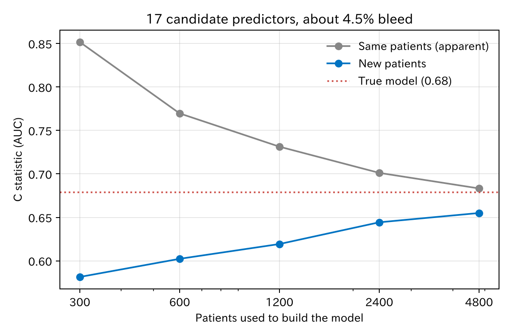
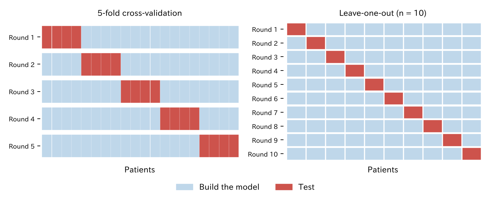
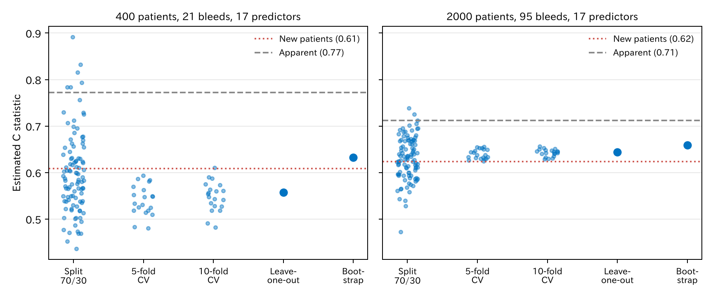

# 8. 過学習と汎化

予測モデルは、作ったデータでは実際より良く見えます。この章では、その「見かけの良さ」がどこから来るか、どう見積もるかを見ます。

[← 目次](index.md) · [← 第 7 章](prediction-model.md)

## 8.1 作ったデータでは良く見える {#apparent}

予測モデルの目的は、**まだ見ていない患者**で当てることです。この力を**汎化**（generalization）と呼びます。作ったデータでの成績（**見かけの成績**、apparent performance）は、汎化の成績より良くなります。モデルが、そのデータにたまたまあった偶然のパターンまで覚えてしまうからです。これを**過学習**（overfitting）と呼びます。

シミュレーションでは、同じ仕組みの「新しい患者」を 5 万人作れます。400 人（出血 21 人）でモデルを作り、新しい患者で確かめました。出血と関係のない検査値を 10 個足したモデルも作りました。

| モデル | 係数の数 | 1 係数あたりの出血数 | C 統計量（作ったデータ） | C 統計量（新しい患者） | 較正の傾き（新しい患者） |
|--------|---------|-------------------|----------------------|---------------------|---------------------|
| 七つの変数 | 7 | 3.0 | 0.73 | 0.64 | 0.55 |
| 七つ + 関係のない検査値 10 個 | 17 | 1.2 | 0.77 | 0.61 | 0.35 |

[CSV](../examples/assets/theory_bleeding/ch8_apparent.csv)

C 統計量は、出血した人の予測確率が出血しなかった人より高い割合です（第 9 章）。0.5 は当てずっぽう、1 は完全です。

- 関係のない検査値を足すと、作ったデータでは **良くなり**（0.73 → 0.77）、新しい患者では **悪くなりました**（0.64 → 0.61）。
- **較正の傾き**は、新しい患者で予測確率がどのくらい当たるかの指標です。1 なら理想です。1 より小さいのは、予測が極端すぎる（高い人を高く、低い人を低く見積もりすぎる）ことを意味します。0.35 は、予測の差を 3 分の 1 に縮めてやっと合う、ということです。

## 8.2 学習曲線 {#learning-curve}

モデルを作る人数を変えて、同じことを 30 回ずつ繰り返しました。変数は 17 個のままです。



[CSV](../examples/assets/theory_bleeding/ch8_learning.csv)

- 300 人で作ると、作ったデータでは 0.85 ですが、新しい患者では 0.58 です。ほとんど当てずっぽうです。
- 人数が増えるほど二つの線は近づき、本当のモデルの値（0.68）に寄っていきます。
- 作ったデータの成績は、人数が少ないほど**良く**見えます。少ない例数で「よく当たるモデルができた」は、まず疑うべきです。

## 8.3 例数の目安 {#sample-size}

過学習の強さは、例数そのものより**イベントの数**（ここでは出血の数）と、推定する係数の数の比で決まります。昔から「1 変数あたりイベント 10 以上」（events per variable、EPV）という目安が使われてきました。

しかしこれは目安にすぎません。必要な例数は、イベントの割合、期待する当たりのよさ、許せる過学習の大きさで変わります。Riley ら [@Riley2020-vc] は、これらから必要な例数を計算する方法を示しています。このデータでは、係数 7 個に出血 21 人（EPV 3）では明らかに足りません。

もう一つ大事なのは、**候補にした変数の数**です。$P$ 値で 20 個から 7 個を選んだなら、係数は 7 個でも、過学習は 20 個ぶん起きています。選ぶ過程そのものがデータに合わせているからです。

## 8.4 汎化の成績を見積もる {#validation}

現実には「新しい患者 5 万人」はいません。手元のデータだけで汎化の成績を見積もる方法を、**内部検証**（internal validation）と呼びます。主な方法は四つです。

| 方法 | やり方 | モデルを作る回数 | 長所 | 短所 |
|------|--------|---------------|------|------|
| 分割 | 例えば 7 割で作り、3 割で確かめる | 1 | わかりやすい | 例数が減る。分け方で結果が大きくぶれる |
| $k$ 分割交差検証 | $k$ 等分し、$k-1$ 個で作り 1 個で確かめるのを $k$ 回 | $k$ | データを無駄にしない | 分け方で少しぶれる |
| 一つ抜き交差検証（LOOCV） | 一人だけ抜いて作り、その一人で確かめるのを $n$ 回 | $n$ | 分け方によるぶれがない | 計算が多い。C 統計量は低めに出やすい |
| ブートストラップ | 復元抽出したデータで作り、楽観度を測って引く | 数百 | 全員でモデルを作れる。少ない例数でも使える | 考え方が少し難しい |

どの方法でも、最後に報告するモデルは**全員で作ったモデル**です。内部検証は、そのモデルを作った「手順」が新しい患者でどのくらい当たるかを見積もるものです。

## 8.5 分割 {#split}

データをランダムに二つに分け、片方（学習データ）でモデルを作り、もう片方（テストデータ）で成績を測ります。考え方はいちばん素直です。

しかし例数が少ないときは勧められません。

- モデルを作る例数が 7 割に減り、モデルそのものが悪くなる。
- 確かめる例数も 3 割しかなく、成績の推定がぶれる。
- **どう分けたか**で結果が大きく変わる（8.9 で見ます）。

「別の病院」や「後の時期」で分けるのは、ランダムな分割とは意味が違います。これは外部検証に近く、時期や施設をまたいで使えるかを確かめられます。

## 8.6 交差検証 {#cross-validation}

**交差検証**（cross-validation、CV）は、分割を何度も行って、全員を一度ずつテストに使う方法です。$k$ 分割交差検証（$k$-fold CV）では、次のようにします。

1. 患者をランダムに $k$ 個のグループ（fold）に分ける。$k$ は 5 か 10 がよく使われます。
2. 1 番目のグループを抜き、残りの $k-1$ 個でモデルを作る。抜いたグループの患者の予測確率を計算する。
3. 2 番目、3 番目、… と、全部のグループで同じことをする。
4. 全員が一度ずつ「自分を含まないモデル」で予測されたことになる。この予測で成績を計算する。



=== "コード"

    ```python
    import numpy as np
    import polars as pl
    from statract import fit_glm, roc_curve

    k = 10
    folds = np.random.default_rng(1).permutation(np.arange(dev.height) % k)
    pred = np.empty(dev.height)
    for j in range(k):
        hold = folds == j
        fit = fit_glm(dev.filter(pl.Series(~hold)), formula, family="binomial")
        pred[hold] = fit.predict(dev.filter(pl.Series(hold)), kind="response")
    roc_curve(dev["bleed"], pred).auc   # 交差検証による C 統計量
    ```

注意点が三つあります。

- **モデルを作る手順を全部、各回でやり直します。** 変数を $P$ 値で選んだなら、その選択も fold ごとに行います。全員で変数を選んでから交差検証すると、選択のぶんの過学習が見えなくなります。
- **イベントが少ないときは、予測をまとめてから計算します。** このデータを 10 分割すると、1 つのグループの出血は 2 人ほどです。グループごとの C 統計量は不安定なので、全員の予測を集めてから一つの C 統計量を計算します（上のコード）。
- **分け方でも結果が変わります。** 分割ほどではありませんが、ランダムに分け直すと値が動きます。分け方を変えて何度も繰り返し（繰り返し交差検証、repeated CV）、平均をとると安定します。

## 8.7 一つ抜き交差検証（LOOCV） {#loocv}

$k$ を患者の数 $n$ まで増やしたものが**一つ抜き交差検証**（leave-one-out cross-validation、LOOCV）です。一人だけ抜いて残りの $n-1$ 人でモデルを作り、抜いた一人を予測する。これを全員について $n$ 回繰り返します。

LOOCV の特徴は次のとおりです。

- **ランダムな要素がありません。** 誰を抜くかが決まっているので、何度やっても同じ結果になります。
- **モデルを作る例数がほとんど減りません。** $n-1$ 人で作るので、全員で作ったモデルとほぼ同じモデルを評価できます。
- **計算が多い。** モデルを $n$ 回作ります。ただし線形回帰では、一回の計算で全員ぶんの結果が出る公式があります（[数学補 A5](math/vectors-matrices.md#loocv-shortcut)）。
- **ばらつきが大きい。** $n$ 個のモデルはほとんど同じなので、結果はその一つのデータに強く依存します。データが変わると LOOCV の値も大きく変わります。
- **C 統計量は低めに出やすい。** 出血した一人を抜くと、残りのデータでは出血の割合が少し下がり、その人の予測確率が少し下がります。出血しなかった人ではこの逆が起きます。この小さなずれが毎回「不利な向き」に入るため、まとめた C 統計量が低めになります。

### LOOCV と情報量規準（AIC、WAIC） {#waic}

ここまでは C 統計量（順位が当たるか）で成績を測りました。LOOCV では、**確率そのものが当たるか**も測れます。抜いた一人 $i$ に、残りで作ったモデルがつけた確率を $p_{(-i)}$ と書きます。実際に起きた結果の確率の対数を、全員で足します。

$$
\text{LOOCV の得点} = -2 \sum_i \log P_{(-i)}(y_i)
$$

$P_{(-i)}(y_i)$ は、出血した人なら $p_{(-i)}$、出血しなかった人なら $1 - p_{(-i)}$ です。起きたことに高い確率をつけていれば小さくなります。$-2$ を掛けるのは、逸脱度（deviance）と同じ物差しにそろえるためです。小さいほど、新しい患者でよく当たるモデルです。

この量を、モデルを $n$ 回作らずに近似するのが**情報量規準**です。

- **AIC**（Akaike information criterion、赤池情報量規準）：$\text{AIC} = -2 \log L + 2k$。$\log L$ は全員で作ったモデルの対数尤度、$k$ はパラメータの数です。作ったデータでの当たり（$-2 \log L$）は楽観的なので、パラメータ 1 個あたり 2 だけ罰を足します。例数が多くなると、AIC と LOOCV の得点は漸近的に同じものになります（漸近的に同等） [@Stone1977-lz]。尤度は第 13 章で扱います。
- **WAIC**（widely applicable information criterion、広く使える情報量規準）：渡辺澄夫 [@Watanabe2010-qk] が示した、ベイズ推論（第 13 章）のための情報量規準です。

WAIC は、パラメータの**事後分布**（データを見たあとの、パラメータのありそうな値の分布）から計算します。事後分布から引いたパラメータを $\theta_1, \dots, \theta_S$ とすると、

$$
\text{WAIC} = -2 \left( \sum_i \log \frac{1}{S}\sum_s P(y_i \mid \theta_s) \;-\; \sum_i \mathrm{Var}_s\!\left[\log P(y_i \mid \theta_s)\right] \right)
$$

一つめの和は、パラメータの不確かさをならした予測の当たり（作ったデータでの当たり）です。二つめの和 $p_{\text{WAIC}}$ が罰で、患者ごとの対数尤度が事後分布の中でどのくらいぶれるかを足したものです。AIC の $k$ にあたり、**実効的なパラメータの数**と呼ばれます。

WAIC には三つの良い性質があります。

- ベイズ流の LOOCV と、例数が多いとき同じになります。モデルを $n$ 回作り直す必要はなく、事後分布から一回で計算できます。
- AIC は、モデルが「正則」（パラメータと分布が一対一に対応し、最尤推定量が正規分布に近づく）であることを前提にしています。混合分布、階層モデル、ニューラルネットワークなどの**特異なモデル**ではこの前提がくずれ、AIC が LOOCV を近似するという理論的な裏づけがなくなります。WAIC はそうしたモデルでも理論的に成り立ちます。名前の「広く使える」はこのことです。
- 事前分布の影響も含めて評価できます。

同じデータで、三つを計算しました。WAIC は、平らな事前分布のもとで、事後分布を正規分布で近似して計算しています（ベイズ推論は第 13 章で扱います）。

| データ | パラメータ数 $k$ | 見かけの逸脱度 | AIC | WAIC | $p_{\text{WAIC}}$ | LOOCV の得点 |
|--------|---------------|-------------|-----|------|-----------------|-------------|
| 400 人、出血 21 | 18 | 141.7 | 177.7 | 181.9 | 18.3 | 183.7 |
| 2000 人、出血 95 | 18 | 707.7 | 743.7 | 745.1 | 18.5 | 745.7 |

[CSV](../examples/assets/theory_bleeding/ch8_information.csv)

- 三つはどれも、見かけの逸脱度に「楽観度」を足した値になっています。2000 人では、AIC、WAIC、LOOCV がほぼ一致しました。
- 400 人では少し開き、AIC が最も小さく（楽観的に）出ました。例数が少ないと、「例数が多いとき」の近似が粗くなります。
- $p_{\text{WAIC}}$ は約 18 で、パラメータの数 18 とほぼ同じです。このモデルは正則で、事前分布も平らなので、こうなります。正則化（第 10 章）や階層モデル（第 14 章）では、$p_{\text{WAIC}}$ はパラメータの数より小さくなります。

情報量規準の値そのものには意味がありません。**同じデータで、モデルどうしを比べる**ときに使います。小さいほうが、新しい患者でよく当たると見込まれるモデルです。

WAIC のほかに、事後分布から LOOCV を直接近似する PSIS-LOO [@Vehtari2017-uy]もよく使われます。

## 8.8 ブートストラップ {#bootstrap}

ブートストラップでは、次のことを何百回も繰り返します。

1. 元のデータから、同じ人数を**復元抽出**（同じ人を何度選んでもよい）してデータを作る。
2. そのデータでモデルを作り、そのデータでの成績（見かけ）と、元のデータでの成績を測る。
3. 二つの差が、そのモデルの「楽観度」（optimism）。

楽観度の平均を、元のデータでの見かけの成績から引くと、汎化の成績の見積もりになります。

=== "コード"

    ```python
    from statract import validate_logistic

    val = validate_logistic(dev, formula, B=200, seed=8)
    # Dxy は 2 × (C − 0.5)。C = Dxy / 2 + 0.5
    ```

400 人、17 変数のモデルで行いました。

| 指標 | 見かけ | 楽観度 | 補正後 | 新しい患者（本当の値） |
|------|-------|-------|-------|-------------------|
| C 統計量 | 0.77 | 0.14 | 0.63 | 0.61 |
| 較正の傾き | 1.00 | 0.52 | 0.48 | 0.35 |

[CSV](../examples/assets/theory_bleeding/ch8_bootstrap.csv)

補正後の値は、新しい患者での本当の値にかなり近づきました。見かけの 0.77 をそのまま報告すると、大きく見誤ります。ただし、補正しても少し楽観的です。ブートストラップは過学習を「見積もる」ものであり、なくすものではありません。

## 8.9 四つの方法を比べる {#compare}

同じデータに四つの方法を使い、新しい患者での本当の値と比べました。分割は分け方を変えて 100 回、5 分割と 10 分割の交差検証は 20 回ずつ繰り返しています。一つの点が一回の結果です。比べやすいように、例数が少ない場合（400 人、出血 21 人）と、十分な場合（2000 人、出血 95 人）を並べました。変数はどちらも 17 個です。



[CSV](../examples/assets/theory_bleeding/ch8_cv_summary.csv)

| 方法 | 400 人（本当の値 0.61） | 2000 人（本当の値 0.62） |
|------|----------------------|-----------------------|
| 見かけ | 0.77 | 0.71 |
| 分割 7:3（100 回） | 平均 0.60、0.44 〜 0.89 | 平均 0.63、0.47 〜 0.74 |
| 5 分割 CV（20 回） | 平均 0.54、0.48 〜 0.59 | 平均 0.64、0.62 〜 0.66 |
| 10 分割 CV（20 回） | 平均 0.55、0.48 〜 0.61 | 平均 0.64、0.63 〜 0.66 |
| LOOCV | 0.56 | 0.64 |
| ブートストラップ | 0.63 | 0.66 |

読み取れることは次のとおりです。

- **分割は、平均すれば当たっていても、一回ごとのぶれがとても大きい。** 400 人では、たまたまの分け方で 0.44 にも 0.89 にもなります。実際の研究では分割は一回しか行わないので、どの値を引くかは運しだいです。
- **例数が十分なら、交差検証、LOOCV、ブートストラップはほぼ一致します**（0.64 〜 0.66）。見かけの 0.71 よりずっと本当の値に近く、どれを使ってもかまいません。
- **例数が少ないと、どの方法も粗くなります。** 400 人では、交差検証と LOOCV は低め（0.54 〜 0.56）、ブートストラップは少し高め（0.63）に出ました。交差検証では 1 割から 2 割少ない人数でモデルを作るので、例数が少ない所ではそれだけで成績が下がります。

つまり内部検証は、例数の不足を補ってはくれません。イベントが少ないなら、まずモデルを小さくする（変数を減らす、正則化する）ことを考えます。

## 8.10 過学習を減らすには {#reduce}

- 例数（イベントの数）を増やす。
- 候補の変数を、臨床の知識で先に絞る。$P$ 値による選択はしない。
- 係数を小さく縮める（**正則化**、第 10 章）。較正の傾きが 1 より小さいのは「係数が大きすぎる」ことなので、縮めるのは理にかなっています。
- 作ったモデルは、別の施設や別の時期の患者でも確かめる（**外部検証**）。

## 文献 {#references}

教科書では、Hastie ら [@Hastie2009-book] の第 7 章が交差検証と情報量規準を扱っています。

::: {#refs}
:::

statract での予測モデルの通しの例は、[予測モデルの較正と DCA](../examples/pred_support.md) にあります。

## まとめ

- 予測モデルは、作ったデータでは実際より良く見えます（過学習）。例数が少なく、変数が多いほど強くなります。
- 関係のない変数を足すと、作ったデータでは良くなり、新しい患者では悪くなります。
- 過学習の強さは、イベントの数と、候補にした変数の数で決まります。
- 汎化の成績は、交差検証、LOOCV、ブートストラップで見積もります。報告するのは全員で作ったモデルで、内部検証はその手順を評価します。
- 交差検証では、変数選択を含む手順全部を各回でやり直します。
- AIC と WAIC は、確率の当たりで測った LOOCV を、モデルを作り直さずに近似します。WAIC はベイズのモデルや特異なモデルでも使えます。
- 分割は一回ごとのぶれが大きく、少ない例数では勧められません。例数が十分なら、交差検証、LOOCV、ブートストラップはほぼ一致します。
- 較正の傾きが 1 より小さいのは、予測が極端すぎるしるしです。
