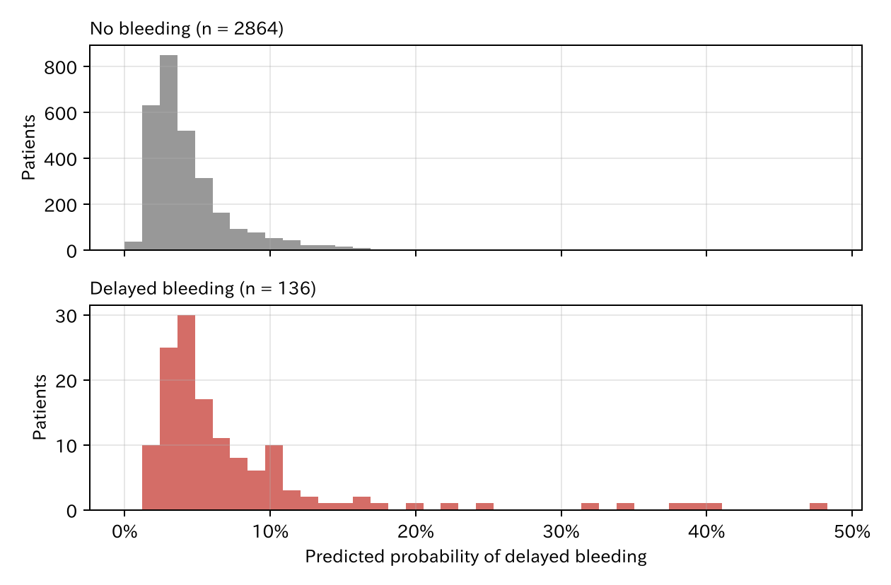

# 7. 予測モデルとしてのロジスティック回帰

第 II 部では「クリップは出血を減らすか」という因果の問いを扱いました。第 III 部の問いは「**この患者は出血するか**」です。使う道具は同じロジスティック回帰ですが、見る所と、変数の選び方が変わります。

[← 目次](index.md) · [← 第 6 章](assumptions-sensitivity.md)

## 7.1 同じ式を予測に使う {#same-equation}

第 1 章のロジスティック回帰をもう一度書きます。

$$
\log \frac{p}{1-p} = \beta_0 + \beta_1 x_1 + \beta_2 x_2 + \cdots
$$

右辺の和を**線形予測子**（linear predictor）と呼び、$\eta$（イータ）と書きます。両辺をひっくり返すと、出血の確率そのものが出ます（[数学補 A1](math/odds-log.md)）。

$$
p = \frac{1}{1 + e^{-\eta}}
$$

因果の問いでは、$\beta_1$ などの**係数**（オッズ比 $e^{\beta_1}$）が答えでした。予測の問いでは、一人ひとりの $p$、つまり**予測確率**が答えです。係数は、その確率を作るための部品にすぎません。

## 7.2 予測モデルを作る {#fit}

治療が終わった時点でわかる七つの変数を全部入れます。年齢、性別、抗血栓薬、高血圧、病変径、部位、クリップです。

=== "コード"

    ```python
    from statract import fit_glm

    fit = fit_glm(df, "bleed ~ age + male + antithrombotic + hypertension + size_mm + proximal + clip", family="binomial")
    p = fit.predict(df, kind="response")   # 一人ひとりの予測確率
    ```

[係数（オッズ比）CSV](../examples/assets/theory_bleeding/ch7_model.csv)

架空の三人に使ってみます。

| 患者 | 年齢 | 性別 | 抗血栓薬 | 高血圧 | 病変径 | 部位 | クリップ | 予測確率 |
|------|------|------|---------|--------|--------|------|---------|---------|
| A | 60 | 男性 | なし | なし | 8 mm | 遠位 | なし | 1.6% |
| B | 75 | 女性 | なし | あり | 20 mm | 近位 | あり | 3.4% |
| C | 80 | 男性 | あり | あり | 40 mm | 近位 | あり | 20.2% |

[CSV](../examples/assets/theory_bleeding/ch7_patients.csv)

C さんは 5 人に 1 人の割合で出血すると予測されます。入院で様子を見る、抗血栓薬の再開を慎重にする、などの判断に使えそうです。

## 7.3 予測確率の分布 {#distribution}

3000 人全員の予測確率を、実際に出血した人としなかった人に分けて並べます。



出血した人（下）は、全体に予測確率が高い所に寄っています。ただし重なりは大きく、出血した人の多くも予測確率 5% 前後です。出血そのものがまれ（4.5%）なので、「確実に出血する人」を当てることはできません。このモデルがどのくらい良いかは、第 8 章と第 9 章で調べます。

## 7.4 因果モデルとの違い {#vs-causal}

第 1 章で、同じロジスティック回帰に二つの使い方があると述べました。予測の目で見直します。

| | 因果のモデル（第 II 部） | 予測のモデル（第 III 部） |
|--|-----------------------|------------------------|
| 答え | クリップの係数（効果） | 一人ひとりの予測確率 |
| 変数の選び方 | DAG（directed acyclic graph、有向非巡回グラフ）で交絡因子を選ぶ | 予測の時点でわかり、当たりがよくなるもの |
| 入れてはいけない変数 | 治療のあとに決まる変数（中間因子など） | 予測の時点でまだわからない変数 |
| 良し悪しの確かめ方 | バランス、感度分析 | 新しい患者で当たるか（第 8、9 章） |
| 係数の読み方 | 因果の効果として読む | 読まない（部品にすぎない） |

### 因果でない変数も予測に役立つ {#non-causal}

このデータの高血圧は、出血の原因ではありません（第 1 章の DAG に矢印がない）。しかし、抗血栓薬を飲んでいる人に多いので、出血と関連します。抗血栓薬の情報がない場合を考えてみます。

| モデル | 高血圧のオッズ比 | $P$ 値 | 新しい患者での C 統計量 |
|--------|----------------|--------|----------------------|
| 七つ全部 | 1.27（0.84–1.94） | 0.26 | 0.667 |
| 抗血栓薬の情報がない | 1.64（1.10–2.42） | 0.014 | 0.633 |

[CSV](../examples/assets/theory_bleeding/ch7_hypertension.csv)

抗血栓薬がわからないと、高血圧が抗血栓薬の「代わり」になり、有意な予測因子として現れます。予測には役立ちます。しかし「高血圧を治療すれば出血が減る」とは言えません。C 統計量（第 9 章）は、新しい患者で当たるかの指標です。

予測モデルの係数が因果の効果に見えても、そう読んではいけない、という例です。クリップの係数（オッズ比 0.46）も同じで、このモデルを「クリップをするかどうか」の判断に使うのは誤りです。それは因果の問い（第 II 部）です。

### 予測の時点を決める {#timing}

予測モデルでは、**いつ**予測するかで使える変数が決まります。

- 治療の前（クリップをするか決める前）に予測するなら、クリップは入れられません。
- 治療のあと（入院させるか決める時）なら、クリップを入れられます。

ここでは治療のあとの予測を考えています。

## まとめ

- 予測では、ロジスティック回帰の答えは係数ではなく、一人ひとりの予測確率です。
- 予測確率は、線形予測子 $\eta$ を $1/(1+e^{-\eta})$ に入れて求めます。
- 変数は、予測の時点でわかり、当たりがよくなるものを選びます。因果である必要はありません。
- そのかわり、予測モデルの係数を因果の効果として読んではいけません。
- モデルの良し悪しは、作ったデータではなく新しい患者で確かめます（次章）。
