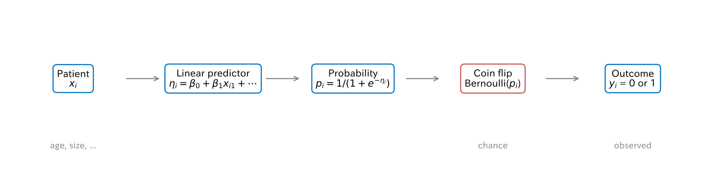
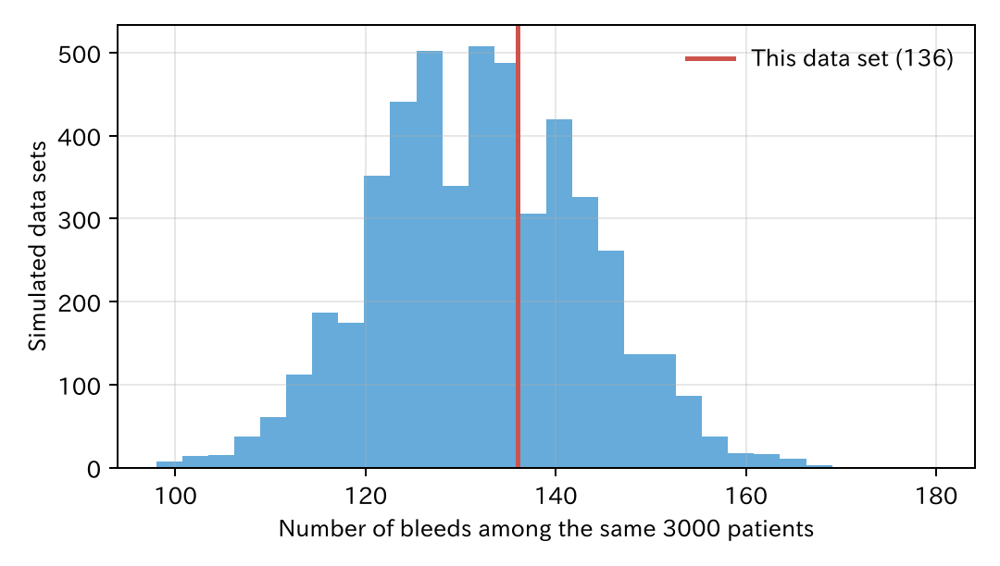
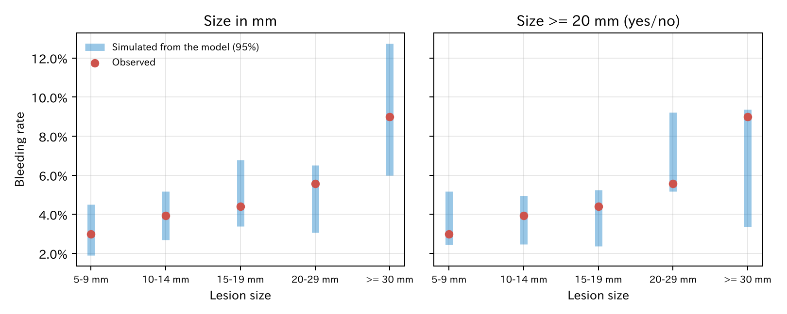
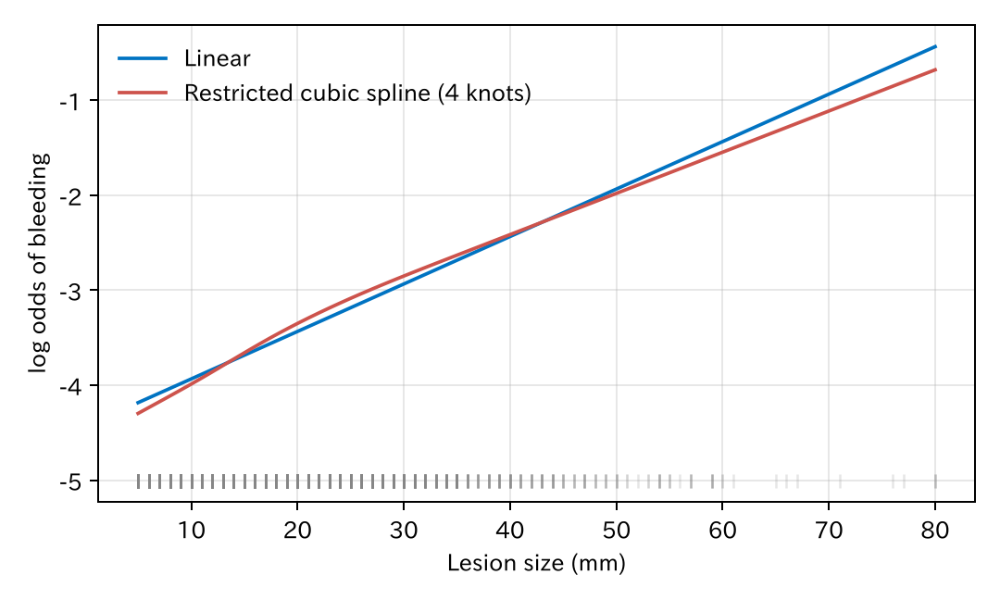

# 12. 確率モデルとしてのロジスティック回帰

第 I–III 部では、ロジスティック回帰を「因果の効果を推定する道具」や「確率を予測する道具」として使いました。第 IV 部では、同じ式を**データが生まれる仕組みの説明**として読み直します。この見方をすると、係数をどう推定するか（第 13 章、最尤法とベイズ）、施設差のようなデータの構造をどう扱うか（第 14 章）、生存時間のような別の種類のアウトカムをどう扱うか（第 15 章）が、同じ考え方で理解できます。

[← 目次](index.md) · [← 第 11 章](trees-ensembles.md)

## 12.1 データが生まれる仕組みとして読む {#generative}

ロジスティック回帰は、一人ひとりの出血を次の手順で起きる出来事とみなします。

$$
\begin{aligned}
\eta_i &= \beta_0 + \beta_1 x_{i1} + \beta_2 x_{i2} + \cdots \\
p_i &= \frac{1}{1 + e^{-\eta_i}} \\
Y_i &\sim \mathrm{Bernoulli}(p_i)
\end{aligned}
$$



- 患者の特徴 $x_i$ から線形予測子 $\eta_i$ が決まり、それが確率 $p_i$ になります（第 7 章）。
- 最後に、確率 $p_i$ で表が出る**硬貨を一回投げて**、出血するかどうかが決まります。$\mathrm{Bernoulli}(p_i)$（ベルヌーイ分布）は、確率 $p_i$ で 1、$1 - p_i$ で 0 になる分布です。

つまりモデルは、**決まった部分**（$p_i$）と**偶然の部分**（硬貨）の二つでできています。同じ特徴の患者でも、出血する人としない人がいるのは、偶然の部分があるからです。モデルが説明するのは一人ひとりの結果ではなく、その確率です。

このように、データの生まれ方を確率の言葉で書いたものを**確率モデル**（probability model）、または**統計モデル**と呼びます。

## 12.2 種明かし：この本のデータの作り方 {#truth}

この本の通しの例は、実はこの仕組みで作った模擬データです。出血は、次の式の確率で硬貨を投げて決めました。

| 項 | 本当の値（対数オッズ） | 本当のオッズ比 | 第 7 章の推定（オッズ比） |
|----|---------------------|-------------|----------------------|
| 年齢（1 歳あたり） | 0.015 | 1.015 | 1.007 |
| 男性 | 0 | 1 | 1.00 |
| 抗血栓薬 | 0.9 | 2.46 | 2.56 |
| 高血圧 | 0 | 1 | 1.27 |
| 病変径（1 mm あたり） | 0.055 | 1.057 | 1.051 |
| 近位 | 0.6 | 1.82 | 1.79 |
| クリップ（20 mm 未満） | −0.2 | 0.82 | 0.46（全体で一つ） |
| クリップ（20 mm 以上） | −1.0 | 0.37 | 〃 |

[本当の値 CSV](../examples/assets/theory_bleeding/ch12_truth.csv) · [データを作るコード](https://github.com/mizuy/statract/blob/main/examples/theory_bleeding/build.py)

- 推定は、本当の値の近くに散らばっています。ずれは偶然の部分（硬貨）によるものです。
- 男性と高血圧は、本当は出血と関係がありません。高血圧の推定が 1.27 になったのは偶然です（$P = 0.26$）。モデルには抗血栓薬が入っているので、抗血栓薬を通じた関連は調整で閉じられています（第 7 章）。
- クリップの効果は、本当は病変径で違います。第 7 章のモデルは一つの係数しか持たないので、その平均のような値（0.46）を推定しています。モデルが本当の仕組みと違っていても、推定はできてしまうことに注意してください。

実際の臨床データでは、本当の仕組みはわかりません。それでも、「データはこういう仕組みで生まれた」と仮定して分析している、という点は同じです。

## 12.3 同じ患者でも、結果は毎回違う {#replicates}

本当の確率 $p_i$ を知っているので、**同じ 3000 人に硬貨を投げ直す**ことができます。5000 回投げ直して、出血の人数を数えました。

=== "図"

    

    [CSV](../examples/assets/theory_bleeding/ch12_replicates.csv)

=== "コード"

    ```python
    import numpy as np

    rng = np.random.default_rng(12)
    counts = rng.binomial(1, p_true, size=(5000, len(p_true))).sum(axis=1)
    ```

- 患者も確率も同じなのに、出血の人数は 111 人から 154 人（95% の範囲）まで変わります。平均は 132 人です。
- 実際のデータの 136 人は、その中のよくある一回です。

この偶然のぶれが、推定の**ばらつき**のもとです。データを取り直せば、係数の推定も変わります。標準誤差や信頼区間は、このぶれの大きさを、手元の一回のデータから見積もったものです（第 13 章）。

## 12.4 当てはめたモデルからデータを作る {#check}

本当の確率がわからない実際のデータでも、**当てはめたモデルの予測確率**で硬貨を投げれば、「このモデルが正しいとしたら、どんなデータが出るか」を作れます。それを実際のデータと比べると、モデルの確認になります [@Gelman2020-book]。

二つのモデルで試しました。病変径をそのまま（mm で）入れたモデルと、病変径を「20 mm 以上か」の二値にしたモデルです。病変径のグループごとに、実際の出血割合（赤）と、モデルから作ったデータでの出血割合の 95% の範囲（青）を比べます。

=== "図"

    

    [CSV](../examples/assets/theory_bleeding/ch12_check.csv)

=== "コード"

    ```python
    import numpy as np
    from statract import fit_glm

    fit = fit_glm(df, "bleed ~ age + male + antithrombotic + hypertension + size_mm + proximal + clip", family="binomial")
    p_hat = fit.predict(df, kind="response")
    rng = np.random.default_rng(1)
    fake = rng.binomial(1, p_hat, size=(1000, len(p_hat)))   # モデルが作る 1000 組のデータ
    ```

- 病変径をそのまま入れたモデル（左）では、実際の割合はどのグループでも青の範囲の真ん中あたりにあります。
- 二値にしたモデル（右）は、20 mm 未満を全部同じ、20 mm 以上を全部同じと扱います。実際には 5–9 mm で低く、30 mm 以上で高いので、両端のグループで赤い点が青の範囲の端に来ています。
- AIC（Akaike information criterion、赤池情報量規準、第 8 章）も、そのまま入れたモデル 1059.4、二値にしたモデル 1072.2 で、そのまま入れたほうが良いモデルです。

連続変数を二値にすると、情報が捨てられ、モデルがデータに合わなくなります [@Royston2006-qt]。臨床研究では「20 mm 以上」のような区切りがよく使われますが、モデルには連続のまま入れるのが基本です。

## 12.5 モデルが置いている仮定 {#assumptions}

ロジスティック回帰は、データの生まれ方について次のことを仮定しています。

1. **患者どうしは独立です。** 一人の硬貨の結果は、ほかの人の結果に影響しません。同じ施設、同じ内視鏡医の患者は似た結果になりやすいので、この仮定がくずれることがあります。これを扱うのが第 14 章の階層モデルです。
2. **連続変数は、対数オッズに直線で効きます。** 病変径が 10 mm 増えると、どこから増えても対数オッズは同じだけ増える、という仮定です。
3. **効果は足し算です。** 交互作用を式に書かない限り、クリップの効果はどの患者でも同じとみなします。このデータでは本当は病変径で違うので、この仮定はくずれています（12.2）。
4. **アウトカムはベルヌーイ分布に従います。** 二値のアウトカムなら、これは自然に成り立ちます。

### 直線でよいかを確かめる：スプライン {#spline}

2 の仮定は、**制限付き 3 次スプライン**（restricted cubic spline）で確かめられます。病変径を、なめらかに曲がる曲線として入れる方法です。両端は直線になるように制限するので、データの少ない端で暴れにくくなっています [@Harrell2015-book]。

=== "図"

    

    [検定 CSV](../examples/assets/theory_bleeding/ch12_spline_test.csv) · [AIC CSV](../examples/assets/theory_bleeding/ch12_models.csv)

=== "コード"

    ```python
    from statract import fit_glm, spline_test

    fit = fit_glm(
        df,
        "bleed ~ age + male + antithrombotic + hypertension + rcs(size_mm, 4) + proximal + clip",
        family="binomial",
    )
    spline_test(fit, "rcs(size_mm, 4)")   # 項全体と、直線からのずれ（非線形部分）の検定
    ```

スプラインの曲線は直線とほとんど重なり、直線からのずれの検定は $P = 0.74$ でした。AIC も直線のほうが小さく（1059.4 と 1062.8）、直線で十分です。本当の仕組みも直線なので、正しい結論です。

年齢や検査値のように、効き方が曲がっていそうな変数では、最初からスプラインで入れておくのが安全です。曲がっているのに直線で入れると、12.4 の二値化と同じように、モデルがデータに合わなくなります。

## 12.6 ほかのアウトカムでも同じ形 {#glm}

ロジスティック回帰の三つの部分（線形予測子、確率への変換、偶然の部分の分布）を取りかえると、ほかの種類のアウトカムも同じ形で扱えます。これを**一般化線形モデル**（generalized linear model、GLM）と呼びます [@McCullagh1989-book]。

| アウトカム | 例 | 偶然の部分の分布 | 変換（リンク関数） | statract |
|-----------|----|---------------|-----------------|----------|
| 二値 | 出血した／しない | ベルヌーイ（二項） | ロジット $\log\frac{p}{1-p}$ | `family="binomial"` |
| 連続 | 術後のヘモグロビン値 | 正規 | そのまま | `family="gaussian"` |
| 件数 | 一年間の再入院の回数 | Poisson | 対数 $\log \mu$ | `family="poisson"` |
| 正の連続で右に長い | 入院費用 | ガンマ | 対数 | `family="gamma"` |

普通の線形回帰も、偶然の部分を正規分布にした GLM の一つです。Poisson 回帰は、第 15 章で生存時間を扱うときにもう一度出てきます。

どの GLM でも、係数はデータの尤度を使って決めます。その方法には、最尤法とベイズ推論の二つがあります。それが[次の章](likelihood.md)です。

## 文献 {#references}

教科書では、Gelman ら [@Gelman2020-book] の第 5、11 章と、Harrell [@Harrell2015-book] の第 2 章が、この章の内容に近いです。

::: {#refs}
:::

## まとめ

- ロジスティック回帰は、「特徴から確率が決まり、その確率で硬貨を投げて結果が決まる」というデータの生まれ方のモデルです。
- この本の例は、まさにこの仕組みで作ったデータです。推定は本当の値の近くに、偶然のぶんだけ散らばります。
- 同じ患者でも結果は毎回違います。このぶれが推定のばらつきのもとです。
- 当てはめたモデルからデータを作って実際のデータと比べると、モデルの確認になります。連続変数の二値化は、モデルを悪くします。
- 独立、直線、足し算という仮定を置いています。直線かどうかはスプラインで確かめられます。
- 分布とリンク関数を取りかえると、件数や連続値も同じ形（GLM）で扱えます。
