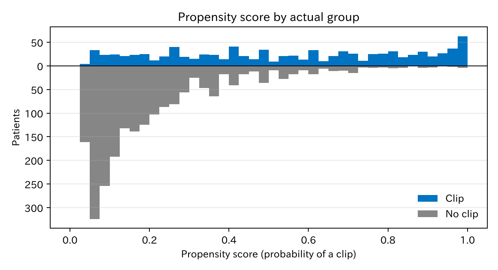
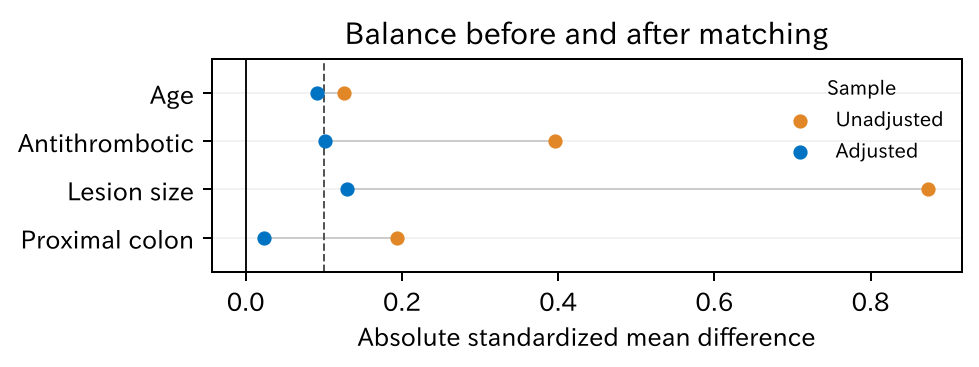

# 4. 傾向スコアマッチング

傾向スコアマッチングは「高度な統計手法」ではありません。治療の選ばれ方の偏り（交絡）を調整して、**比べられる二つの集団を作る**方法です。この章では、バランシングスコアという考え方から傾向スコアを導き、通しの例でマッチングを行います。

[← 目次](index.md) · [← 第 3 章](adjustment-methods.md)

## 4.1 背景がそろった相手を探す {#idea}

クリップをした患者一人ひとりに、背景が**まったく同じ**でクリップをしなかった患者を見つけられれば、その組どうしの比較は公平です。ところが、交絡因子が増えるとこれはすぐに不可能になります。年齢 60 通り、病変径 63 通り、抗血栓薬 2 通り、部位 2 通りだけで、組み合わせは 1 万 5120 通りです。3000 人のデータでは、ほとんどの組み合わせに一人もいません（第 3 章の層別化と同じ問題です）。

## 4.2 バランシングスコア {#balancing-score}

そこで、「全部の変数が同じ」のかわりに、「ある一つの値が同じ」相手を探すことを考えます。どんな値ならよいでしょうか。

交絡因子をまとめて $X$ と書きます。ある値 $b(X)$ が同じ患者どうしで、クリップ群と非クリップ群の $X$ の分布が同じになるとき、$b(X)$ を**バランシングスコア**と呼びます。

$$
X \perp A \mid b(X)
$$

$\perp$ は「無関係（独立）」、$\mid b(X)$ は「$b(X)$ が同じ人たちの中で」という意味です。$b(X)$ をそろえれば、$X$ のすべてが（平均として）そろう、ということです。

- $X$ そのものは、いちばん細かいバランシングスコアです（全部そろえる）。
- いちばん粗いバランシングスコアが**傾向スコア**です。

$$
e(X) = P(A = 1 \mid X)
$$

その患者の背景 $X$ のもとで、クリップをされる確率です。Rosenbaum と Rubin [@Rosenbaum1983-sk] は次のことを示しました。

!!! note "傾向スコアの性質"
    $X$ で調整すれば交換可能になるなら、傾向スコア $e(X)$ だけで調整しても交換可能になる。

何十個の交絡因子があっても、**一つの数**でそろえればよいことになります。傾向スコアが同じ二人は、一人がクリップをされ、もう一人がされなかったのは「同じ確率のくじで、たまたま結果が分かれた」とみなせます。ランダム化を、傾向スコアの層ごとにまねしていることになります。

## 4.3 傾向スコアを推定する {#estimate}

本当の傾向スコアはわからないので、データから推定します。普通は、クリップの有無をアウトカムにしたロジスティック回帰を使います。

$$
\log \frac{e(X)}{1 - e(X)} = \alpha_0 + \alpha_1 \cdot \text{年齢} + \alpha_2 \cdot \text{抗血栓薬} + \alpha_3 \cdot \text{病変径} + \alpha_4 \cdot \text{近位}
$$

第 1 章と同じロジスティック回帰ですが、今度はアウトカムが**出血ではなくクリップ**です。

[傾向スコアモデルのオッズ比 CSV](../examples/assets/theory_bleeding/ch4_ps_model.csv)

抗血栓薬（オッズ比 [OR] 4.5）、病変径（1 mm あたり OR 1.18）、近位結腸（OR 2.0）でクリップが選ばれやすいことがわかります。

傾向スコアモデルを作るときの注意です。

- 入れる変数は DAG（有向非巡回グラフ、第 2 章）で選びます（交絡因子と、アウトカムの原因）。クリップのあとに決まる変数は入れません。
- 目的は**バランスをとること**で、クリップを当てることではありません。$P$ 値で変数を選んだり、C 統計量でモデルの良し悪しを判断したりはしません。良し悪しは、マッチ後のバランス（4.6）で判断します。

## 4.4 重なりを見る {#overlap}

マッチングの前に、二つの群の傾向スコアの分布を並べます。

=== "図"

    

=== "コード"

    ```python
    from statract import match_sample

    matched = match_sample(df, "clip", ["age", "antithrombotic", "size_mm", "proximal"], caliper=0.2)
    frame = matched.frame()   # distance 列が傾向スコア
    ```

非クリップ群（下）は傾向スコアの低い所に集まり、クリップ群（上）は全体に広がっています。傾向スコアが 0.9 を超える所にはクリップ群が多く、非クリップ群はほとんどいません。大きな病変で抗血栓薬を飲んでいる患者は、ほぼ全員がクリップされているからです。この所では、比べる相手がいません（**正値性**の問題）。

## 4.5 マッチングする {#matching}

ここでは最もよく使われる方法をとります。

- クリップ群の一人ひとりに、傾向スコアがいちばん近い非クリップ群の一人を組にする（1 対 1 最近傍）。
- 一度組にした相手は使わない（非復元）。
- 傾向スコアの差が、その標準偏差の 0.2 倍（**キャリパー**）より大きい組は作らない。

クリップ群 927 人のうち、組ができたのは **616 人**でした。311 人は、近い相手がいなかったので外れました。外れた患者は病変径の中央値 32 mm、傾向スコアの平均 0.86 で、組ができた患者（18 mm、0.39）よりずっと「クリップされやすい」患者です。

!!! warning "誰についての答えか"
    マッチングで推定するのは ATT（average treatment effect on the treated、処置群での平均処置効果。ここではクリップをされた患者での効果）です。ただしキャリパーで外れた患者がいると、答えは「**組ができたクリップ群**での効果」になります。このデータでは、クリップがいちばん効くはずの大きな病変が、多く外れました。

Austin [@Austin2011-dk] は、傾向スコアのロジットの標準偏差の 0.2 倍をキャリパーにすることを勧めています。ここでは簡単のため、傾向スコアそのものの標準偏差を使っています。

## 4.6 バランスを確かめる {#balance}

マッチングがうまくいったかは、組にした集団で背景がそろったかで判断します。指標には**標準化差**（standardized mean difference、SMD）を使います。二つの群の平均の差を、標準偏差で割ったものです。0.1 未満がそろった目安です。

=== "図"

    

    [CSV](../examples/assets/theory_bleeding/ch4_balance.csv)

=== "マッチ前の Table 1"

    --8<-- "examples/assets/theory_bleeding/ch4_table1_before_gt.md"

=== "マッチ後の Table 1"

    --8<-- "examples/assets/theory_bleeding/ch4_table1_after_gt.md"

=== "コード"

    ```python
    from statract import plot_love, write_tableone_artifacts

    balance = matched.balance()
    plot_love(balance.rename({"smd_all": "diff_unadjusted", "smd_matched": "diff_adjusted"}), "love_plot.png")

    kept = matched.frame().filter(pl.col("weights") > 0)
    write_tableone_artifacts(out, "table1_after", df=kept, params=params, hue="clip", add_smd=True)
    ```

この図を **Love plot** と呼びます。マッチ前は病変径の標準化差が 0.87、抗血栓薬が 0.40 と大きくずれていました。マッチ後はほとんどが 0.1 前後になりました。病変径はまだ 0.13 残っています。その場合は、キャリパーを狭める、傾向スコアモデルに病変径の曲線（スプラインなど）を足す、20 mm 以上かどうかで完全一致させる、などを試します。

バランスの確認に $P$ 値は使いません。$P$ 値は例数で変わるので、ずれの大きさを表さないからです。

## 4.7 効果を推定する {#effect}

組にした 616 組で出血割合を比べます。

| | 出血の割合 |
|--|-----------|
| 非クリップ（616 人） | 6.3% |
| クリップ（616 人） | 4.4% |
| リスク差 | −1.9 ポイント（95% CI −4.5 〜 0.6） |

[CSV](../examples/assets/theory_bleeding/ch4_matched_summary.csv)

組ができたクリップ群 616 人での本当の効果は −2.3 ポイントで、推定値はこれに近い値です。区間が 0 をまたぐのは、外した 311 人のぶん例数が減ったためでもあります。

ここでは簡単のため、区間を頑健分散で計算しています。組（ペア）の対応を考えたクラスター頑健分散を使うこともあります。

## 4.8 傾向スコアマッチングの限界 {#limits}

- **測っていない交絡は調整できません**。傾向スコアは測った変数の要約にすぎません。
- **組ができない患者を捨てます**。答えの対象が変わり、例数も減ります。
- **傾向スコアのモデルに頼ります**。ただし良し悪しはバランスで確かめられます。
- マッチングは、効果を推定する前に背景をそろえて見せられるのが長所です。マッチ後の Table 1 を示せば、読者も比較の公平さを確かめられます。

## 文献 {#references}

::: {#refs}
:::

statract でのマッチングの通しの例は、[傾向スコアマッチング（RHC）](../examples/psm_rhc.md) にあります。

## まとめ

- バランシングスコアは、その値が同じ患者どうしで背景の分布がそろう値です。傾向スコアはその中でいちばん粗いものです。
- 交絡因子で調整すれば交換可能なら、傾向スコアだけで調整しても交換可能です。多くの変数を一つの数にまとめられます。
- 傾向スコアは、治療をアウトカムにしたロジスティック回帰で推定します。目的は予測ではなくバランスです。
- マッチングの前に重なりを、あとにバランス（標準化差、Love plot、マッチ後の Table 1）を確かめます。
- キャリパーで外れた患者がいると、答えの対象が変わります。

次の[第 5 章](iptw.md)では、傾向スコアを重みとして使います。
