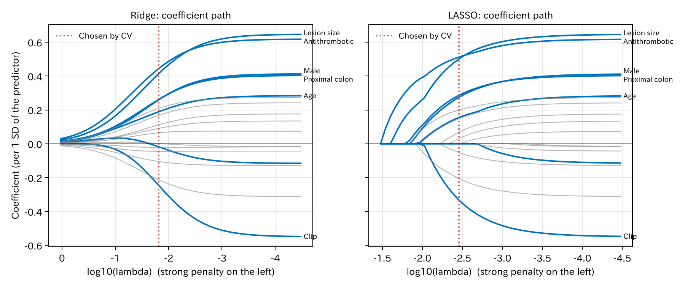
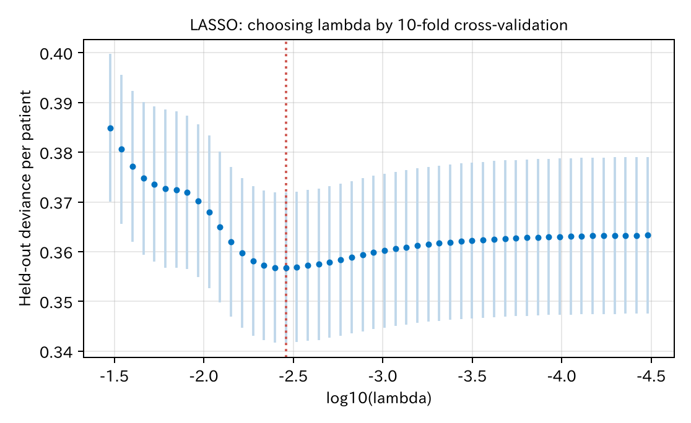
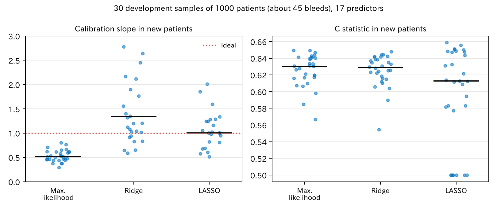

# 10. 正則化

第 8 章で、例数が少ないと予測が極端になる（較正の傾きが 1 より小さい）ことを見ました。係数が大きすぎるのです。それなら、係数を**わざと小さく**推定すればよいのではないでしょうか。これが**正則化**（regularization）、または**縮小推定**（shrinkage）の考え方です。

[← 目次](index.md) · [← 第 9 章](discrimination-calibration.md)

## 10.1 罰をつけて推定する {#penalty}

普通のロジスティック回帰（最尤法）は、データへの当てはまり（対数尤度）が最も良くなる係数を選びます。正則化では、当てはまりに**係数の大きさへの罰**を足して、その合計を最小にします。

$$
\text{最小にするもの} = -\frac{1}{n}\log L(\beta) \;+\; \lambda \times \text{罰}(\beta)
$$

罰の形で名前が変わります。

| 方法 | 罰 | 係数への効き方 |
|------|----|-------------|
| **ridge**（リッジ） | $\frac{1}{2}\sum_j \beta_j^2$（2 乗の和） | すべての係数を 0 に向けて少しずつ縮める。0 にはならない |
| **LASSO**（least absolute shrinkage and selection operator、係数の絶対値の和に罰をつける正則化）[@Tibshirani1996-yi] | $\sum_j \lvert\beta_j\rvert$（絶対値の和） | 縮めるうえに、小さい係数をちょうど 0 にする。変数選択も同時に行う |
| elastic net | 二つの混合 | 中間 |

$\lambda$（ラムダ）は罰の強さです。$\lambda = 0$ なら普通の最尤法、$\lambda$ を大きくするほど係数は 0 に近づき、最後は全員に同じ確率（平均）を言うだけのモデルになります。

使うときの決まりが二つあります。

- **切片には罰をつけません。** 切片は全体の出血割合を決めるだけで、過学習の原因ではないからです。
- **変数の単位をそろえます**（標準化：平均 0、標準偏差 1）。罰は係数の大きさにかかるので、年齢を「歳」で測るか「10 歳」で測るかで罰の効き方が変わってしまいます。

## 10.2 係数の経路 {#path}

1000 人（出血 48 人）のデータで、17 個の変数（臨床の 7 個と、出血と関係のない検査値 10 個）を入れたモデルを作りました。$\lambda$ を大きい値から小さい値へ動かしたときの係数の動きを、**経路図**（coefficient path）と呼びます。

=== "図"

    

    [係数の比較 CSV](../examples/assets/theory_bleeding/ch10_coefficients.csv)

=== "コード"

    ```python
    import numpy as np
    import penalized as pen   # examples/theory_bleeding/penalized.py

    xs, mean, sd = pen.standardize(x)            # 標準化
    lam_max = pen.lambda_max(xs, y)              # これ以上なら LASSO の係数は全部 0
    lambdas = lam_max * np.logspace(0, -3, 50)
    b0, beta = pen.logistic_path(xs, y, lambdas, penalty="lasso")
    ```

青が臨床の 7 変数、灰色が関係のない検査値です。図の左ほど罰が強く、右端が普通の最尤法です。

- ridge（左）では、罰を強めるとすべての係数がなめらかに 0 へ近づきます。
- LASSO（右）では、罰を強めると係数が**一つずつ 0 になって**消えていきます。最後まで残るのは病変径と抗血栓薬、つまり本当に効いている変数です。
- 検査値（灰色）も、最尤法では 0.3 近い係数を持っています。これは偶然を覚えたぶんです。

statract には正則化の関数がまだないので、この章では numpy で書いた短い実装（[`penalized.py`](https://github.com/mizuy/statract/blob/main/examples/theory_bleeding/penalized.py)）を使っています。R の glmnet と同じ考え方の計算です。

## 10.3 λ を交差検証で選ぶ {#choose-lambda}

罰の強さ $\lambda$ は、データから決めます。普通は交差検証（第 8 章）を使います。$\lambda$ の候補ごとに、10 分割交差検証で「抜いた患者での逸脱度」（確率の当たり）を計算し、最も小さい $\lambda$ を選びます。



縦線は 1 標準誤差の幅です。曲線の底は平らで、底の位置にも不確かさがあります。底より少し罰の強い側で、誤差の範囲に入る最大の $\lambda$ を選ぶ方法（1-SE ルール）もあります。

選んだ $\lambda$ で、新しい患者 5 万人に使いました。

| モデル | 係数が 0 でない変数 | うち関係のない検査値 | C 統計量 | 較正の傾き |
|--------|-----------------|-----------------|---------|-----------|
| 最尤法 | 17 | 10 | 0.638 | 0.45 |
| ridge | 17 | 10 | 0.641 | 0.65 |
| LASSO | 12 | 6 | 0.647 | 0.63 |

[CSV](../examples/assets/theory_bleeding/ch10_single.csv)

- 較正の傾きは 0.45 から 0.6 台に改善しました。予測の極端さが和らいでいます。
- C 統計量はほとんど変わりません。正則化は主に**較正**を良くするもので、識別を大きく良くするものではありません。
- LASSO は検査値を 4 個消しましたが、6 個は残しました。LASSO の変数選択は完全ではありません。臨床の変数でも、真のモデルでは係数が 0 の男性と高血圧のうち、高血圧は 0 になりましたが、男性は残りました（係数 0.28）。

## 10.4 一回では当てにならない {#unstable}

上の結果は、たまたま手に入った一つのデータでの話です。同じ人数（1000 人）のデータを 30 回作り直し、毎回同じことをしました。ただし計算を軽くするため、ここでは $\lambda$ を 5 分割交差検証・候補 30 個で選んでいます（10.3 は 10 分割・候補 50 個）。



[CSV](../examples/assets/theory_bleeding/ch10_repeats_summary.csv)

| モデル | 較正の傾き（中央値） | 傾きの範囲（10–90 パーセンタイル） | C 統計量（中央値） |
|--------|-----------------|------------------------------|---------------|
| 最尤法 | 0.51 | 0.38–0.66 | 0.630 |
| ridge | 1.34 | 0.83–5.5 | 0.629 |
| LASSO | 1.01 | 0.61–1.59 | 0.613 |

（LASSO の 30 回のうち 7 回は、すべての係数が 0 のモデルが選ばれました。この 7 回は傾きを計算できないので、傾きの中央値と範囲（23 回分）からは除いています。一方、C 統計量の中央値には、この 7 回を C = 0.50 として含めています。7 回を除いた 23 回だけで計算すると、LASSO の C 統計量の中央値は 0.631 です。）

- 最尤法は、**毎回**較正の傾きが 1 より小さくなります。過学習はいつも同じ向きに起きます。
- LASSO の傾きは、中央値で見ると 1 に近くなりました（1.01）。ridge はこの例では縮めすぎることが多く、30 回中 23 回で傾きが 1 を超え、中央値は 1.34 でした。どちらも一回ごとのばらつきがとても大きく、縮めすぎて傾きが 2 を超える（予測が平らすぎる）回もあれば（ridge では最大 10.9）、縮めたりない回もあります。
- LASSO は 7 回、「何も予測しない」モデルを選びました。出血 45 人ほどでは、交差検証で $\lambda$ を安定して選べないのです。

つまり正則化は、**例数の不足を解決してくれるわけではありません**。罰の強さ $\lambda$ も同じ少ないデータから推定するので、その推定がぶれます。Riley ら [@Riley2021-eq]、Van Calster ら [@Van-Calster2020-dl] も同じことを示しています。例数が少ないなら、まず候補の変数を臨床の知識で絞ることが大切です。

## 10.5 正則化の注意点 {#cautions}

- **因果の推定には使いません。** 係数をわざと 0 に向けてゆがめているので、クリップの係数は効果の推定として使えません（第 II 部）。
- **LASSO で残った変数を「重要な因子」と読みません。** どの変数が残るかは、データが少し変わるだけで入れ替わります。
- **LASSO のあとの $P$ 値や信頼区間は、普通の計算では正しくありません。** 選択の過程を考慮していないからです。
- **予測の目的では、正則化は良い道具です。** とくに変数の多い予測モデルでは、最尤法より新しい患者でよく当たることが多く、標準的に使われています。

### ベイズとのつながり {#bayes}

正則化は、ベイズ推論（第 13 章）の見方で読むこともできます。

- ridge は、係数に「平均 0 の正規分布」の**事前分布**を置いたときの、事後分布の最頻値です。
- LASSO は、係数に「平均 0 のラプラス分布」（0 にとがった分布）の事前分布を置いた場合にあたります。

「係数はたぶん大きくない」という事前の考えを入れることが、罰をつけることにあたります。第 8 章の WAIC（widely applicable information criterion、広く使える情報量規準）で、実効的なパラメータの数 $p_{\text{WAIC}}$ が実際のパラメータの数より小さくなる、と述べたのはこのためです。

## 文献 {#references}

教科書では、Hastie ら [@Hastie2009-book] の第 3、4 章が ridge と LASSO を扱っています。

::: {#refs}
:::

## まとめ

- 正則化は、当てはまりに係数の大きさへの罰を足して推定し、係数を 0 に向けて縮めます。
- ridge はすべての係数を縮め、LASSO は小さい係数を 0 にして変数選択も行います。
- 罰の強さ $\lambda$ は交差検証で選びます。変数は標準化し、切片には罰をつけません。
- 正則化は主に較正を改善します。平均すると較正の傾きは 1 に近づきますが、例数が少ないと一回ごとのばらつきが大きく、例数の不足は解決しません。
- 縮めた係数は因果の効果として読めません。ridge と LASSO は、ベイズの事前分布として読むこともできます。
