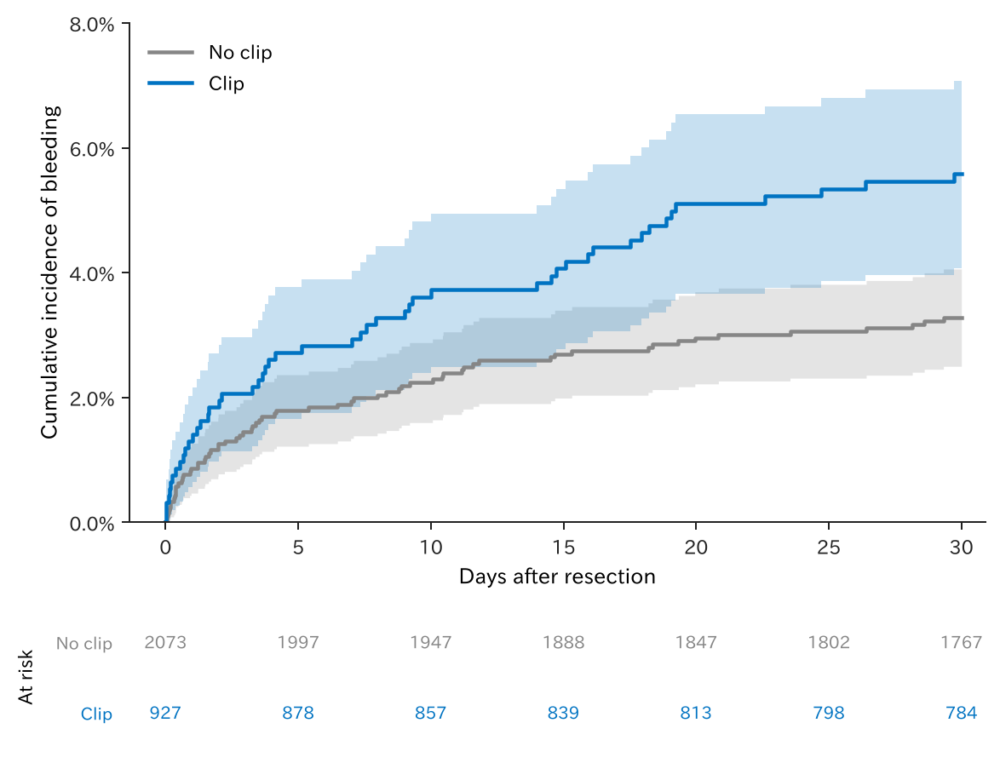
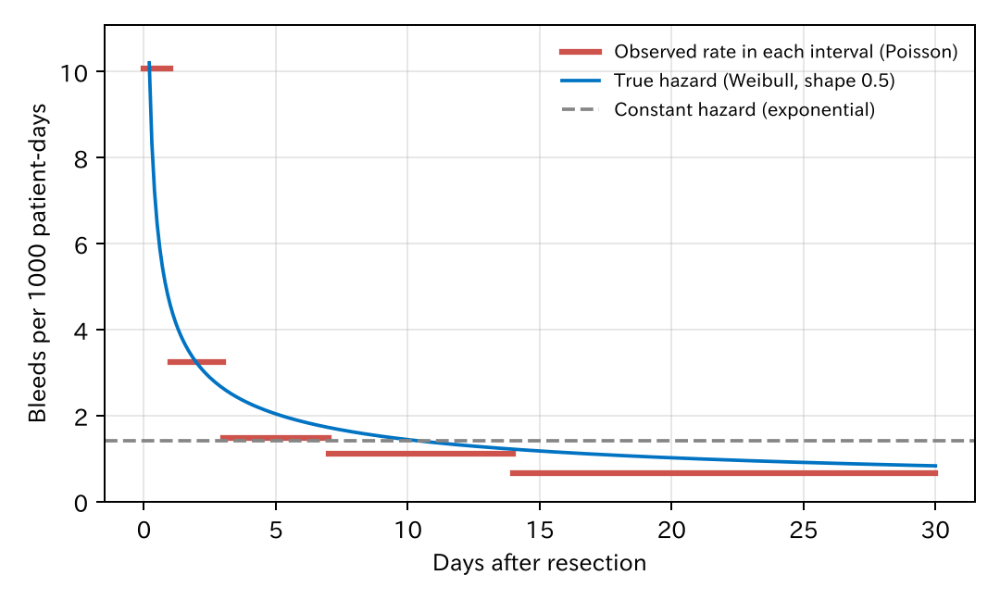
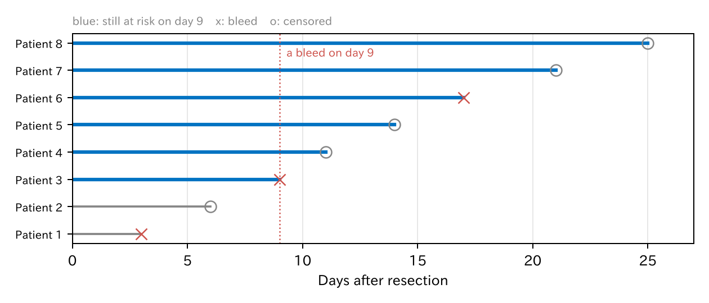

# 15. 生存時間解析

これまでのアウトカムは「出血したか、しなかったか」でした。しかし臨床では、**いつ**起きたかも大切です。後出血は切除の直後に多く、日がたつほど減ります。また、途中で通院しなくなった患者は、その後に出血したかどうかがわかりません。この章では、時間とともに起きる出来事を扱う**生存時間解析**（survival analysis）を紹介します。名前に「生存」とありますが、死亡に限らず、出血、再発、再入院など、どんな出来事にも使えます。

中心になるのは Cox 比例ハザードモデルですが、ほかに Poisson 回帰による人年法と、加速故障時間モデルも紹介し、三つの違いを考えます。

[← 目次](index.md) · [← 第 14 章](hierarchical.md)

## 15.1 打ち切りのあるデータ {#censoring}

通しの例の 3000 人について、今度は**切除から出血までの日数**を、30 日まで追跡したとします（データの作り方は 15.5 で種明かしします）。出血は、患者の背景はそのままに、日数つきで新しく作り直しました。そのため出血は 116 人で、これまでの章の 136 人とは一致しません。

| 人数 | 出血 | 30 日より前に追跡が途切れた人 | 出血の日（中央値） | 3 日以内の出血 |
|------|------|--------------------------|----------------|-------------|
| 3000 | 116 | 333 | 3.8 日目 | 49 人 |

[CSV](../examples/assets/theory_bleeding/ch15_summary.csv)

出血しなかった人については、「**少なくともその日までは出血しなかった**」ことしかわかりません。30 日まで見た人も、10 日目で来なくなった人も同じです。これを**打ち切り**（censoring）と呼びます。

打ち切りを無視して「出血したか」をロジスティック回帰で分析すると、10 日しか見ていない人と 30 日見た人を同じに扱うことになります。生存時間解析は、一人ひとりが**何日間見られていたか**を使って、この問題を解決します。

!!! note "打ち切りの仮定"
    生存時間解析は、打ち切られた人が、打ち切られなかった人と同じように出血しやすい（**情報のない打ち切り**）と仮定します。例えば出血しそうで別の病院に移った人が多いと、この仮定がくずれます。

## 15.2 Kaplan–Meier 法 {#kaplan-meier}

**Kaplan–Meier 法**は、打ち切りを考慮して「ある日までに出血していない割合」（生存曲線）を推定します。出血が起きた日ごとに、その日まで見られていた人のうち出血した人の割合を計算し、それをつないでいきます。下の図は、1 から引いた**累積発生割合**です。

=== "図"

    

=== "コード"

    ```python
    from statract import plot_survival

    plot_survival(df, time="time", status="event", hue="clip", cdf=True)   # cdf=True で累積発生割合
    ```

クリップ群のほうが、出血が多く見えます。第 1 章（1.4）で見た**適応による交絡**です。クリップは出血しやすい大きな病変にされるので、比べるには背景の調整が必要です。

## 15.3 ハザードと人年法 {#hazard}

**ハザード**（hazard）は、「その時点までまだ出血していない人が、次の短い時間に出血する割合」です。単位は「1 人 1 日あたり」で、**率**（rate）の一種です。

ハザードを一番簡単に推定するのが**人年法**（person-time method）です。出血の数を、全員が見られていた日数の合計（**人日**、長い追跡なら人年）で割ります。

| クリップ | 出血 | 人日 | 1000 人日あたりの出血 |
|---------|------|------|------------------|
| なし | 66 | 56968 | 1.16 |
| あり | 50 | 25189 | 1.98 |

[CSV](../examples/assets/theory_bleeding/ch15_rates.csv)

人年法は、ハザードが追跡期間を通じて**一定**だと仮定しています。追跡期間を区切って、区間ごとに率を計算すると、この仮定を確かめられます。



[CSV](../examples/assets/theory_bleeding/ch15_piecewise.csv)

最初の 1 日は 1000 人日あたり 10 件、14 日目以降は 0.7 件で、ハザードは時間とともに大きく下がっています。全期間で一定とみなす（灰色の破線）のは、明らかに合っていません。

## 15.4 Poisson 回帰 {#poisson}

人年法を回帰モデルにしたものが **Poisson 回帰**です（第 12 章の一般化線形モデル（generalized linear model、GLM）で、分布を Poisson にしたもの）。出血の数 $D$ が、率 × 人日を平均とする Poisson 分布に従い、率の対数が線形予測子になる、と考えます。

$$
\begin{aligned}
D_i &\sim \mathrm{Poisson}(\mu_i), \qquad \mu_i = \text{率}_i \times \text{人日}_i \\
\log \mu_i &= \log(\text{人日}_i) + \beta_0 + \beta_1 x_{i1} + \cdots
\end{aligned}
$$

$\log(\text{人日})$ は係数を 1 に固定した項（**offset**、第 13 章）です。$e^{\beta_1}$ は**率比**で、ハザードが一定なら**ハザード比**と同じです。

ハザードが一定でないときは、追跡期間を区間に分け、患者ごと・区間ごとに 1 行を作ります。区間を変数として入れると、区間ごとに違うベースラインの率を持たせられます（**区分指数モデル**、piecewise exponential model）。

=== "コード"

    ```python
    from statract import fit_glm

    # split: 患者 × 区間（0–1、1–3、3–7、7–14、14–30 日）ごとに 1 行。
    # days はその区間で見られていた日数、event はその区間で出血したか。
    fit = fit_glm(
        split,
        "event ~ interval + age + male + antithrombotic + hypertension + size_mm + proximal + clip",
        family="poisson",
        offset="log_days",   # log(days) の列
    )
    ```

Poisson 回帰は、登録データのように「区間ごとの出血数と人年」の集計表しかないときにも使えます。時間の効果を、区間やスプラインとして直接モデルに書けるのも利点です。

## 15.5 Cox 比例ハザードモデル {#cox}

臨床研究で最もよく使われるのが、**Cox 比例ハザードモデル**です [@Cox1972-qx]。

$$
h(t \mid x) = h_0(t) \times \exp(\beta_1 x_1 + \beta_2 x_2 + \cdots)
$$

- $h_0(t)$ は**ベースラインハザード**で、全部の変数が 0 の人のハザードの、時間による変化です。
- $\exp(\beta_1)$ は**ハザード比**（hazard ratio、HR）です。どの時点でも、$x_1$ が 1 増えるとハザードが $\exp(\beta_1)$ 倍になります。この「どの時点でも同じ倍率」が**比例ハザード**の仮定です。

=== "コード"

    ```python
    from statract import cox_ph, proportional_hazards_test

    fit = cox_ph(df, "Surv(time, event) ~ age + male + antithrombotic + hypertension + size_mm + proximal + clip")
    fit.tidy(exponentiate=True)        # ハザード比
    proportional_hazards_test(fit)     # 比例ハザードの検定（R の cox.zph）
    ```

| 変数 | ハザード比 | 95% 信頼区間 |
|------|----------|-----------|
| 年齢（1 歳あたり） | 1.043 | 1.02–1.06 |
| 男性 | 1.27 | 0.87–1.85 |
| 抗血栓薬 | 2.05 | 1.34–3.14 |
| 高血圧 | 1.31 | 0.83–2.07 |
| 病変径（1 mm あたり） | 1.048 | 1.03–1.06 |
| 近位 | 1.87 | 1.27–2.77 |
| クリップ | 0.69 | 0.44–1.10 |

[CSV](../examples/assets/theory_bleeding/ch15_cox.csv) · [比例ハザードの検定 CSV](../examples/assets/theory_bleeding/ch15_ph_test.csv)

種明かしをすると、このデータは、第 12 章の対数オッズの式（切片を除く）をそのまま対数ハザード比とし、ベースラインハザードを形 0.5 の Weibull 分布（はじめが高く、だんだん下がる）にして作りました。15.3 の図の青い曲線が、その本当のハザードです。比例ハザードの仮定は本当に成り立っており、検定でも全体の $P = 0.35$ でした。

本当のクリップのハザード比は、20 mm 未満で 0.82（$e^{-0.2}$）、20 mm 以上で 0.37（$e^{-1.0}$）です。表のクリップの 0.69 は、一つの係数でこの二つを平均したような値で、このデータでは信頼区間が 1 をまたいでいます。また年齢の本当のハザード比は 1 歳あたり 1.015（$e^{0.015}$）で、推定の信頼区間 1.02–1.06 の外にあります。推定 0.042 と本当の 0.015 の差は標準誤差の約 2.5 倍（$z = 2.53$、$P = 0.012$）で、偶然のずれです。95% 信頼区間は、20 回に 1 回くらいは本当の値を外します。

### セミパラメトリックの意味 {#semiparametric}

Cox モデルは**セミパラメトリック**（semi-parametric、半パラメトリック）なモデルと呼ばれます。

- 変数の効果 $\exp(\beta x)$ は、係数という有限個のパラメータで決まります（**パラメトリック**な部分）。
- ベースラインハザード $h_0(t)$ には、形の仮定を何も置きません。一定でも、下がっても、上がって下がってもかまいません（**ノンパラメトリック**な部分）。

この二つを合わせたものなので「セミ」です。15.3 で見たように、出血のハザードは時間とともに大きく変わります。Cox モデルはその形を知らなくても、ハザード比を推定できます。これが Cox モデルが広く使われる最大の理由です。

## 15.6 なぜ普通の最尤法が使えないのか：部分尤度 {#partial-likelihood}

第 13 章の最尤法をそのまま使おうとすると、困ったことが起きます。打ち切りのあるデータの尤度は、出血した人はその日のハザード × その日まで出血しない確率、打ち切られた人はその日まで出血しない確率を掛けたものです。

$$
L = \prod_{i} h(t_i \mid x_i)^{d_i} \, S(t_i \mid x_i)
$$

$d_i$ は出血なら 1、打ち切りなら 0、$S$ は生存関数です。ここで $h_0(t)$ の形を決めないと、尤度は**関数** $h_0(t)$ に依存します。関数は、無数の値（どの時点の値も自由）を持つパラメータです。

- 第 13 章の最尤法の理論（標準誤差は曲がり具合から、例数が多いと正規分布に近づく）は、パラメータの数が**有限で決まっている**ことを前提にしています。パラメータがデータとともにいくらでも増える場合には、そのまま使えません。
- 実際、$h_0(t)$ を自由にすると、出血が起きた瞬間にだけ無限に高いハザードを置けば、尤度はいくらでも大きくできてしまいます。

そこで $h_0(t)$ を、出血が起きた日にだけ跳ねる階段状の関数に限ると、尤度は有限になります。その跳ねの高さについて最大にしたプロファイル尤度（第 13 章）は、下の部分尤度と同じになることが知られています [@Johansen1983-nc]。部分尤度は、結局は最尤法の一種と読むこともできます。

Cox [@Cox1972-qx; @Cox1975-wg] は、$h_0(t)$ を**消してしまう**尤度を考えました。出血が起きた日ごとに、「その日まだ見られていた人（**リスク集合**）のうち、出血したのがまさにその人だった確率」を考えます。



図では、9 日目に患者 3 が出血しました。その日にまだリスクがあったのは、患者 3–8 の 6 人です（青）。「この 6 人のうち出血したのが患者 3 である確率」は、

$$
\frac{h_0(9)\, e^{\eta_3}}{\sum_{k=3}^{8} h_0(9)\, e^{\eta_k}} = \frac{e^{\eta_3}}{\sum_{k=3}^{8} e^{\eta_k}}
$$

で、**$h_0(9)$ が分子と分母で打ち消し合います**。$\eta_k$ は患者 $k$ の線形予測子です。これを出血が起きた全ての日について掛けたものが**部分尤度**（partial likelihood）です。

$$
L_{\text{partial}}(\beta) = \prod_{\text{出血した人 } j} \frac{e^{\eta_j}}{\sum_{k \in R(t_j)} e^{\eta_k}}
$$

$R(t_j)$ は $t_j$ のリスク集合です。部分尤度は係数 $\beta$ だけの関数なので、普通の尤度と同じようにニュートン法で最大にし、曲がり具合から標準誤差を出せます。Cox は、これが普通の尤度と同じように扱えると論じ [@Cox1975-wg]、のちに Andersen と Gill [@Andersen1982-ou] が計数過程の理論で厳密に証明しました。$h_0(t)$ は、$\beta$ を推定したあとで別に推定します（Breslow 推定量）。

### 時間の順番しか使わない {#ranks}

部分尤度には、出血の**日付そのもの**は出てきません。使うのは「誰がどの順番で出血し、その時に誰がまだリスクにあったか」だけです。それを確かめるため、時間を別の値に置きかえて Cox モデルを当てはめました。

| モデル | クリップのハザード比 | 95% 信頼区間 |
|--------|------------------|-----------|
| Cox（日数） | 0.694 | 0.44–1.10 |
| Cox（日数を順位に置きかえ） | 0.694 | 0.44–1.10 |
| Cox（日数を 2 乗） | 0.694 | 0.44–1.10 |

順番が変わらない置きかえなら、結果はまったく同じです。Cox モデルが時間の目盛りに何の仮定も置いていない、ということです。

### Poisson 回帰とのつながり {#cox-poisson}

15.4 の区分指数モデルで、区間を細かくしていき、**出血が起きた日ごとに**区切ると、Poisson 回帰の係数は Cox モデルの係数と一致します [@Whitehead1980-xr; @Laird1981-wm]。区間ごとのベースラインの率が、Cox の $h_0(t)$ にあたります。Cox モデルは「無数の区間を持つ Poisson 回帰」と見ることもできます。

## 15.7 加速故障時間モデル {#aft}

もう一つの考え方は、ハザードではなく**時間そのもの**をモデルにすることです。**加速故障時間モデル**（accelerated failure time model、AFT モデル）は、時間の対数を線形予測子と誤差で表します [@Wei1992-hb]。

$$
\log T_i = \beta_0 + \beta_1 x_{i1} + \cdots + \sigma \varepsilon_i
$$

$\exp(\beta_1)$ は**時間比**（time ratio）で、「$x_1$ が 1 増えると、出血までの時間が $\exp(\beta_1)$ 倍に延びる（縮む）」と読みます。時計の進み方を速めたり遅めたりするイメージです。

誤差 $\varepsilon$ の分布を決めるので、AFT モデルは**完全にパラメトリック**なモデルです。パラメータの数は有限なので、15.6 の尤度をそのまま最大にする、普通の最尤法が使えます。

| 誤差の分布 | 時間 $T$ の分布 | ハザードの形 |
|-----------|---------------|------------|
| 極値分布 | Weibull | 単調に上がる、一定、または下がる。**比例ハザードでもある** |
| 極値分布で $\sigma = 1$ | 指数 | 一定（人年法と同じ） |
| 正規分布 | 対数正規 | 上がってから下がる。比例ハザードではない |

=== "コード"

    ```python
    from statract import accelerated_failure

    formula = "Surv(time, event) ~ age + male + antithrombotic + hypertension + size_mm + proximal + clip"
    weibull = accelerated_failure(df, formula, distribution="weibull")
    lognormal = accelerated_failure(df, formula, distribution="lognormal")
    weibull.tidy(exponentiate=True)   # 時間比
    ```

Weibull モデルは、AFT モデルでもあり比例ハザードモデルでもある、ただ一つの分布です。ハザード比は $\exp(-\beta / \sigma)$ で求まります。形のパラメータは $1/\sigma$ で、このデータでは 0.45 と推定されました（本当は 0.5）。

## 15.8 モデルを比べる {#compare}

同じデータで、クリップの効果を全部のモデルで推定しました。

| モデル | 何の比か | クリップ | 95% 信頼区間 |
|--------|---------|---------|-----------|
| Cox | ハザード比 | 0.69 | 0.44–1.10 |
| Poisson、ハザード一定（指数） | ハザード比 | 0.68 | 0.42–1.08 |
| Poisson、5 区間 | ハザード比 | 0.69 | 0.43–1.10 |
| Weibull（ハザード比に変換） | ハザード比 | 0.69 | 0.43–1.10 |
| Weibull AFT | 時間比 | 2.29 | 0.80–6.54 |
| 対数正規 AFT | 時間比 | 2.53 | 0.81–7.93 |
| 指数 AFT | 時間比 | 1.48 | 0.93–2.35 |

[CSV](../examples/assets/theory_bleeding/ch15_models.csv) · [対数尤度 CSV](../examples/assets/theory_bleeding/ch15_fit.csv)

- **ハザード比は、どのモデルでもほぼ同じ**です（0.68–0.69）。ハザードが一定でないのに一定とみなした Poisson でも、大きくはずれませんでした。区間で時間を扱うと Cox とほぼ一致します。本当のハザード比は病変径で違う（0.82 と 0.37、15.5）ので、どのモデルも、クリップの項が一つである限り、その平均のような値を推定しています。
- **時間比は、分布の選び方で大きく変わります**（1.48–2.53）。同じハザード比 0.69 でも、ハザードが急に下がる（形 0.45）と、「出血を 2.3 倍先に延ばす」ことになります。指数 AFT の 1.48 は、ハザード一定の Poisson のハザード比の逆数（$1/0.68$）です。
- 対数尤度は、指数 −830.4、Weibull −777.4、対数正規 −775.6 でした。指数は明らかに悪いのですが、Weibull と対数正規はほとんど区別できません。本当は Weibull なのに、対数正規のほうがわずかに良く見えています。出血 116 人、9 割以上が打ち切りのデータでは、分布の形を決める情報が少ないのです。

時間比は「出血までの時間が延びる」と直感的に読めそうですが、この例のように**ほとんどの人は出血しない**場合、「出血までの時間」の大半は観察されていません。時間比は、観察していない遠い将来の分布の形に強く依存します。

## 15.9 どう使い分けるか {#choose}

| | Cox | Poisson（人年法） | AFT |
|--|-----|----------------|-----|
| 効果の指標 | ハザード比 | 率比（ハザード比） | 時間比 |
| ベースラインの仮定 | なし（セミパラメトリック） | 区間ごとに一定 | 分布を決める（パラメトリック） |
| 推定 | 部分尤度 | 普通の最尤法 | 普通の最尤法 |
| 向いている場面 | 治療や因子の効果を比べる（標準） | 集計データ、長い追跡、時間の効果を直接見たい | 時間の予測、追跡期間を超えた外挿、比例ハザードが成り立たない |

- 効果の推定には、まず Cox モデルを使い、比例ハザードを確かめます。
- 比例ハザードが成り立たないとき（効果が時間とともに弱まるなど）は、時間で層別したハザード比、制限付き平均生存時間（restricted mean survival time、RMST、statract の `restricted_mean_survival`）、AFT モデルを考えます。
- 医療経済評価のように、追跡期間の先まで生存曲線を延ばす必要があるときは、パラメトリックなモデル（Weibull、対数正規など）が必要です。ただし、15.8 のように分布の選び方で結果が大きく変わるので、いくつかの分布で比べます。
- 出血の前に死亡すると、その人はもう出血しません。このような**競合リスク**があるときは、死亡を打ち切りとして扱わず、競合リスクの方法（statract の `cumulative_incidence`、`fine_gray_regression`）で累積発生割合を推定します。
- これとは別に、出血しそうな人ほど追跡から外れるような**情報のある打ち切り**は、競合リスクの方法では解決しません。打ち切りの理由を調べ、打ち切りの重み付けや感度分析を考えます。

## 文献 {#references}

教科書では、Collett [@Collett2023-book] が入門に、Therneau と Grambsch [@Therneau2000-book] が Cox モデルの拡張と診断に向いています。

::: {#refs}
:::

## まとめ

- 生存時間のデータには打ち切りがあります。生存時間解析は、一人ひとりが見られていた時間を使います。
- ハザードは「まだ起きていない人が次に起きる率」です。人年法は、ハザードを一定とみなして、出来事の数を人年で割ります。
- Poisson 回帰は人年法の回帰版です。区間に分ければ、時間とともに変わるハザードも扱えます。
- Cox モデルは、ベースラインハザードに何の仮定も置かないセミパラメトリックなモデルです。そのため普通の最尤法はそのままでは使えず、ベースラインハザードが打ち消し合う部分尤度を最大にします（階段状の $h_0$ についてのプロファイル尤度とも読めます）。使うのは時間の順番だけです。
- AFT モデルは時間そのものをモデルにする、完全にパラメトリックなモデルで、普通の最尤法が使えます。効果は時間比で、分布の選び方に強く左右されます。
- ハザード比はモデルによらず安定しています。効果の推定には Cox、集計データや時間の効果には Poisson、時間の予測や外挿には AFT が向いています。
