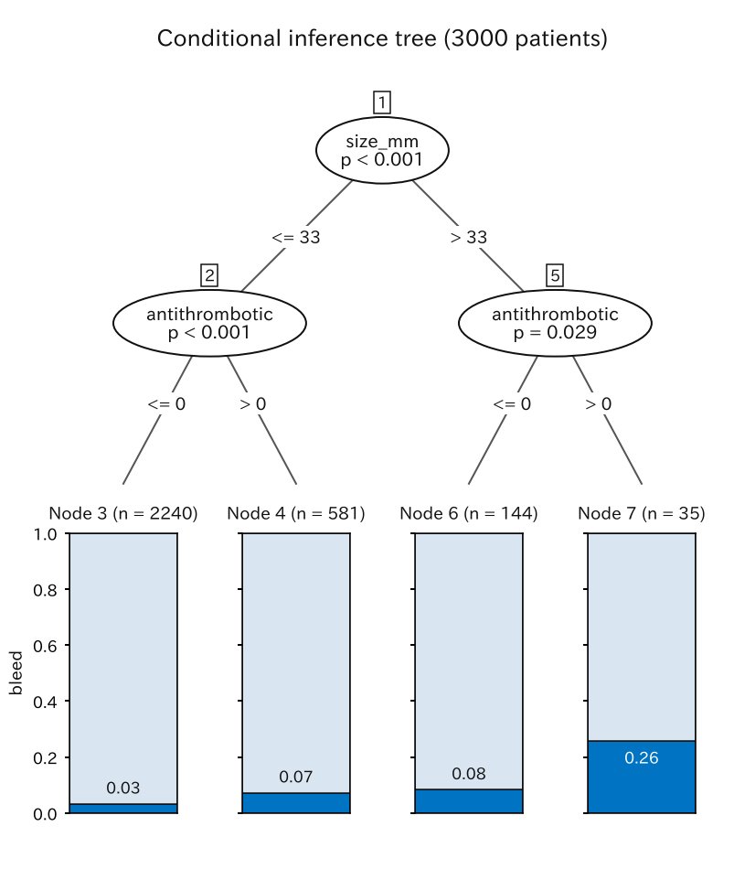
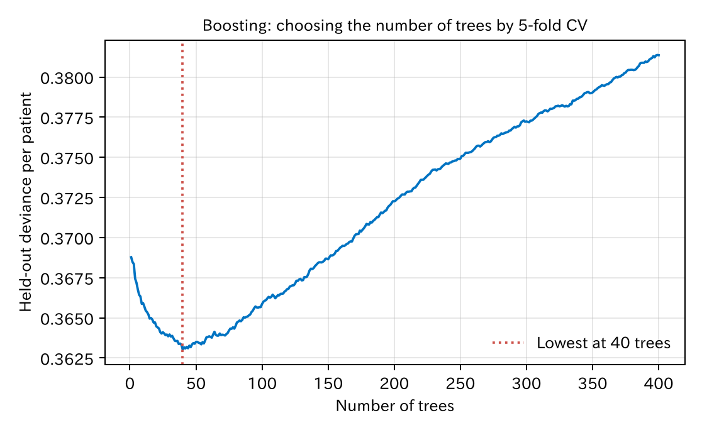
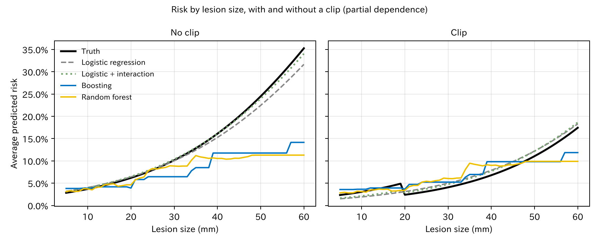

# 11. 木とアンサンブル

ここまでの予測モデルは、すべてロジスティック回帰でした。この章では、機械学習でよく使われる**決定木**と、木をたくさん組み合わせる**アンサンブル**（ランダムフォレスト、勾配ブースティング）を紹介します。そして、同じデータでロジスティック回帰と比べます。

[← 目次](index.md) · [← 第 10 章](regularization.md)

## 11.1 決定木 {#tree}

**決定木**は、「病変径は 33 mm 以下か」のような質問で患者を二つに分けることを繰り返し、最後のグループ（葉）ごとに出血の割合を予測とする方法です。

=== "図"

    

=== "コード"

    ```python
    from statract import conditional_tree, plot_tree

    tree = conditional_tree(df, "bleed", ["age", "male", "antithrombotic", "hypertension", "size_mm", "proximal", "clip"])
    plot_tree(tree, "tree.png")
    tree.predict(new_patients)   # 葉の出血割合が予測確率
    ```

ここでは**条件付き推測木**（conditional inference tree）を使いました。分けるたびに検定を行い、有意な分け方がなくなったら止まる木です（Hothorn ら 2006）。

- 最初の質問は病変径（33 mm 以下か）、次は抗血栓薬です。
- 33 mm を超え、抗血栓薬を飲んでいる 35 人では、出血が 26% でした。33 mm 以下で抗血栓薬なしの 2240 人では 3% です。

木の長所は、**見てわかる**ことです。「この条件ならこのくらい」と、臨床の判断の流れに近い形で示せます。短所は次のとおりです。

- **予測は葉の数だけの段階になります。** この木では、予測確率は 4 通りしかありません。
- **不安定です。** データが少し変わると、最初の質問が変わり、木全体が変わることがあります。
- **連続変数を粗く扱います。** 病変径 10 mm と 33 mm は同じ扱いです。

## 11.2 ランダムフォレスト {#random-forest}

一本の木の不安定さを逆手にとるのが**ランダムフォレスト**（random forest）です（Breiman 2001）。

1. データからブートストラップ標本（第 8 章）を作り、木を一本育てる。分けるたびに、使う変数の候補をランダムに数個に絞る。
2. これを何百回も繰り返し、たくさんの違う木（森）を作る。
3. 新しい患者の予測は、すべての木の予測の平均。

一本一本の木はばらばらでも、平均するとばらつきが打ち消し合い、安定した予測になります。変数の候補を絞るのは、木どうしを似すぎないようにするためです。

## 11.3 勾配ブースティング {#boosting}

**勾配ブースティング**（gradient boosting）は、小さい木を**順番に**足していく方法です（Friedman 2001）。

1. 最初は、全員に平均の確率を予測する。
2. 今の予測で外れている分（実際の結果 − 予測確率、残差）を、小さい木（ここでは深さ 2）で予測する。
3. その木の予測を少しだけ（学習率 0.05 を掛けて）今の予測に足す。
4. 2 と 3 を繰り返す。

一本の木は弱い予測しかしませんが、少しずつ直していくことで、複雑な形も表せます。XGBoost や LightGBM はこの方法の実装です。

木を足しすぎると、作ったデータの偶然まで覚えてしまいます（過学習）。そこで、**木の数**を交差検証で選びます。



このデータでは 40 本前後で最も良くなり、それより多いと悪くなりました。

statract には森とブースティングがまだないので、この章では numpy で書いた短い実装（[`penalized.py`](https://github.com/mizuy/statract/blob/main/examples/theory_bleeding/penalized.py)）を使っています。実務では、R の ranger や xgboost、Python の scikit-learn や LightGBM などを使います。

## 11.4 ロジスティック回帰と比べる {#compare}

第 7 章と同じ 3000 人でモデルを作り、新しい患者 5 万人で比べました。

| モデル | C 統計量（作ったデータ） | C 統計量（新しい患者） | 較正の傾き | Brier |
|--------|---------------------|-------------------|-----------|-------|
| ロジスティック回帰（第 7 章） | 0.678 | 0.667 | 0.93 | 0.0413 |
| ロジスティック回帰 + クリップ ×（20 mm 以上） | 0.679 | 0.670 | 0.94 | 0.0412 |
| 決定木 | 0.617 | 0.606 | 0.88 | 0.0418 |
| ランダムフォレスト（200 本） | 0.819 | 0.640 | 0.84 | 0.0416 |
| ブースティング（40 本、交差検証で選択） | 0.699 | 0.650 | 1.18 | 0.0416 |
| ブースティング（400 本） | 0.775 | 0.625 | 0.62 | 0.0422 |

[CSV](../examples/assets/theory_bleeding/ch11_compare.csv)

- **新しい患者で最も当たったのは、ロジスティック回帰でした。** 機械学習の方法は、どれもロジスティック回帰に届きませんでした。
- ランダムフォレストは、作ったデータでは 0.82 と飛び抜けて良く見えますが、新しい患者では 0.64 です。見かけの成績は、機械学習ではさらに当てになりません。
- ブースティングは、木の数を交差検証で選ぶと 0.65、選ばずに 400 本にすると 0.63 で、較正も崩れます（傾き 0.62）。
- 臨床の知識（20 mm 以上でクリップがよく効く）を交互作用としてロジスティック回帰に入れると、わずかですが最も良くなりました。

多くの臨床予測の研究を集めた系統的レビューでも、機械学習がロジスティック回帰より良いという一貫した証拠はありませんでした（Christodoulou ら 2019）。

### 機械学習は何を拾い、何を拾えないか {#what-trees-learn}

木の長所は、交互作用や曲がった関係を、指定しなくても自動で拾えることです。本当にそうなっているかを、**部分依存**（partial dependence）の図で見ます。全員の病変径とクリップを同じ値に書きかえて予測し、平均します（第 3 章の標準化と同じ計算です）。



[CSV](../examples/assets/theory_bleeding/ch11_partial.csv)

黒い線が本当のリスクです。クリップあり（右）では、20 mm で効果が変わるため段差があります。

- ロジスティック回帰（灰色の破線）はなめらかな曲線で、本当の線に近い形です。段差は表せませんが、交互作用を入れたモデル（緑の点線）は段差を表せます。
- ランダムフォレストとブースティングは、30 〜 40 mm を超えると**平らになります**。大きな病変は数が少なく、木はデータのない所では予測を伸ばせない（外挿しない）からです。
- 20 mm の段差も、木はほとんど拾えていません。出血 136 人では、交互作用を見つけるだけの情報がないのです。

木が「自動で」交互作用を拾えるのは、それを見つけるだけの**大量のデータ**があるときです。臨床研究のようにイベントが数百以下なら、臨床の知識で形（曲線、交互作用）を指定したロジスティック回帰のほうが、たいてい当たります。

## 11.5 どう使い分けるか {#choose}

- イベントが少ない（数百以下）、変数が少ない（数十以下）なら、ロジスティック回帰（必要なら正則化、スプライン、知識に基づく交互作用）が基本です。
- 画像、波形、電子カルテ全体のように、変数がとても多く、イベントも多い場合は、機械学習が力を発揮します。
- どの方法でも、評価は第 8、9 章と同じです。新しい患者での識別、較正、臨床的な有用性を確かめます。
- 機械学習の予測も、係数がないだけで「予測」です。因果の効果としては読めません。

## 文献 {#references}

- Breiman L. Random forests. *Mach Learn.* 2001;45:5–32.
- Friedman JH. Greedy function approximation: a gradient boosting machine. *Ann Stat.* 2001;29:1189–1232.
- Hothorn T, Hornik K, Zeileis A. Unbiased recursive partitioning: a conditional inference framework. *J Comput Graph Stat.* 2006;15:651–674.
- Christodoulou E, Ma J, Collins GS, Steyerberg EW, Verbakel JY, Van Calster B. A systematic review shows no performance benefit of machine learning over logistic regression for clinical prediction models. *J Clin Epidemiol.* 2019;110:12–22.
- van der Ploeg T, Austin PC, Steyerberg EW. Modern modelling techniques are data hungry: a simulation study for predicting dichotomous endpoints. *BMC Med Res Methodol.* 2014;14:137.

## まとめ

- 決定木は、質問で患者を分けていく見てわかる方法ですが、予測が粗く、不安定です。
- ランダムフォレストは多くの木の平均、ブースティングは小さい木を順に足す方法です。
- 機械学習の見かけの成績は特に当てになりません。木の数などの設定は交差検証で選びます。
- このデータでは、新しい患者で最も当たったのはロジスティック回帰でした。木はデータのない所で平らになり、少ないイベントでは交互作用も拾えません。
- 機械学習が力を発揮するのは、データがとても多いときです。
