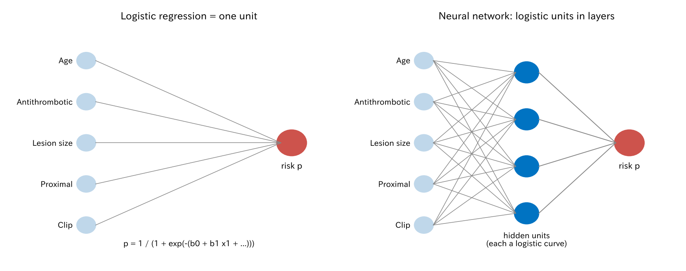

# 11. 木、アンサンブル、ニューラルネットワーク

ここまでの予測モデルは、すべてロジスティック回帰でした。この章では、機械学習でよく使われる方法をまとめて紹介します。臨床研究でも使いやすい**条件付き推測木**（ctree）は少し詳しく、ランダムフォレスト、勾配ブースティング、ニューラルネットワークは考え方だけを紹介します。最後に、同じデータでロジスティック回帰と比べます。

[← 目次](index.md) · [← 第 10 章](regularization.md)

## 11.1 条件付き推測木（ctree） {#ctree}

**決定木**は、「病変径は 33 mm 以下か」のような質問で患者を二つに分けることを繰り返し、最後のグループ（**葉**）ごとの出血割合を予測とする方法です。

決定木にはいくつかの作り方があります。古典的な分類回帰木（classification and regression trees、CART）は、分けたあとのグループができるだけ純粋になる分け方を探し、大きく育ててから刈り込みます。この方法には、**分け方の候補が多い変数**（連続変数や、カテゴリの多い変数）が選ばれやすいという偏りがあります。候補が多いほど、偶然よく分かれる点が見つかりやすいからです。

**条件付き推測木**（conditional inference tree、ctree）は、この偏りを検定で防ぎます [@Hothorn2006-ia]。各ノードで次のことを行います。

1. **変数を選ぶ。** それぞれの変数とアウトカムが無関係かを、並べ替え検定（permutation test）で調べます。変数の数で多重性を補正（Bonferroni）した $P$ 値が最も小さい変数を選びます。
2. **止めるか決める。** 最も小さい $P$ 値でも有意水準（普通は 0.05）を超えたら、そこで分けるのをやめます。
3. **分け方を決める。** 選んだ変数の中で、二つのグループの差が最も大きくなる点で分けます。

変数を選ぶ段階と分ける点を決める段階を分けているので、変数の選ばれやすさが分け方の候補の数に左右されません。また、検定で止まるので、刈り込みがいりません。

=== "図"

    

=== "コード"

    ```python
    from statract import conditional_tree, plot_tree

    tree = conditional_tree(
        df, "bleed",
        ["age", "male", "antithrombotic", "hypertension", "size_mm", "proximal", "clip"],
        alpha=0.05,      # 分けるのをやめる有意水準
        minbucket=7,     # 葉の最小の人数
    )
    print(tree.format())          # 木を文字で表示
    plot_tree(tree, "tree.png")   # 図
    tree.predict(new_patients)    # 葉の出血割合が予測確率
    ```

通しの例の 3000 人で作ると、次の木になりました。

- 最初の質問は病変径（33 mm 以下か）、次はどちらの枝でも抗血栓薬です。
- 33 mm を超え、抗血栓薬を飲んでいる 35 人では出血が 26%、33 mm 以下で抗血栓薬なしの 2240 人では 3% です。
- 年齢、性別、高血圧、部位、クリップは、有意な分け方がなく選ばれませんでした。

### 木の読み方と注意 {#tree-cautions}

木の長所は、**見てわかる**ことです。「この条件ならこのくらい」と、臨床の判断の流れに近い形で示せます。危険の高い患者群を見つけて示す、という使い方に向いています。

一方で、注意も必要です。

- **予測は葉の数だけの段階です。** この木の予測確率は 4 通りしかなく、病変径 10 mm と 33 mm は同じ扱いです。そのため識別は、連続変数をそのまま使うロジスティック回帰より低くなりがちです。
- **分かれ目の値（33 mm）は、データが少し変わると動きます。** 臨床の基準値として読むのは危険です。
- **選ばれなかった変数が「関係ない」とは言えません。** クリップは出血を減らしますが（第 II 部）、この木には出てきません。木も予測のための方法で、因果の効果は読めません。
- **木の形は不安定です。** 最初の質問が変わると、木全体が変わることがあります。この不安定さを逆手にとるのが、次のランダムフォレストです。

## 11.2 ランダムフォレスト {#random-forest}

**ランダムフォレスト**（random forest）は、たくさんの木の平均で予測する方法です [@Breiman2001-qi]。

- データからブートストラップ標本（第 8 章）を作り、木を一本育てます。分けるたびに、使う変数の候補をランダムに数個に絞ります。
- これを数百回繰り返して「森」を作り、新しい患者の予測は全部の木の平均にします。

一本一本の木はばらばらでも、平均するとばらつきが打ち消し合い、予測が安定します。そのかわり、一本の木のように「見てわかる」形ではなくなります。

## 11.3 勾配ブースティング {#boosting}

**勾配ブースティング**（gradient boosting）は、小さい木を**順番に**足していく方法です [@Friedman2001-bs]。今の予測で外れている分（残差）を小さい木で予測し、その結果を少しだけ今の予測に足す、を繰り返します。XGBoost や LightGBM はこの方法の実装です。

木を足しすぎると過学習します。木の数（と学習率、木の深さ）は交差検証で選びます。このデータでは、5 分割交差検証で 40 本が選ばれました。

## 11.4 ニューラルネットワーク {#neural-network}

ロジスティック回帰は、入力に重みをかけて足し、それをシグモイド関数 $1/(1+e^{-\eta})$ に通して確率を出す、**一つの計算単位**と見ることができます。この単位（ニューロン）を何個も並べ、その出力をさらに別の単位に入れるのが**ニューラルネットワーク**（neural network）です。



- 真ん中の層（**隠れ層**）の一つ一つは、入力の重み付きの和を曲線に通したもの、つまりロジスティック回帰のような単位です。
- 出力の単位は、隠れ層の出力を使ったロジスティック回帰です。
- 隠れ層は、予測に役立つ「新しい変数」をデータから自動で作っている、と見ることができます [@Bishop2006-book]。隠れ層が一つでも、隠れ単位を十分に増やせば、どんな形の関係も（いくらでも近く）表せるようになります。

その分、パラメータの数は急に増えます。7 つの入力と 20 個の隠れ単位なら、パラメータは 181 個です。そこで、重みの 2 乗の和に罰をつける**重み減衰**（weight decay）がよく使われます。第 10 章の ridge と同じものです。

画像（内視鏡画像の病変検出など）や波形、文章のように、入力がとても多く、データも大量にある場面で力を発揮します。

## 11.5 ロジスティック回帰と比べる {#compare}

第 7 章と同じ 3000 人（出血 136 人）でモデルを作り、新しい患者 5 万人で比べました。森、ブースティング、ネットワークは、statract にまだないので numpy で書いた短い実装（[`penalized.py`](https://github.com/mizuy/statract/blob/main/examples/theory_bleeding/penalized.py)）を使っています。

| モデル | C 統計量（作ったデータ） | C 統計量（新しい患者） | 較正の傾き |
|--------|---------------------|-------------------|-----------|
| ロジスティック回帰（第 7 章） | 0.68 | 0.67 | 0.93 |
| ロジスティック回帰 + クリップ ×（20 mm 以上） | 0.68 | 0.67 | 0.94 |
| 条件付き推測木 | 0.62 | 0.61 | 0.88 |
| ランダムフォレスト（200 本） | 0.82 | 0.64 | 0.84 |
| 勾配ブースティング（40 本、交差検証で選択） | 0.70 | 0.65 | 1.18 |
| 勾配ブースティング（400 本） | 0.77 | 0.63 | 0.62 |
| ネットワーク、隠れ単位 1 個 | 0.68 | 0.67 | 0.95 |
| ネットワーク、隠れ単位 20 個 | 0.95 | 0.53 | 0.03 |
| ネットワーク、隠れ単位 20 個 + 重み減衰 | 0.67 | 0.66 | 1.40 |

[木と森とブースティング CSV](../examples/assets/theory_bleeding/ch11_compare.csv) · [ネットワーク CSV](../examples/assets/theory_bleeding/ch11_network.csv)

- **新しい患者で最も当たったのは、ロジスティック回帰でした。** どの機械学習の方法も、これを超えませんでした。
- 隠れ単位 1 個のネットワークは、ほぼロジスティック回帰そのものなので、成績もほぼ同じです。
- 隠れ単位 20 個では、作ったデータでは 0.95 と見事に当たりますが、新しい患者では 0.53 で、ほとんど当てずっぽうです。出血 136 人に 181 個のパラメータでは、データを丸暗記するだけです。重み減衰を入れると 0.66 まで戻ります。
- ランダムフォレストやブースティングも、見かけの成績はロジスティック回帰より良く見えますが、新しい患者では下回ります。
- 臨床の知識（20 mm 以上でクリップがよく効く）を交互作用としてロジスティック回帰に入れると、わずかに良くなりました。

多くの臨床予測の研究を集めた系統的レビューでも、機械学習がロジスティック回帰より良いという一貫した証拠はありませんでした [@Christodoulou2019-bs]。機械学習の方法は「データに飢えている」 [@van-der-Ploeg2014-fe]ので、イベントが数百程度の臨床データでは、力を発揮しにくいのです。

## 11.6 どう使い分けるか {#choose}

- イベントが数百以下、変数が数十以下なら、ロジスティック回帰（必要なら正則化、スプライン、知識に基づく交互作用）が基本です。
- 危険の高い患者群を、見てわかる形で示したいときは、条件付き推測木が役立ちます。ただし主な予測モデルとしてより、補助として使うのが安全です。
- 画像、波形、電子カルテ全体のように、入力がとても多くデータも大量にあるときは、森、ブースティング、ニューラルネットワークが力を発揮します。
- どの方法でも、評価は第 8、9 章と同じです。新しい患者での識別、較正、臨床的な有用性を確かめます。見かけの成績は、柔軟な方法ほど当てになりません。
- どの方法の予測も、因果の効果としては読めません。

## 文献 {#references}

::: {#refs}
:::

## まとめ

- 条件付き推測木は、検定で変数を選び、有意でなくなったら止まる決定木です。変数の選び方に偏りがなく、見てわかる形で危険の高い群を示せます。予測は粗く、木の形は不安定です。
- ランダムフォレストは多くの木の平均、勾配ブースティングは小さい木を順に足す方法です。
- ニューラルネットワークは、ロジスティック回帰の単位を層に重ねたものです。重み減衰は ridge と同じです。
- 出血 136 人のこのデータでは、新しい患者で最も当たったのはロジスティック回帰でした。柔軟な方法ほど見かけの成績が良く見え、新しい患者では下がります。

第 III 部はここまでです。[第 IV 部](probability-model.md)では、ロジスティック回帰を「データが生まれる仕組みのモデル」として見直します。
